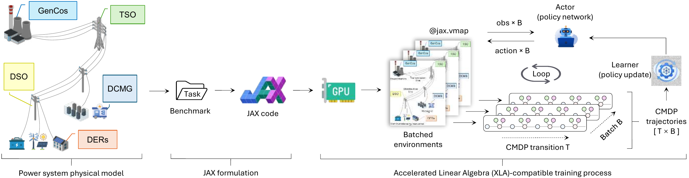
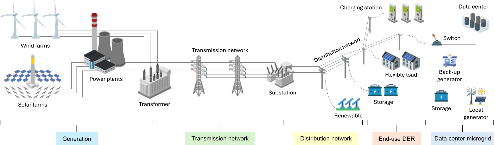
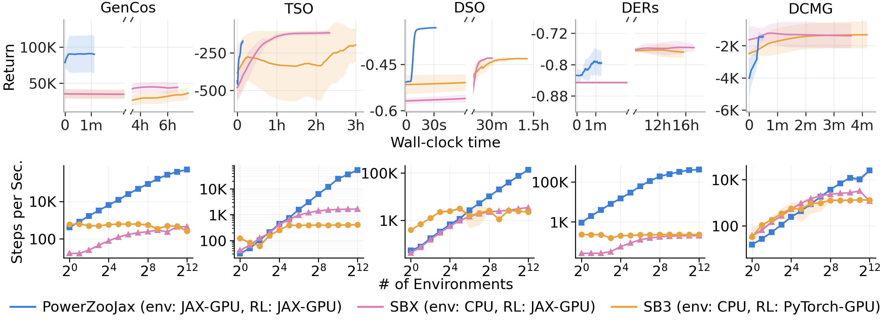
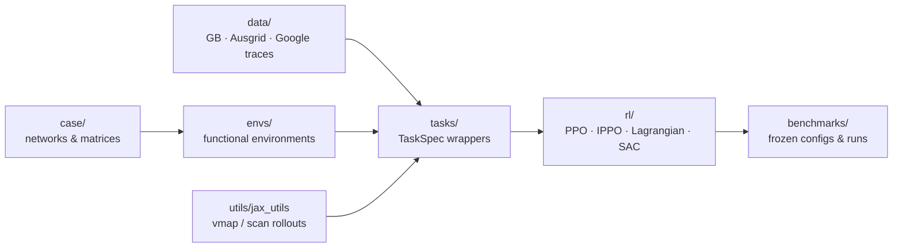

<h1 align="center">PowerZooJax</h1>

<p align="center"><strong>A JAX-based power-system benchmark for reinforcement learning.</strong></p>

<p align="center">
  <a href="https://powerzoojax.github.io/PowerZooJax/"><strong>Documentation</strong></a>
</p>

<p align="center">
  
  
  
</p>

<p align="center">
  <a href="#performance-highlights"></a>
  <a href="#the-five-tasks"></a>
  <a href="#algorithms--baselines"></a>
</p>

<p align="center">
  
  <br><sub><em>Figure 1. Physical CMDP tasks → JAX code → GPU-batched environments → actor/learner training over T × B trajectories.</em></sub>
</p>

<p align="center">
  
  <br><sub><em>Figure 2. Generation · Transmission · Distribution · End-use DERs · Data-center microgrid — five constrained-MDP tasks behind one <code>TaskSpec</code> interface.</em></sub>
</p>

---

## Abstract

Power system operation is a safety-critical sequential decision-making problem, making it a natural testbed for reinforcement learning. Existing RL environments for power systems are often narrow in scope and computationally limited by CPU-based simulation workflows, where each environment step calls a host-side power-flow or optimization solver and the policy trains on a separate device.

**PowerZooJax** rewrites power flow, economic dispatch, market clearing, and device dynamics as JAX computation graphs, so the entire training and evaluation loop — environment reset, transition, reward, safety cost, action sampling, and gradient update — stays on the GPU. The suite ships **five constrained Markov decision process (CMDP) tasks** spanning generation, transmission, distribution, distributed energy resources, and a data-center microgrid, all behind a single `TaskSpec` interface with explicit `reward` and `costs` channels.

Across the five tasks we observe **wall-clock speedups from 8× to 780×** over CPU-driven SB3 / SBX baselines on a single workstation GPU, while reporting a standardized set of returns, safety violations, and out-of-distribution stress metrics with 5 random seeds.

## What you get

- **5 power-system tasks** under a unified CMDP API — GenCos, TSO, DSO, DERs, DCMG. Every task is fully specified by frozen YAML configs at `benchmarks/<task>/configs/`.
- **In-graph physics kernels**: radial AC power flow (DistFlow recurrence) for distribution; ADMM DC-OPF for transmission; PDIPM for bid-based market clearing; device dynamics (battery / PV / flex-load / diesel) for DERs and the microgrid.
- **JAX-resident rollouts**: every environment step runs inside one compiled XLA program, batched with `jax.vmap` and unrolled in time with `jax.lax.scan`.
- **Trainers and baselines**: PPO, IPPO, IPPO-typed (heterogeneous agents), SAC, PPO-Lagrangian, Sauté-PPO, plus task-specific non-learning baselines (truthful / max-markup bids, merit-order, all-on, no-control, TOU, voltage-droop, rule-based).
- **Evaluation protocol**: 5-seed campaigns with held-out IID and OOD stress splits (line-tightening, load-stress, high-demand, low-renewable). Every reported number ties back to a `RunRecord` JSON under `benchmarks/<task>/results/`.
- **Public data only**: GB demand (NESO), Ausgrid distribution, Elexon PV, Google ClusterData workload — no proprietary inputs.
- **Reproducibility tooling**: seed-0 readiness gate, executable-truth preflight, paper-figure regeneration scripts.

---

## Performance highlights

Wall-clock to a matched training budget on **1× NVIDIA RTX 4500 Ada (24 GB)** with an AMD Ryzen Threadripper PRO 7985WX host — paper §6.1, Table 2. Both baselines use **PowerZooPy**, the companion object-oriented CPU implementation of the same five tasks; only the policy backend differs.

| Task       | Steps | $N_\text{envs}$ | PowerZooJax | SBX (PowerZooPy CPU env) | SB3 (PowerZooPy CPU env) | Speedup vs SB3 |
| :--------- | ----: | --------------: | ----------: | -----------------------: | -----------------------: | -------------: |
| **GenCos** |   5 M |             256 |    **67 s** |                  9 602 s |                 10 868 s |       **161 ×** |
| **TSO**    |  20 M |             256 |   **515 s** |                 10 799 s |                 10 801 s |        **21 ×** |
| **DSO**    |   3 M |             128 |    **32 s** |                  1 667 s |                  3 801 s |       **117 ×** |
| **DERs**   |  10 M |             128 |    **79 s** |                 61 883 s |                 59 778 s |       **780 ×** |
| **DCMG**   |   1 M |              64 |    **33 s** |                    221 s |                    257 s |         **8 ×** |

<p align="center">
  
  <br><sub><em>Top: wall-clock under matched budgets. Bottom: env throughput as parallelism grows from 2<sup>0</sup> to 2<sup>12</sup> (log–log).</em></sub>
</p>

The largest gains come from tasks whose CPU baseline pays a per-step solver call (DERs and GenCos: throughput speedups above 2 000×). DCMG is the smallest gain because its transitions are mostly arithmetic device updates with no external solver call, so the CPU baseline is already fast. Backend-admission criteria, throughput-vs-parallelism curves, and the full scaling artifacts: [`benchmarks/HARDWARE.md`](benchmarks/HARDWARE.md).

---

## The five tasks

| Task       | Network · horizon                            | Setting        | Action / Obs dim | Headline RL challenge                              |
| :--------- | :------------------------------------------- | :------------- | :--------------- | :------------------------------------------------- |
| **GenCos** | IEEE 5-bus · 48 × 30 min · GB demand         | Decentralized  | 3 / 12 per agent | MARL · partial observability · strategic bidding   |
| **TSO**    | IEEE 118-bus · 48 × 30 min · GB demand       | Centralized    | 108 / 410        | Mixed continuous-binary action · in-graph DC-OPF   |
| **DSO**    | IEEE 33-bus · 48 × 30 min · Ausgrid          | Centralized    | 12 / 195         | Voltage-aware demand response · radial AC PF       |
| **DERs**   | IEEE 141-bus · 48 × 30 min                   | Decentralized  | 2 / 15 per agent | Cooperative MARL · heterogeneous agents            |
| **DCMG**   | Data-center microgrid · 288 × 5 min          | Centralized    | 5 / 24           | Long-horizon multi-objective scheduling            |

<details>
<summary><strong>GenCos — competitive market bidding</strong> (case5 · 5 generation companies · IPPO)</summary>

Five generation companies bid into the wholesale electricity market on the IEEE 5-bus transmission network over a 24-hour horizon at 30-minute resolution, driven by Great Britain demand profiles. Each agent observes its own generation status and public market price signals, submits a piecewise-linear bid curve, and receives realized profit as the reward after SCED-based market clearing. Thermal line overloads are recorded as a market-side diagnostic cost. **Paper §6.2:** IPPO reaches £395k/day on the in-distribution split — strictly between Truthful (£6.9k/day) and Max-markup (£598k/day) baselines, ordering preserved under high-demand and low-renewable OOD splits.

</details>

<details>
<summary><strong>TSO — transmission unit commitment</strong> (case118 · 54 generators · PPO + PPO-Lagrangian)</summary>

A transmission system operator commits and dispatches 54 generators on the IEEE 118-bus network using GB demand profiles over a 24-hour horizon at 30-minute resolution. Ramping limits, minimum up/down-time, and DC-OPF feasibility are enforced at every step via the in-graph ADMM solver. The agent observes the full system state and receives negative operating cost as reward, with thermal line overloads and reserve shortfalls as two separate safety costs. **Paper §6.3:** PPO reaches £1.58M/day at 35 % thermal violation; PPO-Lagrangian reduces violations to 6 % at £3.50M/day, and fully eliminates reserve shortfalls.

</details>

<details>
<summary><strong>DSO — distribution demand response</strong> (case33bw · 6 flexible loads · PPO / PPO-Lag / Sauté-PPO / SAC)</summary>

A distribution system operator coordinates six flexible loads on the IEEE 33-bus radial feeder using real Ausgrid demand profiles. The agent observes bus voltages, branch flows, nodal demand, and deferred load-shifting buffers, and selects curtailment and load-shift fractions per controllable load. Reward is negative network loss; voltage-band violations enter the CMDP cost. The smooth continuous control with a single global agent is intended as a friendly entry point to distribution-grid RL.

</details>

<details>
<summary><strong>DERs — cooperative DER coordination</strong> (case141 · 12 heterogeneous agents · IPPO-typed)</summary>

Twelve DERs — four batteries, four PV inverters, four flexible loads — sit at fixed buses of the 141-bus distribution network. Each agent observes its own bus voltage, neighbouring bus voltages, a compact system-wide voltage summary, and its local device state, and takes a 2-D device-specific action (active/reactive power for batteries, curtailment/reactive for PV, curtailment/shift for flex-loads). All agents share a negative-network-loss reward; voltage, thermal, and device feasibility violations are reported as three separate safety costs. Heterogeneous parameter sharing is handled by the typed-IPPO trainer.

</details>

<details>
<summary><strong>DCMG — data-center microgrid scheduling</strong> (288-step horizon · PPO / SAC)</summary>

A microgrid powers an AI data center via on-site PV, battery storage, a diesel generator, and a grid connection, controlled over 288 five-minute steps using real Google ClusterData workload traces. The agent jointly schedules training and fine-tuning jobs, cooling, battery operation, diesel generation, and grid interaction, and may switch between grid-connected and islanded modes. Reward combines energy, operating cost, and carbon; power imbalance, server-zone over-temperature, and workload incompletion are reported as three separate safety costs. **Paper §6.4:** SAC discovers a price-aware charge–discharge pattern across the full 288-step horizon while serving the IT workload at every step.

</details>

Per-task formal CMDP cards (state, action, reward, cost vector, splits, baselines, safety budgets) live under [`docs/en/benchmarks/`](docs/en/benchmarks/) and the per-task `benchmarks/<task>/README.md`.

---

## How it works — physics as a JAX computation graph

A traditional radial PF solver is a host-side fixed-point iteration that walks the feeder tree and runs a Python `while`. PowerZooJax rewrites each iteration as a fixed-shape JAX computation graph through three structural changes (paper §5.1):

| Conventional pattern                  | PowerZooJax replacement                                              |
| :------------------------------------ | :------------------------------------------------------------------- |
| Tree walking the feeder               | Dense matrix-vector products against precomputed topology matrices  |
| Python `while` loop with host predicate | `jax.lax.while_loop` with traced convergence test                 |
| Per-step external solver call         | Batched rollout via `jax.vmap` + `jax.lax.scan`                      |

The same computation-graph principle lifts the solver layer onto the device: TSO's DC-OPF is solved by an **in-graph ADMM** iteration; GenCos market clearing by a **JAX-resident PDIPM** solver. With both physics and policy compiled into one accelerator program, episode boundaries do not require returning to a Python control loop, and rollouts avoid per-step CPU↔GPU synchronization (paper §5).

---

## Algorithms &amp; baselines

| Family                | Algorithms shipped                                                                                                | Used by                       |
| :-------------------- | :---------------------------------------------------------------------------------------------------------------- | :---------------------------- |
| Single-agent RL       | **PPO** · **SAC** · **PPO-Lagrangian** · **Sauté-PPO**                                                            | TSO · DSO · DCMG              |
| Multi-agent RL        | **IPPO** · **IPPO-Lagrangian** · **IPPO-typed** (heterogeneous parameter sharing)                                 | GenCos · DERs                 |
| Non-learning baselines | Truthful / Uniform-mid / Max-markup (GenCos) · merit-order / all-on (TSO) · no-control / TOU / droop (DSO) · volt-droop (DERs) · rule-based (DCMG) | All five tasks                |

Reward / safety-cost shaping is handled by `LogWrapper`, `RewardWrapper`, and `SafeRLWrapper` (`powerzoojax/rl/wrappers.py`). The same env contract supports standard RL, Safe RL, and multi-agent wrappers without changing the underlying physics.

---

## Quick start

Python 3.10–3.12. `uv` is the supported workflow.

```bash
# Recommended — Linux + CUDA 12 + paper-facing benchmark stack
uv sync --extra cuda12 --extra rl --extra benchmarks

# Minimal — CPU JAX, environments only
uv sync
```

<details>
<summary>More install options (CPU, JAX RL only, pip, GPU memory)</summary>

```bash
uv sync --extra cuda12                       # GPU only, no RL deps
uv sync --extra rl                           # JAX RL stack (Rejax, distrax)
uv sync --extra rl --extra benchmarks        # CPU + benchmark stack
pip install -e ".[cuda12,rl,benchmarks]"     # pip alternative

# JAX preallocates ~75% of VRAM on first GPU use; disable when sharing the GPU:
export XLA_PYTHON_CLIENT_PREALLOCATE=false
```

</details>

A 12-line, fully JIT-compiled rollout on the IEEE 5-bus transmission environment:

```python
import jax, jax.numpy as jnp
from powerzoojax.case import create_case5
from powerzoojax.envs import TransGridEnv, make_trans_params
from powerzoojax.utils import scan_rollout

env = TransGridEnv()
params = make_trans_params(create_case5())
key = jax.random.PRNGKey(0)
obs, state = env.reset(key, params)
actions = jnp.zeros((48, *env.action_space(params).shape), dtype=jnp.float32)
final_state, obs_traj, reward_traj, cost_traj, done_traj, info_traj = scan_rollout(
    env, key, state, params, actions
)
```

The same `(reset, step)` contract drives the task wrapper used by the benchmark CLI:

```python
import jax
from powerzoojax.tasks.tso import TSOTask

task = TSOTask()
env = task.make_env(split="iid")
params = task.episode_params(
    "iid", episode_idx=0, n_episodes=1, max_steps=48, strategy="seeded", seed=0,
)
obs, state = env.reset(jax.random.PRNGKey(0), params)
```

`powerzoojax.tasks.{tso, dso, ders, gencos, dc_microgrid}` all satisfy the same `TaskSpec` Protocol (`powerzoojax/tasks/base.py`).

---

## Reproducing benchmark results

Seed-0 readiness gate before launching multi-seed paper runs:

```bash
python -m benchmarks.common.experiment_ops seed0_readiness --task tso
```

Per-task entry points (needs `--extra rl --extra benchmarks` for SB3 / SBX cross-backend baselines):

```bash
# TSO, DSO, DCMG — subcommand-style CLI
python benchmarks/tso/run.py            baseline  --seeds 0,1,2,3,4
python benchmarks/tso/run.py            train     --algo ppo --seed 0
python benchmarks/tso/run.py            eval      --run-id <id> --split iid
python benchmarks/tso/run.py            summarize

# DERs, GenCos — pipeline-style CLI
python benchmarks/ders/run_all.py    --only summarize
python benchmarks/gencos/run_all.py  --only summarize
```

<details>
<summary>Lightweight preset / YAML CLI</summary>

```bash
python -m powerzoojax --list-presets
python -m powerzoojax --preset case5-economic-dispatch --seed 0
python -m powerzoojax --preset case5-economic-dispatch --config experiment.yaml --output result.json
```

</details>

**Evaluation protocol** (paper §6): every reported number averages over 5 random seeds, each evaluated on 10–50 held-out episodes, with task-specific OOD stress splits when applicable (line-tightening, load-stress, high-demand, low-renewable). Final values are reported as means with 95 % CIs across seeds.

Reproduction protocol, per-task hardware budgets, frozen task configs, and cross-backend admission criteria: [`benchmarks/README.md`](benchmarks/README.md) · [`benchmarks/HARDWARE.md`](benchmarks/HARDWARE.md).

---

## Where PowerZooJax sits

PowerZooJax addresses two limitations of existing power-system RL benchmarks (paper §2): most cover only one operational task, and most rely on CPU-based solvers that make large-scale parallel rollouts costly — MARL2Grid-TR, for example, reports roughly **120 000 CPU-hours** to train and evaluate its baselines.

|                            | Layer covered             | Backend                           | Example pain point                         |
| :------------------------- | :------------------------ | :-------------------------------- | :----------------------------------------- |
| ANDES-Gym, RL2Grid         | Transmission              | CPU power-flow / OPF              | Per-step solver bottleneck                 |
| MAPDN, PowerGridworld      | Distribution              | CPU power-flow                    | Per-step solver bottleneck                 |
| CityLearn v2, SustainGym   | End-use / building / DER  | CPU device simulator              | Limited grid coupling                      |
| pymgrid, CommonPower       | Microgrid                 | CPU device simulator              | Limited cross-layer comparison             |
| Brax, Gymnax, JaxMARL      | Generic / classic control | JAX device-resident               | Not power-system grounded                  |
| **PowerZooJax**            | **All five layers**       | **JAX device-resident**           | —                                          |

---

## Repository layout

Arrow direction = import direction. The physics layer is independent of the training stack.



Frozen artifacts shipped with the release (per-run JSON records, per-episode metrics, summaries, scaling traces, paper figures) live under `benchmarks/<task>/results/`. Training-state payloads (checkpoints, NumPy arrays, pickle, model archives) are local regeneration outputs and are *not* part of the anonymous release.

---

## Documentation

The full site is built from [`docs/`](docs/) with MkDocs Material:

```bash
./run_doc.sh           # live-reload at http://127.0.0.1:8000
./run_doc.sh build     # static site under site/
```

| Start here                                                             | For                                                |
| :--------------------------------------------------------------------- | :------------------------------------------------- |
| [`getting-started.md`](docs/en/getting-started.md)                     | Fresh-clone walkthrough                            |
| [`concepts/overview.md`](docs/en/concepts/overview.md)                 | Task categories &amp; the JAX contract             |
| [`concepts/jax-contract.md`](docs/en/concepts/jax-contract.md)         | `reset` / `step` purity rules &amp; PRNG handling  |
| [`architecture/gpu-pipeline.md`](docs/en/architecture/gpu-pipeline.md) | `vmap` + `scan` rollout mechanics                  |
| [`architecture/repo-map.md`](docs/en/architecture/repo-map.md)         | Full module map                                    |
| [`benchmarks/`](docs/en/benchmarks/)                                   | Per-task CMDP cards                                |
| [`glossary.md`](docs/en/glossary.md)                                   | Benchmark workflow terminology                     |

---

## Public data sources

Time-series ingested into JAX-friendly Parquet at setup time:

- [GB demand profiles (NESO)](https://www.neso.energy/data-portal/historic-demand-data) — GenCos &amp; TSO
- [Ausgrid distribution-zone profiles](https://www.ausgrid.com.au/Industry/Our-Research/Data-to-share/) — DSO &amp; DERs
- [Elexon generation-by-fuel-type](https://bmrs.elexon.co.uk/generation-by-fuel-type) — PV reference for DERs
- [Google ClusterData traces](https://github.com/google/cluster-data) — workload for DCMG

---

## Limitations &amp; scope

PowerZooJax is a benchmark suite, not a deployment-ready power-system simulator or controller. The current version is bounded in grid scale, uncertainty modeling, operational constraints, and task diversity, and uses public or synthetic grid data rather than real-time operational telemetry. Strong performance on PowerZooJax should therefore be interpreted as evidence that an algorithm can address representative power-system RL challenges, not as a guarantee of safe real-world deployment (paper §7).

---

## License &amp; anonymity

MIT — see [`LICENSE`](LICENSE). The only collective credit is *PowerZooJax Contributors*. 
