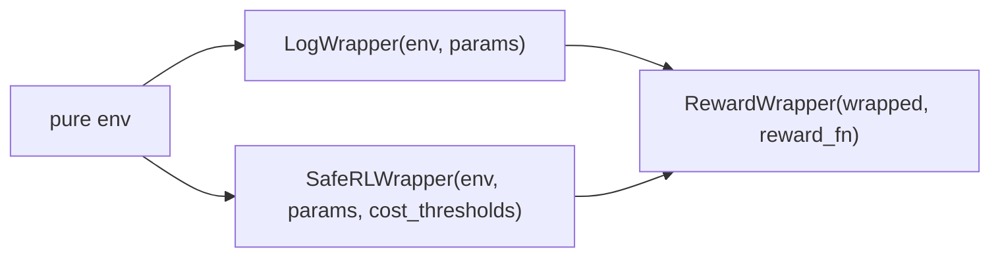

# RL — wrappers and single-agent trainers

Single-agent training adapters. For multi-agent wrappers and trainers, see [API → RL MARL](rl-marl.md). For the conceptual overview, see [Training → Wrappers](../training/wrappers.md) and [Training → Trainers](../training/trainers.md).

## Wrappers

```python
from powerzoojax.rl import (
    LogWrapper, LogEnvState,
    SafeRLWrapper, SafeRLState,
    RewardWrapper, RewardEnvState,
    bind,
)
```



### `LogWrapper`

Binds `params`; tracks per-episode return and length; injects `returned_episode_returns`, `returned_episode_lengths`, `returned_episode` into `info`.

::: powerzoojax.rl.wrappers.LogWrapper

::: powerzoojax.rl.wrappers.LogEnvState

### `SafeRLWrapper`

Returns a 6-tuple from `step`: `(obs, state, reward, costs, done, info)`. Used by CMDP trainers.

::: powerzoojax.rl.wrappers.SafeRLWrapper

::: powerzoojax.rl.wrappers.SafeRLState

### `bind`

Convenience constructor: `safe=False` returns `LogWrapper`, `safe=True` returns `SafeRLWrapper`.

::: powerzoojax.rl.wrappers.bind

### `RewardWrapper`

Overlay a custom reward on top of an existing wrapper. The unmodified env reward is preserved in `info["env_reward"]`.

::: powerzoojax.rl.reward.RewardWrapper

::: powerzoojax.rl.reward.RewardEnvState

## Training configuration

```python
from powerzoojax.rl import TrainConfig, load_config, save_config
```

::: powerzoojax.rl.config.TrainConfig

::: powerzoojax.rl.config.load_config

::: powerzoojax.rl.config.save_config

## Trainers

```python
from powerzoojax.rl import TrainResult, make_train, make_cmdp_train, train
```

`make_train(env, config)` is the dispatcher. It picks Rejax for `algo in {ppo, sac, td3, dqn}`, `make_cmdp_train` for `algo == "ppo_lagrangian"`, or the IPPO backends for MARL envs.

::: powerzoojax.rl.trainer.make_train

::: powerzoojax.rl.trainer.TrainResult

::: powerzoojax.rl.cmdp.make_cmdp_train

## One-line entry point

```python
from powerzoojax.rl import train
result = train("dso-nflex", seed=0)
```

::: powerzoojax.rl.train.train

## Presets

```python
from powerzoojax.rl import list_presets, get_preset
```

::: powerzoojax.rl.presets.list_presets

::: powerzoojax.rl.presets.get_preset
