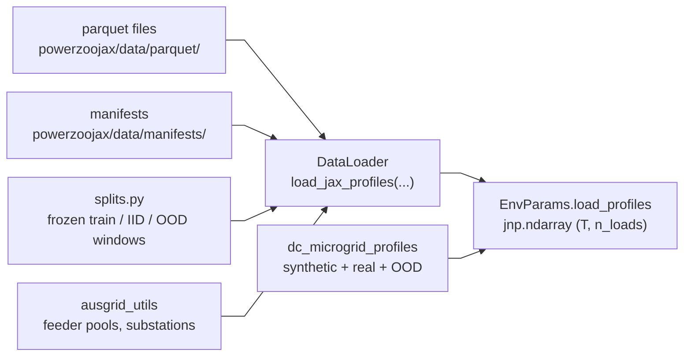
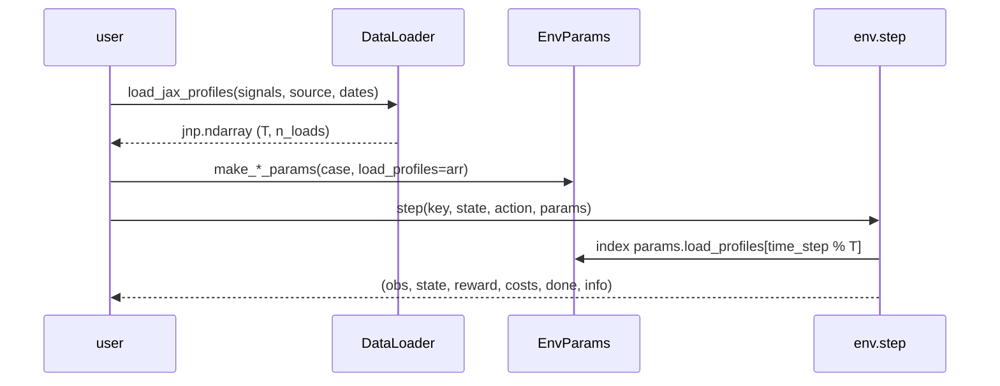

# Data pipeline

Realistic benchmark difficulty depends on real data. PowerZooJax keeps a thin, clearly bounded data layer that converts parquet files into the `jnp.ndarray` profiles stored in `EnvParams`. Nothing in this layer enters the compiled rollout.

## Where the data layer lives



All entries run at setup time only. The compiled rollout only sees `EnvParams`, which contains `jnp.ndarray` profiles indexed by `time_step % T`.

## `DataLoader` — the single facade

`DataLoader` is the only public way to read raw datasets. External code must not access `parquet/` directly. The facade has three layers:

- JAX layer (preferred for `EnvParams`): `load_jax_profiles(signals, source, ...)` returns a `jnp.ndarray` of shape `(T, len(signals))`, dtype `float32`, ready to pass into `params`.
- Semantic layer: `load_signals(...)` returns a pandas `DataFrame` keyed by stable signal names, useful for inspection and diagnostics.
- Raw-column layer: `load_data(...)` reads tables using raw parquet column names. Use it when you need explicit column control or ad-hoc table inspection; benchmark tasks still build `EnvParams` through `load_jax_profiles(...)` and the layers above.

Prefer `load_jax_profiles(...)` when constructing env params and `load_signals(...)` for inspecting curves. Reach for `load_data(...)` when the raw-column surface is the right tool; it is part of the same facade, not a separate data path.

Minimal example:

```python
from powerzoojax.data import DataLoader, signals as S

loader = DataLoader()
profiles = loader.load_jax_profiles(
    [S.LOAD_ACTUAL_MW, S.SOLAR_AVAILABLE_MW],
    source="gb",
    start_date="2025-04-01",
    end_date="2025-12-31",
    resample="30min",
)
print(profiles.shape, profiles.dtype)   # e.g. (13104, 2) float32
```

The full signal-name list is in [API → Data](../api/data.md).

## Datasets used by the suite

Four real-data sources are connected to the benchmark tasks:

- GB demand and gen-by-type (`source="gb"`) — system-level demand and per-fuel generation for Great Britain. Used by the TSO and GenCos tasks.
- GB MID market index data (`source="gb"`) — APX / N2EX mid prices and volumes aligned to the GB forecast/actual demand timeline. Used by Market Lite / price studies.
- Ausgrid distribution (`source="ausgrid"`) — Australian zone-substation load. Used by the DSO task. `ausgrid_utils` exposes feeder pools, substation lists, and split-window helpers.
- Google data-center workload (`source="google"`) — CPU utilization traces for the data-center microgrid task.

In CI / dev environments without parquet bundles, some tasks still retain
synthetic or flat-profile fallbacks so contracts can be tested. These are
development conveniences only. **Formal benchmark experiments must not use
synthetic fallback when real data is required.** Synthetic profiles are defined
in:

- `tasks.tso.make_tso_net_load_profiles(...)` — sinusoidal demand with diurnal wind / solar.
- `dc_microgrid_profiles.make_synthetic_*` — diurnal CPU, solar, outdoor temperature.

When a task guide says "real data required", missing parquet data should
fail the run rather than silently switching to these fallbacks.

## Frozen data splits

`splits.py` defines the train / IID / OOD windows used by every task so cross-paper comparisons stay reproducible. Examples:

| Split | Constant | Window |
| --- | --- | --- |
| GB train | `GB_TRAIN_START`, `GB_TRAIN_END` | 2025-04-01 → 2025-12-31 |
| GB IID | `GB_IID_START`, `GB_IID_END` | 2026-01-01 → 2026-03-31 |
| Ausgrid train | `AUSGRID_TRAIN_START`, `AUSGRID_TRAIN_END` | FY24 train window |
| Ausgrid IID | `AUSGRID_IID_START`, `AUSGRID_IID_END` | FY25 held-out days |
| Ausgrid summer OOD | `AUSGRID_SUMMER_START`, `AUSGRID_SUMMER_END` | Dec–Feb (Australian summer) |

`splits.gb_windows()` and `splits.ausgrid_windows()` return the matching `(start, end, role)` tuples. Use these helpers instead of hard-coded date strings; they are the source of truth.

For the Ausgrid pool, `ausgrid_utils.get_ausgrid_split(role)` and `get_feeder_substations(feeder, role)` return the substation list to load. The DSO task calls these inside `make_dso_params_from_split(case, role=...)` to build per-role feeder-shape profiles.

## Non-stationary sampling

`nonstationary.py` provides the building blocks for non-stationary RL evaluation:

- `EpisodeConfig` holds the per-episode demand multiplier, drift offset, and rolling window length.
- `NonstationarySampler` samples drift parameters per episode from a configured distribution.
- `apply_drift(profile, drift)` applies a per-step multiplier, so a long parquet pool yields many distinct 48-step episodes.

The DSO task uses these helpers via `make_dso_params_nonstationary(...)`.

## Data-center microgrid profiles

`dc_microgrid_profiles.py` is specialized for the 288-step microgrid task:

- `make_all_synthetic_profiles(n_steps, key)` returns synthetic CPU / solar / outdoor-temperature traces.
- `load_workload_profiles(source, n_steps, ...)` loads real Google traces (`source="google"`) when available, falling back to synthetic otherwise.
- `apply_ood_transform(params, scenario)` transforms an existing `DCMicrogridParams` to produce the OOD scenarios used by `benchmarks/dc_microgrid/`. Valid scenarios are listed in `VALID_OOD_SCENARIOS`: `workload_swap`, `workload_shock`, `renewable_drought`, `cooling_stress`, `dg_derating`, `sla_tighten`.

The microgrid env reads profiles cyclically (`profile[t % T]`), so the same loader output works for short tests and long episodes.

## How a profile reaches a step



This is why `EnvParams` is heavy and `EnvState` is light. All static tensors — load shapes, PTDF, BFS topology, cost coefficients — go into `params`. Only values that change per step (time index, SOC, queues, ...) go into `state`.

The next page, [JAX Parallelization Architecture](gpu-pipeline.md), shows how those `state` and `params` objects flow through `vmap` and `lax.scan`.
