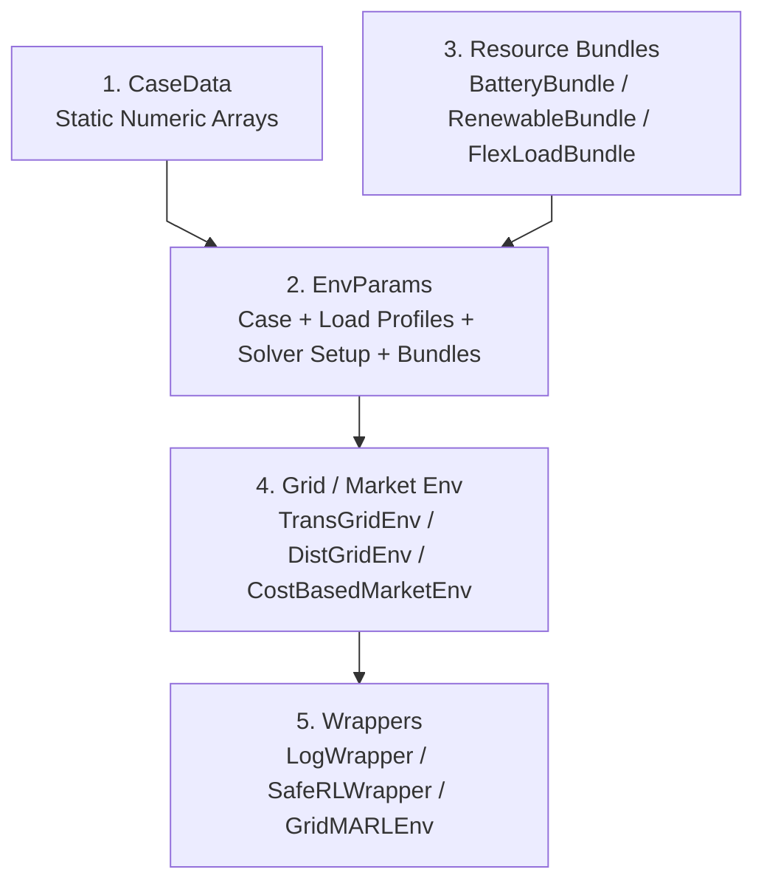
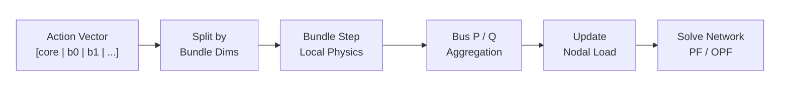
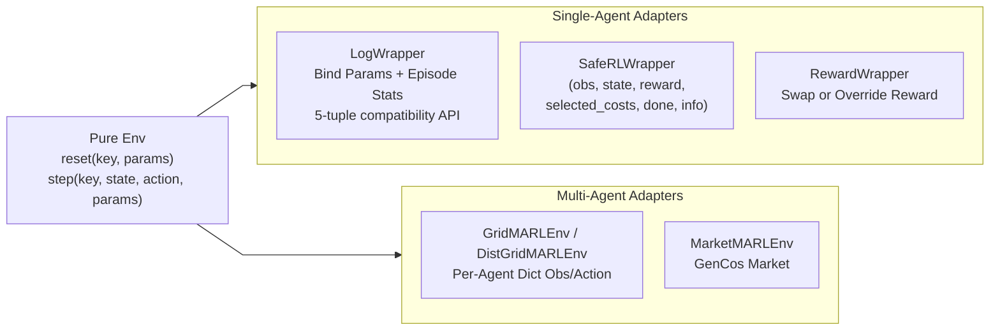

# Environment stack

A PowerZooJax environment is not a single class. It is a stack of pure functions composed at runtime. This page describes the layering and the contracts between layers, so you know where to extend the stack.

## The five layers of one rollout step



Each layer adds exactly one capability:

1. `CaseData` is the static, numeric description of the network.
2. `EnvParams` binds the case to a load-profile time series, a precomputed solver setup, and the resource bundles attached to specific buses.
3. Resource bundles are device-level pure functions, stepped before the network solve; their injections modify nodal load.
4. The grid or market env runs the physics solve and produces `(reward, costs)`.
5. Wrappers reshape the API for a specific training interface (single-agent unconstrained, single-agent CMDP, multi-agent dict).

## Layer 1 — `CaseData`

`CaseData` is a `flax.struct.dataclass` of JAX arrays describing the network: admittance matrices, generator costs, line capacities, voltage limits, three-phase loads if present. It has no Python `name` field — display metadata lives in `CaseMeta` from the case registry.

You build a case once at setup:

```python
from powerzoojax.case import load_case, list_cases

case = load_case("33bw")
print(case.n_nodes, case.n_lines, case.n_loads)
```

Built-in IDs include transmission cases (`5`, `14`, `118`, `300`, `1354pegase`, `2383wp`, `gb`) and distribution cases (`33bw`, `118zh`, `123`, `141`, `533mt_hi`, `533mt_lo`).

## Layer 2 — `EnvParams`

`EnvParams` is per-environment. Each grid env exposes a factory:

- `make_trans_params(case, load_profiles=..., max_steps=48, resources=(...), solver_mode=0, physics=0)`
- `make_dist_params(case, ..., resources=(...))`
- `make_dist_3phase_params(case, ..., resources=(...))`
- `make_cost_market_params(case, ...)`
- `make_uc_params(case, ...)` for unit commitment
- `make_dcmicrogrid_params(...)` for the data-center microgrid

Two important contracts:

- `load_profiles` has shape `(T, n_loads)` and is sliced by the env at index `time_step % T`.
- `resources` is a tuple of resource bundles. The tuple itself is part of the traced configuration, so its length is fixed at trace time.

## Layer 3 — resource bundles

Bundles are the way to attach many devices of the same type to a grid or market env without putting framework-specific logic in the environment. The bundle contract is documented in `powerzoojax/envs/resource/base.py`:

```python
class ResourceBundle:
    n_devices: int
    bus_idx: chex.Array          # (n_devices,) int32
    per_device_action_dim: int
    per_device_obs_dim: int
    action_dim: int
    obs_dim: int

    def reset(self, key) -> ResourceBundleState: ...
    def step(
        self, state, action, ctx
    ) -> tuple[ResourceBundleState, chex.Array, chex.Array, chex.Array, dict]: ...
    def observe(self, state, ctx) -> chex.Array: ...
```

`ResourceBundleState` is an abstract documentation name, not one shared runtime dataclass. Each concrete bundle defines its own bundle state type, such as `BatteryBundleState`, `RenewableBundleState`, or `FlexLoadBundleState`.

Public bundle implementations:

- `BatteryBundle` — multi-device storage with optional reactive control (PQ-circle).
- `RenewableBundle` — multi-device PV / wind with optional curtailment and reactive control.
- `FlexLoadBundle` — multi-device demand response with curtail + shift actions.

Bundle actions are flat one-dimensional slices with device-major layout:

```python
# BatteryBundle, P-only
[p_0, p_1, ..., p_{N-1}]

# BatteryBundle, P+Q enabled
[p_0, q_0, p_1, q_1, ..., p_{N-1}, q_{N-1}]
```

`action_dim = n_devices * per_device_action_dim`, so the grid env can slice the full action vector by bundle and pass each bundle its own flat action segment.

Inside a grid env, the per-step flow is:



The same pattern is used by `CostBasedMarketEnv` and `BidBasedMarketEnv`. Bundle-reported costs are surfaced as named cost components inside the parent env's `costs` vector and mirrored in `info` for diagnostics.

## Layer 4 — grid and market environments

These are the `Environment` subclasses. They are stateless — methods only, no runtime state. The runtime state lives in `EnvState` (or a subclass: `TransGridState`, `UCState`, `DistGridState`, `DistGrid3PhState`, `CostMarketState`, `BidMarketState`, `DCMicrogridState`, ...).

The contract every env satisfies:

```python
obs, state = env.reset(key, params)
obs, state, reward, costs, done, info = env.step(key, state, action, params)
obs, state, reward, costs, done, info = env.step_auto_reset(key, state, action, params)
space = env.observation_space(params)
space = env.action_space(params)
```

`step` already auto-resets. `step_auto_reset` adds `stop_gradient` on the returned obs and state. See [JAX + RL environment implementation rules](../concepts/jax-contract.md) for the conventions these implementations follow.

## Layer 5 — wrappers

Wrappers are how a single env serves three different training interfaces:



- `LogWrapper(env, params)` binds `params` so the wrapped object exposes `.reset(key)` and `.step(key, state, action)`. It projects the core env to a 5-tuple library-compatible API, while keeping `constraint_costs` and `cost_sum` in `info`.
- `SafeRLWrapper(env, params, selected_names=..., cost_thresholds=...)` returns a 6-tuple from `step` so a CMDP trainer can read the selected cost vector directly.
- `RewardWrapper(env, params, reward_fn=...)` lets you replace the reward without touching the env. The unmodified env reward is preserved in `info["env_reward"]`.
- `GridMARLEnv` and `DistGridMARLEnv` produce per-agent dicts on top of `TransGridEnv` and `DistGridEnv`. Generator agents are named `unit_i`; bundle devices are named by resource type (`battery_0`, `pv_0`, `flexload_0`, ...).
- `MarketMARLEnv` wraps the GenCos market core; agents are named `agent_i`.

These wrappers are the only place training-framework concerns are allowed. See [Wrappers](../training/wrappers.md) for the full API.

## What composition looks like end-to-end

A typical "DSO with 6 FlexLoad devices, single-agent PPO" training run uses every layer:

```python
from powerzoojax.case import load_case
from powerzoojax.tasks.dso import make_dso_flexload_bundle, make_dso_params
from powerzoojax.envs.grid.dist import DistGridEnv
from powerzoojax.rl import LogWrapper

case = load_case("33bw")                       # layer 1
bundle = make_dso_flexload_bundle(case)        # layer 3 (bundle factory)
params = make_dso_params(case, resources=(bundle,))  # layer 2
env = DistGridEnv()                            # layer 4
wrapped = LogWrapper(env, params)              # layer 5
```

`wrapped.reset(key)` and `wrapped.step(key, state, action)` are now ready for any PureJaxRL-style trainer. The next page, [Data pipeline](data-pipeline.md), shows how real load profiles are loaded into `params`.
