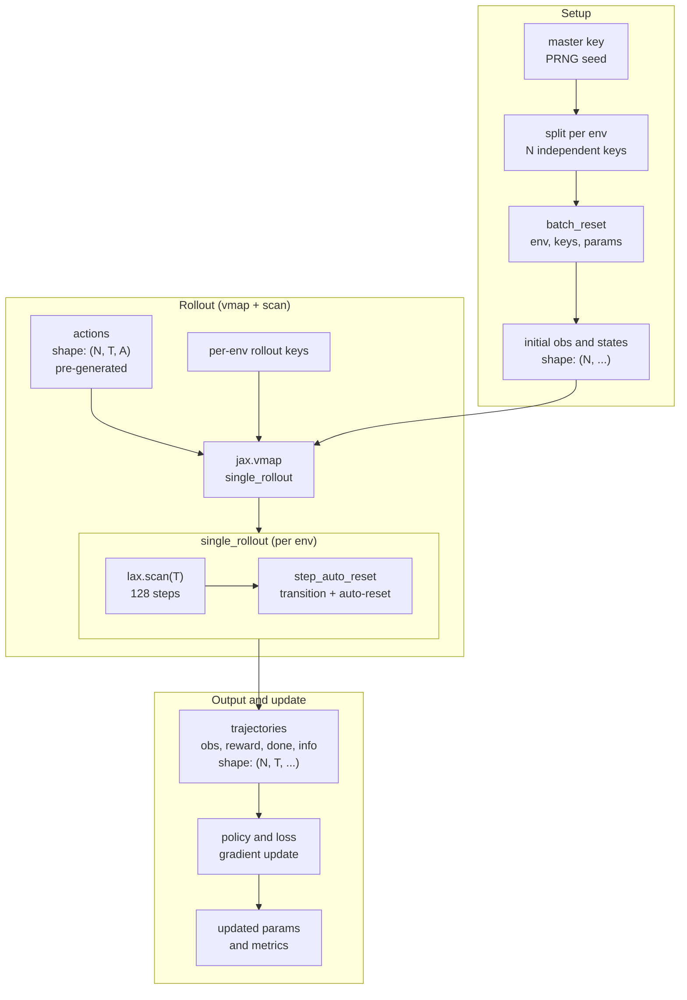

# JAX Parallelization Architecture

PowerZooJax is designed natively for JAX, leveraging `vmap` (vectorization) and `lax.scan` (fixed-length loops) to implement environment sampling, policy forward passes, and gradient updates as pure functions. This architecture compiles efficiently to accelerated devices. This page explains the three key building blocks and helpers in `powerzoojax.utils.jax_utils`.

## The three building blocks

### 1. Auto-reset inside `step`

Every PowerZooJax `step` ends with the auto-reset pattern. When `done=True`, the returned `state` is already the freshly reset initial state of the next episode. The transition still reports `done=True`, so a wrapper can record episode statistics, but the rollout loop never breaks out to handle episode boundaries.

### 2. `step_auto_reset`

`step_auto_reset(key, state, action, params)` is `step` plus `jax.lax.stop_gradient` on the returned observation and state. Use it inside `lax.scan` as defensive protection: sampling currently has no gradient tracking, but if code is later modified to add gradient tracking, `stop_gradient` automatically prevents gradients from flowing across episode boundaries. This enforces the core model-free RL principle: episodes are independent, and gradients must not cross their boundaries.

### 3. `vmap` + `scan`

- `jax.vmap` parallelizes a function over many environments.
- `jax.lax.scan` runs a fixed-length time loop on device.

Together they replace the typical `for env in envs: for t in range(T): ...` Python pattern with a single compiled program.

## Rollout data flow



**Parameter reference**:

| Symbol | Meaning | Typical Value |
|--------|---------|---------------|
| **N** | Parallel environments | task-specific (DSO `128`, TSO `256`, DERs `128`, DCMG `64`, GenCos `256`; see paper Table 1) |
| **T** | Rollout length | task-specific (`48` for TSO/DSO/DERs/GenCos, `288` for DCMG) |
| **A** | Action dimension | Varies |

**Key feature**: the entire flow executes inside a single JIT-compiled program.

## Helpers

`powerzoojax.utils.jax_utils` exposes the standard helpers:

```python
from powerzoojax.utils.jax_utils import (
    split_key_for_envs,
    batch_reset,
    batch_step,
    scan_rollout,
)
```

### Parallel reset

```python
keys = jax.random.split(jax.random.PRNGKey(0), n_envs)
obs, states = batch_reset(env, keys, params)
```

`batch_reset` is `jax.vmap(env.reset, in_axes=(0, None))`, so `params` is broadcast and `keys` is the batched axis.

### Parallel step (with auto-reset)

```python
step_keys = jax.random.split(jax.random.PRNGKey(1), n_envs)
obs, states, rewards, costs, dones, infos = batch_step(
    env, step_keys, states, actions, params
)
```

`batch_step` uses `step_auto_reset` under the hood so done envs reset transparently.

### Fixed-length rollout (`scan`)

```python
final_state, obs_traj, reward_traj, cost_traj, done_traj, info_traj = scan_rollout(
    env, key, init_state, params, actions
)
```

`actions` has shape `(T, *action_shape)`. The output trajectories are stacked along the same `T` axis. Inside `scan_rollout`, the master key is split into `T` per-step keys before the scan starts, so the function still takes only one input key.

## A complete pattern

```python
import jax
import jax.numpy as jnp

from powerzoojax.case import load_case
from powerzoojax.envs import TransGridEnv, make_trans_params
from powerzoojax.utils.jax_utils import batch_reset, scan_rollout

case = load_case("5")
env = TransGridEnv()
params = make_trans_params(case, max_steps=48)

@jax.jit
def collect(key):
    n_envs = 64
    horizon = 48

    key, k_reset, k_actions, k_roll = jax.random.split(key, 4)

    env_keys = jax.random.split(k_reset, n_envs)
    obs0, states0 = batch_reset(env, env_keys, params)

    actions = jax.random.uniform(
        k_actions,
        (n_envs, horizon, case.n_units),
        minval=-1.0,
        maxval=1.0,
    )

    rollout_keys = jax.random.split(k_roll, n_envs)

    def single_rollout(state, key, action_seq):
        return scan_rollout(env, key, state, params, action_seq)

    final_states, obs_traj, reward_traj, cost_traj, done_traj, info_traj = jax.vmap(
        single_rollout
    )(states0, rollout_keys, actions)

    return reward_traj
```

Everything inside `collect` is one compiled XLA program after the first call. There are no Python loops in the hot path.

## Wrappers preserve the contract

`LogWrapper`, `SafeRLWrapper`, `RewardWrapper`, `GridMARLEnv`, and `MarketMARLEnv` all preserve `jit` / `vmap` / `scan` compatibility: their state classes are pytrees, and `reset` and `step` are pure. You can apply any of them to an inner env and still use `batch_reset` and `scan_rollout`.

The MARL wrappers extend the contract slightly:

- `reset(key, params)` returns `(obs_dict, state)`.
- `step(key, state, action_dict, params)` returns `(obs_dict, state, reward, done, info)`.
- The state still goes through `jax.lax.stop_gradient` inside `step_auto_reset`.

## Practical notes

- Always use a fixed rollout length. Variable-length episodes are handled by auto-reset inside that fixed window.
- Keep action and state shapes static. An environment with an optional bundle produces a separate trace for each `EnvParams` that turns it on or off.
- `lax.scan` over batched envs is covered by `tests/grid/test_gpu_pipeline.py` and `tests/resource/test_gpu_pipeline.py`; new envs must keep these tests passing.
- For repeated training calls, build the `train` JIT closure once with `env`, `params`, and the policy structure, and reuse it. Recompiling on every call defeats the purpose.

This is the last page in the architecture layer. The next layer, [Physics](../physics/transmission.md), describes what each environment does inside `step`.
