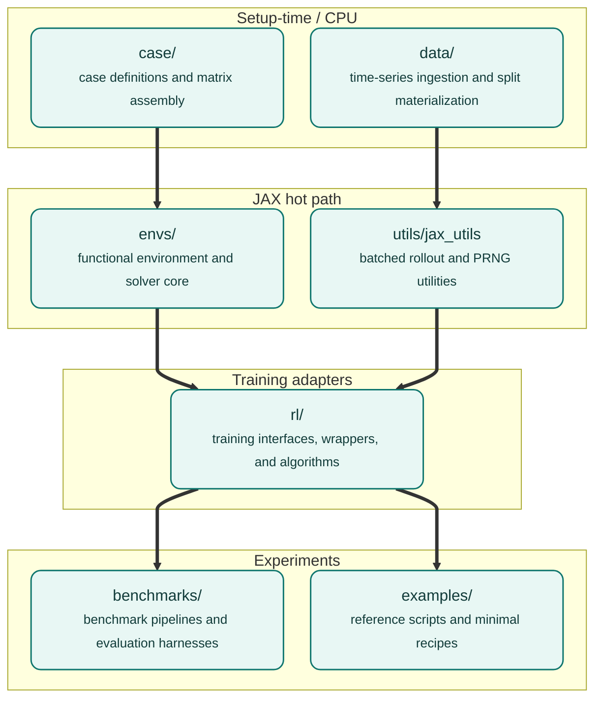

# Repository map

This page maps the source tree. Read it once when you start working with PowerZooJax; afterwards you should be able to predict where any feature lives.

## Top-level layout

```text
PowerZooJax/
|-- powerzoojax/         <- the package itself
|   |-- case/            <- network data and matrix builders (CPU setup)
|   |-- data/            <- parquet / time-series loading (CPU setup)
|   |-- envs/            <- pure JAX environments (the hot path)
|   |   |-- grid/        <- transmission and distribution envs + solvers
|   |   |-- resource/    <- battery, renewable, EV, flex load, data center
|   |   |-- market/      <- DC market, SCED solver, GenCos market MARL core
|   |   |-- microgrid/   <- composite behind-the-meter microgrid envs
|   |   |-- base.py      <- Environment abstract class, EnvState, EnvParams
|   |   `-- spaces.py    <- Box, Discrete, MultiDiscrete, MultiBinary
|   |-- rl/              <- RL training adapters (wrappers + trainers)
|   |-- tasks/           <- benchmark task recipes, metrics, and baselines
|   |-- utils/           <- jax_utils (batch_reset, scan_rollout, ...)
|   |-- __init__.py      <- top-level lazy exports
|   `-- __main__.py      <- python -m powerzoojax CLI entry
|-- benchmarks/          <- the 5 paper task pipelines
|-- examples/            <- runnable scripts (single-file recipes)
|-- tests/               <- pytest suite (L0 contract + L1 physics + L2 equivalence)
|-- docs/en/             <- this documentation
|-- pyproject.toml       <- dependency specification
`-- mkdocs.yml           <- documentation build config
```

## What lives in each top-level layer



Arrow direction = import direction: `envs/` may import from `case/` and `utils/`; `rl/` may import from `envs/`; `benchmarks/` may import from any of them. The reverse is forbidden, so the physics layer stays usable without a training framework.

## `powerzoojax/case/`

Static network data, converted into JAX arrays once at setup and never modified at runtime.

| File | Role |
| --- | --- |
| `case_data.py` | `CaseData` pytree (admittances, generator costs, line caps, etc.) |
| `case_builder.py` | Factory `build_case_from_tables(...)` and per-case `create_caseN()` builders invoked by `load_case` |
| `__init__.py` | Public `load_case("5")`, `load_case("33bw")`, ... entry point |
| `_registry.py` | `list_cases`, `get_meta`, `CaseMeta` |
| `case_matrices.py` | PTDF, adjacency, Laplacian builders |
| `case_adapter.py` | PowerZoo dataframe → `CaseData` conversion |
| `case_info.py` | Pretty-printed inspection (CPU only) |
| `case_plotter.py` | matplotlib topology drawing (CPU only) |
| `cases/`, `raw_cases/` | Built-in network definitions |

`CaseData` is intentionally numeric only. Display names are kept in `CaseMeta` so they do not appear in the JIT trace (see the glossary entry for `trace` in [JAX + RL environment implementation rules](../concepts/jax-contract.md)).

## `powerzoojax/data/`

Setup-time facade for real time-series data: GB demand, Ausgrid distribution feeders, and Google data-center traces.

| File | Role |
| --- | --- |
| `data_loader.py` | `DataLoader.load_jax_profiles(...)` |
| `signals.py` | Stable signal name constants (`LOAD_ACTUAL_MW`, ...) |
| `manifest.py`, `registry.py` | Dataset catalog / registration |
| `splits.py` | Frozen train / IID / OOD windows |
| `ausgrid_utils.py` | Ausgrid feeder pools and substation selection |
| `nonstationary.py` | Drift sampling for non-stationary RL |
| `dc_microgrid_profiles.py` | Synthetic and real microgrid profile loading + OOD transforms |

Nothing in `data/` enters the compiled rollout. It returns `jnp.ndarray` values that are then stored in `EnvParams`.

## `powerzoojax/envs/`

The core of the suite. All pure JAX, JIT-compatible, vmap-compatible. See [Environment stack](env-stack.md) for the cross-module composition rules.

`envs/grid/`:

| File | Role |
| --- | --- |
| `base.py` | `GridState`, `GridParams` shared across grid envs |
| `power_flow.py` | DC power flow, safety check, generation-cost integrator |
| `ac_power_flow.py` | Newton-Raphson AC PF solver |
| `bfs_power_flow.py` | Balanced radial BFS solver |
| `bfs_3phase_power_flow.py` | Three-phase radial BFS solver |
| `dc_opf.py` | Linear DC OPF solver |
| `ac_opf.py` | Augmented-Lagrangian AC OPF solver |
| `trans.py` | `TransGridEnv` (5 mode matrix: DC PF / AC PF / DCOPF / DCOPF+AC / ACOPF) |
| `dist.py` | `DistGridEnv` (balanced radial) |
| `dist_3phase.py` | `DistGrid3PhaseEnv` (unbalanced three-phase) |
| `unit_commitment.py` | `UnitCommitmentEnv` (SCUC dynamics — physical layer) |

`envs/resource/`:

| File | Role |
| --- | --- |
| `base.py` | `ResourceState`, `ResourceParams`, `ResourceBundle` protocol |
| `battery.py` | `BatteryEnv` + `BatteryBundle` |
| `renewable.py` | `RenewableEnv` + `SolarEnv` + `WindEnv` + `RenewableBundle` |
| `vehicle.py` | `VehicleEnv` |
| `flexload.py` | `FlexLoadEnv` + `FlexLoadBundle` |
| `datacenter.py` | `DataCenterEnv` (IT + cooling + thermal) |
| `diesel.py` | `DieselParams` + `DieselBundle` (diesel-generator SoA bundle) |

`envs/microgrid/` (composite 1-bus behind-the-meter env, composes resources via the `ResourceBundle` protocol):

| File | Purpose |
| --- | --- |
| `dc_microgrid.py` | `DataCenterMicrogridEnv` (DataCenter + BatteryBundle + RenewableBundle + DieselBundle) |

`envs/market/`:

| File | Role |
| --- | --- |
| `base.py` | `MarketState`, `MarketParams` |
| `cost_based_market.py` | `CostBasedMarketEnv` (DCOPF clearing) |
| `bid_based_market.py` | `BidBasedMarketEnv` (approximate / heuristic piecewise ED) |
| `clearing.py` | Piecewise-ED helpers (segment construction, KKT-style LMP recovery) |
| `offer_sced.py` | Exact bid-based SCED via primal-dual interior point |
| `market_marl_core.py` | GenCos rolling market core (per-unit profit, ramp coupling) |
| `lmp_market.py` | Alternate import path and names for `CostBasedMarketEnv` |

## `powerzoojax/tasks/`

Task recipes — one file per paper-suite benchmark task. Contains factory functions, data-split helpers, non-learning baselines, and `compute_*_metrics`. Physical dynamics stay in `envs/`.

| File | Task |
| --- | --- |
| `dso.py` | DSO — DistGrid + FlexLoad case33bw factories + baselines |
| `tso.py` | TSO — SCUC case118 UCParams factories + reference baselines |
| `ders.py` | DERs — case141 12-agent heterogeneous resource factories |
| `gencos.py` | GenCos — case5 MARL market GB-profile factory + metrics |
| `dc_microgrid.py` | DC Microgrid — DataCenter microgrid recipe + metrics |

## `powerzoojax/utils/`

| File | Role |
| --- | --- |
| `jax_utils.py` | `batch_reset`, `batch_step`, `scan_rollout`, `split_key_for_envs` |
| `typing.py` | Shared type aliases |

These are the helpers training loops call. See [JAX Parallelization Architecture](gpu-pipeline.md).

## `powerzoojax/rl/`

Adapters between the pure physics layer and training code. Nothing here may leak back into `envs/`.

| File | Role |
| --- | --- |
| `wrappers.py` | `LogWrapper`, `SafeRLWrapper`, `bind` |
| `reward.py` | `RewardWrapper` for custom-reward injection |
| `multi_agent.py` | `GridMARLEnv`, `DistGridMARLEnv`, `MultiAgentEnvironment` |
| `market_marl.py` | `MarketMARLEnv` (GenCos task adapter) |
| `config.py` | `TrainConfig` dataclass (frozen) |
| `trainer.py` | `make_train` dispatcher (PPO / IPPO / typed-IPPO / Lagrangian) |
| `cmdp.py` | PPO-Lagrangian implementation |
| `ippo.py` | Independent PPO implementation (parameter-shared and typed) |
| `presets.py` | One-line `PRESETS` dict (`battery-soc-tracking`, `tso-uc`, ...) |
| `train.py` | `train(preset_name, ...)` entry point |

## `benchmarks/`

The 5 paper-experiment pipelines. Each task has its own directory with `configs/`, `run.py`, `train.py`, `eval.py`, `baselines.py`, `summarize.py`, `plots.py`, `results/`. See [Benchmarks overview](../benchmarks/overview.md).

## What is intentionally not here

- No general OPF library. The OPF solvers target benchmark fidelity, not utility-grade dispatch.
- No production market platform. `Market Lite` covers cost-based clearing, simple rule-shaped offers, exact PD-IPM SCED, and a competitive-bidding MARL core, but not contingency-constrained, multi-period co-optimized markets.
- No built-in Gym / Gymnax wrapper layer. PowerZooJax provides its own minimal `Environment` base; library-level adapters live in `rl/` when needed.

The next page, [Environment stack](env-stack.md), shows how the modules above compose at runtime.
