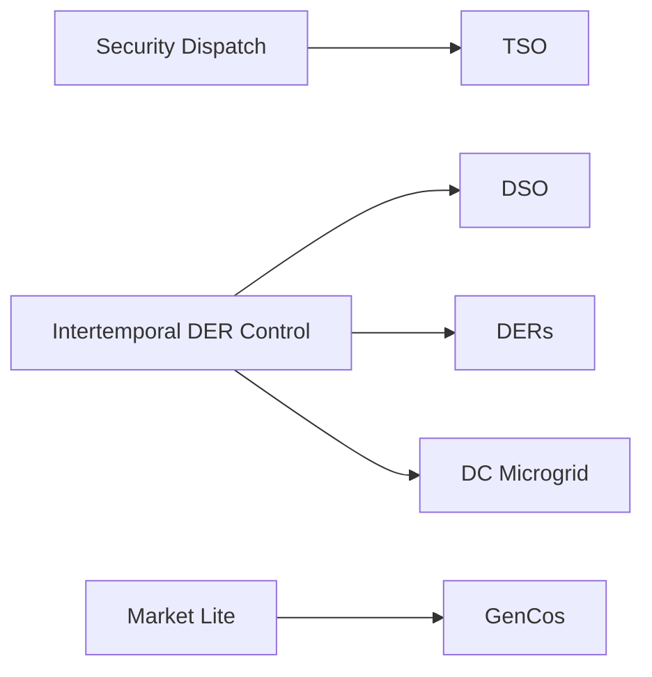
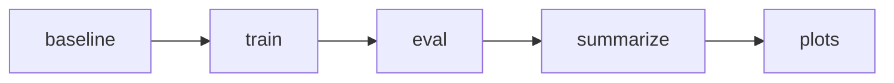

# Benchmarks overview

The benchmark layer collects the paper-facing experiments in PowerZooJax. The envs, wrappers, tasks, trainers, and reporting scripts are all organized around this layer.

This page is a top-level map: the five tasks, the shared workflow, the result schema, and the backend/device comparison contract. For benchmark workflow terms such as `campaign`, `NormScore`, `IQM`, `primary split`, `primary metric`, `convergence target`, or `leaderboard quantity`, see the [Benchmark workflow glossary](../glossary.md).

## First-time users

If you are new to PowerZooJax, the easiest starting point is usually [DSO](dso.md): it is single-agent, physically interpretable, and has a short `run.py` workflow. A minimal first run is:

```bash
python benchmarks/dso/run.py baseline --seeds 0
python benchmarks/dso/run.py train --algo ppo --seed 0
python benchmarks/dso/run.py eval --run-id <run_id> --split iid
python benchmarks/dso/run.py summarize
```

After that first pass, inspect `benchmarks/dso/results/summary/latest.json` first. For a beginner, the simplest success signal is: the pipeline finishes end-to-end, writes a run record plus summary, and reports physically sensible DSO metrics such as `total_loss_mwh`, `voltage_violation`, and `NormScore`.

If you want a more targeted entry point, use this shortcut:

| If you want to start with... | Read first |
| --- | --- |
| single-agent distribution control | [DSO](dso.md) |
| safe RL with explicit CMDP language | [TSO](tso.md) |
| cooperative MARL on the grid | [DERs](ders.md) |
| competitive MARL / market bidding | [GenCos](gencos.md) |
| multi-objective microgrid control | [DC Microgrid](dc-microgrid.md) |

## The five tasks

| Task | Pillar | Case | Agents | Steps | RL paradigm |
| --- | --- | --- | --- | --- | --- |
| [TSO](tso.md) | Security dispatch | `case118` | 1 | 48 x 30 min | safe RL on SCUC |
| [DSO](dso.md) | Intertemporal DER control | `case33bw` | 1 | 48 x 30 min | single-agent demand response |
| [DERs](ders.md) | Intertemporal DER control | `case141` | 12 | 48 x 30 min | cooperative MARL |
| [DC Microgrid](dc-microgrid.md) | Intertemporal DER control | self-contained | 1 | 288 x 5 min | multi-objective robust RL |
| [GenCos](gencos.md) | Market Lite | `case5` | 5 | 48 x 30 min | competitive MARL |

Current evidence snapshot as of 2026-04-25:

- TSO has complete 5-seed evidence, but the strict zero-violation safety gate is negative.
- DSO has complete 5-seed evidence; the official eval split is IID only.
- DERs uses `case141`; Phase 1 has complete 5-seed evidence and the mandatory seed-0 backend/device matrix is complete.
- GenCos Phase-2 Python rows use frozen self-play IL, not random-opponent baselines.
- DC Microgrid has complete Phase-2 backend evidence and execution-scaling artifacts; strict exact-zero feasibility has a numerical-tail caveat.

Shared terms used across the task pages:

- `OOD split`: an out-of-distribution evaluation setting whose data distribution differs from training.
- `reward shaping`: the underlying physics stay unchanged, but the training reward adds fixed penalties or bonuses.
- `CMDP`: a constrained Markov decision process, where reward and cost are reported through separate channels.
- `NormScore`: a diagnostic task-normalized score anchored to frozen non-learning baselines. Primary tables rank by each task's raw primary metric unless `norm_score_status=ok`.

The five tasks are intentionally heterogeneous. They are not meant to reward one universal algorithm; they are meant to stress different combinations of physics, uncertainty, temporal coupling, and agent interaction under one reporting contract.

## What Is Actually Trained

This table removes one common source of confusion: the physical env, the benchmark task, and the formal training path are related, but they are not the same layer.

| Task | Agent setting | Benchmark task type | Current formal training path | Primary leaderboard quantity | Main safety / audit gate |
| --- | --- | --- | --- | --- | --- |
| TSO | single-agent | MDP / CMDP SCUC dispatch | PPO or PPO-Lagrangian | `total_operating_cost` | zero thermal overload and zero reserve shortfall |
| DSO | single-agent | demand-response MDP / CMDP | PPO, SAC, Sauté PPO, or PPO-Lagrangian | `total_loss_mwh` for interpretation; current convergence target is `total_reward` | zero voltage-violation rate |
| DERs | 12-agent MARL | cooperative constrained task | reward-shaped IPPO / IPPO-safe / IPPO-Lagrangian | `mean_p_loss_mw` | zero voltage-violation target |
| DC Microgrid | single-agent | multi-objective constrained task | reward-shaped PPO / SAC | `episode_reward` | SLA / temperature / deficit channels are audited |
| GenCos | 5-agent MARL | competitive Markov game | IPPO | `total_profit` | market-concentration audit via `market_HHI` |

One naming detail is easy to miss: `NormScore` is the benchmark concept, while `norm_score` is often the serialized metric key written into result records.



## Benchmark workflow

Each task page follows the same reader-facing structure:

1. task definition and frozen setup
2. baselines
3. training algorithms
4. eval splits
5. metrics
6. quick-start commands
7. output artifacts

If a task depends on real data, formal benchmark runs must fail rather than silently fall back to synthetic data. Development presets may still exist for local checks, but they are not benchmark records.

The formal workflow has two phases:

- Phase 1: rerun the canonical `jax_rejax + GPU` benchmark path from scratch for the current [campaign](../glossary.md#campaign). The `seed=0` chain must pass the initial readiness checks before multi-seed runs are treated as formal.
- Phase 2: run the backend/device comparison matrix on the same frozen task setup. The exact cells are task-specific; the current paper-facing matrices use `jax_rejax + gpu` / `jax_rejax + cpu` plus Python backend rows such as `sb3 + cuda`, `sb3 + cpu` where configured, and `sbx + cuda` where a formal SBX row is part of the task matrix.

## Unified result schema

Every `baseline`, `train`, and `eval` command writes a result record with at least:

- task
- algorithm
- backend / device
- seed
- split
- scalar metrics
- artifact paths

Because the schema is shared across all five tasks, summary tables and plots can be regenerated from the task manifests without task-specific parsing logic.

## Cross-task statistics

Cross-seed summaries use robust statistics such as `IQM` (interquartile mean) and task-normalized `NormScore`.

The exact normalization anchor differs by task:

- TSO and DSO normalize against physically meaningful non-learning dispatch / control baselines.
- DERs normalizes against `no_control` and the stronger `volt_droop` rule.
- DC Microgrid currently normalizes on `episode_reward`, because the frozen convergence target is also reward-based.
- GenCos normalizes market performance on `total_profit` against frozen bidding baselines.

This keeps each task physically interpretable while still supporting one cross-task summary figure.

## Hardware contract

The hardware contract freezes the assumptions behind throughput comparisons:

- 1 x NVIDIA RTX 4500 Ada (24 GB) GPU on a single workstation (AMD Ryzen Threadripper PRO 7985WX, 64 cores, 256 GB RAM); the same workstation runs all paper-facing experiments
- one GPU per training or eval run
- within a task, seeds run in parallel; algorithms run serially; tasks run serially
- `num_envs` has two distinct meanings depending on which YAML it appears in, both kept frozen per task:

| Task | Training `num_envs` (`train_<algo>.yaml`, paper Table 1) | Throughput-cap `num_envs` (`task.yaml`) |
| --- | --- | --- |
| DSO | 128 (PPO/PPO-Lag/Sauté) / 64 (SAC) | 512 |
| TSO | 256 (PPO/PPO-Lag/penalty) / 64 (SAC) | 1024 |
| DERs | 128 | 128 |
| DC Microgrid | 64 | 256 |
| GenCos | 256 | 256 |

The training value drives the actual policy update and matches paper Table 1 (`tab:speed`) and Appendix H.2. The throughput-cap value in `task.yaml` is metadata used only by the cross-backend speed harness; `train.py` ignores it. Each `RunRecord` stores `throughput_sps`, so the cross-task throughput table can be reconstructed from `manifest.json` alone.

## Run-script flow

Typical commands look like:

```bash
python benchmarks/dso/run.py baseline --seeds 0,1,2,3,4
python benchmarks/dso/run.py train --algo ppo --seed 0
python benchmarks/dso/run.py eval --run-id <run_id> --split iid
python benchmarks/ders/run_all.py --only train --algos ippo ippo_safe ippo_lagrangian --seeds 0 1 2 3 4
python benchmarks/gencos/run_all.py --only eval
python benchmarks/dso/run.py summarize
python benchmarks/dso/run.py plots
```

- `baseline`: runs the non-learning baselines.
- `train`: trains a policy and writes a run record plus checkpoint artifacts.
- `eval`: re-evaluates a trained checkpoint on a specified split.
- `summarize`: aggregates `manifest.json` into `results/summary/latest.json`.
- `plots`: regenerates the task-level figures in `results/figures/`.



## Backend / device comparisons

For backend or device comparisons, keep the task config fixed and vary only the backend or device:

| Mode | Command surface | Notes |
| --- | --- | --- |
| JAX + GPU | each task's own `run.py` / `run_all.py` with `CUDA_VISIBLE_DEVICES=<id>` | canonical PowerZooJax path |
| JAX + CPU | same command with `JAX_PLATFORM_NAME=cpu JAX_PLATFORMS=cpu` | same seeds, timesteps, splits |
| Python + GPU | `python -m benchmarks.common.powerzoo_bridge driver ... --device cuda` | required `sb3` row in the minimum matrix |
| Python + CPU | same driver with `--device cpu` | required `sb3` row in the minimum matrix |

All rows in a backend/device table must keep the same:

- case
- real data source
- split definition
- seed set
- total timesteps
- eval-episode count
- reward scaling
- safety thresholds

## Reading order

If the task pages mention unfamiliar power-system terms, start with [Concepts](../concepts/overview.md) and the relevant [Physics](../physics/transmission.md) / [Physics](../physics/distribution.md) / [Physics](../physics/markets.md) / [Physics](../physics/microgrid.md) page. Then go to the task you care about:

- [TSO](tso.md): security-constrained unit commitment on `case118`
- [DSO](dso.md): flexible-load loss minimization on `case33bw` with Ausgrid data
- [DERs](ders.md): 12-agent cooperative DER control on `case141`
- [DC Microgrid](dc-microgrid.md): grid-connected data-center microgrid with PV, battery, diesel, and a capped grid-import port (islanded under simulated outages)
- [GenCos](gencos.md): 5-agent rolling competitive electricity market on `case5`
