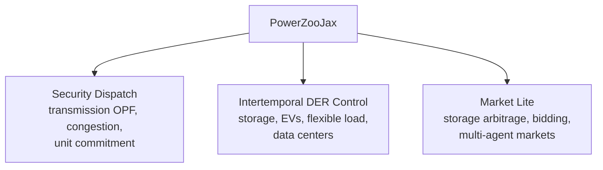

# Overview

PowerZooJax is a benchmark suite for reinforcement learning (RL) on power-system control problems, written entirely in JAX. It is not a general-purpose power simulator. It is a small set of physically grounded benchmarks that ML researchers can train on using the same GPU pipeline they already use for gym-like environments.

This page is the shortest overview. The other pages in this layer go deeper into each idea.

## Beginner Entry Point

If the power-system side is new to you, read the [Power systems primer](power-systems-primer.md) before continuing. It introduces core ideas such as power flow, buses, lines, active and reactive power, voltage, OPF, LMP, and SOC, so the abbreviations and physical semantics in this layer are easier to follow.

## What problem this suite is built for

Two reader communities use this documentation:

- ML readers who want a JAX-native benchmark with realistic dynamics, fixed-length rollouts, and a clean reward / cost interface.
- Power-systems readers who want to drive their existing physical models from PyTorch, Flax, or PureJaxRL-style training loops without writing a new simulator.

Both have the same two requirements: realistic physical dynamics, and an API that does not add overhead to the training loop.

## Compact comparison

The easiest way to place PowerZooJax is to compare it with the three things readers usually expect it to be:

| Compared with | Primary purpose | What it usually optimizes for | What PowerZooJax does differently |
| --- | --- | --- | --- |
| Gymnasium-style environments | General RL environment API | Simple interfaces, broad task coverage, easy experimentation | Keeps the gym-like RL contract, but makes the environment itself JAX-native, physics-grounded, and compatible with `jit` / `vmap` / `scan` end-to-end |
| Generic power simulators | Power-system modeling and analysis | Modeling breadth, engineering workflows, simulator flexibility | Narrows the scope to a small benchmark suite for RL, with fixed-shape functional state and training-loop-friendly APIs instead of simulator-first interfaces |
| PowerZoo | Power-system RL benchmarks in Python | Benchmark semantics and task design | Preserves the benchmark intent, but rebuilds the environments around pure JAX execution so rollout and batching stay on accelerators and the benchmark pipeline can minimize Python loop overhead |

So the project is not trying to beat Gymnasium on breadth, or generic simulators on engineering scope. It is trying to occupy the middle ground: credible power-system benchmarks with an API and execution model that fit modern JAX RL pipelines.

## Three benchmark categories

PowerZooJax groups its environments into three categories. Each category covers a different physical regime and produces a different kind of RL difficulty.

- Security Dispatch is built around shared network constraints: one generator's action changes the feasible set of every other generator through the power-flow solver.
- Intertemporal DER Control turns physical memory (state of charge, deferred demand, queued jobs) into RL state, so credit assignment is delayed and observability is partial.
- Market Lite adds simplified nodal pricing on top of dispatch, so reward depends on both price timing and physical feasibility.

DER is short for distributed energy resource: small generators, storage units, EVs, or controllable loads at the distribution level. SOC is state of charge, the energy currently stored in a battery as a fraction of capacity. LMP is locational marginal price: the marginal cost of one extra MWh at a specific bus, reported in GBP (£) for the paper benchmark experiments.

## MDP / CMDP task contract

Every benchmark in PowerZooJax is specified as an MDP or CMDP before implementation details are discussed. That formal contract is what determines why `step` returns both `reward` and `costs`, why benchmark pages open with an "MDP / CMDP specification" table, and how one env can support standard RL, Safe RL, and multi-agent wrappers without changing the underlying physics.

The full formalization now lives on the dedicated [MDP / CMDP](reward-cost-split.md) page. Read that page when you want the tuple-level definition, the CMDP objective with budgets, or the rationale for keeping reward and constraint costs as separate channels.

## Where the difficulty comes from

A common failure mode in "RL for power" benchmarks is to hide difficulty inside black-box solvers or inconsistent state. PowerZooJax keeps the difficulty in the physics, not in the API. The four sources of difficulty are:

1. Network coupling. Power flow ties every action together through a single solve.
2. Temporal state. Storage and queue dynamics make the optimal action depend on future steps.
3. MDP / CMDP separation. Objectives live in `reward`; explicit constraint violations live in the CMDP vector `costs`, not in shaped reward.
4. Partial observability. Observations are compact normalized vectors, not the full physical state.

## The JAX commitment

Every public environment in PowerZooJax obeys one contract:

- `reset(key, params) -> (obs, state)` is a pure function.
- `step(key, state, action, params) -> (obs, state, reward, costs, done, info)` is a pure function and already auto-resets.
- `state` and `params` are pytrees with static shape and dtype.
- Random number generation goes through an explicit `jax.random.PRNGKey`.

This is what makes fully fused training loops possible when the trainer stack supports them: environment rollout, policy forward, and gradient updates can be composed into a single JIT-compiled program on the hot path. In the current benchmark pipeline, the environment and rollout hot path are already JAX-native; some higher-level trainers still keep a Python-driven outer loop. JIT (just-in-time compilation) turns a Python function into one fused XLA program. `vmap` maps a function over a batch axis automatically. `scan` replaces a Python for-loop with one compiled loop. The next page explains these in detail.

## Reading map

If you came here for...

- a five-minute introduction, jump to [Getting Started](../getting-started.md).
- the JAX rules every environment follows, read [JAX + RL environment implementation rules](jax-contract.md).
- the formal task contract and reward / cost semantics, read [MDP / CMDP](reward-cost-split.md).
- a Power glossary you can refer back to, read [Power systems primer](power-systems-primer.md).

After this layer, the documentation is organised by depth:

- [Architecture](../architecture/repo-map.md): how the code is laid out.
- [Physics](../physics/transmission.md): what each environment does.
- [Benchmarks](../benchmarks/overview.md): the five paper tasks built on top.
- [Training](../training/wrappers.md): how to train policies with the supplied wrappers.
- [API reference](../api/grid.md): generated symbol-level documentation.
