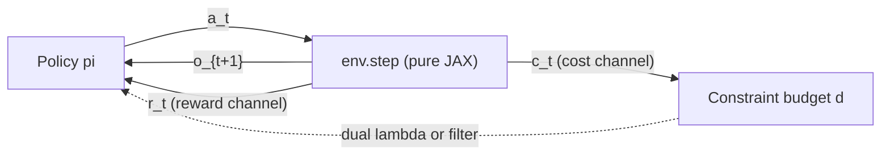
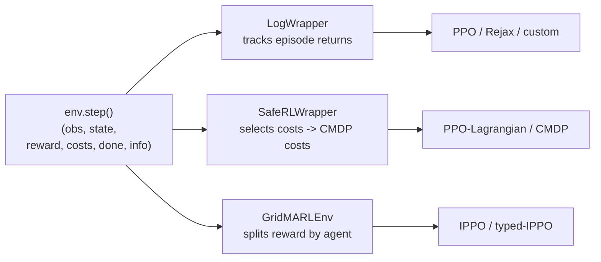

# MDP / CMDP

PowerZooJax treats every benchmark as an MDP or CMDP. Exposing `reward` and `costs` as separate channels is one direct consequence of that formal contract.

This page explains the formalization first, then shows why `reward` and `costs` must stay separate in code.

## MDP / CMDP formalization

Every benchmark in PowerZooJax is specified as a finite-horizon MDP or CMDP so that the task contract is explicit before implementation details.

A finite-horizon MDP is the tuple \((\mathcal{S}, \mathcal{O}, \mathcal{A}, P, r, \gamma, \rho_0, T)\) with state space \(\mathcal{S}\), observation space \(\mathcal{O}\) (partial when \(o_t \neq s_t\)), action space \(\mathcal{A}\), transition kernel \(P(s_{t+1} \mid s_t, a_t)\), reward \(r_t = r(s_t, a_t)\), discount \(\gamma\), initial distribution \(\rho_0\), and horizon \(T\).

A CMDP (constrained MDP) adds a non-negative constraint-cost vector \(\mathbf{c}_t = (c_{1,t}, \dots, c_{k,t})\) and a constraint-threshold vector \(\mathbf{b} = (b_1, \dots, b_k)\); the agent solves

\[
\max_{\pi}\ \mathbb{E}_{\pi}\!\left[\sum_{t=0}^{T-1} \gamma^t r_t\right]
\quad \text{s.t.} \quad
\mathbb{E}_{\pi}\!\left[\sum_{t=0}^{T-1} \gamma^t\, c_{i,t}\right] \le b_i
\quad \forall i \in \{1, \dots, k\}.
\]

This matches the paper Appendix C tuple \((\mathcal{S}, \mathcal{A}, P, r, \mathbf{c}, \gamma, \mathbf{b}, \rho_0, T)\); the docs add the observation space \(\mathcal{O}\) explicitly so partial observability is visible at the type level. As an implementation detail, the code allows a separate `cost_gamma` defaulting to `1.0` (undiscounted total violation) while reward uses \(\gamma = 0.995\); the formal CMDP definition above uses one \(\gamma\) for both channels, matching the paper.

PowerZooJax exposes this directly at the core env layer: every public `env.step` returns `reward` (the economic objective) and an explicit fixed-shape `costs` vector (the constraint-cost channel). `env.constraint_names(params)` gives the static names of those cost components. The env never mixes them back into reward. The wrapper layer then decides whether to keep the full CMDP vector, select a task-specific subset, or project it to a scalar compatibility channel for an external library.



In multi-agent tasks the same picture lifts to a Markov game (each agent has its own action and reward) or a Dec-POMDP (each agent observes a local slice of the state). The cost channel keeps its semantics in both cases.

Each [Benchmark](../benchmarks/overview.md) task page opens with an "MDP / CMDP specification" table that fills these fields in concretely: state, observation, action, transition, reward, cost, threshold, discount, horizon, agents, and MDP class. Read that table first to know which kind of problem you are looking at.

## Why not hide constraints inside reward shaping?

The textbook way to encode a constraint in RL is to add a penalty term to the reward:

```python
shaped_reward = -gen_cost - lambda * voltage_violation
```

Here, `gen_cost` is the generation or operating cost, `voltage_violation` is the amount of voltage-limit violation, and `lambda` is the penalty weight that converts constraint violation into reward shaping.

This is convenient and works for prototypes, but it has three known drawbacks:

1. The penalty weight `lambda` is a hyperparameter that depends on the environment, the policy, the random seed, and the training horizon. There is no canonical value.
2. A trained agent's performance becomes meaningless until you also report its constraint violation rate. Two policies with the same shaped reward can have very different feasibility.
3. The shaped reward is no longer the quantity the operator wants to optimize. It is a third quantity, distinct from both the true objective and the hard constraints.

CMDP is the formalism that keeps the two signals separate. PPO-Lagrangian and similar algorithms then learn the trade-off online by adjusting a dual multiplier instead of fixing one in advance.

## How PowerZooJax exposes the CMDP contract

Every public environment returns a 6-tuple from `step`:

```python
obs, state, reward, costs, done, info = env.step(key, state, action, params)
```

- `reward` is a JAX scalar. Sign convention is reward-positive: larger is better.
- `costs` is a fixed-shape JAX vector holding the per-constraint CMDP costs for that transition.
- `info["cost_sum"] = jnp.sum(costs)` is a diagnostic aggregate only.
- `costs` is never folded back into `reward`.

For example, in `TransGridEnv`:

- `reward = -reward_scale * gen_cost`, where `reward_scale` is a reward scaling factor and `gen_cost` is the total generation cost obtained by integrating the marginal-cost polynomial over the realized dispatch.
- `costs = [cost_thermal_overload, cost_voltage_violation, cost_power_balance, cost_resource]`, which represent thermal overload, voltage violation, the remaining system power-imbalance residual after the DC solve, and resource-side constraint or penalty terms.

The TSO benchmark uses `UnitCommitmentEnv`, not `TransGridEnv`. Its env-level cost vector replaces `power_balance`/`resource` with `reserve_shortfall`/`min_updown`, and the paper-faithful CMDP spec selects only `(thermal_overload, reserve_shortfall)`. The third channel is shape-padding kept identically zero. See [Physics → Transmission](../physics/transmission.md#unitcommitmentenv-scuc-for-the-tso-task) for the full breakdown.

The exact composition of each environment's reward and cost is documented in [Physics](../physics/transmission.md).

## Why one env can serve multiple training interfaces

Because the CMDP split is enforced inside the environment, the same `step` function can drive three different training stacks without modification:



- Single-agent unconstrained: wrap with `LogWrapper`, train PPO on `reward`.
- Single-agent constrained: wrap with `SafeRLWrapper`, train PPO-Lagrangian on `(reward, selected_costs)`.
- Multi-agent: wrap with `GridMARLEnv`; the wrapper produces a per-agent observation / action dict and a shared reward.

None of these wrappers change the physics. Switching between them is a one-line change.

## What is allowed into the cost channel

Different environments use different cost compositions, but the rule is the same: only physical or operational violations enter `costs`. Examples:

- `TransGridEnv`: weighted thermal overload + voltage violation + power-balance slack + resource cost.
- `DistGridEnv`: count-based voltage and thermal violations + resource cost.
- `DistGrid3PhaseEnv`: voltage + thermal + voltage-unbalance-factor (VUF) + resource cost. VUF measures how much the three phase voltages differ from each other.
- `RenewableEnv`: curtailment opportunity cost + reactive-power clipping cost.
- `BatteryEnv`: cycle throughput cost only.
- `VehicleEnv`: shortfall against minimum departure SOC.
- `FlexLoadEnv`: discomfort, deferred-demand holding cost, simultaneous-activation penalty.
- `DataCenterEnv`: SLA violation density + over-temperature.
- `DataCenterMicrogridEnv`: SLA + over-temperature + power-deficit.

Diagnostics that do not enter `costs` (such as `cost_action_clip`, `cost_continuous`, or the aggregate `info["cost_sum"]`) live in sibling `info[...]` fields. They are useful for dashboards and ablation, but they do not feed CMDP directly.

## Sign conventions

Three sign conventions are used across the suite. Knowing them in advance saves debugging time:

- Reward-positive. Higher is better. `reward = -gen_cost` is normal.
- Cost-non-negative. Zero is feasible. Larger means worse violation.
- Power-injection-positive. A device's `current_p_mw > 0` means it injects into the grid. Battery discharge is positive, charging is negative. A data center is always a load, so its `current_p_mw` is always negative.

## Reading next

- [JAX + RL environment implementation rules](jax-contract.md): the JAX rules every environment follows.
- [Power systems primer](power-systems-primer.md): the Power-side glossary.
- [Wrappers](../training/wrappers.md): how `LogWrapper`, `SafeRLWrapper`, and `RewardWrapper` consume the CMDP split.
