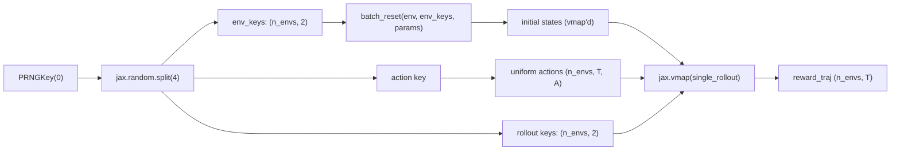

# 02 — Batched rollout

Run many environments in parallel for a fixed horizon, all inside one JIT-compiled program. Reference script: [`examples/jax_00_verify_device.py`](https://github.com/powerzoojax/PowerZooJax/blob/main/examples/jax_00_verify_device.py).

```python
import jax
import jax.numpy as jnp

from powerzoojax.case import load_case
from powerzoojax.envs import TransGridEnv, make_trans_params
from powerzoojax.utils.jax_utils import batch_reset, scan_rollout

case = load_case("5")
env = TransGridEnv()
params = make_trans_params(case, max_steps=48)

@jax.jit
def collect(key):
    n_envs = 64
    horizon = 48

    key, k_reset, k_actions, k_roll = jax.random.split(key, 4)

    env_keys = jax.random.split(k_reset, n_envs)
    obs0, states0 = batch_reset(env, env_keys, params)

    actions = jax.random.uniform(
        k_actions,
        (n_envs, horizon, case.n_units),
        minval=-1.0,
        maxval=1.0,
    )
    rollout_keys = jax.random.split(k_roll, n_envs)

    def single_rollout(state, key, action_seq):
        return scan_rollout(env, key, state, params, action_seq)

    final_states, obs_traj, reward_traj, cost_traj, done_traj, info_traj = jax.vmap(
        single_rollout
    )(states0, rollout_keys, actions)

    return reward_traj.sum(axis=1)   # shape (n_envs,)

returns = collect(jax.random.PRNGKey(0))
print("mean return:", float(returns.mean()))
print("std  return:", float(returns.std()))
```

## What is happening



- `batch_reset` is `jax.vmap(env.reset, in_axes=(0, None))`.
- `scan_rollout` runs `lax.scan` of length `T` per environment.
- The outer `jax.vmap(single_rollout)` lifts that scan over the batch.
- The whole pipeline fuses into one XLA program after the first call.

## Auto-reset

If a single rollout exceeds `max_steps`, the env auto-resets inside `step` and the rollout continues without interruption. There is no Python branching: `done=True` is reported on the terminal transition, and the returned `state` is already the next episode's initial state.

## Adding wrappers

`LogWrapper`, `SafeRLWrapper`, `RewardWrapper`, and the MARL wrappers all preserve the contract that `batch_reset` and `scan_rollout` rely on:

```python
from powerzoojax.rl import LogWrapper

wrapped = LogWrapper(env, params)

@jax.jit
def collect_wrapped(key):
    n_envs = 64
    key, k_reset, k_actions = jax.random.split(key, 3)
    env_keys = jax.random.split(k_reset, n_envs)

    obs0, states0 = jax.vmap(wrapped.reset)(env_keys)

    actions = jax.random.uniform(
        k_actions,
        (n_envs, 48, case.n_units),
        minval=-1.0,
        maxval=1.0,
    )

    def single_rollout(state, key, action_seq):
        def step_fn(state_i, k_a):
            k, a = k_a
            obs, state_i, reward, done, info = wrapped.step_auto_reset(
                k, state_i, a
            )
            return state_i, (reward, done, info)

        keys = jax.random.split(key, action_seq.shape[0])
        return jax.lax.scan(step_fn, state, (keys, action_seq))

    return jax.vmap(single_rollout)(
        states0, jax.random.split(k_reset, n_envs), actions
    )
```

`LogWrapper` does not need `params` at runtime; it bound them at construction time.

## Next step

[03 — Train PPO](03_train_ppo.md) replaces the random action sequence with a policy and adds the Optax update step.
