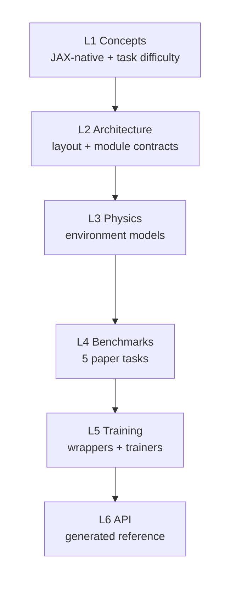
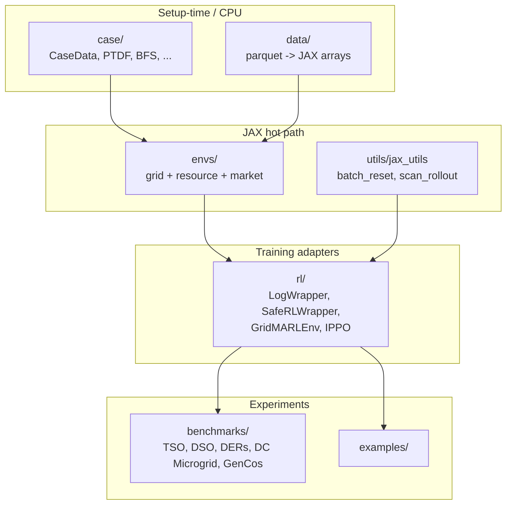

# PowerZooJax

PowerZooJax is a pure-JAX benchmark suite for power-system reinforcement learning research. It mirrors the benchmark scope of PowerZoo, but enforces a JAX-first contract: explicit state, explicit PRNG, `jit`-safe transitions, `vmap` batching, and fixed-length `lax.scan` rollouts with built-in auto-reset. The project direction is end-to-end GPU training; today the environment and rollout path are JAX-native, while some benchmark trainers still keep a Python-driven outer loop.

This documentation targets both ML and Power readers. Power-system terms (PTDF, SCUC, VUF, LMP, SOC, BFS) get a one-line definition on first appearance; JAX / RL terms (jit, vmap, scan, CMDP, IPPO) are used directly, with brief definitions on first use per page.

## New to Power Systems?

If this is your first time reading power-system RL material, start with the [Power systems primer](concepts/power-systems-primer.md). It introduces basics such as buses, lines, power flow, active vs reactive power, voltage, OPF, LMP, and SOC before you dive into the Concepts, Physics, and Benchmark pages.

## What is in the suite

| Component | Implementation |
| --- | --- |
| Transmission | `TransGridEnv` (DC PF, Newton-Raphson AC PF, DCOPF, ACOPF) and `UnitCommitmentEnv` (SCUC) |
| Distribution | `DistGridEnv` (balanced radial BFS) and `DistGrid3PhaseEnv` (unbalanced three-phase BFS + VUF) |
| Resources | `BatteryEnv`, `RenewableEnv`, `VehicleEnv`, `FlexLoadEnv`, `DataCenterEnv`, plus bundles for grid attachment |
| Microgrid | `DataCenterMicrogridEnv` (DataCenter + battery + PV + diesel) |
| Markets | `CostBasedMarketEnv`, `BidBasedMarketEnv`, exact PD-IPM `offer_sced` solver, GenCos `MarketMARLEnv` |
| RL adapters | `LogWrapper`, `SafeRLWrapper`, `RewardWrapper`, `GridMARLEnv`, `DistGridMARLEnv`, `MarketMARLEnv` |
| Trainers | PPO and SAC (Rejax), PPO-Lagrangian / CMDP, Sauté PPO, IPPO, typed-IPPO |
| Benchmark tasks | TSO, DSO, DERs, DC Microgrid, GenCos (under `benchmarks/`) |
| Data | GB demand, Ausgrid distribution, Google data-center workload + OOD transforms |

## Reading map (six layers)

Each layer builds on the previous one. Stopping at any layer still leaves a coherent picture at that depth.



- L1 [Concepts](concepts/overview.md) — project pitch, JAX + RL environment implementation rules, MDP / CMDP task contract, Power glossary.
- L2 [Architecture](architecture/repo-map.md) — repository map, environment stack, data pipeline, JAX parallelization architecture.
- L3 [Physics](physics/transmission.md) — what each environment does inside `step`.
- L4 [Benchmarks](benchmarks/overview.md) — the 5 paper tasks and the unified result schema; workflow terms in [Benchmark workflow glossary](glossary.md).
- L5 [Training](training/wrappers.md) — wrappers, trainers, presets, custom loops.
- L6 [API reference](api/grid.md) — symbol-level documentation generated by mkdocstrings.

Plus runnable [Examples](examples/index.md).

## Architecture at a glance



Arrow direction = import direction: `envs/` may import `case/` and `utils/`; `rl/` may import `envs/`; `benchmarks/` may import any of them. The reverse is forbidden, so the physics layer stays usable without a training framework.

## Core conventions

- `step` is pure and already auto-resets. When `done=True`, the returned `state` is the freshly reset state of the next episode.
- Benchmarks are formalized as MDPs or CMDPs. Economic objective stays in `reward`; physical violations stay in the explicit `costs` vector. `info["cost_sum"]` is only an aggregate diagnostic. See [MDP / CMDP](concepts/reward-cost-split.md).
- Positive resource power means injection to the grid. For storage and EVs, discharge is positive and charging is negative. For data centers, `current_p_mw` is always negative.
- Grid-attached resources use `ResourceBundle` structs; grid observations and actions are concatenated as `[grid_core | bundle_0 | bundle_1 | ...]`.

## Minimal runnable example

```python
import jax
import jax.numpy as jnp

from powerzoojax.case import load_case
from powerzoojax.envs import TransGridEnv, make_trans_params

case = load_case("5")
env = TransGridEnv()
params = make_trans_params(case, max_steps=48)

@jax.jit
def rollout(key):
    obs, state = env.reset(key, params)

    def step_fn(carry, _):
        key, state = carry
        key, sk = jax.random.split(key)
        action = jax.random.uniform(sk, (case.n_units,), minval=-1.0, maxval=1.0)
        obs, state, reward, costs, done, info = env.step(sk, state, action, params)
        return (key, state), reward

    (_, _), rewards = jax.lax.scan(step_fn, (key, state), None, length=48)
    return rewards.sum()

returns = jax.vmap(rollout)(jax.random.split(jax.random.PRNGKey(0), 256))
print("mean return:", float(returns.mean()))
```

256 environments, 48 steps each, no Python loops in the hot path.

## Where to go next

- New here? Start with [Getting started](getting-started.md), then the [Concepts overview](concepts/overview.md).
- ML researcher who wants the implementation rules? Read [JAX + RL environment implementation rules](concepts/jax-contract.md) and [MDP / CMDP](concepts/reward-cost-split.md).
- Power researcher who wants the env semantics? Read [Physics → Transmission](physics/transmission.md) and the rest of the physics layer.
- Looking for the benchmark experiments? Go to [Benchmarks overview](benchmarks/overview.md).
- Need a function signature? Use the [API reference](api/grid.md).
