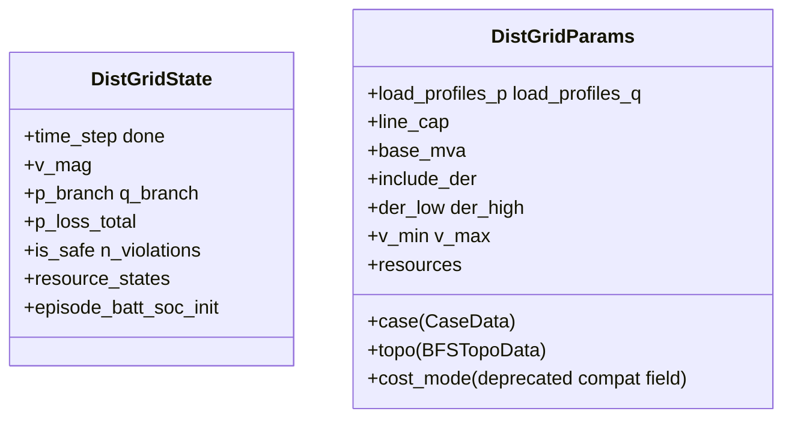
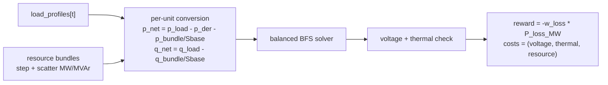
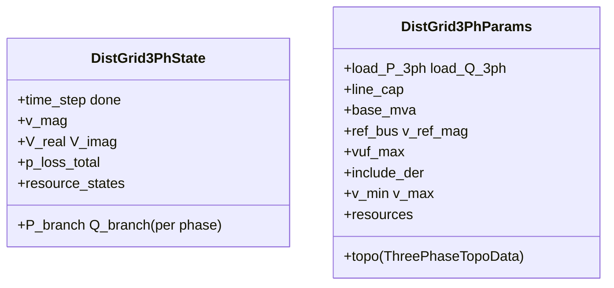

# Distribution

The distribution layer ships two environments: `DistGridEnv` for balanced radial feeders and `DistGrid3PhaseEnv` for unbalanced three-phase feeders. Both are built around backward / forward sweep (BFS) power flow, which is a specialized solver for radial topologies. See [Power systems primer](../concepts/power-systems-primer.md) for BFS, voltage limits, and VUF.

In plain language, this env lets an RL agent control batteries, PV, flexible loads, or abstract DER injections on a tree-shaped distribution network, then asks a simple question each step: after those actions, what do the bus voltages, line flows, and losses become, and did the agent keep the grid safe?

## `DistGridEnv` — balanced radial feeder

`DistGridEnv` solves a single-phase backward / forward sweep on a radial network and treats the agent action as controllable active-power injection at non-slack buses.

Here, "radial feeder" means the distribution network is tree-shaped: power flows outward from one substation / slack bus, and each downstream bus has one electrical path back to the source. "Balanced" means the three phases are assumed similar enough that the feeder can be modeled with a single-phase equivalent, instead of tracking phase A / B / C separately.

### State and parameters

`include_der=True` exposes an optional per-bus aggregated DER action channel in per-unit, meaning a dimensionless value normalized by a chosen base quantity. In practice, this lets the policy specify net active-power injection or withdrawal directly at each controllable bus. Here "DER" means a bus-level aggregated control port, not a specific device model. `include_der=False` removes that aggregated channel and leaves only concrete `resource bundles`, such as battery, PV, EV, or flexible-load models with their own state and constraints.

Action layout is `[aggregated DER segment | bundle segments]`. In the current benchmark tasks built on `DistGridEnv` such as DSO and DERs, `include_der=False` is the common setting, so the policy usually acts through attached bundles rather than direct per-bus injections.
Because `DistGridEnv` exposes one shared `[-1, 1]` action box for all attached resources, bundle-specific physical clipping still happens inside each bundle. In particular, the DSO task's `FlexLoadBundle` interprets each per-device control as a non-negative fraction and clips negative values to `0`.

### Step flow

### Net-load construction

Net per-unit injection at each bus combines load, optional per-bus DER action when `include_der=True`, and bundle injections (after converting to per unit by dividing by `base_mva`). In other words, `p_net` and `q_net` are the final per-bus net injections that the BFS solver actually sees:

\[
p_{\text{net}} = p_{\text{load}} - p_{\text{der}} - \frac{p_{\text{bundle}}}{S_{\text{base}}}
\]

\[
q_{\text{net}} = q_{\text{load}} - \frac{q_{\text{bundle}}}{S_{\text{base}}}
\]

Bundle MW/MVAr is positive injection, so it reduces net load.

### Constraints and reward

Voltage and thermal violations are tracked separately:

- voltage: count-based, meaning each violating bus contributes one count when `vm < v_min` or `vm > v_max`.
- thermal: count-based, meaning each overloaded line contributes one count when apparent power `sqrt(P^2 + Q^2)` exceeds `line_cap`.
- `info["cost_continuous"]` stores distance-style severity diagnostics rather than simple violation counts.

The reward is loss-based only:

\[
r_t = -w_{\text{loss}}\, P_{\text{loss}, t}^{\text{MW}}
\]

The core env always exposes the full fixed-shape CMDP vector:

\[
\text{costs} = (C_{\mathrm{v}}, C_{\mathrm{th}}, C_{\mathrm{res}})
\]

with static names `("voltage_violation", "thermal_overload", "resource")`. `info["cost_sum"]` is the sum of those reported cost components and is provided as a convenience diagnostic.

Cost channel definitions:

| Symbol | Constraint name | Info key | Meaning |
| --- | --- | --- | --- |
| \(C_{\mathrm{v}}\) | `voltage_violation` | `cost_voltage_violation` | Count of buses outside `[v_min, v_max]`. |
| \(C_{\mathrm{th}}\) | `thermal_overload` | `cost_thermal_overload` | Count of branches whose apparent power exceeds their rating. |
| \(C_{\mathrm{res}}\) | `resource` | `cost_resource` | Sum of `cost_sum` reported by attached resource bundles. |

The DSO benchmark does not change the env-level semantics. Instead, its task layer selects only `"voltage_violation"` for the CMDP constraint spec. The legacy `cost_mode` field is kept only so old configs can still load; readers can ignore it because it no longer changes the core env output.
That selected voltage channel is count-based: each violating bus contributes to $C_{\mathrm{v}}$, rather than the task using a continuous distance-from-limit penalty as its benchmark cost.

!!! note
    In the current implementation, `info["soc_terminal_sq"]` only tracks the **first** attached bundle that exposes an `soc` field. If that first bundle is a battery bundle, the env reports the squared deviation between episode-start SOC and terminal SOC on the terminal transition; it is zero on non-terminal steps. If a battery appears only in the second or later bundle position, this diagnostic is not triggered.

### Observation Vector

`obs = [v_mag_norm | p_branch_norm | q_branch_norm | p_load_norm | q_load_norm | sin(t) | cos(t) | <bundle_obs>]`.

- `v_mag_norm`: per-bus voltage magnitude, normalized as $(v_{\text{mag}} - 1.0) / 0.1$
- `p_branch_norm`: per-branch active-power flow, normalized as $p_{\text{branch}} / p_{\text{load,ref}}$
- `q_branch_norm`: per-branch reactive-power flow, normalized as $q_{\text{branch}} / q_{\text{load,ref}}$
- `p_load_norm`: current per-bus active load, normalized as $p_{\text{load}} / p_{\text{load,ref}}$
- `q_load_norm`: current per-bus reactive load, normalized as $q_{\text{load}} / q_{\text{load,ref}}$
- `sin(t)`, `cos(t)`: time-of-day phase features, giving the policy a periodic encoding of the current step.
- `<bundle_obs>`: appended resource summaries from attached bundles.

Here, `p_load_ref` and `q_load_ref` are just normalization reference scales for active and reactive load. They are not additional physical state variables.

For the DSO benchmark, `<bundle_obs>` is the `FlexLoadBundle` slice with `6 devices x 5 features` in device-major order. "Device-major" means the five features for device 1 come first, then the five features for device 2, and so on:

- `curtail_norm`: current-step curtailment divided by that device's `curtail_cap_mw`.
- `shift_out_norm`: current-step deferred demand divided by that device's `shift_cap_mw`.
- `shift_in_norm`: current-step released deferred demand divided by that device's `shift_cap_mw`.
- `buffer_fill_ratio`: deferred-demand buffer occupancy relative to `shift_horizon`.
- `buffer_energy_norm`: total deferred energy in the buffer, normalized by `shift_cap_mw * shift_horizon`.

Unlike standalone `FlexLoadEnv`, the bundle observation does not carry time or price channels; those are already provided by the parent `DistGridEnv`.

## `DistGrid3PhaseEnv` — unbalanced three-phase feeder

`DistGrid3PhaseEnv` extends the radial model to unbalanced three-phase networks. The agent controls per-phase active injections on non-reference buses, and the env solves a three-phase BFS with per-phase voltages and branch flows.

Here, "unbalanced three-phase" means the feeder still has radial topology, but phase A / B / C are no longer assumed identical. Loads, line impedances, and controllable injections may differ by phase, so the env keeps per-phase voltages, flows, and unbalance metrics such as VUF instead of collapsing the feeder into a single-phase equivalent.

### State and parameters

### Modeling choices

- Direct DER actions are per-phase and expressed in per unit.
- Resource bundles are scattered as balanced three-phase injections: each device contributes `P/3` and `Q/3` to phases A, B, and C at its bus.
- Thermal checks use per-phase apparent power, reconstructed from branch current and both endpoint voltages. The aggregate line capacity is split across the energized phases.

Action layout is `[aggregated per-phase DER segment | bundle segments]`. The aggregated per-phase DER segment is still a direct bus/phase-level control port, while the bundles remain concrete device models. In the current three-phase DERs eval path, `include_der=False` is typically used as well, so policies usually control attached bundles while the three-phase env still computes voltage, power flow, and imbalance separately for phases A / B / C.

### VUF constraint

Voltage unbalance is tracked with the Fortescue-based voltage unbalance factor (VUF). "Fortescue-based" means the three-phase voltages are first decomposed into sequence components before measuring imbalance:

\[
\mathrm{VUF} = \frac{|V_{\text{neg}}|}{|V_{\text{pos}}|} \times 100\%
\]

$V_{\text{pos}}$ is the balanced positive-sequence component, while $V_{\text{neg}}$ measures the unbalanced part that rotates in the opposite sequence. Constraint: $\mathrm{VUF} \le vuf_{\max}$.

### Cost composition

\[
\text{costs} = (C_{\mathrm{v}}, C_{\mathrm{th}}, C_{\mathrm{vuf}}, C_{\mathrm{res}})
\]

The static names are `("voltage_violation", "thermal_overload", "vuf_violation", "resource")`. `info["max_vuf_percent"]` keeps the worst per-node VUF as a diagnostic. Reward stays loss-based:

Cost channel definitions:

| Symbol | Constraint name | Info key | Meaning |
| --- | --- | --- | --- |
| \(C_{\mathrm{v}}\) | `voltage_violation` | `cost_voltage_violation` | Count of phase voltages outside the allowed voltage band. |
| \(C_{\mathrm{th}}\) | `thermal_overload` | `cost_thermal_overload` | Count of phase/branch apparent-power overloads. |
| \(C_{\mathrm{vuf}}\) | `vuf_violation` | `cost_vuf_violation` | Count of nodes whose voltage-unbalance factor exceeds `vuf_max_percent`. |
| \(C_{\mathrm{res}}\) | `resource` | `cost_resource` | Sum of `cost_sum` reported by attached resource bundles. |

\[
r_t = -w_{\text{loss}}\, P_{\text{loss}, t}^{\text{MW}}
\]

### Observation vector

The observation vector is phase-separated and can be read as five groups:

- per-phase bus voltages: voltage magnitudes for phases A / B / C at each bus.
- per-phase branch active power: branch flows `P_A/B/C`.
- per-phase branch reactive power: branch flows `Q_A/B/C`.
- per-phase loads: the load level on each phase at each bus.
- auxiliary features: time features and optional bundle observations.

The point of this layout is to let the policy see how imbalance appears differently across phases, rather than collapsing everything into a single-phase equivalent summary.

Note that the stored `P_A/B/C` and `Q_A/B/C` branch channels are mainly solver diagnostics exposed through the observation vector. Thermal enforcement does not rely directly on those diagnostic channels; it uses the endpoint-voltage-and-current reconstruction described above to compute per-phase apparent power.

## When to use which

- Use `DistGridEnv` when the task is balanced radial control (DSO, single-phase DER coordination).
- Use `DistGrid3PhaseEnv` when the benchmark goal includes phase imbalance, VUF, or per-phase device placement.

The DSO benchmark builds on `DistGridEnv`. The DERs benchmark also builds on `DistGridEnv` (with 12 heterogeneous bundles) and provides a 3-phase OOD eval mode through `DistGrid3PhaseMARLEnv`. See [Benchmarks → DSO](../benchmarks/dso.md) and [Benchmarks → DERs](../benchmarks/ders.md).

## Cross references

- [Resources](resources.md) — bundles attached at distribution buses.
- [API → Distribution](../api/distribution.md) and [API → Grid (shared)](../api/grid.md) for the BFS solver helpers.
