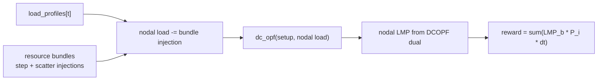

# Markets

PowerZooJax provides four market layers, all built on top of DC network primitives and resource bundles. Each one uses a different price model, from cost-reflective DCOPF to a fully exact bid-based SCED used by the GenCos multi-agent benchmark.

For Power-side terms (LMP, SCED, dispatch, marginal cost), see [Power systems primer](../concepts/power-systems-primer.md).

!!! note "Market solver ≠ RL agent"
    One distinction helps a lot when reading this page:

    - the **market solver** optimizes how the system clears at the current step
    - the **RL agent** optimizes how to act so its own reward is larger over time

    So in the single-agent market envs, the agent is usually a storage resource trying to earn more arbitrage revenue. In `MarketMARLEnv`, each agent is a generator company trying to earn more dispatch profit through its offers. These two optimizations are related, but they are not the same objective.

## When to use which

| Env / Module | Purpose | Pricing model | Used by |
| --- | --- | --- | --- |
| `CostBasedMarketEnv` | storage arbitrage benchmark | DCOPF clearing with exact nodal prices for that problem | dev / sanity / single-agent |
| `BidBasedMarketEnv` | offer-based stylized market | piecewise economic dispatch plus approximate LMP recovery | dev / quick MARL |
| `offer_sced` | exact bid-based SCED | exact LP solver for the offer-based market-clearing problem | GenCos task and any exact-LMP rollout |
| `MarketMARLEnv` (core: `market_marl_core`) | rolling competitive market | exact `offer_sced` per step plus dispatch limits carried over from the previous step | GenCos benchmark |

## `CostBasedMarketEnv`

`CostBasedMarketEnv` is the simplest storage-arbitrage env. Generator dispatch is cleared by the JAX `dc_opf` solver using the *true* generator cost curves (no strategic bidding). Resource bundles inject before clearing, and the agent earns revenue on the cleared LMP.

### Step flow

### Reward and cost

\[
r_t = \sum_i \mathrm{LMP}_{b(i), t}\, P_{i, t}\, \Delta t
\]

`b(i)` is the bus of device `i`. The CMDP cost channel is

\[
\text{costs} = (C_{\mathrm{th}},)
\]

with static name `("thermal_overload",)`. This matches the real-market convention: the operator settles money on price, but does not add extra penalties for bundle-internal device costs. In the implementation, $C_{\mathrm{th}}$ corresponds to $\texttt{cost\_thermal\_overload}$, and `info["cost_sum"]` is the sum of the reported cost components.

Cost channel definition:

| Symbol | Constraint name | Info key | Meaning |
| --- | --- | --- | --- |
| \(C_{\mathrm{th}}\) | `thermal_overload` | `cost_thermal_overload` | Weighted thermal-overload magnitude from line-flow safety checks after market dispatch. |

If `resources=()` at setup time, the factory creates a default single-battery bundle at external bus `1`, so the env stays runnable for quick checks.

`SimpleLMPArbitrageEnv` is an alias of `CostBasedMarketEnv` (same implementation, alternate name).

## `BidBasedMarketEnv`

`BidBasedMarketEnv` adds an offer-based market layer on top of the same battery-arbitrage setup, but uses the heuristic clearing solver in `market/clearing.py` rather than the exact LP solver used by `offer_sced`.

### Setup and runtime

- Setup: `prepare_piecewise_ed(case, n_segments)` builds piecewise segment widths and base prices from the true generator cost curves.
- Reset: the env samples an upward random markup on top of the base segments and fixes those offer prices for the whole episode, so the market structure is stationary within an episode.
- Step: bundle injections modify nodal load, then `piecewise_ed(...)` clears dispatch and recovers a nodal LMP. Reward is `sum(LMP * P * dt)`, same as the cost-based env.

!!! caution "Known BidBased approximations (intentional)"
    - `piecewise_ed()` is a heuristic merit-order plus PTDF-penalty solver, **not** a globally optimal SCED.
    - Recovered LMPs are approximated from the cleared dispatch and the true marginal-cost curve. **When markup is nonzero, those LMPs are not exact dual prices of the offer-based problem.** Use this env for prototyping and unit tests; for paper-quality LMPs use `offer_sced`.

The CMDP cost channel is again

\[
\text{costs} = (C_{\mathrm{th}},)
\]

where $C_{\mathrm{th}}$ corresponds to $\texttt{cost\_thermal\_overload}$. Diagnostics in `info` include:

- `offer_cost`: market payment under the submitted offers
- `true_cost`: the underlying physical generation cost
- `ed_converged`: whether the heuristic dispatch converged
- `cost_sum`: the sum of reported cost components

The static constraint name and info key are the same as the cost-based market:
`thermal_overload` maps to `info["cost_thermal_overload"]`.

## `offer_sced` — exact bid-based SCED

`offer_sced` is a standalone solver (not an `Environment`) that solves the offer-based single-period SCED *exactly* with an interior-point LP solver. Generator agents submit piecewise-linear offer curves; the solver computes the optimal dispatch and exact dual prices.

### LP formulation (segment space)

Decision variables: $\delta_{i,k}$ is the output increment above $p_{\min}$ for unit $i$, segment $k$.

\[
\min\ c^\top \delta
\]

\[
\text{s.t.}\quad 0 \le \delta \le \bar{\delta},\quad \mathbf{1}_S^\top \delta = D_\delta,\quad \text{line\_floor} \le M_S \delta + f_{p_{\min}} \le \text{line\_cap}
\]

where $c = \texttt{offer\_prices.ravel()}$, $\bar{\delta} = \texttt{seg\_widths.ravel()}$, $D_{\delta} = \texttt{total\_load} - \sum p_{\min}$, $M_S$ maps segment increments to line flows via the PTDF, and $f_{p_{\min}}$ is the line flow at the all-$p_{\min}$ baseline.

### Why this exact LP solver

The LP is solved with an interior-point method and a logarithmic barrier. Internally, each iteration reduces to one dense linear system. Float32 stability is preserved with two engineering steps:

1. Adaptive regularization: `reg = max(1e-8, 1e-4 * mean(D_L))` is added to the diagonal of `H`.
2. Diagonal equilibration: rows / columns of the KKT system are rescaled by `S = sqrt(|diag(KKT)|)` so the effective condition number becomes `O(sqrt(D_max))`.

The result is a JIT-compatible, vmap-able solver that produces exact LMPs to within `< 1e-4 $/MWh` of HiGHS LP marginals on tested cases.

### LMP recovery

\[
\mathrm{LMP}_n = -\nu - \mathrm{PTDF}_{:, n}^\top (\mu_{\text{upper}} - \mu_{\text{lower}})
\]

$\nu$ is the balance-equality dual; $\mu_{\text{upper}}$ and $\mu_{\text{lower}}$ are the line inequality duals from the IPM. Verified accurate against HiGHS for both uncongested and congested cases with tiered offer prices.

### API surface

- Setup time (NumPy): `prepare_offer_sced(case, n_segments=...)` returns `OfferSCEDSetup` with segment widths and base prices.
- Runtime (pure JAX): `offer_sced(setup, load_mw, offer_prices, p_min_rt=None, p_max_rt=None)` returns `OfferSCEDResult` with dispatch, line flow, LMP, and convergence info.

The optional `p_min_rt` / `p_max_rt` arguments let the caller pass runtime dispatch ranges that already include ramp limits from the previous step; this is what `MarketMARLEnv` uses to enforce intertemporal dispatch continuity at the LP level.

See [API → Market SCED](../api/market-sced.md) for the dataclass fields.

## `MarketMARLEnv` — GenCos rolling market

`MarketMARLEnv` is the multi-agent market env used by the GenCos benchmark. Each agent is one generator company, so the env is a competitive game over offer prices. Internally it uses `offer_sced` for clearing, and adds three pieces of structure:

- dispatch continuity across time: each step's dispatch is bounded by the previous step's dispatch plus or minus the per-unit ramp limits, enforced *inside the LP* (not as post-hoc clipping).
- recent price history: the state carries a circular buffer of the last `lmp_history_len` system-wide mean LMPs as part of the per-agent observation.
- random episode start: `reset` samples a uniform start index into `load_profiles`, so a long parquet pool produces many distinct 48-step episodes.

The pure-functional core keeps the full nodal LMP vector in state and `info`, but the MARL wrapper does not expose a private per-agent nodal-LMP channel directly. Instead, it builds a compact private observation around bidding context, own recent outcome, a one-step-ahead total-load forecast, and recent history of the system-wide mean LMP.

### Action

For each agent, the action is `Box(n_segments)` in `[-1, 1]`. The mapping to monotone offer prices is:

\[
m = (a + 1) / 2 \in [0, 1]
\]

\[
m_{\text{sorted}} = \mathrm{sort}(m)
\]

\[
\text{offer\_price}_{i, k} = \text{base\_seg\_price}_{i, k}\, (1 + m_{\text{sorted}, k}\, \text{max\_markup})
\]

`sort` enforces the monotone-offer constraint usually required by markets (a generator's offer for the kth MW cannot be lower than the offer for the k-1th MW).

### Private observation

For each generator agent in the wrapper, the private observation has `8 + lmp_history_len` dimensions (default 12 with `lmp_history_len=4`):

- `[0]` normalized first-segment base price (paper symbol \(c^{b}_i\))
- `[1]` normalized own `p_max` (paper symbol \(\widetilde{P}^{\max}_i\))
- `[2]` normalized own last dispatch (paper symbol \(P^{g}_{i,t-1}\))
- `[3]` normalized own last dispatch profit (paper symbol \(\widetilde{w}_{i,t-1}\))
- `[4]` normalized remaining ramp-up room for this generator (paper symbol \(h^{\mathrm{ramp}}_{i,t}\))
- `[5]` normalized one-step-ahead total-load forecast (paper symbol \(D^{\mathrm{fcst}}_{t+1}\))
- `[6]` `sin(t)` (paper \(\tau_t\) component)
- `[7]` `cos(t)` (paper \(\tau_t\) component)
- `[8:]` normalized history of the system-wide mean LMP, oldest to newest (paper symbol \(\overline{\boldsymbol{\pi}}^{\mathrm{hist}}_{t}\in\mathbb{R}^{4}\))

The implementation places the time encoding at indices `[6,7]` and the LMP history at the tail `[8:]`. The paper Appendix E.1 (Eq. for `\mathbf{o}_{i,t}`) lists the same 12 entries with the LMP history block placed before the time encoding; the index permutation is purely cosmetic, but anyone reading observation indices off the paper should expect the implementation order shown above.

!!! warning "Agents do not see their own nodal LMP"
    High-level descriptions often say "each agent receives its own nodal LMP as observation" — that is a misreading of the current implementation.

    The wrapper does **not** expose each agent's own nodal LMP as a separate private observation entry. Private obs only contains the *system-mean* LMP history. The full nodal LMP vector remains in the core state and in `info["lmp"]`; you have to wire it in through your own wrapper / `info` if you want it as an observation.

### Reward and cost

Per-agent reward is dispatch profit per generator:

\[
\text{profit}_i = \mathrm{LMP}_{b(i)}\, P_i\, \Delta t - \mathrm{TC}(P_i)\, \Delta t
\]

with `TC(P) = (a/3) P^3 + (b/2) P^2 + c P` (the integrated true cost).

For the pure core, `market_marl_step` returns `(final_state, done, reward_vec, info)`, where `reward_vec` is the per-unit profit vector. It does **not** return a standalone `costs` tuple in the same shape as the single-agent env API. Instead, the thermal-overload safety signal remains in diagnostics such as `info["cost_thermal_overload"]`, `info["cost_sum"]`, `info["n_violations"]`, and `info["is_safe"]`. Market diagnostics such as the cleared `info["lmp"]` and per-unit last-step profit are reported separately from the safety diagnostic.

### Auto-reset

`market_marl_step` performs an internal auto-reset with `stop_gradient` on the final state, so it is `lax.scan` compatible without further wrapping. The MARL adapter `MarketMARLEnv` (in `rl/market_marl.py`) only adds the per-agent dict layout for IPPO-style training.

## Cross references

- [Benchmarks → GenCos](../benchmarks/gencos.md) — the actual GenCos task built on top of `MarketMARLEnv`.
- [API → Market](../api/market.md), [Market SCED](../api/market-sced.md), [Market MARL](../api/market-marl.md).
- [Resources](resources.md) — `BatteryBundle` is the typical actor in cost-based and bid-based markets.
