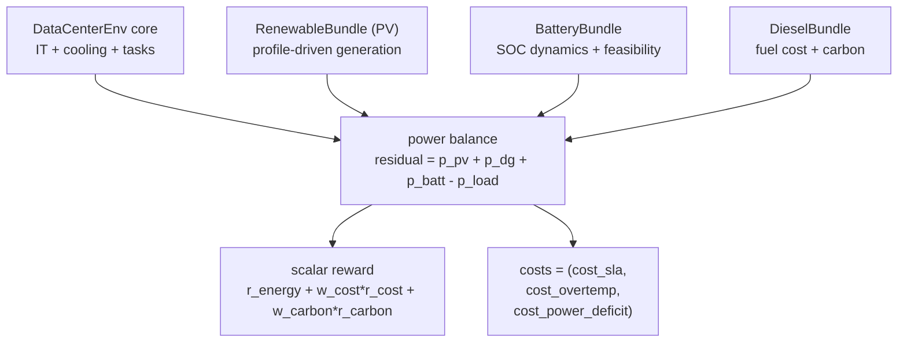
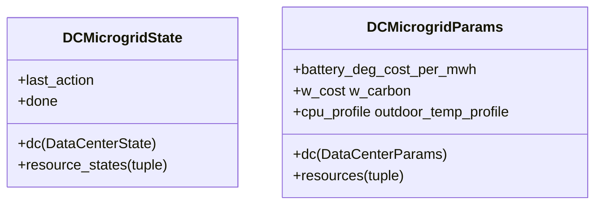

# Microgrid

`DataCenterMicrogridEnv` is a self-contained behind-the-meter microgrid that combines:

- a `DataCenter` core (IT workload + cooling + thermal dynamics, see [Resources](resources.md)),
- battery storage with explicit feasibility,
- exogenous PV generation (real or synthetic diurnal profile),
- a dispatchable diesel generator with explicit fuel cost.

The microgrid runs grid-connected by default with a capped grid-import port (`grid_import_p_max_mw`, set to `1.5 MW` in the canonical benchmark task config). Pure islanded operation corresponds to `grid_import_p_max_mw = 0.0`. Under simulated outages the microgrid switches to islanded mode, so any unmet load enters the `power_deficit` cost channel as a hard violation. Power balance is explicit and testable; the agent jointly decides GPU scheduling, cooling, storage, diesel, and (implicitly) the residual served by capped grid import.

This env drives the DC Microgrid benchmark task ([benchmarks/dc-microgrid](../benchmarks/dc-microgrid.md)).

## Why a separate env

`DataCenterEnv` models only the load. Attaching PV / battery / diesel as bundles to a `TransGridEnv` would not capture the islanded power-balance constraint or the multi-objective trade-off (energy vs cost vs carbon vs SLA). The composite env keeps the same JAX + RL implementation rules while exposing those objectives directly.

More concretely, this env is not "several full environments glued together". It is a composition layer with one `DataCenterEnv` sub-env for load and thermal dynamics, plus resource bundles for battery / PV / diesel, wrapped by a top-level microgrid step that enforces power balance and computes the final reward / cost outputs.

## Architecture



Internally, `DataCenterMicrogridEnv` calls a private helper `_dc_step_inner(...)` that runs the inner DataCenter physics without its auto-reset, then applies a single unified auto-reset across all sub-states. This avoids double-resetting inside `lax.scan`.

## State and parameters



The actual runtime schema is nested: the top-level env stores the `DataCenterState` plus one bundle state per attached resource. Convenience accessors such as `state.soc`, `state.p_dg_mw`, `params.battery_power_mw`, and `params.solar_profile` still exist for backward compatibility, but they are projections from the nested bundle structure rather than primary stored fields.

`DieselParams` is a small frozen helper struct: `p_dg_max_mw`, `fuel_cost_per_mwh`, `emission_factor` (in kgCO2 per kWh).

The optional profile fields `cpu_profile` and `outdoor_temp_profile` are JAX arrays of shape `(T,)`. Profiles are indexed cyclically as `arr[t % T]`. PV lives on the attached `RenewableBundle`; when these profiles are absent, synthetic diurnal helpers from `dc_microgrid_profiles.py` are used.

## Action {#action}

5-D `Box`:

| Index | Name | Range | Meaning |
| --- | --- | --- | --- |
| 0 | `train_sched_rate` | `[0, 1]` | fraction of GPU headroom to training |
| 1 | `ft_sched_rate` | `[0, 1]` | fraction of remaining headroom to finetuning |
| 2 | `cooling_setpoint_norm` | `[0, 1]` | maps to `[t_set_min, t_set_max]` |
| 3 | `battery_power_norm` | `[-1, 1]` | positive = discharge, negative = charge |
| 4 | `dg_power_norm` | `[0, 1]` | DG output as fraction of `p_dg_max_mw` |

The first two entries are easy to misread. They are not fixed GPU counts or a one-shot split of the full cluster:

- `inference demand` means the exogenous GPUs already occupied by online inference load in the current step.
- `urgent tasks` are waiting jobs whose latest feasible start time has already arrived or passed, so they must be launched immediately to have any chance of meeting their deadline.
- `GPU headroom` means the GPUs still available after subtracting inference demand and already-running urgent work.
- `train_sched_rate` is applied first. It sets the training scheduler's GPU budget as a fraction of the current headroom.
- `ft_sched_rate` is applied second, after the training scheduler has already consumed part of that headroom. It sets the finetuning budget as a fraction of the remaining headroom, not the original total.

In code terms, if the current step has `gpus_avail = 600` and `train_sched_rate = 0.5`, then training receives a budget of `300` GPUs. If training actually uses `240`, the env recomputes the residual headroom and `ft_sched_rate` is then applied to that smaller remainder.

The other three entries are direct physical controls:

- `cooling_setpoint_norm = 0` maps near `t_set_min` (colder, safer, but usually higher cooling power), while `1` maps near `t_set_max` (warmer, cheaper, but higher over-temperature risk).
- `battery_power_norm` is first mapped to a desired MW dispatch, then clipped by both converter rating and SOC feasibility. The realised battery power can therefore be smaller in magnitude than the commanded value.
- `dg_power_norm` maps to diesel output as a fraction of `p_dg_max_mw`. If a minimum-loading rule is enabled, very small positive commands can be interpreted as "off" or lifted to the minimum stable output.

## Observation (24-D) {#observation-24-d}

```
[cpu_util, mem_util, q_train_fill, q_ft_fill, queue_urgency,
 zone_temp_norm, outdoor_temp_norm, cop_ratio,
 solar_cf, soc, dg_margin_norm, p_load_norm, net_load_norm,
 batt_dis_headroom_norm, batt_chg_headroom_norm,
 grid_price_norm, grid_price_6h_max_norm,
 last_action_norm (5), sin(t), cos(t)]
```

The layout is frozen so policies trained on one profile pool remain forward-compatible with later pools.

The observation is interface-first rather than formula-first: the code field names stay visible so readers can map them back to the implementation. When a field is normalized, that normalization rule is part of its meaning:

- `solar_cf`: current PV capacity factor
- `soc`: current battery SOC
- `dg_margin_norm`: remaining diesel margin, normalized by diesel capacity
- `p_load_norm`: current DC load, normalized by total on-site supply capacity
- `net_load_norm`: current net load after PV, normalized by dispatchable capacity
- `batt_dis_headroom_norm`: currently feasible battery discharge power, normalized by converter rating
- `batt_chg_headroom_norm`: currently feasible battery charge power, normalized by converter rating
- `grid_price_norm`: current GB MID grid-import price, normalized by `grid_price_ref_per_mwh` (default `150.0`)
- `grid_price_6h_max_norm`: maximum grid-import price expected over the next six hours, same normalization, giving the policy a forward-looking arbitrage signal
- `last_action_norm (5)`: previous step's action vector, already in normalized control coordinates
- `sin(t)`, `cos(t)`: periodic time-of-day features

## Power balance and battery feasibility

Battery action is clipped by both converter rating and SOC headroom (same one-way efficiency rule as `BatteryEnv`):

\[
P_{\max}^{\text{dis}} = \min\!\left(P_{\text{rated}},\ \frac{(\mathrm{SOC} - \mathrm{SOC}_{\min})\, E_{\max}\, \eta_d}{\Delta t}\right)
\]

\[
P_{\max}^{\text{chg}} = \min\!\left(P_{\text{rated}},\ \frac{(\mathrm{SOC}_{\max} - \mathrm{SOC})\, E_{\max}}{\eta_c\, \Delta t}\right)
\]

Diesel and PV outputs are deterministic functions of the agent action and the exogenous profile. Power balance:

\[
\text{residual} = P_{\text{pv}} + P_{\text{dg}} + P_{\text{batt}} - P_{\text{load}}
\]

\[
P_{\text{deficit}} = \max(-\text{residual}, 0),\quad P_{\text{spill}} = \max(\text{residual}, 0)
\]

In plain terms: if PV + battery + diesel cannot cover the data-center load, the shortfall becomes $P_{\text{deficit}}$, the unmet load power, and enters the cost channel. If supply is larger than load, the excess becomes $P_{\text{spill}}$, the unused surplus power, and is reported in `info` only.

## Scalar reward

\[
r_t = r_{\text{energy}} + w_{\text{cost}}\, r_{\text{cost}} + w_{\text{carbon}}\, r_{\text{carbon}}
\]

with

\[
r_{\text{energy}} = -P_{\text{dc}}\, \Delta t \quad [\mathrm{MWh}]
\]

\[
r_{\text{cost}} = -(C_{\text{fuel}} + C_{\text{deg}})
\]

\[
r_{\text{carbon}} = -\text{carbon\_kg}
\]

where $C_{\text{fuel}}$ is the diesel fuel cost for this step, and $C_{\text{deg}} = |P_{\text{batt}}|\, \Delta t\, c_{\text{deg}}$ is the battery degradation cost with $c_{\text{deg}} = \texttt{deg\_cost\_per\_MWh}$ in the implementation.

`step()` returns the scalar reward $r_t$ above. Separately, `info["reward_vector"] = [r_energy, r_cost, r_carbon]` exposes the three unscaled reward components for analysis or for multi-objective RL methods that want the decomposed signal.

## Constraint costs (CMDP channel)

\[
\text{costs} = (C^{\mathrm{sla}}_t, C^{\mathrm{temp}}_t, C^{\mathrm{deficit}}_t)
\]

The static names are `("sla", "overtemp", "power_deficit")`, mapping to $\texttt{cost\_sla}$, $\texttt{cost\_overtemp}$, and $\texttt{cost\_power\_deficit}$ in the implementation. `info["cost_sum"]` is the sum of the reported cost components. These three subscripts (`sla`, `temp`, `deficit`) are the canonical short-forms used in the paper Appendix E.5 and in [`benchmarks/dc-microgrid.md`](../benchmarks/dc-microgrid.md).

Cost channel definitions:

| Symbol | Constraint name | Info key | Meaning |
| --- | --- | --- | --- |
| \(C^{\mathrm{sla}}_t\) | `sla` | `cost_sla` | SLA violation density from the DataCenter task queue: expired jobs divided by `n_gpus`. |
| \(C^{\mathrm{temp}}_t\) | `overtemp` | `cost_overtemp` | Normalized excess of zone temperature above the critical threshold. |
| \(C^{\mathrm{deficit}}_t\) | `power_deficit` | `cost_power_deficit` | Unserved electrical load \(P_{\mathrm{def}} / \max(P_{\mathrm{load}}, \epsilon)\). |

## Time scale

The microgrid env defaults to `delta_t_hours = 5/60` and `max_steps = 288`, giving a 24-hour episode at 5-minute resolution. This is finer than the 30-minute grid envs because both thermal dynamics and battery feasibility require a sub-15-minute step to be physically meaningful.

## Real vs synthetic profiles

`make_dcmicrogrid_params(...)` builds a synthetic-only param object, suitable for tests. For real workload data:

```python
from powerzoojax.envs.microgrid.dc_microgrid import (
    make_dcmicrogrid_params_with_profiles,
)
params = make_dcmicrogrid_params_with_profiles(source="google", n_steps=288)
```

For benchmark evaluation, the same env can be tested under both in-distribution and shifted conditions. To produce OOD eval splits, transform an existing `params` with `apply_ood_transform(params, scenario)` from `powerzoojax.data.dc_microgrid_profiles`. Valid scenarios: `workload_swap`, `workload_shock`, `renewable_drought`, `cooling_stress`, `dg_derating`, `sla_tighten`. The benchmark task uses `cooling_stress` and `renewable_drought` as OOD splits.

## Cross references

- [Resources](resources.md) for the battery and DataCenter physics referenced here.
- [Benchmarks / DC microgrid](../benchmarks/dc-microgrid.md) for the task built on top.
- [API / Data center microgrid](../api/microgrid.md) for symbol-level signatures.
