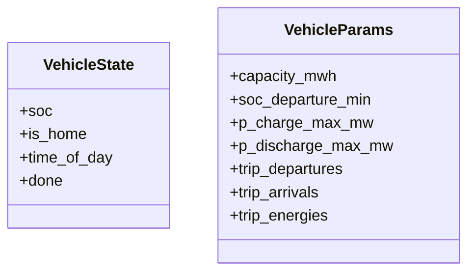
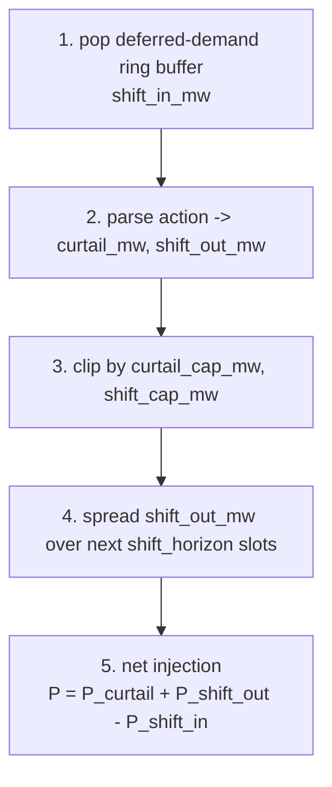
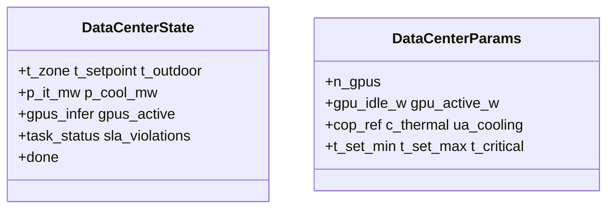

# Resources

Resource environments model device-local physics: batteries, renewables, EVs, flexible loads, diesel generators, and data centers.

In plain language, this layer answers a simple question: if we control one device by itself, or attach many such devices to a grid, how does that device update its own power, energy, or internal state?

The most important distinction is:

- standalone `Env`: use this when you want to study one device on its own
- `Bundle`: use this when you want to attach many devices to a grid / market / microgrid env

!!! note "Why keep standalone resource envs at all?"
    They are usually not the final system-level benchmark. Their main job is to serve as device-level experiment benches: validating local physics, providing the smallest possible RL example, debugging training pipelines, and testing whether a controller can learn a simple objective before we couple the same resource to a larger grid. In contrast, the more system-level questions in this repo, such as voltage regulation, branch congestion, losses, and network safety, usually appear only after bundles are attached to a parent `distribution`, `transmission`, or `market` env.

So a practical rule of thumb is:

- choose a standalone `Env` when you want the cleanest possible single-device experiment or training example
- choose a `Bundle` plus a parent env when you care about system interactions and benchmark-style power-system behavior

Not every resource exposes both forms. The current public surface is:

| Resource | Standalone env | Bundle | Typical use |
| --- | --- | --- | --- |
| Battery | `BatteryEnv` | `BatteryBundle` | standalone storage tests; grid / market attachment |
| Renewable | `RenewableEnv` / `SolarEnv` / `WindEnv` | `RenewableBundle` | standalone generator tests; grid attachment |
| Vehicle | `VehicleEnv` | no public bundle | standalone EV scheduling |
| Flexible load | `FlexLoadEnv` | `FlexLoadBundle` | standalone demand response; DSO / DERs |
| Diesel | no standalone env | `DieselBundle` | grid / microgrid attachment |
| Data center | `DataCenterEnv` | no public bundle | standalone load-side scheduling / thermal control |

This page summarizes the physics of each resource type. For symbol-level signatures see [API → Resources](../api/resource.md).

## Sign conventions

- Active power `P > 0` means injection to the grid.
- For batteries and EVs: discharge is positive, charge is negative.
- For flexible loads: positive `current_p_mw` means load reduction (curtail or shift-out); negative means a load increase from releasing deferred demand.
- For diesel: active power is non-negative and injects into the host env.
- For data centers: `current_p_mw` is always negative because the data center is always a net load.

## Battery — `BatteryEnv` and `BatteryBundle`

The battery model is shared between standalone and bundle form.

### Feasible-power clipping

Feasible grid-side power is clipped by both converter rating and SOC headroom:

\[
P_{\max}^{\text{dis}} =
\min\!\left(P_{\text{rated}},\ \frac{(\mathrm{SOC} - \mathrm{SOC}_{\min})\, E_{\max}\, \eta_d}{\Delta t}\right)
\]

\[
P_{\max}^{\text{chg}} =
\min\!\left(P_{\text{rated}},\ \frac{(\mathrm{SOC}_{\max} - \mathrm{SOC})\, E_{\max}}{\eta_c\, \Delta t}\right)
\]

$E_{\max}$ is `capacity_mwh`; $\eta_c$ and $\eta_d$ are one-way charge / discharge efficiencies; $\Delta t$ is `delta_t_hours`.

### SOC update

\[
\Delta \text{soc} =
\begin{cases}
- \dfrac{P\, \Delta t}{\eta_d\, E_{\max}} & P \ge 0 \quad \text{(discharge)} \\[6pt]
- \dfrac{P\, \Delta t\, \eta_c}{E_{\max}}  & P < 0 \quad \text{(charge)}
\end{cases}
\]

### Standalone `BatteryEnv`

The standalone battery has no device-local economic reward:

\[
r_t = 0
\]

Its CMDP cost channel is

\[
\text{costs} = (C_{\text{cycle}},)
\]

with

\[
C_{\text{cycle}} = c_{\text{cycle}}\, |P|\, \Delta t
\]

where $c_{\text{cycle}}$ corresponds to `cycle_cost_per_mwh` in the implementation. `info["cost_sum"]` is the sum of the reported cost components. Separately, `info["cost_action_clip"]` is a clipping diagnostic and is not folded into the CMDP cost vector.

Cost channel definitions:

| Symbol | Constraint name | Info key | Meaning |
| --- | --- | --- | --- |
| \(C_{\text{cycle}}\) | `cycle_throughput` | `cost_cycle_throughput` | Battery throughput cost \(|P| \Delta t\, c_{\text{cycle}}\), a soft degradation proxy. |
| diagnostic | N/A | `cost_action_clip` | Normalized distance between requested and feasible battery power; reported in `info` but not included in the CMDP cost vector. |

### `BatteryBundle`

`BatteryBundle` is the public bundle implementation used by grid and market envs. It packs `n_devices` batteries into batched per-device arrays and supports optional reactive power. With `enable_q_control=True`, reactive power is clipped by the apparent-power limit after active power is finalized:

\[
|Q| \le \sqrt{S_{\text{rated}}^2 - P^2}
\]

`BatteryBundle.step` reports `cost_soc_clip` and `cost_cycle` diagnostics. Unlike standalone `BatteryEnv`, the current bundle path does not expose a `cost_sum` key, so parent grid envs that aggregate only `cost_sum` / `cost` do not automatically include these battery diagnostics in `info["cost_resource"]`. Market envs currently ignore bundle cost channels by design.

!!! warning "Observation rebuild gap"
    Notation in this section: $p$ is active power (MW), $q$ is reactive power (MVAR).

    `BatteryBundle.step` computes the current feasible $p$ / $q$ and writes them into the returned `obs_slice`. The parent env, however, then rebuilds the bundle observation via `observe(state, ctx)`. Because `BatteryBundleState` currently stores SOC only, parent observations expose SOC plus **zeroed** $p$ / $q$ channels, not the just-applied power. The agent therefore cannot directly see how its commanded power was clipped — it has to infer that indirectly from SOC changes.

## Renewable — `RenewableEnv`, `SolarEnv`, `WindEnv`, `RenewableBundle`

`RenewableEnv` is a profile-driven generator. `SolarEnv` and `WindEnv` are convenience subclasses with different default capacity-factor profiles; they do not define separate physics.

### Action and output

The action `a in [-1, 1]` maps to curtailment:

\[
\text{curtailment}_t = \frac{1 - a_t}{2}
\]

so `a = +1` means no curtailment, and `a = -1` means full curtailment. Active power output is then:

\[
P_t = P_{\text{cap}}\, \mathrm{CF}(t)\, (1 - c_t)
\]

`CF(t)` is the time-indexed capacity-factor profile. If `allow_curtailment=False`, curtailment is forced to zero. With `enable_q_control=True`, reactive power is clipped by the same apparent-power limit used by the battery bundle.

### Reward and cost

The standalone renewable env also uses zero scalar reward:

\[
r_t = 0
\]

Its CMDP cost channel is

\[
\text{costs} = (C_{\text{curtail}}, C_{\text{q-clip}})
\]

where $C_{\text{curtail}}$ is non-zero when the agent curtails available renewable output, and $C_{\text{q-clip}}$ is non-zero when requested reactive power is clipped by the apparent-power limit.

Cost channel definitions:

| Symbol | Constraint name | Info key | Meaning |
| --- | --- | --- | --- |
| \(C_{\text{curtail}}\) | `curtailment` | `cost_curtailment` | Curtailed available renewable power/energy; standalone env uses a lost-capacity proxy, bundle mode uses configured curtailment cost. |
| \(C_{\text{q-clip}}\) | `q_clip` | `cost_q_clip` | Normalized amount by which requested reactive power is clipped by the apparent-power limit. |

Device-local renewable envs do not carry voltage / thermal constraint costs; those come from the parent grid env. `RenewableBundle` follows the same protocol and packs `n_devices` PV / wind plants into batched per-device arrays.

## Vehicle — `VehicleEnv`

`VehicleEnv` adds temporal availability and trip energy consumption on top of a battery-like SOC model.

### State extension

### State-transition order

1. Check departures and arrivals using fixed-size trip arrays.
2. On departure, subtract `trip_energy` from SOC and record any shortfall relative to `soc_departure_min`.
3. Apply charging or vehicle-to-grid discharge only if the vehicle is at home (`is_home=1`).
4. Advance time of day.

### Action

Asymmetric scaling:

- `a > 0`: V2G discharge up to `p_discharge_max_mw`
- `a < 0`: charging up to `p_charge_max_mw`

SOC update follows the same one-way-efficiency rule as the battery, but charge / discharge is forced to zero when `is_home=0`.

### Reward and cost

The standalone EV env uses

\[
r_t = 0
\]

and a single CMDP cost channel

\[
\text{costs} = \left(\max(0,\ \mathrm{SOC}_{\text{dep,min}} - \mathrm{SOC}_{\text{at dep}}),\right)
\]

This term is non-zero only on the step where the vehicle departs below the required SOC.

Cost channel definition:

| Symbol | Constraint name | Info key | Meaning |
| --- | --- | --- | --- |
| \(C_{\text{dep}}\) | `departure_soc` | `cost_departure_soc` | SOC shortfall below the required departure SOC, reported only on departure steps. |

## Flexible load — `FlexLoadEnv` and `FlexLoadBundle` {#flexible-load-flexloadenv}

`FlexLoadEnv` models demand response with two controls: curtail now and shift demand out now, to be released later.

### Step order

### Sign convention

\[
\Delta P = P_{\text{curtail}} + P_{\text{shift out}} - P_{\text{shift in}}
\]

- positive `current_p_mw`: load reduction
- negative `current_p_mw`: load increase from releasing deferred demand

### Reward and cost

The standalone flex-load env uses

\[
r_t = 0
\]

and

\[
\text{costs} = (C_{\text{curtail}}, C_{\text{shift}}, C_{\text{simul}})
\]

with:

- $C_{\text{curtail}} = c_{\text{curtail}}\, P_{\text{curtail}}\, \Delta t$
- $C_{\text{shift}}$: a per-step discomfort penalty proportional to buffered deferred energy
- $C_{\text{simul}}$: a penalty when curtailment and shifting are both activated in the same step

In the implementation, $c_{\text{curtail}}$ corresponds to `curtail_cost_per_mwh`. `info["cost_sum"]` is the sum of the reported cost components.

Cost channel definitions:

| Symbol | Constraint name | Info key | Meaning |
| --- | --- | --- | --- |
| \(C_{\text{curtail}}\) | `curtailment` | `cost_curtailment` | Energy curtailed now times `curtail_cost_per_mwh`. |
| \(C_{\text{shift}}\) | `shift_discomfort` | `cost_shift_discomfort` | Discomfort cost proportional to deferred energy remaining in the shift buffer. |
| \(C_{\text{simul}}\) | `simultaneous_activation` | `cost_simultaneous` | Penalty for curtailing and shifting load out in the same step. |

`FlexLoadEnv.step` optionally accepts `lmp=` so the LMP can appear in the observation, but price does not change the physical update. `FlexLoadBundle` packs `n_devices` flex loads into batched per-device arrays for use in DSO / DERs.

### Bundle observation

Per device, the `FlexLoadBundle` observation is:

`[curtail_norm, shift_out_norm, shift_in_norm, buffer_fill_ratio, buffer_energy_norm]`

- `curtail_norm = curtailed_mw / curtail_cap_mw`
- `shift_out_norm = shift_out_mw / shift_cap_mw`
- `shift_in_norm = shift_in_mw / shift_cap_mw`
- `buffer_fill_ratio = buffer_size / shift_horizon`
- `buffer_energy_norm = buffered_deferred_energy / (shift_cap_mw * shift_horizon)`

The parent grid env appends these slices device-major to build `<bundle_obs>`. In the DSO benchmark, that produces the `flexload_obs (30)` tail because there are 6 devices and 5 features per device.

## Diesel — `DieselBundle`

Diesel currently exposes public pure helpers plus a public bundle form, but no standalone `DieselEnv`.

### Action and output

Per device, the action is one scalar in `[0, 1]`:

\[
P_{\text{dg}} = a \, P_{\max}
\]

The bundle also supports an optional minimum-loading rule `p_min_norm`:

- below the deadband (`p_min_norm / 2`): generator stays off
- above the deadband: output is clamped to at least `p_min_norm * p_max`

Reactive power is fixed to zero in the current benchmark implementation.

### Observation and accounting

Per device, the bundle observation is `[p_norm, dg_margin_norm]`, where:

- `p_norm = p_dg / p_max`
- `dg_margin_norm = 1 - p_norm`

### Reward and cost

- `reward`: no standalone diesel reward exists here because diesel is exposed as a bundle
- `cost_info["cost"] = 0.0`
- `cost_info["fuel_cost"]` and `cost_info["carbon_kg"]` are reported separately

So diesel does not create a standalone CMDP-cost channel at the resource layer; fuel and carbon are meant to enter the parent env objective explicitly.

## Data center — `DataCenterEnv`

`DataCenterEnv` is a load-side environment with three coupled layers: IT power, cooling power, and zone thermal dynamics.

### State and parameters

### Action

3-D action:

- `action[0]`: fraction of currently available GPUs allocated to training jobs
- `action[1]`: fraction of the remaining available GPUs allocated to finetuning jobs
- `action[2]`: normalized cooling setpoint between `t_set_min` and `t_set_max`

### Job dynamics

- training and finetuning arrivals are sampled from Poisson processes
- new jobs are inserted into a fixed-size waiting queue
- urgent jobs are force-scheduled first
- the agent-controlled scheduler allocates the remaining GPUs with an earliest-deadline-first greedy rule, meaning jobs with the closest deadline are considered first
- waiting jobs that miss their deadline become SLA violations

### Power equations

IT and cooling power:

\[
P_{\text{it}} = \frac{P_{\text{infer}} + P_{\text{running}} + P_{\text{idle}}}{10^6} + P_{\text{base}}
\]

!!! note "Unit conversion"
    The division by `10^6` converts watts to megawatts. Per-GPU quantities such as `gpu_idle_w` and `gpu_active_w` are stored in W, so `P_infer`, `P_running`, and `P_idle` are accumulated in W first. The env, however, reports facility-scale active power in MW (`p_it_mw`, `current_p_mw`, `p_base_mw`), so the sum must be divided by `1,000,000` before adding `P_base`.

\[
\mathrm{COP} = \mathrm{COP}_{\text{ref}}\, \mathrm{clip}\!\left(1 - k_{\text{cop}}\, \max(T_{\text{out}} - T_{\text{ref}}, 0),\ 0.4,\ 1.2\right)
\]

\[
Q_{\text{cool}} = UA_{\text{cool}}\, \max(T_{\text{zone}} - T_{\text{set}}, 0)
\]

\[
P_{\text{cool}} = \frac{Q_{\text{cool}}}{\mathrm{COP} \cdot 10^3}
\]

Zone thermal update:

\[
T_{\text{zone}}^{+} = \mathrm{clip}\!\left(T_{\text{zone}} + \Delta t\, \frac{P_{\text{it,kW}} - Q_{\text{cool}} + Q_{\text{wall}}}{c_{\mathrm{th}}},\ 15,\ 45\right)
\]

Total electrical demand:

\[
P_{\text{dc}} = P_{\text{it}} + P_{\text{cool}} + \alpha_{\text{aux}}\, P_{\text{it}}
\]

!!! note "Symbol guide"
    In the equations above:

    - $P_{\text{infer}}$: inference GPU power, accumulated in W before the $10^6$ conversion.
    - $P_{\text{running}}$: power of GPUs currently running scheduled training / finetuning jobs, in W.
    - $P_{\text{idle}}$: idle-GPU power for GPUs that are installed but not currently active, in W.
    - $P_{\text{base}}$: non-GPU base facility load, in MW.
    - $\mathrm{COP}_{\text{ref}}$: reference coefficient of performance for cooling.
    - $k_{\text{cop}}$: temperature-sensitivity coefficient that reduces cooling efficiency as outdoor temperature rises above $T_{\text{ref}}$.
    - $T_{\text{out}}$: outdoor temperature.
    - $T_{\text{ref}}$: reference outdoor temperature used by the COP model.
    - $UA_{\text{cool}}$: effective cooling conductance; it converts the temperature gap $(T_{\text{zone}} - T_{\text{set}})$ into a cooling heat-removal term.
    - $T_{\text{zone}}$: current zone temperature inside the data center.
    - $T_{\text{set}}$: cooling setpoint chosen by the agent.
    - $Q_{\text{cool}}$: cooling heat removed from the zone.
    - $P_{\text{it,kW}}$: $P_{\text{it}}$ expressed in kW for the thermal ODE.
    - $Q_{\text{wall}}$: heat exchange with the outside through the building envelope.
    - $c_{\mathrm{th}}$: effective thermal capacitance of the zone (the $\texttt{c\_thermal}$ field, units kWh/°C; lowercase to disambiguate from the cost-vector symbol $C_{\mathrm{th}}$).
    - $\Delta t$: step length in hours (`delta_t_hours`).
    - $\alpha_{\text{aux}}$: auxiliary-power fraction applied on top of IT power.
    - $P_{\text{dc}}$: total data-center electrical demand, in MW.

The env reports `current_p_mw = -P_dc_mw`.

### Reward and cost

The standalone data-center env uses

\[
r_t = 0
\]

and

\[
\text{costs} = (C_{\mathrm{sla}}, C_{\mathrm{ot}})
\]

where:

- $C_{\mathrm{sla}}$ is SLA violation density: the number of waiting jobs that have already missed their deadline, divided by $\texttt{n\_gpus}$.
- $C_{\mathrm{ot}}$ is the normalized over-temperature excess (overtemp).

SLA means service-level agreement, here the per-job deadline obligation. `info["cost_sum"]` is the sum of the reported cost components.

Cost channel definitions:

| Symbol | Constraint name | Info key | Meaning |
| --- | --- | --- | --- |
| \(C_{\mathrm{sla}}\) | `sla` | `cost_sla` | Expired waiting jobs divided by `n_gpus`. |
| \(C_{\mathrm{ot}}\) | `overtemp` | `cost_overtemp` | Normalized excess of zone temperature above the critical threshold. |

!!! note "Why a separate microgrid env exists"
    `DataCenterEnv` models a grid-connected data-center load. To benchmark a self-contained microgrid that combines this load with PV, battery, and diesel, use `DataCenterMicrogridEnv`; see [Microgrid](microgrid.md).

## Where these resources appear

| Task / env | Resource use |
| --- | --- |
| DSO benchmark | `FlexLoadBundle` |
| DERs benchmark | `BatteryBundle + RenewableBundle + FlexLoadBundle` |
| Market envs | `BatteryBundle` |
| Data-center microgrid | `DataCenterEnv` composed with battery / PV / diesel logic |

## Cross references

- [API → Resources](../api/resource.md) for full signatures
- [Microgrid](microgrid.md) for the composed `DataCenterMicrogridEnv`
- [Benchmarks → DSO](../benchmarks/dso.md) and [DERs](../benchmarks/ders.md) for tasks that use these bundles
