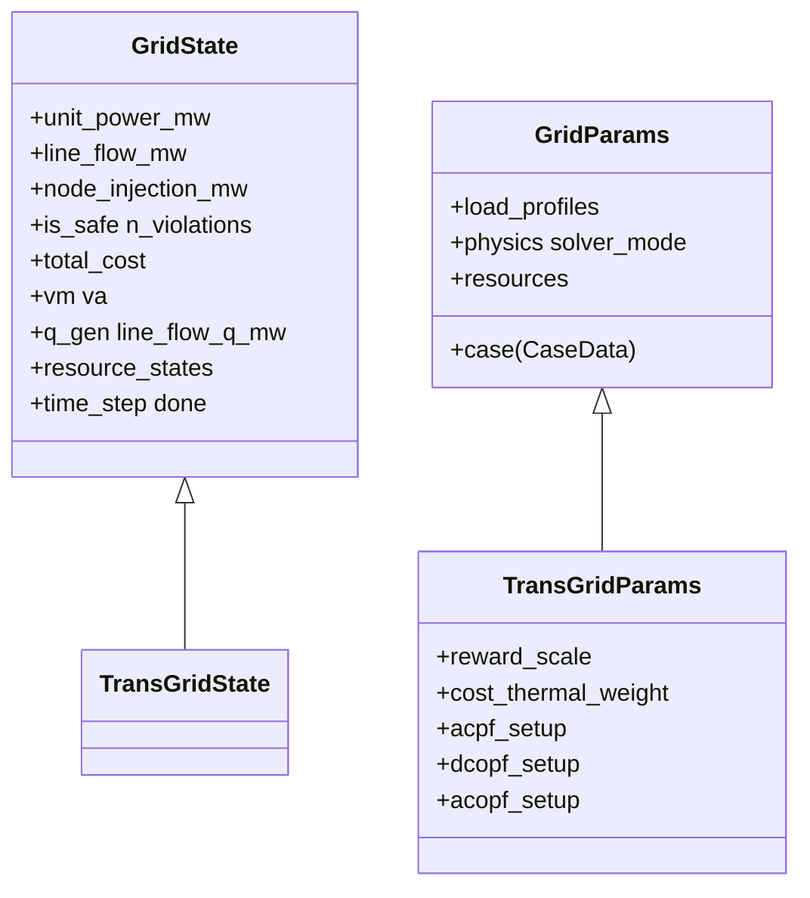
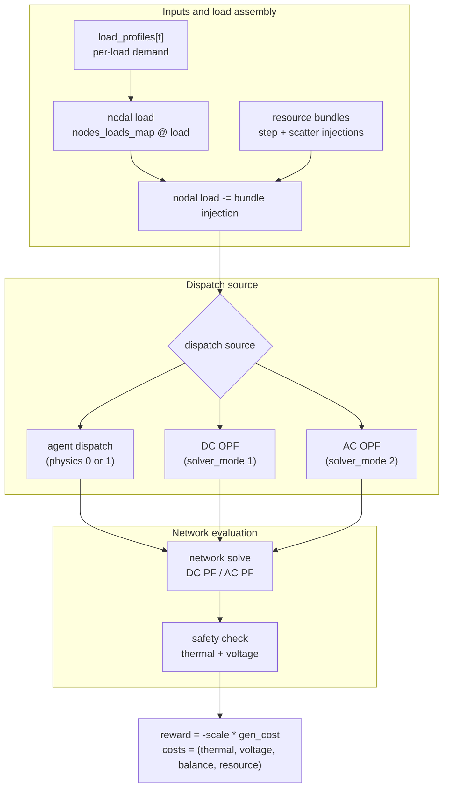
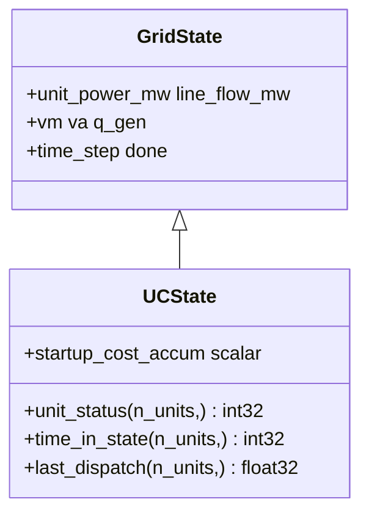
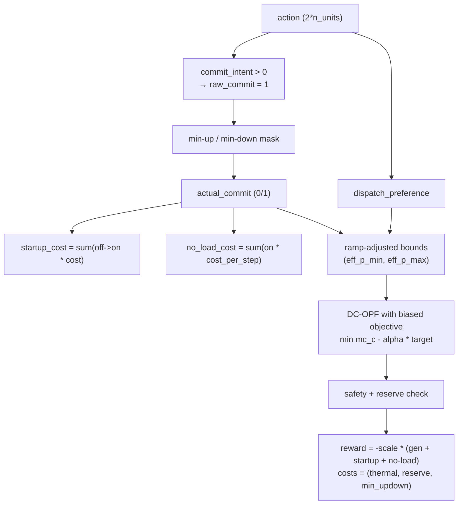

# Transmission

The transmission layer ships two environments: `TransGridEnv` (continuous economic dispatch, with optional OPF) and `UnitCommitmentEnv` (multi-step on/off + dispatch with security constraints, used by the TSO benchmark task).

For Power-side terminology used here (PTDF, AC / DC PF, OPF, SCUC, reserve, ramp), see [Power systems primer](../concepts/power-systems-primer.md).

## `TransGridEnv` — security dispatch on a meshed grid

`TransGridEnv` is the security-dispatch environment. At each step it combines the current load profile, optional resource-bundle injections, a generator dispatch decision, and a network solve.

### State and parameters



### Step flow



### Mode matrix

`TransGridEnv` supports five effective modes via two flags in `GridParams`:

| `physics` | `solver_mode` | Dispatch source | Network evaluation | Main safety checks |
| --- | --- | --- | --- | --- |
| `0` | `0` | agent dispatch | PTDF-based DC PF | MW line limits |
| `1` | `0` | agent dispatch | Newton-Raphson AC PF | apparent-power thermal limits and voltage bounds |
| `0` | `1` | DCOPF | PTDF-based DC PF | MW line limits |
| `1` | `1` | DCOPF | DCOPF dispatch followed by a separate AC PF validation pass | apparent-power thermal limits and voltage bounds |
| `0` or `1` | `2` | ACOPF | ACOPF dispatch and AC network state | apparent-power thermal limits and voltage bounds |

Two solver details matter for code-aligned interpretation:

- `solver_mode=1` uses the JAX `dc_opf()` solver. Its dispatch objective is the linear `mc_c` term (marginal-cost gradient) used by the LP-style DCOPF layer; the reported `gen_cost` is then computed from the full integrated marginal-cost polynomial. Here `gen_cost` simply means the total generation cost of the realized dispatch.
- `solver_mode=2` uses the JAX `ac_opf()` augmented-Lagrangian solver. In plain terms, this is an optimization method for finding an AC-feasible operating point. It produces a coherent AC operating point, but line limits are handled by soft penalties and the recovered AC LMP / congestion diagnostics are approximate, not exact dual prices from a standard interior-point OPF solve.

### DC equations and constraints

When the environment uses the DC PF solve branch, it first builds net nodal active-power injection from generator dispatch and load, then maps that injection to line active-power flow through the PTDF. The core equations are:

\[
p_{\text{inj}} = A_u\, p_g - p_{\text{load,balanced}}
\]

\[
f = \mathrm{PTDF}\, p_{\text{inj}}
\]

$A_u = \texttt{nodes\_units\_map}$, the generator-to-bus mapping matrix. Here $p_{\text{inj}}$ means net active-power injection at each bus, and $f$ is the resulting line active-power flow vector. Power imbalance is absorbed at the slack bus, so the returned `actual_unit_power_mw` is the final realized generator dispatch after that slack-bus balancing adjustment. `gen_cost` and `cost_power_balance` are computed from this slack-adjusted dispatch, not from the raw agent command. `cost_power_balance` measures how much system-wide power imbalance is still left after the DC solve, so it should be read as a feasibility-diagnostic cost rather than an economic objective.

In the DC branch, line constraints apply directly to active-power flow:

\[
f_\ell^{\min} \le f_\ell \le f_\ell^{\max}
\]

Whenever a line falls outside that interval, a thermal-constraint violation is recorded. The corresponding thermal cost is:

\[
C_{\mathrm{th}} = \sum_\ell \max(f_\ell - f_\ell^{\max}, 0) + \max(f_\ell^{\min} - f_\ell, 0)
\]

### AC equations and constraints

When the environment uses the AC solve branch, line-limit checks no longer look at active-power MW alone; they use apparent power magnitude instead:

\[
|S_\ell| = \sqrt{P_\ell^2 + Q_\ell^2}
\]

Here $|S_\ell|$ can be read as the line's combined AC power burden: both active power $P_\ell$ and reactive power $Q_\ell$ consume line capacity, so checking MW alone would miss part of the load on the line.

The AC line constraint is

\[
|S_\ell| \le S_\ell^{\max}
\]

That is, line-limit checking compares the current apparent-power magnitude $|S_\ell|$ against the line's allowed capacity $S_\ell^{\max}$. Any excess beyond that limit becomes a line violation.

!!! note "AC state fields and naming"
    In the AC PF solve branch, the env keeps the following AC quantities in state (all zero in the DC branch):

    - `vm`: voltage magnitude per bus (p.u.)
    - `va`: voltage angle per bus (rad)
    - `q_gen`: per-generator reactive output (MVAR); only the `solver_mode=2` ACOPF branch writes into it
    - `line_flow_q_mw`: reactive line flow — **the actual units are MVAR**. The `_mw` suffix is legacy naming; do not let it mislead you into reading it as active power
    - `line_viol_mva`: apparent-power overshoot above $S_\ell^{\max}$ (MVA), returned only by the ACOPF branch

    The voltage cost combines `vm` with `node_v_min` / `node_v_max` from `CaseData`, and is only nonzero in the AC branch.

### Reward and cost

The scalar reward is

\[
r_t = -\lambda_{\text{reward}}\, C_{\text{gen}}
\]

where $\lambda_{\text{reward}}$ is the reward-scaling factor and $C_{\text{gen}}$ is the total generation cost of the realized dispatch.

Numerically, $C_{\text{gen}}$ is computed on the slack-adjusted dispatch by integrating each unit's marginal-cost polynomial:

\[
C_{\text{gen}}
=
\sum_u \left(
\frac{mc_{a,u}}{3} p_u^3
+ \frac{mc_{b,u}}{2} p_u^2
+ mc_{c,u} p_u
\right)
\]

In the implementation, these correspond to `reward_scale` and `gen_cost`.

The CMDP cost vector is

\[
\text{costs} =
\bigl(
C_{\mathrm{th}},
\ C_{\mathrm{v}},
\ C_{\mathrm{bal}},
\ C_{\mathrm{res}}
\bigr)
\]

The static component names are `("thermal_overload", "voltage_violation", "power_balance", "resource")`. Here `info["cost_sum"]` is the sum of the reported cost components and is provided as a convenience diagnostic.

Cost channel definitions:

| Symbol | Constraint name | Info key | Meaning |
| --- | --- | --- | --- |
| \(C_{\mathrm{th}}\) | `thermal_overload` | `cost_thermal_overload` | Weighted line-overload cost; active-power overflow in DC mode and apparent-power overflow in AC mode. |
| \(C_{\mathrm{v}}\) | `voltage_violation` | `cost_voltage_violation` | Voltage-magnitude violation cost in AC modes; zero in DC mode. |
| \(C_{\mathrm{bal}}\) | `power_balance` | `cost_power_balance` | Residual power-balance/slack-adjustment diagnostic after the solve. |
| \(C_{\mathrm{res}}\) | `resource` | `cost_resource` | Sum of `cost_sum` reported by attached resource bundles. |

!!! note "Cost components mean different things in AC vs DC branches"
    The cost-vector shape is identical across both solve branches, but each component's physical source differs. A policy trained on one branch will see semantically different signals if `physics` / `solver_mode` is later flipped.

    - $C_{\mathrm{th}}$ is the thermal-overload term, equal to $\texttt{cost\_thermal\_weight} \cdot \texttt{thermal\_overload}$ ($\texttt{cost\_thermal\_weight}$ defaults to 1.0). In the DC branch it comes from active-power line-flow overflow; in the AC branch it comes from apparent-power overflow.
    - $C_{\mathrm{v}}$ is the voltage-bound penalty. It is produced by voltage-magnitude violations in the AC branch and is identically zero in the DC branch.
    - $C_{\mathrm{bal}}$ corresponds to $\texttt{cost\_power\_balance}$, the system power-imbalance residual remaining after the solve. In the current implementation it mostly reflects the post-slack balancing residual, so its interpretation is more DC-flavored.
    - $C_{\mathrm{res}}$ is the sum of bundle-reported costs.


### Observation layout

- DC observation: `[line_flow / cap, load / total_cap, unit_p / p_max, sin(t), cos(t), <bundle_obs>]`
- AC observation: `[|S| / cap, vm, load / total_cap, unit_p / p_max, sin(t), cos(t), <bundle_obs>]`

### Action layout

When no resource bundles are attached, the action is `Box(n_units)` in `[-1, 1]` and is denormalized into `[unit_p_min, unit_p_max]`. With bundles attached, the action is concatenated:

```
[unit actions | bundle_0 actions | bundle_1 actions | ...]
```

The env splits the action by `bundle.action_dim` before stepping each bundle.

### Factories

`TransGridEnv` also has a parameter factory symmetric to `UnitCommitmentEnv`; this page simply had not called it out separately before. The generic entry point is `make_trans_params(...)`, defined in [`powerzoojax/envs/grid/trans.py`](https://github.com/powerzoojax/PowerZooJax/blob/main/powerzoojax/envs/grid/trans.py).

In normal use, you do not construct `TransGridParams` by hand. Instead, use:

- `make_trans_params(case, ...)`: create the standard `TransGridEnv` parameter object and set fields such as `physics`, `solver_mode`, `reward_scale`, `cost_thermal_weight`, and `load_profiles`.
- `make_trans_params(case, resources=(...,))`: attach resource bundles through the same factory; bundle actions and states are then folded into the grid env's `step` / `reset` flow automatically.

So at the code level, both `TransGridEnv` and `UnitCommitmentEnv` follow the same pattern: an env class plus a `make_*_params` factory. The UC section simply goes one level higher and also lists the TSO-specific task factories.

## `UnitCommitmentEnv` — SCUC for the TSO task

`UnitCommitmentEnv` extends `TransGridEnv` with the discrete on/off state machine, intertemporal constraints, and reserve margin needed for security-constrained unit commitment (SCUC). The TSO paper benchmark uses this env on case118.

### Why a separate env

`TransGridEnv` chooses dispatch given that all units are eligible. `UnitCommitmentEnv` adds:

- per-unit on/off status with min-up / min-down constraints,
- ramp-rate constraints between consecutive steps,
- one-time startup cost and per-step no-load cost,
- system-wide reserve margin requirement.

To stay JAX-compatible (JAX does not natively support dynamic integer branching), the commitment decision uses a continuous-to-binary mapping: the policy outputs a continuous commitment intent `commit_intent ∈ [-1, 1]`, which the env thresholds at `> 0` to produce a binary on/off decision; min-up / min-down constraints are then enforced by a hard mask inside `step` to guarantee feasibility.

### State extension



### Action and step flow

The action is `Box(2 * n_units)` in `[-1, 1]`:

- first `n_units` entries: `commit_intent`. `> 0` requests ON, `≤ 0` requests OFF; the env then applies min-up / min-down hard masking to produce `actual_commit`, the final ON/OFF decision that is actually executed after feasibility rules are enforced.
- second `n_units` entries: `dispatch_preference`. These values are denormalized to the ramp-adjusted feasible range `[eff_p_min, eff_p_max]`, meaning the minimum and maximum output still allowed this step after ramp constraints are applied. In DC-OPF mode (`solver_mode=1`, the SCUC default) they bias the OPF cost function to steer the solution toward the preferred output without overriding physical constraints; in direct-PF mode (`solver_mode=0`) they are used directly as the unit dispatch setpoint.



In DC-OPF mode, `dispatch_preference` guides the solve as

\[
mc_{c,\text{biased}} = mc_c - \alpha\, p_{\text{target}}
\]

where $\alpha = \texttt{dispatch\_preference\_weight}$ (default 0.01) and $p_{\text{target}}$ is the preferred dispatch level after denormalization. This adds a linear bias to each unit's quadratic cost curve, shifting the cost minimum toward the preferred dispatch while leaving power balance, ramp bounds, and line limits as hard constraints enforced by the solver.

### Reward and cost

The scalar reward is

\[
r_t = -\lambda_{\text{reward}} \left(C_{\text{gen}} + C_{\text{start}} + C_{\text{no-load}}\right)
\]

where $\lambda_{\text{reward}}$ is the reward-scaling factor, $C_{\text{gen}}$ is the realized total generation cost, $C_{\text{start}}$ is the startup-cost term, and $C_{\text{no-load}}$ is the fixed running cost of keeping committed units online before counting dispatch-dependent fuel cost.

In the implementation, these correspond to `reward_scale`, `gen_cost`, `startup_cost`, and `no_load_cost`.

The env's CMDP cost vector is

\[
\text{costs} = \left(C_{\mathrm{th}}, C_{\mathrm{res}}, C_{\mathrm{up/down}}\right)
\]

with static component names `("thermal_overload", "reserve_shortfall", "min_updown")`. The TSO benchmark and the paper (Appendix E.2, Eq. for `\mathbf{c}_t`) use only the first two channels as the formal CMDP spec; the third is a fixed-shape padding entry that is always zero (see the next note) and is retained only so downstream wrappers can rely on a stable cost-vector shape across env variants.

Cost channel definitions:

| Symbol | Constraint name | Info key | Meaning |
| --- | --- | --- | --- |
| \(C_{\mathrm{th}}\) | `thermal_overload` | `cost_thermal_overload` | Weighted line-overload cost after unit commitment and dispatch. |
| \(C_{\mathrm{res}}\) | `reserve_shortfall` | `cost_reserve_shortfall`, `reserve_shortfall` | Missing committed capacity headroom relative to load plus the reserve margin. |
| \(C_{\mathrm{up/down}}\) | `min_updown` | `cost_min_updown` | Min-up / min-down diagnostic retained for fixed-shape cost vectors. |

!!! note "$C_{\mathrm{up/down}}$ is currently identically zero"
    Min-up / min-down constraints are enforced by a hard mask inside `step`, so $C_{\mathrm{up/down}}$ is always 0. It is kept in the cost vector only to preserve a fixed shape for downstream wrappers; do not treat it as an optimizable safety signal.

`info` also exposes diagnostics: `gen_cost`, `startup_cost`, `no_load_cost`, `reserve_shortfall`, `commitment_switches`, `is_safe`, `n_violations`. These names are literal rollout diagnostics: total generation cost, startup cost, fixed no-load cost, reserve shortfall, the number of on/off commitment changes, and the final safety summary.

### Observation

`obs = [unit_status | time_in_state_norm | last_dispatch_norm | unit_cost_b_norm | line_flow_norm | load_norm | reserve_ratio | sin(t) | cos(t) | future_total_load_norm[t+1:t+H]]`. Total dimension is `4 * n_units + n_lines + 4 + H`, where `H = forecast_horizon_steps`.

Field semantics:

- `unit_status`: per-unit ON / OFF state, encoded as `0` or `1`.
- `time_in_state_norm`: per-unit time spent in the current ON or OFF state, normalized as `time_in_state / 200`.
- `last_dispatch_norm`: previous-step actual dispatch of each unit, normalized as $p_{i,t-1} / p_{\max,i}$.
- `unit_cost_b_norm`: each unit's linear marginal-cost coefficient, normalized as $b_i / \max_j |b_j|$.
- `line_flow_norm`: current line active-power flow, normalized as $f_{\ell,t} / f^{\max}_{\ell}$.
- `load_norm`: current total load, normalized as $P_{\text{load},t} / \sum_i p_{\max,i}$.
- `reserve_ratio`: committed headroom relative to current load, computed as $\frac{P_{\text{committed}} - P_{\text{load},t}}{P_{\text{load},t}}$. In plain terms, it measures how much spare committed generation is still available beyond the current demand.
- `sin(t)`, `cos(t)`: time-of-day phase features, giving the policy a periodic encoding of the current step within the day.
- `future_total_load_norm[t+1:t+H]`: short rolling preview of future total load,
  normalized by $\sum_i p_{\max,i}$ and clipped to the episode end by
  repeating the last available step.

### Where to find ramp / cost data

Ramp limits come from `case.unit_ramp_up` / `case.unit_ramp_down` (fractions of `unit_p_max` per hour); `make_uc_params` converts them to per-step `ramp_up_mw` / `ramp_down_mw`. Min-up / min-down come from `case.min_up_time` / `case.min_down_time` (in steps). Startup and no-load costs come from `case.unit_startup_cost` / `case.unit_no_load_cost`. The built-in case118 already has all of these fields populated.

### Factories

Use the TSO factories rather than constructing `UCParams` by hand:

- `make_tso_case118_params(...)` — main case118 SCUC config.
- `make_tso_case14_params(...)` — case14 with injected default UC metadata.
- `make_tso_ed_params(...)` — UC disabled (pure economic dispatch) for the `tso-ed` preset.
- `make_tso_uc_params(...)` — UC enabled, reserve disabled.
- `make_tso_scuc_params(...)` — UC enabled, reserve enabled (used by `tso-scuc-safe`).

For real GB demand profiles, use `make_tso_net_load_profiles_from_data(loader, case, role=...)`. For tests and CI, use `make_tso_net_load_profiles(...)`, which returns synthetic intraday traces.

The TSO task page ([benchmarks/tso](../benchmarks/tso.md)) wraps these factories into the full experiment pipeline.

## Non-learning baselines for TSO

`tasks/tso.py` ships with two **non-learning** rollouts for the SCUC benchmark:

- `tso_all_on_rollout(env, params, key)` — all units always ON; pure dispatch by the OPF layer. Reference “always committed” policy; used as a cost upper reference in the benchmark table.
- `tso_merit_order_rollout(env, params, key)` — **priority-list (merit-order)** commitment: enable units in ascending marginal-cost order until load + reserve is covered, then OPF. A deterministic **rule-based** SCUC *approximation* and a strong **cost reference** (often a loose lower bound in simplified settings).

`compute_tso_metrics(rollout_info)` aggregates per-step info into the metrics reported by [benchmarks/tso](../benchmarks/tso.md).

## Cross references

- [Distribution](distribution.md) — radial and three-phase environments.
- [Resources](resources.md) — what bundles you can attach.
- [Benchmarks → TSO](../benchmarks/tso.md) — the SCUC task built on top of `UnitCommitmentEnv`.
- [API → Grid](../api/grid.md) and [API → Unit commitment](../api/grid-uc.md) for symbol-level signatures.
