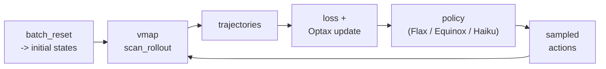

# Custom loops

The trainers in [Trainers](trainers.md) and the presets in
[Presets](presets.md) cover the usual cases. When you need full control over
the optimizer, policy architecture, objective, logging, or data flow, write
your own loop directly on top of `batch_reset`, `batch_step`, `scan_rollout`,
and Optax.

This page is the practical guide for doing that in a way that stays aligned
with the PowerZooJax JAX contract.

## Why a custom loop is fine

PowerZooJax envs are pure functions. They do not require a trainer-specific
wrapper to be usable. As long as you respect the
[JAX + RL environment implementation rules](../concepts/jax-contract.md)
(explicit state, explicit PRNG key, fixed shapes), you can drive them from any
JAX-compatible RL stack.



## Which env interface should I use?

The first decision is not the optimizer. It is the env interface.

| Need | Recommended interface | Why |
| --- | --- | --- |
| Full control over reward and cost handling | bare env | Gives you the raw `(obs, state, reward, costs, done, info)` contract. |
| Single-agent MDP training with episode stats in `info` | `LogWrapper` | Binds `params` and exposes the trainer-friendly 5-tuple step. |
| CMDP / PPO-Lagrangian style training | `SafeRLWrapper` | Returns the selected cost vector as a first-class output. |
| Dict-based multi-agent training | `GridMARLEnv`, `DistGridMARLEnv`, `MarketMARLEnv` | Matches the MARL contract used by the IPPO backends. |

If you are unsure, start from the bare env. It is the most explicit path and
the least likely to hide semantics you care about.

## Data flow and tensor shapes

Most custom-loop bugs come from shape confusion rather than optimizer math.

For a single-agent rollout with horizon `T`, parallel env count `N`, and
constraint count `k`, the usual shapes are:

| Quantity | Typical shape | Notes |
| --- | --- | --- |
| `obs` | `(T, N, obs_dim)` | Observations before each action. |
| `actions` | `(T, N, act_dim)` | Sampled or deterministic actions. |
| `rewards` | `(T, N)` | Scalar reward per step. |
| `costs` | `(T, N, k)` | Constraint-cost vector per step. |
| `dones` | `(T, N)` | Episode termination flags before auto-reset replacement continues. |
| `values` | `(T, N)` | Reward critic output on rollout observations. |
| `last_value` | `(N,)` | Bootstrap value on the final observation after the scan. |
| `info` leaves | `(T, N, ...)` | Batched diagnostics; avoid relying on them for core training logic. |

For minibatch updates, the common pattern is to flatten `(T, N, ...)` into
`(T * N, ...)`, shuffle once, then reshape into minibatches.

## Minimal single-agent rollout

The most useful custom-loop pattern is: reset once, carry observation + state
through `lax.scan`, and emit a transition pytree.

```python
import jax
import jax.numpy as jnp
import optax
from flax import linen as nn

from powerzoojax.case import load_case
from powerzoojax.envs import TransGridEnv, make_trans_params
from powerzoojax.utils.jax_utils import batch_reset

case = load_case("5")
env = TransGridEnv()
profiles = jnp.ones((48, case.n_loads), dtype=jnp.float32) * 0.5
params = make_trans_params(case, load_profiles=profiles, max_steps=48)


class GaussianActorCritic(nn.Module):
    action_dim: int
    hidden: tuple[int, ...] = (64, 64)

    @nn.compact
    def __call__(self, x):
        for h in self.hidden:
            x = nn.tanh(nn.Dense(h)(x))
        mu = nn.Dense(self.action_dim)(x)
        log_sigma = self.param("log_sigma", nn.initializers.zeros, (self.action_dim,))
        value = nn.Dense(1)(x)[..., 0]
        return mu, log_sigma, value


policy = GaussianActorCritic(action_dim=case.n_units)


def policy_apply(params_p, obs):
    return policy.apply({"params": params_p}, obs)


def sample_action_and_value(key, params_p, obs):
    mu, log_sigma, value = policy_apply(params_p, obs)
    sigma = jnp.exp(log_sigma)
    noise = jax.random.normal(key, mu.shape)
    action = mu + sigma * noise
    return action, value


def rollout_once(key, params_p, init_obs, init_state, horizon=48):
    def step_fn(carry, _):
        obs, state, key = carry
        key, k_act, k_step = jax.random.split(key, 3)
        action, value = sample_action_and_value(k_act, params_p, obs)
        obs_next, state_next, reward, costs, done, info = env.step_auto_reset(
            k_step, state, action, params
        )
        transition = {
            "obs": obs,
            "action": action,
            "reward": reward,
            "costs": costs,
            "done": done,
            "value": value,
        }
        return (obs_next, state_next, key), transition

    (last_obs, last_state, _), traj = jax.lax.scan(
        step_fn,
        (init_obs, init_state, key),
        None,
        length=horizon,
    )
    _, _, last_value = policy_apply(params_p, last_obs)
    return traj, last_obs, last_state, last_value


def collect_batch(key, params_p, n_envs=64, horizon=48):
    key, k_reset, k_roll = jax.random.split(key, 3)
    keys_reset = jax.random.split(k_reset, n_envs)
    init_obs, init_states = batch_reset(env, keys_reset, params)
    keys_roll = jax.random.split(k_roll, n_envs)
    traj, last_obs, last_states, last_values = jax.vmap(
        rollout_once, in_axes=(0, None, 0, 0, None)
    )(keys_roll, params_p, init_obs, init_states, horizon)
    return traj, last_obs, last_states, last_values
```

The important part is the carry: do not recompute rollout observations from
Python-side state. Carry them through the scan so the entire pipeline stays
inside JIT.

## From rollout to one PPO update

The rollout above is only the first half of PPO. The second half is:

1. bootstrap the reward critic with `last_value`
2. compute reward returns and reward advantages
3. flatten `(T, N, ...)` into `(T * N, ...)`
4. shuffle into minibatches
5. run `n_epochs` of Optax updates on the PPO loss

At minimum, a single-agent PPO update needs these terms:

- policy loss: clipped surrogate objective
- value loss: squared error against reward returns
- entropy bonus: encourages exploration

The core value/advantage logic looks like this:

```python
def gae_advantage(rewards, dones, values, last_value, gamma=0.99, gae_lambda=0.95):
    # rewards/dones/values: (T, N)
    next_values = jnp.concatenate([values[1:], last_value[None, :]], axis=0)

    def step_back(last_gae, xs):
        reward, done, value, next_value = xs
        not_done = 1.0 - done
        delta = reward + gamma * next_value * not_done - value
        gae = delta + gamma * gae_lambda * not_done * last_gae
        return gae, gae

    _, advantages_rev = jax.lax.scan(
        step_back,
        jnp.zeros_like(last_value),
        (rewards[::-1], dones[::-1], values[::-1], next_values[::-1]),
    )
    advantages = advantages_rev[::-1]
    returns = advantages + values
    return advantages, returns
```

After that, flatten the batch:

```python
def flatten_time_env(tree):
    return jax.tree.map(lambda x: x.reshape((x.shape[0] * x.shape[1],) + x.shape[2:]), tree)
```

Then the training step becomes conceptually:

```python
def train_step(train_state, key):
    traj, _, _, last_values = collect_batch(key, train_state.params)
    adv, ret = gae_advantage(
        traj["reward"],
        traj["done"],
        traj["value"],
        last_values,
    )
    batch = flatten_time_env({**traj, "advantage": adv, "return": ret})
    batch = shuffle_and_split_into_minibatches(batch, key)
    train_state = run_n_epochs_of_ppo_updates(train_state, batch)
    return train_state
```

This page does not reproduce the full PPO loss implementation from the library.
The point is the data movement: rollout on device, bootstrap on device, flatten
on device, update on device.

## CMDP custom loop pattern

For constrained loops, the main difference is not the scan. It is the update
logic after the scan.

If you use `SafeRLWrapper`, each step already returns the selected cost vector:

```text
(obs, state, reward, selected_costs, done, info)
```

The standard CMDP pattern is:

1. collect reward rollout and selected cost rollout
2. compute reward advantages `A_R`
3. compute one cost advantage per selected constraint, giving `A_C`
4. form the augmented advantage `A_R - lambda^T A_C`
5. run the PPO inner update on that augmented advantage
6. run one outer dual update on `lambda`

In practice, you usually keep these tensors around:

- `reward_value`: reward critic output
- `cost_values`: cost critic output with shape `(T, N, k)`
- `advantages_reward`: shape `(T, N)`
- `advantages_cost`: shape `(T, N, k)`
- `lambda`: shape `(k,)`

If you do not use `SafeRLWrapper`, you can still write a CMDP loop on the bare
env by aggregating `costs` directly from the raw step output. In that case, the
cost-channel selection logic is your responsibility.

## MARL custom loop pattern

For MARL, the env contract changes more than the optimizer contract.

The dict-based wrappers return:

```text
reset(key) -> (obs_dict, state)
step(key, state, action_dict) -> (obs_dict, state, rewards_dict, dones_dict, info)
```

The main extra work in a custom MARL loop is deciding how to batch those dicts.

Typical options are:

- full parameter sharing: stack all agents into one batch and use one actor
- typed sharing: stack agents by type (`battery_*`, `renewable_*`, `flexload_*`)
- fully independent: keep one params tree per agent

The typed-sharing case is often the best middle ground for PowerZooJax because
agent physics differ by resource type but many agents within a type are
interchangeable.

For local-observation MARL envs, also document the per-agent observation shape
early in the loop. Most errors in custom MARL code come from accidental mixing
of agent order, dict order, and stacked array order.

## Deterministic evaluation with `scan_rollout`

To evaluate a hand-crafted rule-based policy, or to replay a deterministic
action sequence, `scan_rollout` is the simplest path:

```python
from powerzoojax.utils.jax_utils import scan_rollout

@jax.jit
def evaluate(key, action_seq):
    key, k_reset, k_scan = jax.random.split(key, 3)
    _, state = env.reset(k_reset, params)
    final_state, obs_traj, reward_traj, cost_traj, done_traj, info_traj = scan_rollout(
        env, k_scan, state, params, action_seq
    )
    return reward_traj.sum(), cost_traj, info_traj
```

This is the structure used by benchmark `baselines.py` files: deterministic
policy logic plus a fixed-length device-side rollout.

## When to use which utility

| Need | Use |
| --- | --- |
| Single env, fixed-horizon rollout | `env.step_auto_reset` inside `lax.scan` |
| Many parallel envs, one step | `batch_step` |
| Many parallel envs, fixed-horizon rollouts | `jax.vmap(scan_rollout)` |
| Reset only | `batch_reset` |

All of them come from `powerzoojax.utils.jax_utils`.

## Common failure modes

- Rebuilding the jitted train function on every call. Construct the closure once and reuse it.
- Mixing Python control flow with traced values. Use `jax.lax.cond`, `jax.lax.scan`, or array ops instead.
- Letting shapes depend on runtime data. Batch sizes, horizon lengths, and state structure should stay static.
- Forgetting the done mask in GAE or bootstrap logic.
- Recomputing reward or cost from `info` after the rollout when the env already returned them explicitly.
- Failing to split PRNG keys at every stochastic boundary.
- Accidentally changing the order of MARL agents between dict handling and array stacking.
- Treating `info["cost_sum"]` as the canonical CMDP signal when the loop should use explicit `costs` or `constraint_costs`.

## Tips

- Build the `train` function once as a closure over `env`, `params`, and the policy module. Recompiling on every call defeats the point of JIT.
- For multi-objective reward (`info["reward_vector"]`), pull the vector out inside the rollout instead of recomputing it from `info` later.
- For CMDP loops without `SafeRLWrapper`, aggregate `costs` directly inside the rollout. Use `info["cost_sum"]` only as a diagnostic.
- `jax.lax.stop_gradient` is already applied inside `step_auto_reset`. Do not wrap it again.
- If you need trainer-friendly episode statistics rather than the raw env contract, switch to `LogWrapper` instead of rebuilding that bookkeeping yourself.

## Cross references

- [Trainers](trainers.md) — the built-in single-agent, CMDP, and MARL training paths.
- [Wrappers](wrappers.md) — which wrapped env interface to start from.
- [Architecture -> JAX Parallelization Architecture](../architecture/gpu-pipeline.md) — the helper layer behind `batch_reset`, `batch_step`, and `scan_rollout`.
- [Concepts -> JAX + RL environment implementation rules](../concepts/jax-contract.md) — the contract that makes custom loops possible.
- [Examples](../examples/index.md) — runnable scripts derived from these patterns.
