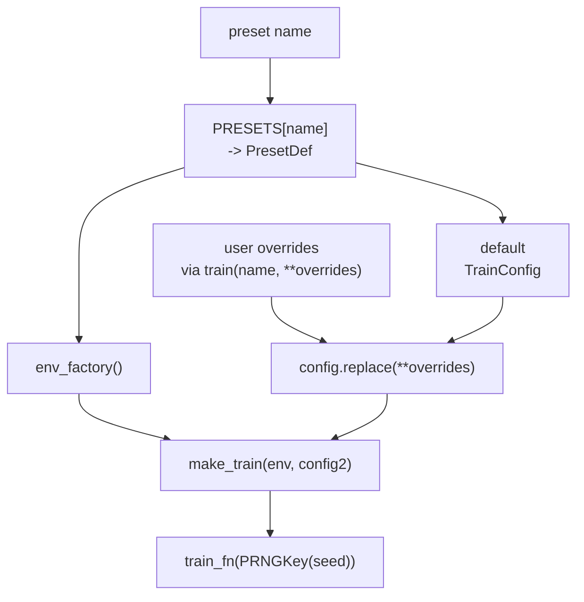

# Presets

A preset bundles three components under one name:

- an environment factory (case + bundle + wrapper),
- an optional reward override,
- a `TrainConfig` with sensible defaults.

A preset is a pre-packaged training recipe. It gives you a stable name for a
specific env construction path plus a matching default trainer config, so you
can rerun a standard setup without rebuilding the env and hyperparameters by
hand each time.

This lets you launch a benchmark training run with one line:

```python
from powerzoojax.rl import train

result = train("dso-nflex", seed=0)
```

The full preset list lives in `powerzoojax/rl/presets.py`. This page documents the catalog.

## API

```python
from powerzoojax.rl import list_presets, get_preset, train

for p in list_presets():
    print(p["name"], "-", p["description"])

preset = get_preset("battery-soc-tracking")
env = preset.env_factory()
config = preset.config
```

`train(preset_name, seed=..., total_timesteps=..., **overrides)` resolves the preset, applies overrides via `preset.config.replace(...)`, then runs `make_train(env, config)` from the trainers layer.

`list_presets()` returns a JSON-friendly list with `name`, `description`, `algo`, and `total_timesteps`.

## Catalog

### Resource warm-up

| Name | Algo | Notes |
| --- | --- | --- |
| `battery-soc-tracking` | `ppo` | `BatteryEnv` + `LogWrapper`, 48-step. Smallest sanity-check preset. Custom reward `-|soc - 0.5|`. |

### Transmission single-agent

| Name | Algo | Notes |
| --- | --- | --- |
| `case5-economic-dispatch` | `ppo` | `TransGridEnv` (case5) + `LogWrapper`, constant 50% load, 48-step. |
| `case5-safe-dispatch` | `ppo_lagrangian` | Same env wrapped with `SafeRLWrapper`, `selected_names=("thermal_overload",)`, `cost_thresholds=(0.0,)`. |

### Transmission multi-agent

| Name | Algo | Notes |
| --- | --- | --- |
| `case5-ippo` | `ippo` | `GridMARLEnv` over `TransGridEnv` (case5). 5 unit agents with parameter sharing. |
| `case5-ippo-battery` | `ippo` | Same as above plus 2 battery devices, for 7 agents total. |

### DSO benchmark

| Name | Algo | Notes |
| --- | --- | --- |
| `dso-nflex` | `ppo` | DSO `case33bw` with 6 FlexLoad devices, single-agent PPO. Synthetic load (dev / test only). |
| `dso-nflex-safe` | `ppo_lagrangian` | Same env, task selects `("voltage_violation",)`, `cost_thresholds=(0.0,)`. |

For paper-quality numbers, run from `benchmarks/dso/` with real Ausgrid splits via `make_dso_params_from_split(...)`. See [Benchmarks → DSO](../benchmarks/dso.md).

### DERs benchmark

| Name | Algo | Notes |
| --- | --- | --- |
| `ders-medium` | `ippo_typed` | `case141` + 12 agents (4 Battery + 4 PV + 4 FlexLoad). Typed parameter sharing. |
| `ders-medium-safe` | `ippo_typed` | Same env with task-level fallback reward shaping that subtracts a fixed weighted cost term from reward. `cost_thresholds=(0.0, 0.0, 0.0)` are logging targets only; this is **not** constrained MARL. |

The "safe" preset is reward-shaped IPPO. True per-agent constrained MARL is on the roadmap; do not cite this preset as constrained MARL in published results.

### TSO benchmark

| Name | Algo | Notes |
| --- | --- | --- |
| `tso-ed` | `ppo` | `case118` economic dispatch (UC disabled). Action `Box(2*54)`; the commitment-signal half is ignored and the dispatch target biases the OPF. |
| `tso-uc` | `ppo` | `case118` SCUC with a thresholded commitment signal. Min-up/down, ramp, startup/no-load enforced in env. |
| `tso-scuc-safe` | `ppo_lagrangian` | Same as `tso-uc` plus selected CMDP costs `("thermal_overload", "reserve_shortfall")`. `cost_thresholds=(0.0, 0.0)`. |

All three use hidden `(256, 256)` and gamma `0.995`.

### GenCos benchmark

| Name | Algo | Notes |
| --- | --- | --- |
| `gencos-case5-ippo` | `ippo` | 5-agent rolling competitive market with exact SCED + ramp coupling. Uses the GB demand pool and raises `FileNotFoundError` if the GB parquet data is not installed. |
| `gencos-case5-ippo-dev` | `ippo` | Synthetic flat profiles for CI / dev. Not the benchmark config. |

### DC microgrid benchmark

| Name | Algo | Notes |
| --- | --- | --- |
| `dc-microgrid` | `ppo` | `DataCenterMicrogridEnv`, 1 agent, 288 steps of 5 minutes. Scalarized multi-objective reward. |
| `dc-microgrid-safe` | `ppo_lagrangian` | Same env, selected CMDP costs `("sla", "overtemp", "power_deficit")`, `cost_thresholds=(0.0, 0.0, 0.0)`. |

## How a preset resolves



This means any preset can be modified without editing `presets.py`:

```python
from powerzoojax.rl import train

result = train(
    "tso-uc",
    seed=1,
    total_timesteps=2_000_000,
    learning_rate=1e-4,
    hidden_dims=(512, 512),
)
```

## When to use a preset vs a custom loop

Use a preset when you want standard PPO / IPPO / Lagrangian on a benchmark with no extra setup. Use a custom loop (see [Custom loops](custom-loops.md)) when you need to:

- plug in a different policy network architecture,
- add extra losses (auxiliary, contrastive, multi-objective decompositions),
- run a non-PPO algorithm not yet supported by the trainer dispatcher,
- expose intermediate quantities for analysis.

The benchmark `train.py` scripts use presets because reproducibility matters more than flexibility there. Research code is fine on the custom-loop path.

## Cross references

- [Trainers](trainers.md) — what `make_train` does.
- [Wrappers](wrappers.md) — how the env is bound before training.
- [Custom loops](custom-loops.md) — fully manual training.
- [Benchmarks](../benchmarks/overview.md) — the benchmark experiments built on these presets.

