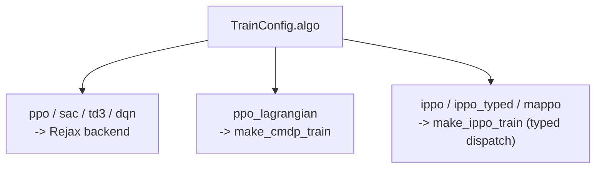
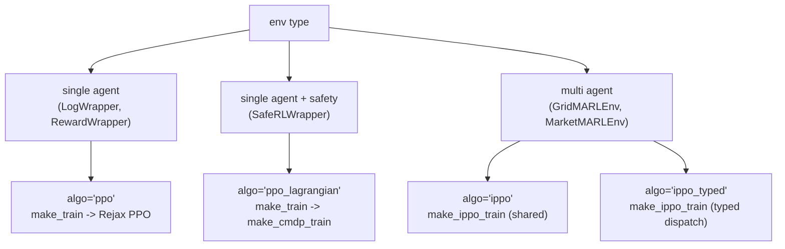

# Trainers

PowerZooJax provides four training entry points behind a single dispatcher, `make_train`. All four share the same `TrainConfig` dataclass, so switching algorithms is a one-field change.

For Power-side terms, see [Power systems primer](../concepts/power-systems-primer.md). RL terms (PPO, IPPO, CMDP, Lagrangian) get inline definitions below.

## `TrainConfig` — the unified configuration

```python
from powerzoojax.rl import TrainConfig

config = TrainConfig(
    algo="ppo",                   # ppo | sac | td3 | dqn | ppo_lagrangian | ippo | ippo_typed | mappo
    total_timesteps=200_000,
    num_envs=64,
    seed=42,
    learning_rate=3e-4,
    gamma=0.99,
    n_steps=128,                  # rollout length per update
    n_epochs=4,
    n_minibatches=4,
    clip_eps=0.2,
    ent_coef=0.01,
    vf_coef=0.5,
    gae_lambda=0.95,
    cost_thresholds=(),           # vector budgets for ppo_lagrangian; legacy cost_threshold still broadcasts
    lambda_lr=5e-3,
    hidden_dims=(64, 64),
    normalize_observations=False,
    normalize_rewards=False,
)
```

`TrainConfig` is frozen; use `config.replace(field=value)` to derive a variant. `load_config(path)` and `save_config(config, path)` round-trip YAML.

This is also the dataclass that `benchmarks/<task>/configs/train_*.yaml` decodes into. Hyperparameters that do not map to a given backend are silently ignored.

## `make_train` — the dispatcher

```python
from powerzoojax.rl import make_train

train_fn = make_train(env, config)
result = train_fn(jax.random.PRNGKey(42))
```

`train_fn` is the JIT-fused training program. Calling it returns a `TrainResult` namedtuple with the learned `params`, learning curves, and a short text `summary`.

Internally `make_train` dispatches on `config.algo`:



The dispatcher picks the backend based on the algo string and the wrapper type. Single-agent envs go through Rejax, or through CMDP for Lagrangian. MARL envs (`GridMARLEnv`, `DistGridMARLEnv`, `MarketMARLEnv`) go through IPPO.

!!! note "Why the routing is split this way"
    This is not an arbitrary backend split. It reflects three different training-facing env interfaces: single-agent MDP via `LogWrapper`, single-agent CMDP via `SafeRLWrapper`, and multi-agent dict-based MARL via `GridMARLEnv` / `DistGridMARLEnv` / `MarketMARLEnv`. The dispatcher therefore matches both the algorithm family and the wrapped env contract.

## Single-agent PPO via Rejax

For `algo in {"ppo", "sac", "td3", "dqn"}`, `make_train` builds a Rejax adapter and forwards `TrainConfig.to_rejax_kwargs()` to the underlying algorithm. Rejax provides a fused `algo.train()` JIT program with built-in eval callbacks.

This is the default path for `LogWrapper`-bound envs and for every preset ending in `-economic-dispatch` or `-soc-tracking`.

The adapter bridges a few API differences (Rejax expects a `gymnax`-style 4-arg `step`; PowerZooJax wrappers use 3-arg), so `LogWrapper(env, params)` works without modification.

## CMDP — `make_cmdp_train`

When `algo == "ppo_lagrangian"` and the env is a `SafeRLWrapper`, the dispatcher routes to `make_cmdp_train`. CMDP is short for constrained Markov decision process; PPO-Lagrangian solves the constrained problem by maintaining a learned non-negative dual vector `lambda` that penalizes expected cost above `cost_thresholds`.

At the objective level, the trainer solves

\[
\max_\pi \; J_R(\pi)
\quad \text{s.t.} \quad
J_{C,i}(\pi) \le d_i,\; i=1,\dots,k,
\]

where \(J_R\) is expected return, \(J_{C,i}\) is the expected cost of
constraint \(i\), and \(d_i\) is `cost_thresholds[i]`.

Inside PPO, this becomes an augmented advantage of the form

\[
A_{\mathrm{aug}} = A_R - \lambda^\top A_C,
\]

where \(A_R\) is the standard reward advantage and \(A_C\) is the vector of
per-constraint cost advantages. The actor therefore improves reward while
accounting for the current dual penalty on constraint violation.

The dual update is conceptually

\[
\lambda_i \leftarrow \max\!\left(0,\; \lambda_i + \eta_\lambda (\hat J_{C,i} - d_i)\right),
\]

where \(\eta_\lambda\) is `lambda_lr`. In the implementation, PowerZooJax
stores `log_lambda` and uses \(\lambda_i = \exp(\log \lambda_i)\) so
non-negativity is enforced by construction.

The implementation lives in `powerzoojax.rl.cmdp`:

- `SafeActorCritic` — actor + reward critic + vector cost critic.
- inner update: PPO clipped surrogate using the augmented advantage \(A_R - \lambda^\top A_C\).
- outer update: one dual update per constraint so `lambda` tracks the violation vector.

Key hyperparameters (in addition to the standard PPO ones):

- `cost_thresholds` — one frozen budget per selected constraint. Use explicit vector budgets for benchmark configs; hard physical constraints should normally use zero. The legacy scalar `cost_threshold` field still broadcasts for backward compatibility, so avoid it for multi-constraint tasks.
- `lambda_lr` — learning rate of the dual multipliers (scalar broadcast or one value per constraint).
- `cost_gamma` — discount factor for the cost critic (often kept at `1.0`).

CMDP is the path used by the `tso-scuc-safe`, `dso-nflex-safe`, and `dc-microgrid-safe` presets.

## MARL — `make_ippo_train` and `make_ippo_typed_train`

When the env is a MARL wrapper (`GridMARLEnv`, `DistGridMARLEnv`, `MarketMARLEnv`), the dispatcher routes to the IPPO backends:

- `algo == "ippo"` — independent PPO with full parameter sharing across agents.
- `algo == "ippo_typed"` — typed parameter sharing: agents are partitioned by name prefix (`battery_*`, `renewable_*`, `flexload_*`), and each type gets an independent `SharedActorCritic`.
- `algo == "mappo"` — centralized critic, decentralized actor (not implemented in this repo yet).

IPPO ("independent PPO") trains one PPO instance per agent, sharing parameters when the agents are interchangeable. MAPPO ("multi-agent PPO") shares a centralized critic.

The DERs benchmark uses `ippo_typed`. Its result tree is a dict keyed by type:

```python
result.params == {
    "battery": <SharedActorCritic params for the 4 battery agents>,
    "renewable": <... for the 4 PV agents>,
    "flexload": <... for the 4 flex-load agents>,
}
```

This is more expressive than full sharing (different physics → different policies) and cheaper than fully independent training (4 batteries share a battery actor).

## `make_ippo_act`

For evaluation, `make_ippo_act(env, params)` returns a deterministic per-agent action function backed by the trained actor parameters. Use it inside `eval.py` rollouts.

## Choosing a trainer



In all cases `make_train(env, config)` is the call you make — the diagram shows where it routes internally.

## A complete example

```python
import jax
from powerzoojax.case import load_case
from powerzoojax.envs.grid.trans import TransGridEnv, make_trans_params
from powerzoojax.rl import LogWrapper, TrainConfig, make_train

case = load_case("5")
env = TransGridEnv()
import jax.numpy as jnp
profiles = jnp.ones((48, case.n_loads), dtype=jnp.float32) * 0.5
params = make_trans_params(case, load_profiles=profiles, max_steps=48)
wrapped = LogWrapper(env, params)

config = TrainConfig(
    algo="ppo",
    total_timesteps=200_000,
    num_envs=32,
    n_steps=48,
    hidden_dims=(64, 64),
)

train_fn = make_train(wrapped, config)
result = train_fn(jax.random.PRNGKey(0))
print(result.summary)
```

For one-line entry points that pre-configure the env factory and `TrainConfig`, see [Presets](presets.md).
