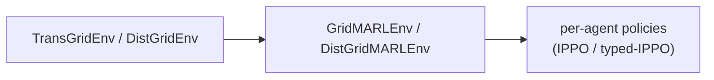
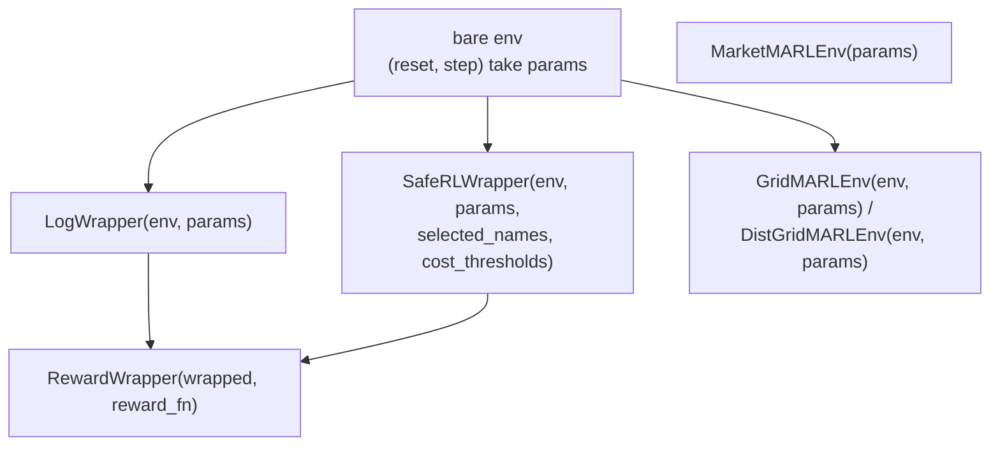

# Wrappers

Wrappers adapt a pure functional environment to different training-facing interfaces. They live in:

- `powerzoojax.rl.wrappers` for single-agent binders and CMDP adapters,
- `powerzoojax.rl.reward` for reward override / shaping wrappers,
- `powerzoojax.rl.multi_agent` and `powerzoojax.rl.market_marl` for MARL adapters.

This page is the practical reference for what each wrapper changes in the env contract. For the underlying physics envs, see the relevant [Physics](../physics/transmission.md), [Distribution](../physics/distribution.md), [Resources](../physics/resources.md), [Markets](../physics/markets.md), and [Microgrid](../physics/microgrid.md) pages.

## What every wrapper preserves

All PowerZooJax wrappers keep the core JAX contract from [Concepts -> JAX contract](../concepts/jax-contract.md):

- `reset` and `step` stay pure functions,
- state and params stay pytrees,
- PRNG keys stay explicit,
- wrappers remain compatible with `jit`, `vmap`, and `lax.scan`,
- wrappers do not change the underlying physics, only the training-facing interface.

## `LogWrapper` -> bind params and expose a 5-tuple step

```python
from powerzoojax.rl import LogWrapper

wrapped = LogWrapper(env, params)
obs, state = wrapped.reset(key)
obs, state, reward, done, info = wrapped.step(key, state, action)
```

What it does:

- binds `params`, so the wrapped object exposes `(reset, step)` without a `params` argument,
- converts the core CMDP env step
  `(obs, state, reward, costs, done, info)`
  into the PureJaxRL / Rejax-style 5-tuple
  `(obs, state, reward, done, info)`,
- tracks episode return and episode length on device,
- writes compatibility cost fields into `info`, including `constraint_costs`, `cost_sum`, and scalar alias `cost`.

One detail that matters when reading `info`: the episode logging keys
`returned_episode_returns`, `returned_episode_lengths`, and `returned_episode`
are present on every step. The boolean flag `returned_episode` tells you whether
the current step ended an episode.

## `SafeRLWrapper` -> expose selected CMDP costs as a first-class output

```python
from powerzoojax.rl import SafeRLWrapper

wrapped = SafeRLWrapper(
    env,
    params,
    selected_names=("thermal_overload",),
    cost_thresholds=(0.0,),
)
obs, state = wrapped.reset(key)
obs, state, reward, costs, done, info = wrapped.step(key, state, action)
```

`SafeRLWrapper` keeps `params` bound, but unlike `LogWrapper` it preserves a
CMDP-facing step output:

```text
(obs, state, reward, selected_costs, done, info)
```

Use it when the trainer needs direct access to the selected cost vector, such
as PPO-Lagrangian. Important details:

- `selected_names=` chooses a subset of the env's full constraint vector,
- `cost_thresholds=` provides one threshold per selected constraint,
- `info["constraint_costs_all"]` keeps the full env cost vector,
- `info["constraint_costs"]` is the selected vector actually returned to the trainer.

For hard physical constraints such as thermal overload, voltage violation,
reserve shortfall, over-temperature, or power deficit, use zero thresholds
unless the task explicitly defines a relaxed or chance-constrained benchmark.

This is the wrapper consumed by `make_cmdp_train`.

## `bind` -> convenience constructor

```python
from powerzoojax.rl import bind

wrapped = bind(env, params, safe=False)   # -> LogWrapper
wrapped = bind(
    env,
    params,
    safe=True,
    selected_names=("thermal_overload",),
    cost_thresholds=(0.0,),
)   # -> SafeRLWrapper
```

`bind` is just a convenience helper so examples and tests can request either
single-agent wrapper from one call.

## `RewardWrapper` -> replace the training reward of an existing wrapper

```python
from powerzoojax.rl import LogWrapper, RewardWrapper

def custom_reward_fn(obs, action, next_obs, reward, info):
    return -jnp.abs(next_obs[0] - 0.5)

wrapped = RewardWrapper(LogWrapper(env, params), reward_fn=custom_reward_fn)
```

`RewardWrapper` replaces the reward produced by an already wrapped training env.
It does not change the underlying physics or cost channels. Supported reward
function signatures are:

- `(obs, action, next_obs, reward, info)`
- `(obs, action, next_obs, reward, costs, info)`

In other words, `RewardWrapper` should sit outside `LogWrapper` or
`SafeRLWrapper`, not around a bare env.

## `GridMARLEnv` and `DistGridMARLEnv` -> JaxMARL-style dict interface

Multi-agent wrappers convert a single env into a dict-based MARL interface:

- `reset(key)` returns `(obs_dict, state)`,
- `step(key, state, action_dict)` returns
  `(obs_dict, state, rewards_dict, dones_dict, info)`,
- `dones_dict["__all__"]` is the global episode-done flag,
- observation and action dicts are keyed by agent name.

Typical agent names are:

- `GridMARLEnv`: `"unit_0"`, `"unit_1"`, `"battery_0"`, `"pv_0"`, `"flexload_0"`, ...
- `DistGridMARLEnv`: `"battery_0"`, `"battery_1"`, `"pv_0"`, `"flexload_0"`, ...



`DistGridMARLEnv` supports an `observation_mode` flag:

- `"global"`: every agent sees the full shared grid-core observation plus its own device slice,
- `"local"`: each agent gets a Dec-POMDP-style local observation built from its own bus, K-hop neighbours, global summary stats, time features, and own device state.

These wrappers are thin adapters. They do not duplicate physics and they do not
provide `LogWrapper`-style single-agent episode logging fields by themselves.

## `MarketMARLEnv` -> GenCos market adapter

`MarketMARLEnv` wraps the pure functional market core for the GenCos benchmark.
It exposes the same dict-style MARL contract as the grid MARL wrappers:

- `reset(key)` returns `(obs_dict, state)`,
- `step(key, state, action_dict)` returns
  `(obs_dict, state, rewards_dict, dones_dict, info)`.

Agents are named `genco_i`, one per generator company.

Internally the wrapper calls `market_marl_reset` and `market_marl_step`; it is
only responsible for splitting and packing per-agent observations and actions.

See [Physics -> Markets](../physics/markets.md#marketmarlenv-gencos-rolling-market) for the underlying market dynamics.

## Composition rules

- `RewardWrapper` should wrap `LogWrapper` or `SafeRLWrapper`, not a bare env.
- `SafeRLWrapper` should wrap a bare env. It is itself a param-binding wrapper.
- MARL wrappers wrap a bare env or pure market core with params fixed at construction time.

!!! warning "Wrapper stacking pitfalls"
    The following stacking orders are interface-incompatible and will break the `step` return shape:

    - Do **not** put `SafeRLWrapper` on top of `LogWrapper`. `LogWrapper` folds `costs` into `info`, so `SafeRLWrapper` cannot read `costs` afterwards. The correct order is `LogWrapper(SafeRLWrapper(env))`.
    - Do **not** put `LogWrapper` inside a MARL wrapper. MARL rewards / dones are vectorized; `LogWrapper` only handles scalars. MARL logging belongs in the trainer pipeline, not in `LogWrapper`.

## Stacking diagram



## Cross references

- [Trainers](trainers.md) for `make_train`, `make_cmdp_train`, `make_ippo_train`, and `make_ippo_typed_train`.
- [Presets](presets.md) for one-line entry points that pre-configure wrapper choice.
- [API -> RL](../api/rl.md) and [API -> RL MARL](../api/rl-marl.md).
