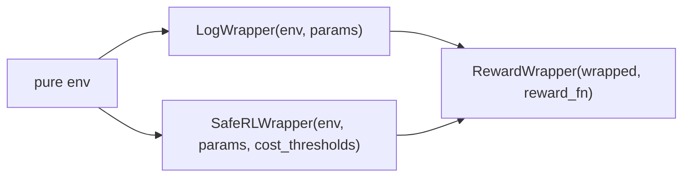

# RL —— wrapper 与单 agent trainer

!!! note "Python API 签名"
    本页只翻译概览、合约表与示例。完整的 mkdocstrings 自动生成签名（参数、字段、类型）由英文 API 渲染，见 [English API → RL — wrappers and single-agent trainers](../../en/api/rl.md)。

单 agent 训练适配器。多 agent wrapper 与 trainer 见 [API → RL MARL](rl-marl.md)。概念性概览见 [Training → Wrappers](../training/wrappers.md) 与 [Training → Trainers](../training/trainers.md)。

## Wrapper

```python
from powerzoojax.rl import (
    LogWrapper, LogEnvState,
    SafeRLWrapper, SafeRLState,
    RewardWrapper, RewardEnvState,
    bind,
)
```



### `LogWrapper`

绑定 `params`；追踪每集回报与长度；向 `info` 注入 `returned_episode_returns`、`returned_episode_lengths`、`returned_episode`。

### `SafeRLWrapper`

`step` 返回 6-元组：`(obs, state, reward, costs, done, info)`。CMDP trainer 使用。

### `bind`

便利构造器：`safe=False` 返回 `LogWrapper`，`safe=True` 返回 `SafeRLWrapper`。

### `RewardWrapper`

在已有 wrapper 之上叠加用户自定义 reward。未修改的 env reward 保留在 `info["env_reward"]`。

## 训练配置

```python
from powerzoojax.rl import TrainConfig, load_config, save_config
```

## Trainer

```python
from powerzoojax.rl import TrainResult, make_train, make_cmdp_train, train
```

`make_train(env, config)` 是 dispatcher。`algo in {ppo, sac, td3, dqn}` 走 Rejax；`algo == "ppo_lagrangian"` 走 `make_cmdp_train`；MARL env 走 IPPO backend。

## 一行式入口

```python
from powerzoojax.rl import train
result = train("dso-nflex", seed=0)
```

## Preset

```python
from powerzoojax.rl import list_presets, get_preset
```
