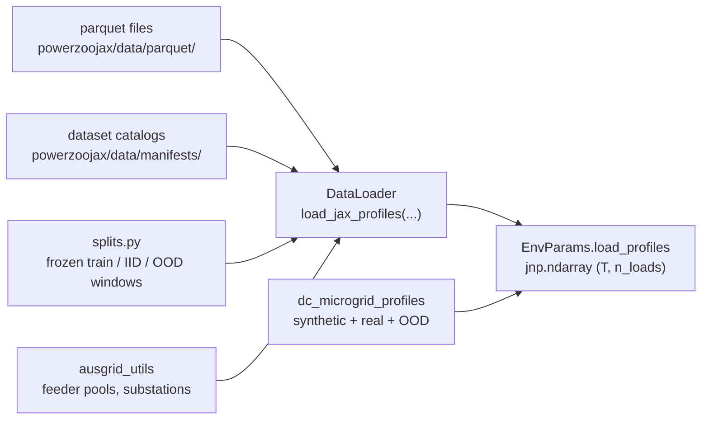
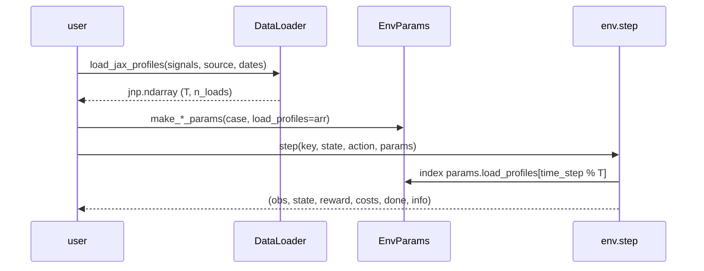

# Data pipeline

真实的 benchmark 难度依赖真实数据。PowerZooJax 保留一层轻量、边界清晰的数据层，把 parquet 文件转成存入 `EnvParams` 的 `jnp.ndarray` 曲线。这一层的任何内容都不会进入编译后的 rollout。

## 数据层在哪里



所有调用都只在 setup 阶段运行。编译后的 rollout 只看到 `EnvParams`，其中的 `jnp.ndarray` 曲线按 `time_step % T` 取索引。

## `DataLoader` —— 唯一的入口

`DataLoader` 是读原始数据集的唯一公开方式。外部代码不能直接访问 `parquet/`。这个 facade 有三层：

- JAX 层（用于 `EnvParams` 的首选）：`load_jax_profiles(signals, source, ...)` 返回 `(T, len(signals))` 形状、`float32` dtype 的 `jnp.ndarray`，可以直接传入 `params`。
- 语义层：`load_signals(...)` 返回以稳定信号名为列的 pandas `DataFrame`，适合检查与诊断。
- 原始列名层：`load_data(...)` 按原始 parquet 列名读表。需要直接指定列名或排查原始表时用；benchmark 任务构造 `EnvParams` 仍走上面的 `load_jax_profiles(...)` 与 parquet facade。

构造 env 参数时优先用 `load_jax_profiles(...)`，检查曲线用 `load_signals(...)`；只有需要原始列名映射时再使用 `load_data(...)`——它与上面两层同属一个 facade，不是另一条数据管线。

最小示例：

```python
from powerzoojax.data import DataLoader, signals as S

loader = DataLoader()
profiles = loader.load_jax_profiles(
    [S.LOAD_ACTUAL_MW, S.SOLAR_AVAILABLE_MW],
    source="gb",
    start_date="2025-04-01",
    end_date="2025-12-31",
    resample="30min",
)
print(profiles.shape, profiles.dtype)   # e.g. (13104, 2) float32
```

完整信号名列表见 [API → Data](../api/data.md)。

## 实际使用的数据集

四种真实数据源连接到 benchmark 任务：

- GB 用电与按燃料分类发电（`source="gb"`）—— 英国系统级用电与按燃料分的发电。TSO 与 GenCos 任务使用。
- GB MID 市场指数数据（`source="gb"`）—— 与 GB forecast/actual demand timeline 对齐的 APX / N2EX 中间价与成交量。Market Lite / price studies 使用。
- Ausgrid 配电（`source="ausgrid"`）—— 澳大利亚分区变电站负荷。DSO 任务使用。`ausgrid_utils` 暴露馈线池、变电站列表与划分窗口的 helper。
- Google data center 工作负载（`source="google"`）—— CPU 利用率轨迹，给 data-center 微电网任务用。

CI / 开发环境若没有 parquet 数据包，每个 benchmark 任务都有合成数据回退方案，合约依旧可以测试。合成曲线定义在：

- `tasks.tso.make_tso_net_load_profiles(...)` —— 正弦曲线需求 + 日内风光发电。
- `dc_microgrid_profiles.make_synthetic_*` —— 日内 CPU、太阳辐照、室外温度。

## 冻结的数据划分

`splits.py` 定义所有任务共用的 train / IID / OOD 窗口，保证跨论文比较的可复现性。例如：

| Split | 常量 | 时间窗 |
| --- | --- | --- |
| GB train | `GB_TRAIN_START`、`GB_TRAIN_END` | 2025-04-01 → 2025-12-31 |
| GB IID | `GB_IID_START`、`GB_IID_END` | 2026-01-01 → 2026-03-31 |
| Ausgrid train | `AUSGRID_TRAIN_START`、`AUSGRID_TRAIN_END` | FY24 训练窗 |
| Ausgrid IID | `AUSGRID_IID_START`、`AUSGRID_IID_END` | FY25 留出日 |
| Ausgrid 夏季 OOD | `AUSGRID_SUMMER_START`、`AUSGRID_SUMMER_END` | 12–2 月（澳洲夏季） |

`splits.gb_windows()` 与 `splits.ausgrid_windows()` 返回对应的 `(start, end, role)` tuple。用这些 helper 而不是写死日期字符串；它们才是 source of truth。

Ausgrid 池里，`ausgrid_utils.get_ausgrid_split(role)` 与 `get_feeder_substations(feeder, role)` 返回要加载的变电站列表。DSO 任务在 `make_dso_params_from_split(case, role=...)` 内部调用它们，按 role 构造对应的馈线形状曲线。

## 非平稳采样

`nonstationary.py` 提供非平稳 RL 评测的构件：

- `EpisodeConfig` 保存按 episode 的需求倍乘、drift 偏移与滚动窗长。
- `NonstationarySampler` 按设定分布每 episode 采样 drift 参数。
- `apply_drift(profile, drift)` 应用每步乘子，让一段长 parquet 池产生许多不同的 48 步 episode。

DSO 任务通过 `make_dso_params_nonstationary(...)` 调用这些 helper。

## 数据中心微电网曲线

`dc_microgrid_profiles.py` 专为 288 步微电网任务定制：

- `make_all_synthetic_profiles(n_steps, key)` 返回合成的 CPU / 太阳辐照 / 室外温度轨迹。
- `load_workload_profiles(source, n_steps, ...)` 在可用时加载真实 Google 轨迹（`source="google"`），否则回退到合成。
- `apply_ood_transform(params, scenario)` 把现有的 `DCMicrogridParams` 变换成 `benchmarks/dc_microgrid/` 用到的 OOD 场景。可用场景列在 `VALID_OOD_SCENARIOS` 中：`workload_swap`、`workload_shock`、`renewable_drought`、`cooling_stress`、`dg_derating`、`sla_tighten`。

微电网 env 循环读取曲线（`profile[t % T]`），所以同一份 loader 输出既能用于短测试，也能用于长 episode。

## 一段曲线如何抵达一次 step



这就是为什么 `EnvParams` 重、`EnvState` 轻：所有静态张量（负荷曲线、PTDF、BFS 拓扑、成本系数）都放进 `params`。只有每步会变的值（time index、SOC、队列等）放进 `state`。

下一页 [JAX 原生并行计算](gpu-pipeline.md) 展示这些 `state` 与 `params` 对象如何流经 `vmap` 与 `lax.scan`。
