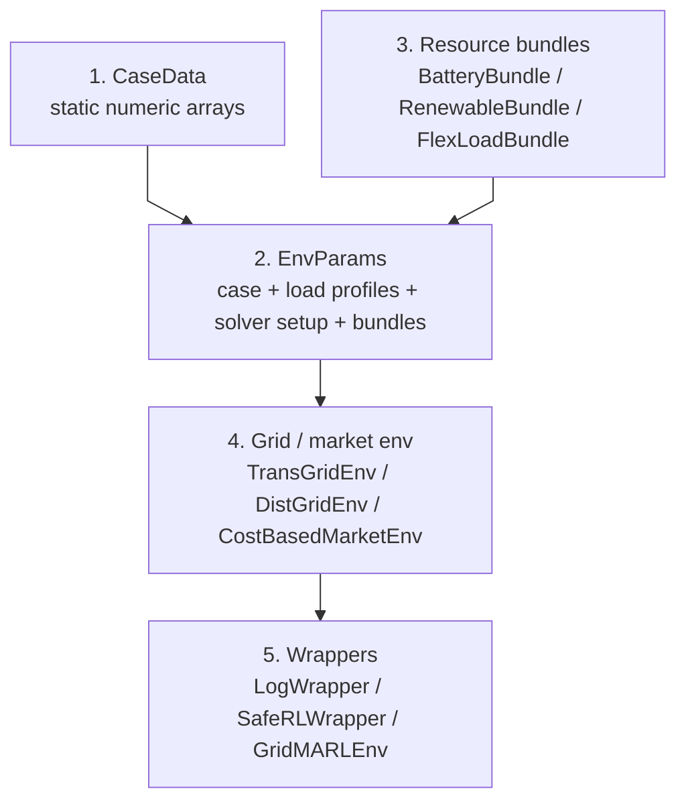
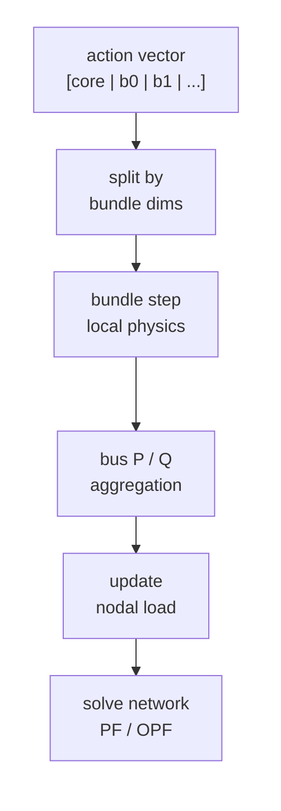
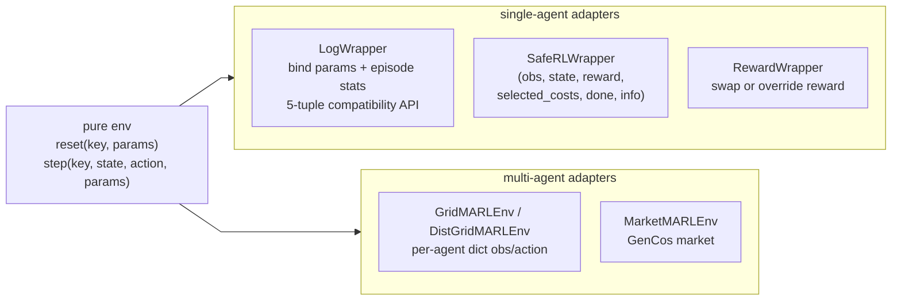

# Environment stack

PowerZooJax 里的环境不是单个 class。它是一组在运行期组合的纯函数。这一页描述分层方式以及层与层之间的合约，让你知道扩展点在哪里。

## 一次 rollout step 的五层



每一层只增加一种能力：

1. `CaseData` 是网络的静态数值描述。
2. `EnvParams` 把这份 case 与一段负荷曲线时间序列、预计算的求解器 setup，以及挂在特定 bus 上的 resource bundle 绑定起来。
3. Resource bundle 是设备级纯函数，在网络求解之前先 step；它们的注入会修改节点负荷。
4. Grid / market env 跑物理求解，并产生 `(reward, costs)`。
5. Wrapper 为某种训练接口重塑 API（单 agent 无约束、单 agent CMDP、多 agent dict）。

## Layer 1 —— `CaseData`

`CaseData` 是一个 `flax.struct.dataclass`，里面装着描述网络的 JAX 数组：导纳矩阵、发电成本、线路容量、电压上下限、（如有）三相负荷。它没有 Python `name` 字段；展示用元数据放在 case registry 的 `CaseMeta` 里。

setup 阶段一次性构造：

```python
from powerzoojax.case import load_case, list_cases

case = load_case("33bw")
print(case.n_nodes, case.n_lines, case.n_loads)
```

内置 ID 包括输电网（`5`、`14`、`118`、`300`、`1354pegase`、`2383wp`、`gb`）和配电网（`33bw`、`118zh`、`123`、`141`、`533mt_hi`、`533mt_lo`）。

## Layer 2 —— `EnvParams`

`EnvParams` 是按环境定义的。每个电网 env 都暴露一个工厂函数：

- `make_trans_params(case, load_profiles=..., max_steps=48, resources=(...), solver_mode=0, physics=0)`
- `make_dist_params(case, ..., resources=(...))`
- `make_dist_3phase_params(case, ..., resources=(...))`
- `make_cost_market_params(case, ...)`
- `make_uc_params(case, ...)` 用于 unit commitment
- `make_dcmicrogrid_params(...)` 用于 data-center 微电网

两个关键合约：

- `load_profiles` 形状为 `(T, n_loads)`，env 用 `time_step % T` 取索引。
- `resources` 是一组 resource bundle 的 tuple。这个 tuple 本身属于被 trace 的配置，长度在 trace 期固定。

## Layer 3 —— resource bundle {#layer-3-resource-bundles}

Bundle 用来把多台同类型设备挂到一个 grid 或 market env 上，而不把训练框架特定逻辑写入环境。Bundle 合约记录在 `powerzoojax/envs/resource/base.py`：

```python
class ResourceBundle:
    n_devices: int
    bus_idx: chex.Array          # (n_devices,) int32
    per_device_action_dim: int
    per_device_obs_dim: int
    action_dim: int
    obs_dim: int

    def reset(self, key) -> ResourceBundleState: ...
    def step(
        self, state, action, ctx
    ) -> tuple[ResourceBundleState, chex.Array, chex.Array, chex.Array, dict]: ...
    def observe(self, state, ctx) -> chex.Array: ...
```

`ResourceBundleState` 是一个抽象的文档占位名，不是所有 bundle 共用的同一个运行时 dataclass。真正的 bundle state 由各具体 bundle 自己定义，例如 `BatteryBundleState`、`RenewableBundleState`、`FlexLoadBundleState`。

公开的 bundle 实现：

- `BatteryBundle` —— 多设备储能，可选无功控制（PQ-circle）。
- `RenewableBundle` —— 多设备 PV / 风电，可选 curtailment 与无功控制。
- `FlexLoadBundle` —— 多设备需求响应，含 curtail 与 shift 动作。

Bundle 动作是扁平的一维切片，按 device-major 排布：

```python
# BatteryBundle，仅 P 控制
[p_0, p_1, ..., p_{N-1}]

# BatteryBundle，开启 P+Q 控制
[p_0, q_0, p_1, q_1, ..., p_{N-1}, q_{N-1}]
```

`action_dim = n_devices * per_device_action_dim`，因此 grid env 可以先按 bundle 切分完整动作向量，再把各自的扁平 action 片段传给对应 bundle。

电网 env 内部，每步流程是：



`CostBasedMarketEnv` 与 `BidBasedMarketEnv` 用同一套模式。Bundle 上报的 cost 会作为父 env `costs` 向量中的命名分量暴露出来，并同步写进 `info` 做诊断。

## Layer 4 —— grid 和 market 环境

这些是 `Environment` 子类。它们是无状态的——只有方法，没有运行时状态。运行时状态放在 `EnvState` 里（或它的子类：`TransGridState`、`UCState`、`DistGridState`、`DistGrid3PhState`、`CostMarketState`、`BidMarketState`、`DCMicrogridState`、…）。

每个 env 都满足的合约：

```python
obs, state = env.reset(key, params)
obs, state, reward, costs, done, info = env.step(key, state, action, params)
obs, state, reward, costs, done, info = env.step_auto_reset(key, state, action, params)
space = env.observation_space(params)
space = env.action_space(params)
```

`step` 已经内置 auto-reset。`step_auto_reset` 在返回的 obs 与 state 上加 `stop_gradient`。这些实现遵守的规则见 [JAX + RL 环境实现规范](../concepts/jax-contract.md)。

## Layer 5 —— wrapper

Wrapper 是同一个 env 服务三种训练接口的方式：



- `LogWrapper(env, params)` 绑定 `params`，让包装后的对象暴露 `.reset(key)` 与 `.step(key, state, action)`。它把 core env 投影成兼容库常见的 5-元组接口，同时把 `constraint_costs` 与 `cost_sum` 放在 `info` 里。
- `SafeRLWrapper(env, params, selected_names=..., cost_thresholds=...)` 让 `step` 返回 6-元组，CMDP trainer 可以直接读取选中的 cost 向量。
- `RewardWrapper(env, params, reward_fn=...)` 在不动 env 的前提下替换 reward。原始 env reward 保留在 `info["env_reward"]` 中。
- `GridMARLEnv` 与 `DistGridMARLEnv` 在 `TransGridEnv` 和 `DistGridEnv` 上产出按 agent 切分的 dict。发电机 agent 命名为 `unit_i`；bundle 设备按资源类型命名（`battery_0`、`pv_0`、`flexload_0`、…）。
- `MarketMARLEnv` 包装 GenCos 市场核心；agent 命名为 `agent_i`。

这些 wrapper 是唯一允许出现训练框架相关逻辑的地方。完整 API 见 [Wrappers](../training/wrappers.md)。

## 端到端组合示例

一个典型的 "DSO + 6 个 FlexLoad 设备 + 单 agent PPO" 训练用到了所有层：

```python
from powerzoojax.case import load_case
from powerzoojax.tasks.dso import make_dso_flexload_bundle, make_dso_params
from powerzoojax.envs.grid.dist import DistGridEnv
from powerzoojax.rl import LogWrapper

case = load_case("33bw")                       # layer 1
bundle = make_dso_flexload_bundle(case)        # layer 3 (bundle factory)
params = make_dso_params(case, resources=(bundle,))  # layer 2
env = DistGridEnv()                            # layer 4
wrapped = LogWrapper(env, params)              # layer 5
```

`wrapped.reset(key)` 与 `wrapped.step(key, state, action)` 这时已经可以接到任意 PureJaxRL 风格 trainer 上。下一页 [Data pipeline](data-pipeline.md) 展示真实负荷曲线如何加载进 `params`。
