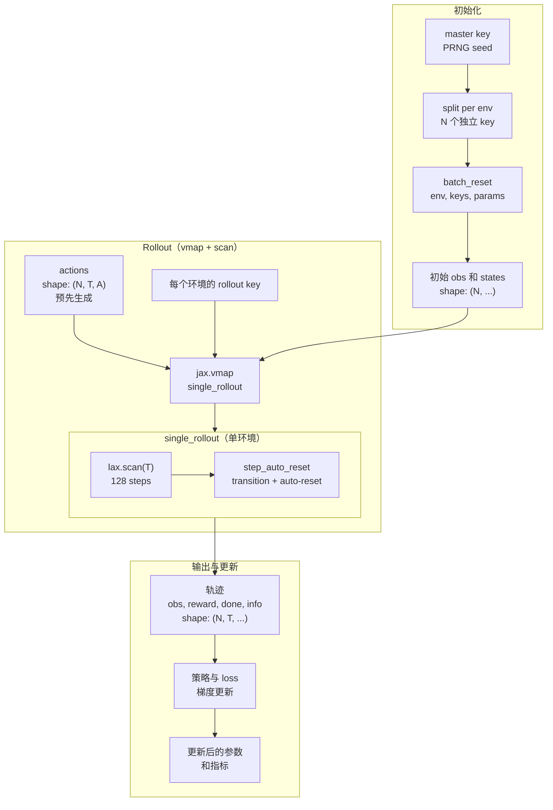

# JAX 原生并行计算

PowerZooJax 采用 JAX 原生设计，利用 `vmap`（向量化）和 `lax.scan`（定长循环）将环境采样、策略前向和梯度更新实现为纯函数。这种架构可以高效编译到加速设备上。本页介绍支撑这一点的三个关键构件，以及 `powerzoojax.utils.jax_utils` 中的辅助函数。

## 三个基础构件

### 1. `step` 内置 auto-reset

每个 PowerZooJax `step` 在末尾都会执行 auto-reset。 当 `done=True` 时，返回的 `state` 已经是下一条 episode 的全新初始 state。当前这一步 transition 仍然会报告 `done=True`，这样 wrapper 还能记录 episode 统计；但 rollout 循环本身不需要跳出并手动处理 episode 边界。

### 2. `step_auto_reset`

`step_auto_reset(key, state, action, params)` 可以看作是在 `step` 的基础上，再对返回的 observation 和 state 应用 `jax.lax.stop_gradient`。在 `lax.scan` 中使用它是一种防御性保护：当前采样阶段本来不追踪梯度，但如果后续代码改动引入了梯度路径，`stop_gradient` 会自动阻止梯度跨越 episode 边界传播。这符合 model-free RL 的核心原则：episode 之间彼此独立，梯度不应跨越边界传播。

### 3. `vmap` + `scan`

- `jax.vmap` 用来在多个环境上并行执行同一个函数。
- `jax.lax.scan` 用来在 device 上执行定长时间循环。

两者结合后，就能把典型的 `for env in envs: for t in range(T): ...` Python 循环替换成一个单独编译的程序。

## Rollout 数据流



**参数说明**：

| 符号 | 含义 | 典型值 |
|------|------|--------|
| **N** | 并行环境数 | 与任务相关（DSO `128`、TSO `256`、DERs `128`、DCMG `64`、GenCos `256`，见论文 Table 1） |
| **T** | rollout 长度 | 与任务相关（TSO/DSO/DERs/GenCos 为 `48`，DCMG 为 `288`） |
| **A** | action 维度 | 视任务而定 |

**关键点**：整条数据流都可以在单个 JIT 编译程序中执行。

## 辅助函数

`powerzoojax.utils.jax_utils` 暴露了常用的辅助函数：

```python
from powerzoojax.utils.jax_utils import (
    split_key_for_envs,
    batch_reset,
    batch_step,
    scan_rollout,
)
```

### 并行 reset

```python
keys = jax.random.split(jax.random.PRNGKey(0), n_envs)
obs, states = batch_reset(env, keys, params)
```

`batch_reset` 等价于 `jax.vmap(env.reset, in_axes=(0, None))`，因此 `params` 会被广播，而 `keys` 是 batch 轴。

### 并行 step（带 auto-reset）

```python
step_keys = jax.random.split(jax.random.PRNGKey(1), n_envs)
obs, states, rewards, costs, dones, infos = batch_step(
    env, step_keys, states, actions, params
)
```

`batch_step` 底层使用的是 `step_auto_reset`，因此已经 done 的环境会被透明地自动重置。

### 定长 rollout（`scan`）

```python
final_state, obs_traj, reward_traj, cost_traj, done_traj, info_traj = scan_rollout(
    env, key, init_state, params, actions
)
```

`actions` 的形状是 `(T, *action_shape)`。输出轨迹会沿同一个 `T` 轴堆叠。`scan_rollout` 会在 scan 开始前把 master key 拆成 `T` 个逐步 key，所以这个函数本身仍然只需要一个输入 key。

## 一个完整模式

```python
import jax
import jax.numpy as jnp

from powerzoojax.case import load_case
from powerzoojax.envs import TransGridEnv, make_trans_params
from powerzoojax.utils.jax_utils import batch_reset, scan_rollout

case = load_case("5")
env = TransGridEnv()
params = make_trans_params(case, max_steps=48)

@jax.jit
def collect(key):
    n_envs = 64
    horizon = 48

    key, k_reset, k_actions, k_roll = jax.random.split(key, 4)

    env_keys = jax.random.split(k_reset, n_envs)
    obs0, states0 = batch_reset(env, env_keys, params)

    actions = jax.random.uniform(
        k_actions,
        (n_envs, horizon, case.n_units),
        minval=-1.0,
        maxval=1.0,
    )

    rollout_keys = jax.random.split(k_roll, n_envs)

    def single_rollout(state, key, action_seq):
        return scan_rollout(env, key, state, params, action_seq)

    final_states, obs_traj, reward_traj, cost_traj, done_traj, info_traj = jax.vmap(
        single_rollout
    )(states0, rollout_keys, actions)

    return reward_traj
```

`collect` 在第一次调用完成编译后，内部就是一个单独的 XLA 程序。Hot path 中不再有任何 Python 循环。

## Wrapper 保留合约

`LogWrapper`、`SafeRLWrapper`、`RewardWrapper`、`GridMARLEnv` 和 `MarketMARLEnv` 都保留了 `jit` / `vmap` / `scan` 兼容性：它们的 state 类都是 pytree，`reset` 和 `step` 也都是纯函数。你可以把任意一个 wrapper 套在内层环境上，依然继续使用 `batch_reset` 和 `scan_rollout`。

MARL wrapper 会对这个合约做一点扩展：

- `reset(key, params)` 返回 `(obs_dict, state)`。
- `step(key, state, action_dict, params)` 返回 `(obs_dict, state, reward, done, info)`。
- state 仍然会在 `step_auto_reset` 内部经过 `jax.lax.stop_gradient`。

## 实用提示

- 始终使用定长 rollout。变长 episode 由 fixed window 内的 auto-reset 来处理。
- 保持 action 和 state 的形状静态不变。带可选 bundle 的环境会针对 bundle 开或关的不同 `EnvParams` 分别生成独立 trace。
- `lax.scan` 作用于 batched env 的兼容性由 `tests/grid/test_gpu_pipeline.py` 和 `tests/resource/test_gpu_pipeline.py` 覆盖；新环境必须保持这些测试继续通过。
- 对重复训练调用，应该把 `train` 的 JIT 闭包只构造一次，并复用同一个 `env`、`params` 和 policy 结构。每次都重新编译会抵消整个 pipeline 的意义。

这是 architecture 层的最后一页。下一层 [Physics](../physics/transmission.md) 会解释每个环境在 `step` 内部实际做了什么。
