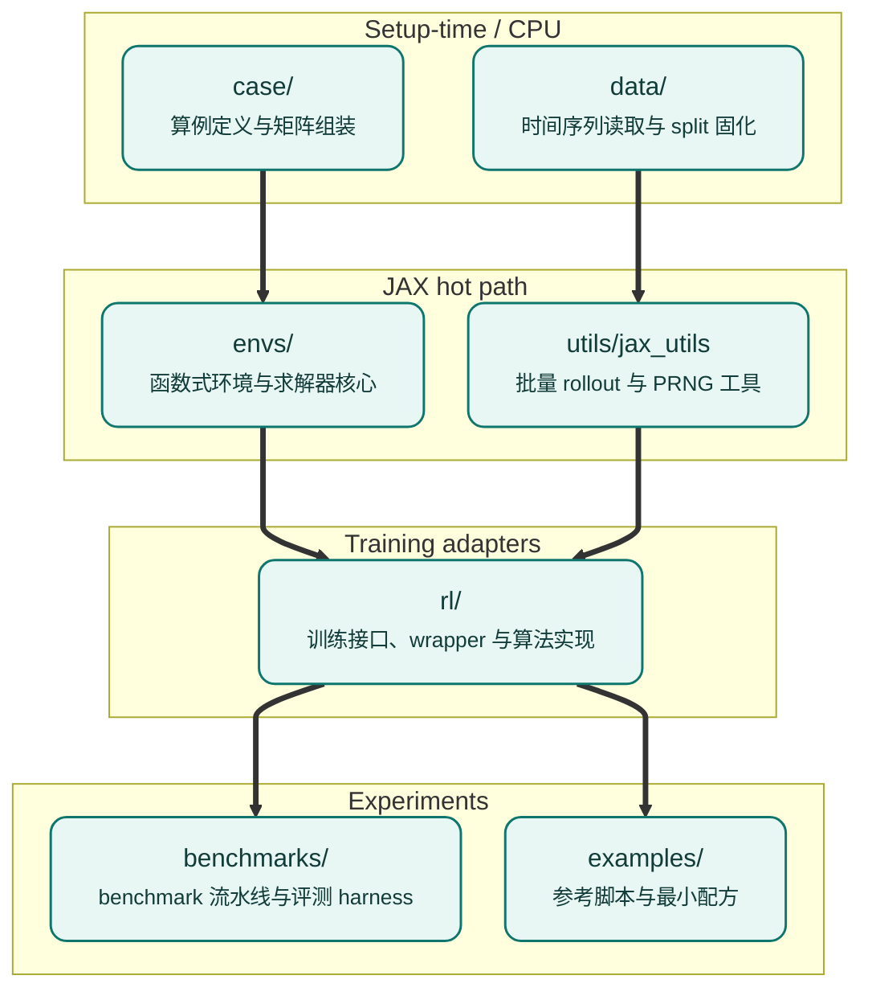

# Repository map

这一页是源码树的地图。第一次接触 PowerZooJax 时读一遍；之后你应该能预测任何功能位于何处。

## 顶层结构

```text
PowerZooJax/
|-- powerzoojax/         <- the package itself
|   |-- case/            <- network data and matrix builders (CPU setup)
|   |-- data/            <- parquet / time-series loading (CPU setup)
|   |-- envs/            <- pure JAX environments (the hot path)
|   |   |-- grid/        <- transmission and distribution envs + solvers
|   |   |-- resource/    <- battery, renewable, EV, flex load, data center
|   |   |-- market/      <- DC market, SCED solver, GenCos market MARL core
|   |   |-- microgrid/   <- composite behind-the-meter microgrid envs
|   |   |-- base.py      <- Environment abstract class, EnvState, EnvParams
|   |   `-- spaces.py    <- Box, Discrete, MultiDiscrete, MultiBinary
|   |-- rl/              <- RL training adapters (wrappers + trainers)
|   |-- tasks/           <- benchmark task recipes, metrics, and baselines
|   |-- utils/           <- jax_utils (batch_reset, scan_rollout, ...)
|   |-- __init__.py      <- top-level lazy exports
|   `-- __main__.py      <- python -m powerzoojax CLI entry
|-- benchmarks/          <- the 5 paper task pipelines
|-- examples/            <- runnable scripts (single-file recipes)
|-- tests/               <- pytest suite (L0 contract + L1 physics + L2 equivalence)
|-- docs/en/             <- this documentation
|-- pyproject.toml       <- 依赖声明文件
`-- mkdocs.yml           <- documentation build config
```

## 各顶层模块的职责



箭头方向 = import 方向：`envs/` 可以 import `case/` 和 `utils/`；`rl/` 可以 import `envs/`；`benchmarks/` 可以 import 任意层。反过来禁止；这样物理层即使脱离训练框架也能独立使用。

## `powerzoojax/case/`

静态网络数据，setup 阶段一次性转成 JAX 数组，运行时不再变。

| 文件 | 作用 |
| --- | --- |
| `case_data.py` | `CaseData` pytree（导纳、发电成本、线路容量等） |
| `case_builder.py` | 工厂 `build_case_from_tables(...)` 以及各 case 的 `create_caseN()` 构建器，由 `load_case` 调用 |
| `__init__.py` | 公开入口 `load_case("5")`、`load_case("33bw")` … |
| `_registry.py` | `list_cases`、`get_meta`、`CaseMeta` |
| `case_matrices.py` | PTDF、邻接、Laplacian 构造 |
| `case_adapter.py` | PowerZoo dataframe → `CaseData` 转换 |
| `case_info.py` | 友好的检查打印（仅 CPU） |
| `case_plotter.py` | matplotlib 拓扑绘图（仅 CPU） |
| `cases/`、`raw_cases/` | 内置网络定义 |

`CaseData` 故意只装数值。展示用的名字放在 `CaseMeta` 里，因此不会出现在 JIT trace 中（见 [JAX + RL 环境实现规范](../concepts/jax-contract.md) 里的术语表对 `trace` 的说明）。

## `powerzoojax/data/`

setup 阶段读取真实时间序列的统一入口：GB 用电、Ausgrid 配电馈线，以及 Google data center 轨迹。

| 文件 | 作用 |
| --- | --- |
| `data_loader.py` | `DataLoader.load_jax_profiles(...)` |
| `signals.py` | 稳定的信号名常量（`LOAD_ACTUAL_MW`、…） |
| `manifest.py`、`registry.py` | 数据集目录与注册 |
| `splits.py` | 冻结的 train / IID / OOD 时间窗 |
| `ausgrid_utils.py` | Ausgrid 馈线池与变电站选择 |
| `nonstationary.py` | 非平稳 RL 的 drift 采样 |
| `dc_microgrid_profiles.py` | 微电网合成与真实曲线加载 + OOD 变换 |

`data/` 中没有任何内容进入编译后的 rollout。它只返回 `jnp.ndarray`，这些数组随后存入 `EnvParams`。

## `powerzoojax/envs/`

整个项目的核心，全部纯 JAX，兼容 JIT 与 vmap。跨模块组合规则见 [Environment stack](env-stack.md)。

`envs/grid/`：

| 文件 | 作用 |
| --- | --- |
| `base.py` | 共享的 `GridState`、`GridParams` |
| `power_flow.py` | DC power flow、安全检查、发电成本积分器 |
| `ac_power_flow.py` | Newton-Raphson AC PF 求解器 |
| `bfs_power_flow.py` | 平衡辐射状 BFS 求解器 |
| `bfs_3phase_power_flow.py` | 三相辐射状 BFS 求解器 |
| `dc_opf.py` | 线性 DC OPF 求解器 |
| `ac_opf.py` | 增广拉格朗日 AC OPF 求解器 |
| `trans.py` | `TransGridEnv`（5 种模式：DC PF / AC PF / DCOPF / DCOPF+AC / ACOPF） |
| `dist.py` | `DistGridEnv`（平衡辐射状） |
| `dist_3phase.py` | `DistGrid3PhaseEnv`（不平衡三相） |
| `unit_commitment.py` | `UnitCommitmentEnv`（SCUC 动力学——物理层） |

`envs/resource/`：

| 文件 | 作用 |
| --- | --- |
| `base.py` | `ResourceState`、`ResourceParams`、`ResourceBundle` 协议 |
| `battery.py` | `BatteryEnv` + `BatteryBundle` |
| `renewable.py` | `RenewableEnv` + `SolarEnv` + `WindEnv` + `RenewableBundle` |
| `vehicle.py` | `VehicleEnv` |
| `flexload.py` | `FlexLoadEnv` + `FlexLoadBundle` |
| `datacenter.py` | `DataCenterEnv`（IT + 冷却 + 热模型） |
| `diesel.py` | `DieselParams` + `DieselBundle`（柴油机 SoA bundle） |

`envs/microgrid/`（合成 1-bus 行为后表 env，按 `ResourceBundle` 协议组合资源）：

| 文件 | 作用 |
| --- | --- |
| `dc_microgrid.py` | `DataCenterMicrogridEnv`（DataCenter + BatteryBundle + RenewableBundle + DieselBundle） |

`envs/market/`：

| 文件 | 作用 |
| --- | --- |
| `base.py` | `MarketState`、`MarketParams` |
| `cost_based_market.py` | `CostBasedMarketEnv`（DCOPF 出清） |
| `bid_based_market.py` | `BidBasedMarketEnv`（近似 / 启发式分段 ED） |
| `clearing.py` | 分段 ED helper（分段构造、KKT 风格 LMP 反推） |
| `offer_sced.py` | 用 PD-IPM 实现的精确 bid-based SCED |
| `market_marl_core.py` | GenCos 滚动市场核心（按机组算利润、ramp 耦合） |
| `lmp_market.py` | `CostBasedMarketEnv` 的并列导入路径与符号名 |

## `powerzoojax/tasks/`

任务配方层——每个论文级 benchmark 任务一个文件。包含工厂函数、数据 split 工具、**非学习式** baseline 和 `compute_*_metrics`。物理动力学保留在 `envs/`。

| 文件 | 任务 |
| --- | --- |
| `dso.py` | DSO — DistGrid + FlexLoad case33bw 工厂 + baseline |
| `tso.py` | TSO — SCUC case118 UCParams 工厂 + 参照基线（非学习） |
| `ders.py` | DERs — case141 12-agent 异构资源工厂 |
| `gencos.py` | GenCos — case5 MARL 市场 GB-profile 工厂 + 指标 |
| `dc_microgrid.py` | DC Microgrid — 数据中心微电网配方 + 指标 |

## `powerzoojax/utils/`

| 文件 | 作用 |
| --- | --- |
| `jax_utils.py` | `batch_reset`、`batch_step`、`scan_rollout`、`split_key_for_envs` |
| `typing.py` | 公共类型别名 |

这些 helper 是训练循环真正调用的。详见 [JAX 原生并行计算](gpu-pipeline.md)。

## `powerzoojax/rl/`

纯物理层和训练代码之间的适配器。这里的任何内容都不能反向流回 `envs/`。

| 文件 | 作用 |
| --- | --- |
| `wrappers.py` | `LogWrapper`、`SafeRLWrapper`、`bind` |
| `reward.py` | `RewardWrapper`，用于注入自定义 reward |
| `multi_agent.py` | `GridMARLEnv`、`DistGridMARLEnv`、`MultiAgentEnvironment` |
| `market_marl.py` | `MarketMARLEnv`（GenCos 任务适配器） |
| `config.py` | `TrainConfig` dataclass（frozen） |
| `trainer.py` | `make_train` 分发器（PPO / IPPO / typed-IPPO / Lagrangian） |
| `cmdp.py` | PPO-Lagrangian 实现 |
| `ippo.py` | Independent PPO 实现（参数共享与 typed） |
| `presets.py` | 一行 preset 字典（`battery-soc-tracking`、`tso-uc`、…） |
| `train.py` | `train(preset_name, ...)` 入口 |

## `benchmarks/`

5 个论文实验流水线。每个任务有自己的 `configs/`、`run.py`、`train.py`、`eval.py`、`baselines.py`、`summarize.py`、`plots.py`、`results/`。详见 [Benchmarks overview](../benchmarks/overview.md)。

## 未包含的内容

- 没有通用 OPF 库。OPF 求解器面向 benchmark 保真度，而不是公用级 dispatch。
- 没有生产级市场平台。`Market Lite` 覆盖 cost-based 出清、**简单规则化报价**、精确 PD-IPM SCED 与竞争性报价 MARL 核心，但不覆盖含偶然事故约束、跨周期协同优化的市场。
- 没有内置的 Gym / Gymnax wrapper 层。PowerZooJax 自带最小的 `Environment` 基类；如需库级适配器，放在 `rl/`。

下一页 [Environment stack](env-stack.md) 展示上面这些模块在运行期如何组合起来。
