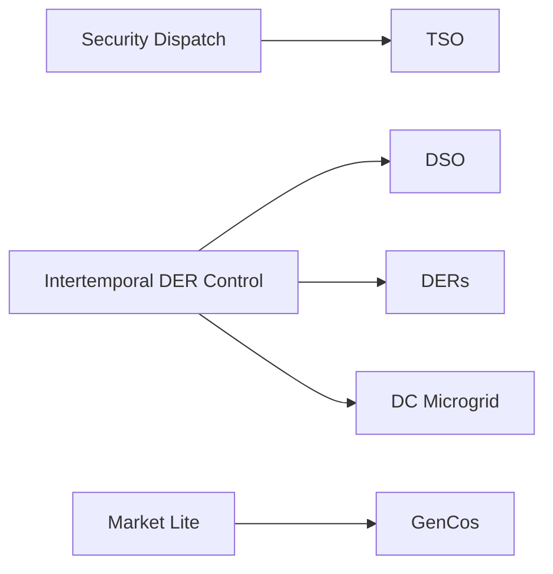
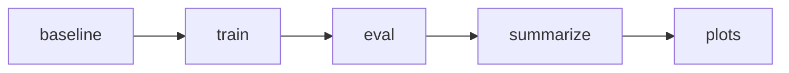

# Benchmarks 总览

benchmark 层汇集了 PowerZooJax 面向论文的正式实验。env、wrapper、task、trainer 和结果脚本，最终都是围绕这一层组织的。

本页给出顶层地图：五个任务、统一工作流、结果 schema，以及 backend/device 对比约定。像 `NormScore`、`IQM`、`primary split`、`primary metric`、`convergence target`、`leaderboard quantity` 这类 benchmark 术语，可见 [Benchmark workflow glossary](../glossary.md)。

如果你在 benchmark 页面里看到 `campaign` 这个词，它指的是“当前这一轮 benchmark 运行”。具体定义见 [Benchmark workflow glossary](../glossary.md#campaign)。

## 初次上手

如果你第一次接触 PowerZooJax，最容易上手的通常是 [DSO](dso.md)：它是单智能体任务，物理含义直观，而且 `run.py` 工作流最短。一个最小可运行链路是：

```bash
python benchmarks/dso/run.py baseline --seeds 0
python benchmarks/dso/run.py train --algo ppo --seed 0
python benchmarks/dso/run.py eval --run-id <run_id> --split iid
python benchmarks/dso/run.py summarize
```

第一次跑通后，最建议先看 `benchmarks/dso/results/summary/latest.json`。对入门者来说，最简单的成功信号是：整条链路能从 baseline 跑到 summarize，生成 run record 和 summary，并且输出像 `total_loss_mwh`、`voltage_violation`、`NormScore` 这样物理上说得通的 DSO 指标。

如果你想按兴趣更快选入口，可以直接看这张表：

| 如果你想先看…… | 建议先读 |
| --- | --- |
| 单智能体配电控制 | [DSO](dso.md) |
| 带显式 CMDP 语义的 safe RL | [TSO](tso.md) |
| cooperative 的电网 MARL | [DERs](ders.md) |
| competitive MARL / 市场竞价 | [GenCos](gencos.md) |
| 多目标微电网控制 | [DC Microgrid](dc-microgrid.md) |

## 五个任务

| 任务 | 主线 | Case | Agents | Steps | RL 范式 |
| --- | --- | --- | --- | --- | --- |
| [TSO](tso.md) | Security dispatch | `case118` | 1 | 48 x 30 min | SCUC 上的 safe RL |
| [DSO](dso.md) | Intertemporal DER control | `case33bw` | 1 | 48 x 30 min | 单智能体需求响应 |
| [DERs](ders.md) | Intertemporal DER control | `case141` | 12 | 48 x 30 min | cooperative MARL |
| [DC Microgrid](dc-microgrid.md) | Intertemporal DER control | self-contained | 1 | 288 x 5 min | 多目标鲁棒 RL |
| [GenCos](gencos.md) | Market Lite | `case5` | 5 | 48 x 30 min | competitive MARL |

截至 2026-04-25 的当前 evidence snapshot：

- TSO 已有完整 5-seed evidence，但严格零违反 safety gate 是 negative。
- DSO 已有完整 5-seed evidence；正式评估 split 只有 `iid`。
- DERs 使用 `case141`；Phase 1 有完整 5-seed evidence，mandatory seed-0 backend/device matrix 已完成。
- GenCos 的 Phase-2 Python 行使用 frozen self-play IL，不是 random-opponent baseline。
- DC Microgrid 已完成 Phase-2 backend evidence 与 execution-scaling artifacts；严格 exact-zero `feasibility_rate` 有 numerical-tail caveat。

下面这些术语会在各任务页反复出现：

- `OOD split`：与训练分布不同的 out-of-distribution 评估设置。
- `reward shaping`：底层物理不变，但训练 reward 里加入固定惩罚或奖励。
- `CMDP`：constrained Markov decision process，reward 与 cost 分通道报告。
- `NormScore`：基于固定非学习 baselines 的任务归一化诊断分数。主表默认按各任务 raw primary metric 排名，只有 `norm_score_status=ok` 时才用 NormScore 比较。

这五个任务是有意做成异构的。目标不是让某一个算法通吃所有任务，而是在统一报告口径下，分别考察物理约束、不确定性、时序耦合和多智能体交互。

## 实际训练对象

这里专门解决一个最常见的阅读障碍：物理 env、benchmark task 和正式训练路径彼此相关，但并不是同一层。

| 任务 | 智能体设置 | benchmark 任务类型 | 当前正式训练路径 | 主要 leaderboard quantity | 主要安全 / 审计门槛 |
| --- | --- | --- | --- | --- | --- |
| TSO | 单智能体 | SCUC 调度 MDP / CMDP | PPO 或 PPO-Lagrangian | `total_operating_cost` | 零热过载、零备用不足 |
| DSO | 单智能体 | 需求响应 MDP / CMDP | PPO、SAC、Sauté PPO 或 PPO-Lagrangian | 解释上看 `total_loss_mwh`；当前收敛目标是 `total_reward` | 零电压违反率 |
| DERs | 12 智能体 MARL | cooperative 约束任务 | reward-shaped IPPO / IPPO-safe / IPPO-Lagrangian | `mean_p_loss_mw` | 零电压违反目标 |
| DC Microgrid | 单智能体 | 多目标约束任务 | reward-shaped PPO / SAC | `episode_reward` | SLA / 温度 / 缺电 cost 会被审计 |
| GenCos | 5 智能体 MARL | competitive Markov game | IPPO | `total_profit` | 通过 `market_HHI` 做市场集中度审计 |

还有一个容易混淆的命名细节：`NormScore` 是 benchmark 概念，而 `norm_score` 往往是结果记录里写出的 metric key。



## Benchmark 工作流

每个任务页都采用同一套读者视角结构：

1. 任务定义与定版设置
2. baselines
3. 训练算法
4. eval splits
5. metrics
6. quick-start 命令
7. 输出 artifacts

如果任务依赖真实数据，那么正式 benchmark run 在缺数据时必须直接失败，不能静默退回 synthetic data。开发用 preset 可以保留给本地检查，但它们不是 benchmark records。

正式工作流分为两个阶段：

这里的 Phase 1 和 Phase 2 都是针对当前 [campaign](../glossary.md#campaign) 来说的，而不是把旧历史记录也算进来。

- Phase 1：先在 canonical `jax_rejax + GPU` 主路径上从头重跑 benchmark。只有 `seed=0` 链路通过最初的 readiness 检查后，multi-seed 才算正式。
- Phase 2：在完全相同的定版任务设置上做 backend/device 对比。具体 cell 由任务决定；当前 paper-facing 矩阵使用 `jax_rejax + gpu` / `jax_rejax + cpu`，以及按任务配置的 Python backend 行，例如 `sb3 + cuda`、`sb3 + cpu` 和正式纳入矩阵的 `sbx + cuda`。

## 统一结果 schema

每个 `baseline`、`train`、`eval` 命令都会写出统一格式的结果记录，至少包含：

- task
- algorithm
- backend / device
- seed
- split
- scalar metrics
- artifact 路径

因为五个任务共用同一 schema，所以 summary 表和 plots 可以直接从 task manifests 重建，而不需要每个任务单独写解析器。

## 跨任务统计

跨 seed 汇总默认使用鲁棒统计量，例如 `IQM`（interquartile mean）和任务归一化的 `NormScore`。

不同任务的归一化锚点并不完全相同：

- TSO 和 DSO 是相对物理上可解释的非学习 dispatch/control baselines 做归一化。
- DERs 相对 `no_control` 与更强的 `volt_droop` 规则做归一化。
- DC Microgrid 当前以 `episode_reward` 为归一化基准，因为当前定版的 convergence target 也是 reward-based。
- GenCos 则在 `total_profit` 上，相对固定 bidding baselines 做归一化。

这样既保留了各任务的物理可解释性，也能支持统一的跨任务总图。

## 硬件约定

硬件约定固定了 throughput 对比时的前提条件：

- 1 × NVIDIA RTX 4500 Ada（24 GB）单工作站（AMD Ryzen Threadripper PRO 7985WX，64 核，256 GB 内存），所有论文实验都在该机器上跑
- 每个 train 或 eval run 独占一张 GPU
- 同一任务内部，seeds 并行；不同算法串行；不同任务也串行
- 每个任务的 `num_envs` 在两个 YAML 中含义不同，但都是冻结值：

| 任务 | 训练用 `num_envs`（`train_<algo>.yaml`，论文 Table 1） | throughput 上限 `num_envs`（`task.yaml`） |
| --- | --- | --- |
| DSO | 128（PPO/PPO-Lag/Sauté）/ 64（SAC） | 512 |
| TSO | 256（PPO/PPO-Lag/penalty）/ 64（SAC） | 1024 |
| DERs | 128 | 128 |
| DC Microgrid | 64 | 256 |
| GenCos | 256 | 256 |

训练值是真正驱动策略更新、与论文 Table 1（`tab:speed`）和 Appendix H.2 一致的数；`task.yaml` 里的 throughput 上限只供跨 backend 速度脚本使用，`train.py` 不读它。每条 `RunRecord` 都会记录 `throughput_sps`，所以跨任务 throughput 表可以只靠 `manifest.json` 重建。

## 运行流程

典型命令如下：

```bash
python benchmarks/dso/run.py baseline --seeds 0,1,2,3,4
python benchmarks/dso/run.py train --algo ppo --seed 0
python benchmarks/dso/run.py eval --run-id <run_id> --split iid
python benchmarks/ders/run_all.py --only train --algos ippo ippo_safe ippo_lagrangian --seeds 0 1 2 3 4
python benchmarks/gencos/run_all.py --only eval
python benchmarks/dso/run.py summarize
python benchmarks/dso/run.py plots
```

- `baseline`：运行非学习 baselines。
- `train`：训练策略，并写出 run record 与 checkpoint artifacts。
- `eval`：在指定 split 上重新评估已有 checkpoint。
- `summarize`：把 `manifest.json` 汇总成 `results/summary/latest.json`。
- `plots`：重建 `results/figures/` 下的任务级图表。



## Backend / device 对比

做 backend 或 device 对比时，必须固定任务配置，只改变 backend 或 device：

| 模式 | 命令入口 | 说明 |
| --- | --- | --- |
| JAX + GPU | 各任务自己的 `run.py` / `run_all.py` + `CUDA_VISIBLE_DEVICES=<id>` | canonical PowerZooJax 路径 |
| JAX + CPU | 同一命令，外加 `JAX_PLATFORM_NAME=cpu JAX_PLATFORMS=cpu` | seeds、timesteps、splits 全都不变 |
| Python + GPU | `python -m benchmarks.common.powerzoo_bridge driver ... --device cuda` | 最小矩阵中强制需要 `sb3` 这一行 |
| Python + CPU | 同一 driver，外加 `--device cpu` | 最小矩阵中强制需要 `sb3` 这一行 |

对比表中必须保持一致的包括：

- case
- 真实数据源
- split 定义
- seed 集
- total timesteps
- eval episode 数
- reward scaling
- safety thresholds

## 建议阅读顺序

如果任务页里的电力系统术语还不熟，先读 [Concepts](../concepts/overview.md) 和对应的 [Physics](../physics/transmission.md) / [Physics](../physics/distribution.md) / [Physics](../physics/markets.md) / [Physics](../physics/microgrid.md)，再进入具体任务：

- [TSO](tso.md)：`case118` 上的安全约束机组组合
- [DSO](dso.md)：`case33bw` 上基于 Ausgrid 数据的柔性负荷降损
- [DERs](ders.md)：`case141` 上的 12 智能体协作 DER 控制
- [DC Microgrid](dc-microgrid.md)：带 PV、电池、柴油机和有上限购电口的并网型数据中心微电网（外部停电时切换到孤网模式）
- [GenCos](gencos.md)：`case5` 上的 5 智能体滚动竞争电力市场
