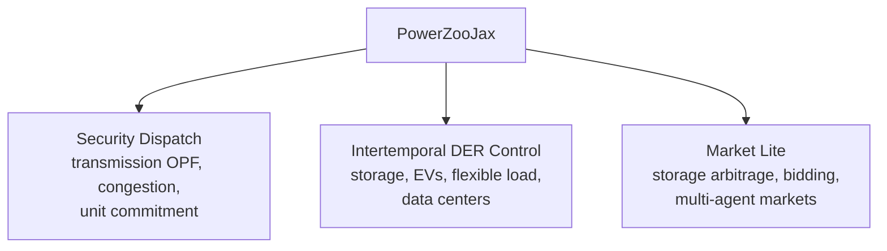

# 概览

PowerZooJax 是一个面向电力系统控制问题强化学习研究的 benchmark 环境集，全部用 JAX 实现。它不是通用电力仿真平台，而是一组物理语义明确、可以直接接入现代 JAX RL 流水线的小型 benchmark。

这一页只给最短总览；Concepts 这一章的其他页面会把每个核心想法继续展开。

## 入门入口

如果你对电力系统这边还比较陌生，建议先读 [Power 系统入门](power-systems-primer.md)。那一页会先解释潮流、bus、线路、有功/无功、电压、OPF、LMP、SOC 等基本概念，这样后面读缩写和物理语义时会轻松很多。

## 这套 benchmark 解决什么问题

这套文档主要服务两类读者：

- ML 研究者：想要一个 JAX-native、物理上可信、可以直接接进固定长度 rollout 和 GPU 训练流水线的 benchmark。
- 电力系统研究者：想保留熟悉的物理模型，但希望它们能直接被 PyTorch、Flax 或 PureJaxRL 风格的训练循环驱动，而不用再搭一套新的 simulator。

两类读者的共同需求其实是一样的：既要物理动态真实，也要接口不要给训练循环额外加负担。

## 紧凑对比

理解 PowerZooJax 最快的方法，是把它和大家最容易联想到的三类东西放在一起比较：

| 对比对象 | 主要目标 | 通常优化什么 | PowerZooJax 的不同点 |
| --- | --- | --- | --- |
| Gymnasium 风格环境 | 通用 RL 环境 API | 接口简单、任务覆盖广、实验门槛低 | 保留 gym 风格 RL 契约，但把环境本体做成 JAX-native、物理驱动，并且能端到端配合 `jit` / `vmap` / `scan` |
| 通用电力仿真器 | 电力系统建模与分析 | 建模范围、工程工作流、仿真灵活性 | 主动收缩到小规模 benchmark 环境集，强调固定 shape 的函数式状态和训练循环友好的 API，而不是 simulator-first 接口 |
| PowerZoo | Python 电力 RL benchmark | benchmark 语义和任务设计 | 保留 benchmark 意图，但围绕纯 JAX 执行重建环境，让 rollout、batching 和训练都能留在 GPU 上，不再受 Python 循环开销限制 |

所以 PowerZooJax 不是想在任务广度上赢 Gymnasium，也不是想在工程覆盖面上赢通用仿真器；它要占据的是中间位置：一套物理可信、同时又适合现代 JAX RL pipeline 的电力 benchmark。

## 三类 benchmark

PowerZooJax 目前把环境分成三类。每一类对应不同的物理结构，也带来不同类型的 RL 难点。

- `Security Dispatch` 的难点来自共享网络约束：一个机组的动作会通过潮流求解器改变其他机组的可行域。
- `Intertemporal DER Control` 的难点来自物理记忆：SOC、延迟负荷、排队作业等状态会把 credit assignment 拉长，而且观测通常是不完全的。
- `Market Lite` 在调度之上叠加了简化的节点价格，因此 reward 同时受价格时序和物理可行性影响。

DER 是 distributed energy resource，指配电侧的小型分布式能源或可控负荷。SOC 是 state of charge，表示电池当前储能占容量的比例。LMP 是 locational marginal price，表示某个 bus 上额外 1 MWh 电力的边际成本，论文 benchmark 实验里以英镑（GBP，£）报告。

## MDP / CMDP 任务契约

PowerZooJax 里的每个 benchmark 都先被写成 MDP 或 CMDP，再讨论实现细节。也正因为这样，`step` 才会同时返回 `reward` 和 `costs`，benchmark 页面才会先放一张 “MDP / CMDP 规范” 表，同一个 env 才能在不改底层物理的前提下同时服务普通 RL、Safe RL 和多智能体 wrapper。

完整的形式化定义现在收口到专门的 [MDP / CMDP](reward-cost-split.md) 页面里。想看元组定义、带预算的 CMDP 目标函数，或者为什么 reward 与约束 cost 必须分通道表达，都去那一页。

## 难点来自哪里

“电力 RL benchmark” 很常见的失败方式，是把难点藏进黑箱求解器或者不一致的状态设计里。PowerZooJax 尽量把难点留在物理里，而不是 API 里。主要有四个来源：

1. 网络耦合。潮流会把所有动作通过同一次求解绑在一起。
2. 时序状态。储能和队列动态会让最优动作依赖未来时刻。
3. MDP / CMDP 分离。目标留在 `reward`，显式约束违反留在 `costs` 向量，而不是被揉进 shaped reward。
4. 部分可观测。策略看到的是压缩后的规范化观测，而不是完整物理状态。

## JAX 承诺

PowerZooJax 的所有公开环境都遵守同一个实现契约：

- `reset(key, params) -> (obs, state)` 是纯函数。
- `step(key, state, action, params) -> (obs, state, reward, costs, done, info)` 是纯函数，并且已经内建 auto-reset。
- `state` 和 `params` 都是 shape / dtype 静态的 pytree。
- 随机性只通过显式 `jax.random.PRNGKey` 传递。

这套约束保证整个训练循环，包括环境 rollout、策略前向和梯度更新，都可以放进同一个 JIT 编译程序里。`jit` 把 Python 函数编译成单个 XLA 程序；`vmap` 自动沿 batch 维并行；`scan` 用编译后的循环替代 Python `for`。下一页会把这些规则展开说明。

## 阅读地图

如果你现在最关心的是：

- 五分钟快速理解项目定位，先跳到 [Getting Started](../getting-started.md)。
- JAX 实现规则，读 [JAX + RL 环境实现规范](jax-contract.md)。
- 正式任务契约以及 reward / cost 语义，读 [MDP / CMDP](reward-cost-split.md)。
- 可以随时回查的电力术语解释，读 [Power 系统入门](power-systems-primer.md)。

再往后，文档会按层次继续展开：

- [Architecture](../architecture/repo-map.md)：代码结构怎么组织。
- [Physics](../physics/transmission.md)：每个环境在 `step` 里具体做什么。
- [Benchmarks](../benchmarks/overview.md)：五个论文任务怎么搭在这些环境之上。
- [Training](../training/wrappers.md)：如何用现有 wrapper 训练策略。
- [API reference](../api/grid.md)：自动生成的符号级接口文档。
