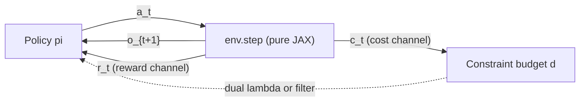
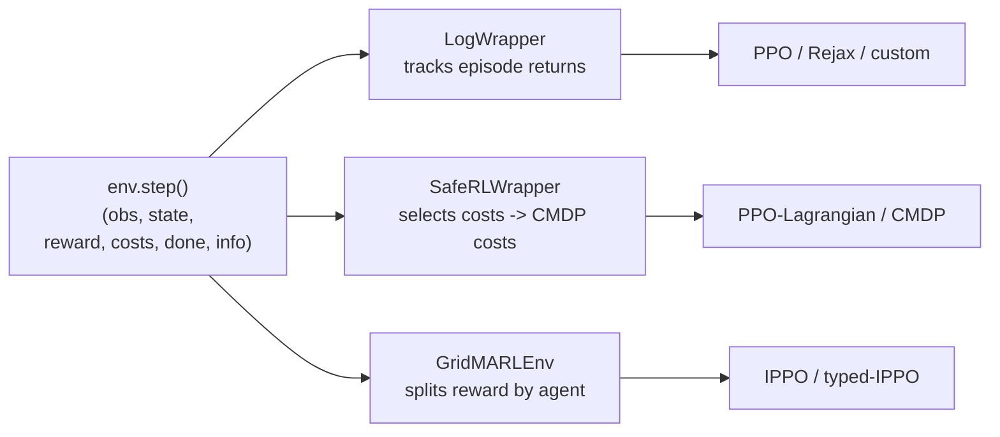

# MDP / CMDP

PowerZooJax 把每个 benchmark 都看成一个 MDP 或 CMDP；`reward` 与 `costs` 分通道暴露，就是这个形式化契约的直接结果。

这一页先解释形式化定义，再说明为什么代码里必须把 `reward` 和 `costs` 分开。

## MDP / CMDP 形式化

PowerZooJax 里的每个 benchmark 都先被写成有限时域 MDP 或 CMDP，再讨论实现细节，这样任务契约会先于实现出现。

有限时域 MDP 可以写成元组 \((\mathcal{S}, \mathcal{O}, \mathcal{A}, P, r, \gamma, \rho_0, T)\)，分别表示状态空间 \(\mathcal{S}\)、观测空间 \(\mathcal{O}\)（当 \(o_t \neq s_t\) 时为部分观测）、动作空间 \(\mathcal{A}\)、转移核 \(P(s_{t+1} \mid s_t, a_t)\)、奖励 \(r_t = r(s_t, a_t)\)、折扣因子 \(\gamma\)、初始分布 \(\rho_0\) 和时域长度 \(T\)。

CMDP（约束 MDP）在此基础上增加一个非负约束 cost 向量 \(\mathbf{c}_t = (c_{1,t}, \dots, c_{k,t})\) 和约束阈值向量 \(\mathbf{b} = (b_1, \dots, b_k)\)。智能体求解的是

\[
\max_{\pi}\ \mathbb{E}_{\pi}\!\left[\sum_{t=0}^{T-1} \gamma^t r_t\right]
\quad \text{s.t.} \quad
\mathbb{E}_{\pi}\!\left[\sum_{t=0}^{T-1} \gamma^t\, c_{i,t}\right] \le b_i
\quad \forall i \in \{1, \dots, k\}.
\]

这与论文 Appendix C 的元组 \((\mathcal{S}, \mathcal{A}, P, r, \mathbf{c}, \gamma, \mathbf{b}, \rho_0, T)\) 一致；文档侧额外把观测空间 \(\mathcal{O}\) 单独写出来，把部分观测放到类型层面就能看见。作为实现细节，代码允许设置一个独立的 `cost_gamma`（默认 `1.0`，即不折扣总违反量），而 reward 折扣 \(\gamma = 0.995\)；上面的形式化定义按照论文统一用一个 \(\gamma\) 描述两个通道。

PowerZooJax 在 core env 层直接暴露这一点：所有公开 `env.step` 都返回 `reward`（经济目标）和显式、固定 shape 的 `costs` 向量（约束 cost 通道）。`env.constraint_names(params)` 给出这些 cost 分量的静态名称。环境不会再把它们揉回 reward 里；wrapper 层再决定是保留完整 CMDP 向量、选取任务相关子集，还是为了外部库兼容而投影成标量通道。



在多智能体任务里，同一张图会自然抬升成 Markov game（每个 agent 有自己的 action 和 reward）或 Dec-POMDP（每个 agent 只观察全局状态的一部分）。cost 通道在这两类场景下仍然保持同样语义。

每个 [Benchmark](../benchmarks/overview.md) 任务页都以一张 “MDP / CMDP 规范” 表开头，逐字段写清楚 state、observation、action、transition、reward、cost、threshold、discount、horizon、agents 和 MDP class。先看那张表，再决定要不要深入实现细节。

## 为什么不要把约束揉进 reward shaping

教科书式的 RL 写法，常常会把约束做成 reward 惩罚项：

```python
shaped_reward = -gen_cost - lambda * voltage_violation
```

这里的 `gen_cost` 是发电或运行成本，`voltage_violation` 是电压越界量，`lambda` 是把约束违反折算成 reward 惩罚的权重。

这种写法做原型很方便，但有三个已知问题：

1. 惩罚权重 `lambda` 是超参数，会依赖环境、策略、随机种子和训练时域，没有唯一正确值。
2. 如果不额外报告违反率，训练出的 agent 表现没有可解释性。两个 shaped reward 相同的策略，可能有完全不同的可行性。
3. shaped reward 不再等于调度者真正想优化的量；它变成了一个既不同于真实目标、也不同于硬约束的第三种量。

CMDP 的作用，就是把这两类信号分开。PPO-Lagrangian 等算法随后通过在线调整对偶乘子去学习权衡，而不是提前手工定死一个惩罚系数。

## PowerZooJax 如何暴露 CMDP 契约

所有公开环境的 `step` 都返回一个 6 元组：

```python
obs, state, reward, costs, done, info = env.step(key, state, action, params)
```

- `reward` 是 JAX 标量，采用 reward-positive 约定：越大越好。
- `costs` 是固定 shape 的 JAX 向量，表示这一步 transition 上各个约束对应的 CMDP cost。
- `info["cost_sum"] = jnp.sum(costs)` 只是聚合诊断量。
- `costs` 永远不会再被揉回 `reward`。

以 `TransGridEnv` 为例：

- `reward = -reward_scale * gen_cost`，其中 `reward_scale` 是 reward 缩放系数，`gen_cost` 是对实际 dispatch 的边际成本多项式积分后得到的总发电成本。
- `costs = [cost_thermal_overload, cost_voltage_violation, cost_power_balance, cost_resource]`，分别对应热越限、电压违反、DC 求解后残留的系统功率不平衡残差，以及资源侧约束或惩罚项。

注意 TSO benchmark 用的是 `UnitCommitmentEnv` 而不是 `TransGridEnv`：env 侧 cost 向量把 `power_balance`/`resource` 换成 `reserve_shortfall`/`min_updown`，论文真值的 CMDP 规约只采用 `(thermal_overload, reserve_shortfall)` 这前两个通道，第三个通道是恒为 0 的固定 shape padding。完整说明见 [Physics → Transmission](../physics/transmission.md#unitcommitmentenv-scuc-for-the-tso-task)。

每个环境里 reward 和 cost 的精确组成，都在 [Physics](../physics/transmission.md) 这一层展开说明。

## 为什么一个 env 可以服务多种训练接口

因为 CMDP 分离是在环境内部就固定下来的，所以同一个 `step` 函数不用改动，就可以服务三种训练栈：



- 单智能体无约束：包一层 `LogWrapper`，直接用 `reward` 训练 PPO。
- 单智能体有约束：包一层 `SafeRLWrapper`，对 `(reward, selected_costs)` 训练 PPO-Lagrangian。
- 多智能体：包一层 `GridMARLEnv`；wrapper 会把观测 / 动作拆成 per-agent 字典，并给出共享 reward。

这些 wrapper 都不会改变底层物理。切换训练接口，本质上只是换一层适配器。

## 什么可以进入 cost 通道

不同环境的 cost 组成不同，但规则一样：只有物理或运行层面的违反进入 `costs`。例如：

- `TransGridEnv`：加权热越限 + 电压违反 + 功率平衡 slack + 资源 cost
- `DistGridEnv`：基于计数的电压 / 热违反 + 资源 cost
- `DistGrid3PhaseEnv`：电压 + 热约束 + 电压不平衡因子（VUF） + 资源 cost。VUF 表示三相电压彼此差异有多大。
- `RenewableEnv`：弃电机会成本 + 无功裁剪 cost
- `BatteryEnv`：循环吞吐成本
- `VehicleEnv`：低于离站最小 SOC 的缺口
- `FlexLoadEnv`：不舒适度、延迟需求持有成本、同时激活惩罚
- `DataCenterEnv`：SLA 违反密度 + 过温
- `DataCenterMicrogridEnv`：SLA + 过温 + 供电缺口

那些不直接进入 `costs` 的诊断量，例如 `cost_action_clip`、`cost_continuous` 或聚合项 `info["cost_sum"]`，都放在相邻的 `info[...]` 字段里。它们对 dashboard 和 ablation 很有用，但不直接进入 CMDP。

## 符号方向约定

整套 benchmark 里有三个最好先记住的符号约定：

- Reward-positive：越大越好。`reward = -gen_cost` 很正常。
- Cost-non-negative：零表示可行，越大表示违反越严重。
- Power-injection-positive：设备的 `current_p_mw > 0` 表示向电网注入功率。电池放电为正，充电为负。数据中心始终是负荷，因此 `current_p_mw` 总为负。

## 接着读

- [JAX + RL 环境实现规范](jax-contract.md)：这一页环境都遵守哪些 JAX 规则。
- [Power 系统入门](power-systems-primer.md)：电力侧术语表。
- [Wrappers](../training/wrappers.md)：`LogWrapper`、`SafeRLWrapper` 和 `RewardWrapper` 如何消费这套 CMDP 分离。
