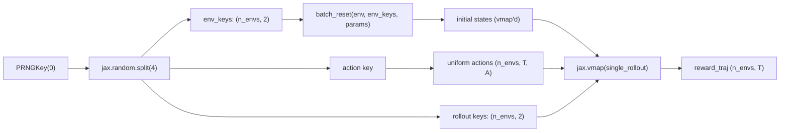

# 02 — Batched rollout

在固定 horizon 上并行跑多个环境，全部编译进单个 JIT 程序。参考脚本：[`examples/jax_00_verify_device.py`](https://github.com/powerzoojax/PowerZooJax/blob/main/examples/jax_00_verify_device.py)。

```python
import jax
import jax.numpy as jnp

from powerzoojax.case import load_case
from powerzoojax.envs import TransGridEnv, make_trans_params
from powerzoojax.utils.jax_utils import batch_reset, scan_rollout

case = load_case("5")
env = TransGridEnv()
params = make_trans_params(case, max_steps=48)

@jax.jit
def collect(key):
    n_envs = 64
    horizon = 48

    key, k_reset, k_actions, k_roll = jax.random.split(key, 4)

    env_keys = jax.random.split(k_reset, n_envs)
    obs0, states0 = batch_reset(env, env_keys, params)

    actions = jax.random.uniform(
        k_actions,
        (n_envs, horizon, case.n_units),
        minval=-1.0,
        maxval=1.0,
    )
    rollout_keys = jax.random.split(k_roll, n_envs)

    def single_rollout(state, key, action_seq):
        return scan_rollout(env, key, state, params, action_seq)

    final_states, obs_traj, reward_traj, cost_traj, done_traj, info_traj = jax.vmap(
        single_rollout
    )(states0, rollout_keys, actions)

    return reward_traj.sum(axis=1)   # shape (n_envs,)

returns = collect(jax.random.PRNGKey(0))
print("mean return:", float(returns.mean()))
print("std  return:", float(returns.std()))
```

## 发生了什么



- `batch_reset` 等于 `jax.vmap(env.reset, in_axes=(0, None))`。
- `scan_rollout` 在每个 env 内跑长度 `T` 的 `lax.scan`。
- 外层 `jax.vmap(single_rollout)` 把这段 scan 提到 batch 维度。
- 整条 pipeline 在第一次调用之后融合成单个 XLA 程序。

## Auto-reset

如果某个 rollout 超过 `max_steps`，env 在 `step` 内部自动 reset，rollout 不中断地继续。没有 Python 分支：终止 transition 上报 `done=True`，而返回的 `state` 已经是下一 episode 的初始 state。

## 加 wrapper

`LogWrapper`、`SafeRLWrapper`、`RewardWrapper` 与 MARL wrapper 都保留 `batch_reset` 与 `scan_rollout` 依赖的合约：

```python
from powerzoojax.rl import LogWrapper

wrapped = LogWrapper(env, params)

@jax.jit
def collect_wrapped(key):
    n_envs = 64
    key, k_reset, k_actions = jax.random.split(key, 3)
    env_keys = jax.random.split(k_reset, n_envs)

    obs0, states0 = jax.vmap(wrapped.reset)(env_keys)

    actions = jax.random.uniform(
        k_actions,
        (n_envs, 48, case.n_units),
        minval=-1.0,
        maxval=1.0,
    )

    def single_rollout(state, key, action_seq):
        def step_fn(state_i, k_a):
            k, a = k_a
            obs, state_i, reward, done, info = wrapped.step_auto_reset(
                k, state_i, a
            )
            return state_i, (reward, done, info)

        keys = jax.random.split(key, action_seq.shape[0])
        return jax.lax.scan(step_fn, state, (keys, action_seq))

    return jax.vmap(single_rollout)(
        states0, jax.random.split(k_reset, n_envs), actions
    )
```

`LogWrapper` 不需要 runtime 传入 `params`；它在构造时已经绑定。

## 下一步

[03 — 训练 PPO](03_train_ppo.md) 用 policy 替换随机 action 序列，并加上 Optax 更新步骤。
