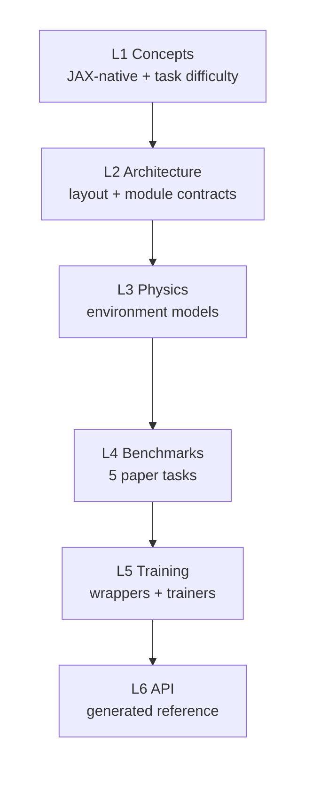
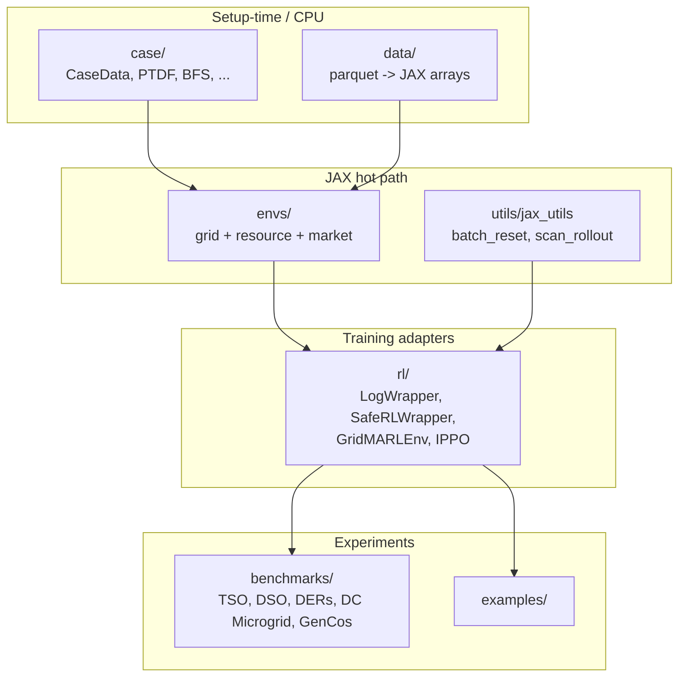

# PowerZooJax

PowerZooJax 是一套面向电力系统强化学习研究的纯 JAX benchmark 环境集。它沿用 PowerZoo 的 benchmark 范围，但强制一组 JAX 优先的合约：显式 state、显式 PRNG、`jit` 安全的状态转移、`vmap` 批量并行、固定长度 `lax.scan` rollout 并内置 auto-reset。最终目标是端到端 GPU 训练，让 environment rollout、policy forward、gradient update 全部位于同一个编译后的程序里。

本文档面向 ML 与 Power 两类读者。Power 系统术语（PTDF、SCUC、VUF、LMP、SOC、BFS）首次出现时给一行说明；JAX / RL 术语（jit、vmap、scan、CMDP、IPPO）直接使用，每页首次出现时给一行说明。

## 完全入门先看这里

如果你是第一次接触电力系统 RL，建议先读 [Power 系统入门](concepts/power-systems-primer.md)。那一页先解释 bus、line、潮流（power flow）、有功 / 无功、电压、OPF、LMP、SOC 这些基础概念，再回来看 Concepts、Physics 和 Benchmark 页面会顺很多。

## 项目包含什么

| 层面 | 实现 |
| --- | --- |
| 输电网（Transmission） | `TransGridEnv`（DC PF、Newton-Raphson AC PF、DCOPF、ACOPF）和 `UnitCommitmentEnv`（SCUC） |
| 配电网（Distribution） | `DistGridEnv`（平衡辐射状 BFS）和 `DistGrid3PhaseEnv`（不平衡三相 BFS + VUF） |
| 资源（Resources） | `BatteryEnv`、`RenewableEnv`、`VehicleEnv`、`FlexLoadEnv`、`DataCenterEnv`，以及挂接到电网用的 bundle |
| 微电网（Microgrid） | `DataCenterMicrogridEnv`（DataCenter + battery + PV + diesel） |
| 市场（Markets） | `CostBasedMarketEnv`、`BidBasedMarketEnv`、精确 PD-IPM `offer_sced` 求解器、GenCos 用的 `MarketMARLEnv` |
| RL 适配器 | `LogWrapper`、`SafeRLWrapper`、`RewardWrapper`、`GridMARLEnv`、`DistGridMARLEnv`、`MarketMARLEnv` |
| Trainer | PPO 与 SAC（Rejax）、PPO-Lagrangian / CMDP、Sauté PPO、IPPO、typed-IPPO |
| Benchmark 任务 | TSO、DSO、DERs、DC Microgrid、GenCos（位于 `benchmarks/`） |
| 数据 | GB 用电需求、Ausgrid 配电、Google data center 负载 + OOD 变换 |

## 阅读路线（六层）

每一层都建立在上一层之上。任何一层读完后停下，仍能形成对应深度的完整概念模型。



- L1 [Concepts](concepts/overview.md) —— 项目定位、JAX + RL 环境实现规范、reward / cost 拆分、Power 术语表。
- L2 [Architecture](architecture/repo-map.md) —— 代码组织、环境栈、数据 pipeline、JAX 原生并行计算。
- L3 [Physics](physics/transmission.md) —— 每个环境的 `step` 内部实际在计算什么。
- L4 [Benchmarks](benchmarks/overview.md) —— 5 个论文任务以及统一的结果 schema；流程用语见 [Benchmark 工作流术语表](glossary.md)。
- L5 [Training](training/wrappers.md) —— wrappers、trainers、presets、自定义训练循环。
- L6 [API reference](api/grid.md) —— 由 mkdocstrings 生成的符号级文档。

另外还有可运行的 [Examples](examples/index.md)。

## 整体架构一览



箭头方向 = import 方向：`envs/` 可以 import `case/` 和 `utils/`；`rl/` 可以 import `envs/`；`benchmarks/` 可以 import 任意层。反过来禁止，目的是让物理层在不依赖任何训练框架时仍可独立使用。

## 核心约定

- `step` 是纯函数并且已经内置 auto-reset。当 `done=True` 时返回的 `state` 就是下一 episode 的初始 state。
- 这些 benchmark 会先被形式化成 MDP 或 CMDP。经济目标留在 `reward`，物理违反留在显式 `costs` 向量中。`info["cost_sum"]` 只是聚合诊断量。详见 [MDP / CMDP](concepts/reward-cost-split.md)。
- 资源功率正方向规定：注入电网为正。储能与电动车放电为正、充电为负。data center 永远是负载，因此其 `current_p_mw` 始终为负。
- 挂接到电网的资源使用 `ResourceBundle` 结构；电网的观测和动作按 `[grid_core | bundle_0 | bundle_1 | ...]` 顺序拼接。

## 最小可运行示例

```python
import jax
import jax.numpy as jnp

from powerzoojax.case import load_case
from powerzoojax.envs import TransGridEnv, make_trans_params

case = load_case("5")
env = TransGridEnv()
params = make_trans_params(case, max_steps=48)

@jax.jit
def rollout(key):
    obs, state = env.reset(key, params)

    def step_fn(carry, _):
        key, state = carry
        key, sk = jax.random.split(key)
        action = jax.random.uniform(sk, (case.n_units,), minval=-1.0, maxval=1.0)
        obs, state, reward, costs, done, info = env.step(sk, state, action, params)
        return (key, state), reward

    (_, _), rewards = jax.lax.scan(step_fn, (key, state), None, length=48)
    return rewards.sum()

returns = jax.vmap(rollout)(jax.random.split(jax.random.PRNGKey(0), 256))
print("mean return:", float(returns.mean()))
```

256 个环境，每个跑 48 步，hot path 里没有任何 Python 循环。

## 接下来去哪

- 第一次接触？先看 [Getting started](getting-started.md)，再看 [Concepts overview](concepts/overview.md)。
- ML 研究者想看实现规范？读 [JAX + RL 环境实现规范](concepts/jax-contract.md) 和 [MDP / CMDP](concepts/reward-cost-split.md)。
- Power 研究者想看 env 语义？读 [Physics → Transmission](physics/transmission.md) 以及 physics 层的其他页面。
- 找论文实验？去 [Benchmarks overview](benchmarks/overview.md)。
- 找函数签名？查 [API reference](api/grid.md)。
