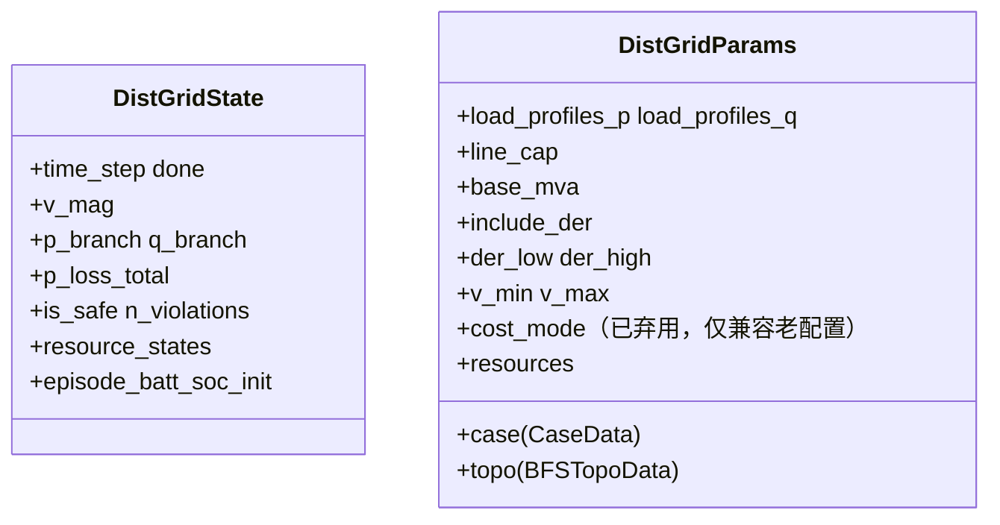
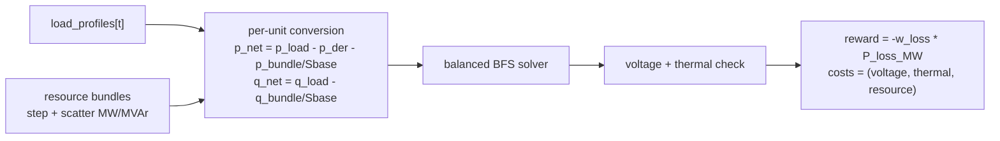
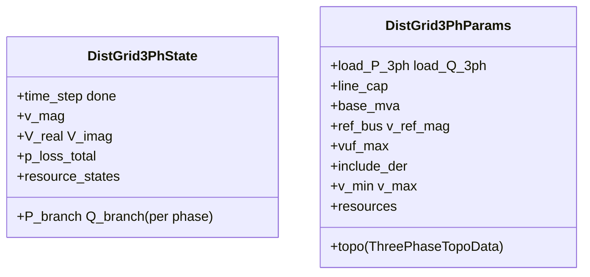

# Distribution

配电网部分包含两个环境：`DistGridEnv`（平衡辐射状馈线）与 `DistGrid3PhaseEnv`（不平衡三相馈线）。两者都基于 backward / forward sweep（BFS）潮流，这是一种专门为辐射拓扑设计的求解器。BFS、电压上下限、VUF 等术语见 [Power 系统入门](../concepts/power-systems-primer.md)。

用最直白的话说，这个 env 就是在一张树形配电网上，让 RL agent 去控制电池、光伏、柔性负荷或抽象的 DER 注入，然后在每一步回答一个简单问题：这些动作执行后，各个节点的电压、线路潮流和网损变成了什么样，电网有没有被控制在安全范围内？

## `DistGridEnv` —— 平衡辐射状馈线 {#distgridenv-balanced-radial-feeder}

`DistGridEnv` 在辐射状网络上运行单相 backward / forward sweep，把 agent 动作解释为非 slack bus 上的可控有功注入。

这里的“辐射状馈线”是指配电网络呈树形结构：电力从一个变电站 / slack bus 向外送出，每个下游 bus 到电源只有一条电气路径。“平衡”则表示三相足够接近，可以用单相等值建模，而不用分别追踪 A / B / C 三相。

### State 与 params

`include_der=True` 时会暴露按 bus 的聚合 DER 动作通道（per-unit，也就是标幺值：用基准量归一化后的无量纲数），也就是策略可以直接在每个可控 bus 上给出净有功注入 / 抽取；这里的 “DER” 指的是面向 bus 的聚合控制口，而不是某个具体设备模型。`include_der=False` 时关闭这条聚合通道，只保留具体的 `resource bundle`，例如 battery、PV、EV、flex load 这类带自身状态和约束的设备模型。

动作布局可以理解为 `[聚合 DER 段 | bundle 段]`。当前基于 `DistGridEnv` 的 benchmark，如 DSO 和 DERs，更常见的是 `include_der=False`，也就是策略主要控制挂载的 bundle，而不是每个 bus 的直接净注入。

由于 `DistGridEnv` 对所有附加资源统一暴露一个共享的 `[-1, 1]` 动作盒，真正的物理裁剪仍然发生在各自 bundle 内部。对 DSO 来说，这意味着 `FlexLoadBundle` 会把每台设备的控制解释为非负比例，并把负值裁到 `0`。

### Step 流程

### Net-load 构造

每个 bus 的标幺净注入由三部分共同决定：负荷、按 bus 的聚合 DER 动作（仅在 `include_der=True` 时启用），以及各个 bundle 的注入。bundle 输出的 MW/MVAr 会先除以 `base_mva`，再转换成 per unit。换句话说，`p_net` 和 `q_net` 就是 BFS 潮流求解器实际看到的各 bus 最终净注入：

\[
p_{\text{net}} = p_{\text{load}} - p_{\text{der}} - \frac{p_{\text{bundle}}}{S_{\text{base}}}
\]

\[
q_{\text{net}} = q_{\text{load}} - \frac{q_{\text{bundle}}}{S_{\text{base}}}
\]

bundle 的 MW/MVAr 是正注入，因此会减小净负荷。

### 约束与 reward

电压违反与热违反分别记录：

- 电压：计数型，每个 `vm < v_min` 或 `vm > v_max` 的 bus 都贡献 1 次违反计数
- 热：计数型，每条视在功率 `sqrt(P^2 + Q^2)` 高于 `line_cap` 的线路都贡献 1 次违反计数
- `info["cost_continuous"]` 里保存的是“超了多少”的连续严重程度诊断，而不是简单违反计数

reward 只基于损耗：

\[
r_t = -w_{\text{loss}}\, P_{\text{loss}, t}^{\text{MW}}
\]

core env 始终暴露完整的固定 shape CMDP 向量：

\[
\text{costs} = (C_{\mathrm{v}}, C_{\mathrm{th}}, C_{\mathrm{res}})
\]

静态名称顺序是 `("voltage_violation", "thermal_overload", "resource")`。`info["cost_sum"]` 就是这些 cost 分量的求和，用作方便查看的汇总诊断量。

DSO benchmark 不再通过 env 层修改语义，而是在 task 层只选择 `"voltage_violation"` 作为 CMDP 约束。遗留的 `cost_mode` 字段仅用于兼容旧配置加载；读者可以忽略它，因为它已经不再改变 core env 输出。

被选中的这个电压通道是计数型的：每个超限 bus 都会对 $C_{\mathrm{v}}$ 贡献一次违反计数，而不是按"距离限值多远"给连续惩罚。

!!! note
    当前实现里，`info["soc_terminal_sq"]` 只跟踪**第一个**挂载且暴露 `soc` 字段的 bundle。若第一个 bundle 是 battery bundle，env 会在终止 transition 上报告 episode 起始 SOC 与结束 SOC 的平方偏差；在非终止步上该值为零。若 battery 只出现在第二个或更后面的 bundle 位置，这条诊断当前不会触发。

### 观测向量

`obs = [v_mag_norm | p_branch_norm | q_branch_norm | p_load_norm | q_load_norm | sin(t) | cos(t) | <bundle_obs>]`

- `v_mag_norm`：各 bus 电压幅值，按 `(v_mag - 1.0) / 0.1` 归一化。
- `p_branch_norm`：各支路有功潮流，按有功负荷参考量 `p_load_ref` 归一化。
- `q_branch_norm`：各支路无功潮流，按无功负荷参考量 `q_load_ref` 归一化。
- `p_load_norm`：当前各 bus 有功负荷，按 `p_load_ref` 归一化。
- `q_load_norm`：当前各 bus 无功负荷，按 `q_load_ref` 归一化。
- `sin(t)`, `cos(t)`：日内时间相位特征，用周期编码表示当前步。
- `<bundle_obs>`：挂载资源 bundle 追加的局部摘要。

- `v_mag_norm = (v_mag - 1.0) / 0.1`
- `p_branch_norm = p_branch / p_load_ref`
- `q_branch_norm = q_branch / q_load_ref`
- `p_load_norm = p_load / p_load_ref`
- `q_load_norm = q_load / q_load_ref`

这里的 `p_load_ref` 和 `q_load_ref` 只是有功、无功负荷的归一化参考尺度，不是额外的物理状态变量。

对 DSO benchmark 来说，`<bundle_obs>` 就是 `FlexLoadBundle` 的切片，即 `6 devices x 5 features`，按 device-major 顺序展开。这里的 device-major 意思是先放第 1 台设备的 5 个特征，再放第 2 台设备的 5 个特征，依次类推：

- `curtail_norm`：当前步削减量除以该设备的 `curtail_cap_mw`。
- `shift_out_norm`：当前步推迟出去的需求除以该设备的 `shift_cap_mw`。
- `shift_in_norm`：当前步释放回来的延期需求除以该设备的 `shift_cap_mw`。
- `buffer_fill_ratio`：延期需求缓冲区占用相对于 `shift_horizon` 的比例。
- `buffer_energy_norm`：缓冲区中累计延期能量，再除以 `shift_cap_mw * shift_horizon`。

和独立的 `FlexLoadEnv` 不同，bundle observation 本身不再携带时间或价格通道；这些上下文已经由父环境 `DistGridEnv` 提供。

## `DistGrid3PhaseEnv` —— 不平衡三相馈线

`DistGrid3PhaseEnv` 把辐射模型扩展到不平衡三相网络。agent 控制非参考 bus 上每相的有功注入；env 运行三相 BFS，并给出按相电压与按相支路潮流。

这里的“不平衡三相”是指网络拓扑仍然是辐射状的，但 A / B / C 三相不再被视为完全相同。不同相上的负荷、线路阻抗和可控注入都可能不同，因此 env 必须显式保留按相电压、按相潮流以及 VUF 这类不平衡指标，而不能再压缩成单相等值模型。

### State 与 params

### 建模选择

- 直接 DER 动作按相给出，并以 per unit 表达
- Resource bundle 以平衡三相注入散布：每台设备在所属 bus 上向 A、B、C 三相各贡献 `P/3` 与 `Q/3`
- 热检查使用按相视在功率，由支路电流和两端电压重建。总线路容量在已通电的相上分摊

动作布局可以理解为 `[按相聚合 DER 段 | bundle 段]`。这里的 “按相聚合 DER 段” 仍然是面向 bus / phase 的直接控制口，而 `bundle` 仍然表示具体设备模型。当前三相 DERs 评测路径中，`include_der=False` 也通常是默认实践，因此策略一般仍然控制挂载的 bundle，而三相 env 仍然会按 A / B / C 三相分别计算电压、潮流和不平衡效应。

### VUF 约束

电压不平衡用基于 Fortescue 的 voltage unbalance factor（VUF）表示。这里“基于 Fortescue”指的是先把三相电压分解成序分量，再衡量不平衡程度：

\[
\mathrm{VUF} = \frac{|V_{\text{neg}}|}{|V_{\text{pos}}|} \times 100\%
\]

$V_{\text{pos}}$ 是平衡部分对应的正序分量，$V_{\text{neg}}$ 则表示反向旋转的不平衡部分。约束为 $\mathrm{VUF} \le vuf_{\max}$。

### Cost 组成

\[
\text{costs} = (C_{\mathrm{v}}, C_{\mathrm{th}}, C_{\mathrm{vuf}}, C_{\mathrm{res}})
\]

静态名称顺序是 `("voltage_violation", "thermal_overload", "vuf_violation", "resource")`。`info["max_vuf_percent"]` 保留每节点最大 VUF 作为诊断。reward 仍然只看损耗：

\[
r_t = -w_{\text{loss}}\, P_{\text{loss}, t}^{\text{MW}}
\]

### 观测向量

观测向量按相展开，核心上可以分成五组：

- 按相节点电压：A / B / C 三相各 bus 的电压幅值。
- 按相支路有功：A / B / C 三相各支路的有功潮流 `P_A/B/C`。
- 按相支路无功：A / B / C 三相各支路的无功潮流 `Q_A/B/C`。
- 按相负荷：A / B / C 三相各 bus 的负荷水平。
- 其他辅助特征：时间特征，以及可选的 bundle 观测。

这样做的目的是让策略直接看到三相不平衡是如何体现在不同 phase 上的，而不是只看到一个单相等效后的汇总量。

需要注意，state 里保存的 `P_A/B/C` 与 `Q_A/B/C` 支路通道主要是给观测向量提供求解器诊断；热约束的强制检查并不直接依赖这些诊断通道，而是使用上面提到的“端点电压 + 支路电流”重建结果来计算按相视在功率。

## 怎么选

- 任务是平衡辐射状控制，例如 DSO、单相 DER 协调，用 `DistGridEnv`
- benchmark 目标包含相不平衡、VUF 或按相设备布点，用 `DistGrid3PhaseEnv`

DSO benchmark 建在 `DistGridEnv` 上。DERs benchmark 也建在 `DistGridEnv` 上（挂 12 个异质 bundle），并通过 `DistGrid3PhaseMARLEnv` 提供三相 OOD 评测模式。详见 [Benchmarks → DSO](../benchmarks/dso.md) 与 [Benchmarks → DERs](../benchmarks/ders.md)。

## 交叉引用

- [Resources](resources.md) —— 挂在配电 bus 上的 bundle
- [API → Distribution](../api/distribution.md) 与 [API → Grid（共享）](../api/grid.md) 提供 BFS 求解器 helper
