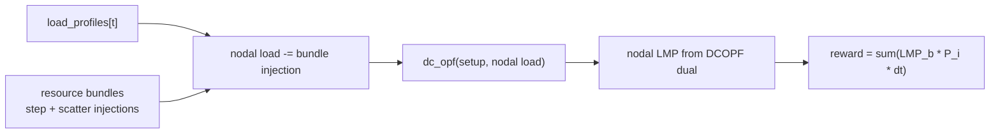

# Markets

PowerZooJax 提供四层市场相关模块，全部建立在 DC 网络原语和 resource bundle 之上。它们使用不同的价格模型，从基于真实成本的 DCOPF，到 GenCos 多智能体 benchmark 使用的精确 bid-based SCED。

文中涉及的电力市场术语，如 LMP、SCED、dispatch、marginal cost，见 [Power 系统入门](../concepts/power-systems-primer.md)。

!!! note "市场求解器 ≠ RL agent"
    读这页时有一个非常重要的区分：

    - **市场求解器**优化的是"当前这一步系统如何出清"
    - **RL agent** 优化的是"自己怎样行动，长期 reward 才更高"

    所以在单智能体市场 env 里，agent 通常是一个想赚更多套利收益的储能设备；而在 `MarketMARLEnv` 里，每个 agent 是一个通过报价争取更高利润的发电公司。这两种优化彼此相关，但目标并不相同。

## 什么时候用哪个

| Env / Module | 目的 | 定价模型 | 使用场景 |
| --- | --- | --- | --- |
| `CostBasedMarketEnv` | 储能套利 benchmark | DCOPF 出清，对该问题给出精确节点电价 | 开发 / sanity / 单智能体 |
| `BidBasedMarketEnv` | 报价驱动的简化市场 | 分段经济调度 + 近似 LMP 恢复 | 开发 / 快速 MARL 原型 |
| `offer_sced` | 精确 bid-based SCED | 对报价出清问题使用精确 LP 求解 | GenCos 任务及所有需要精确 LMP 的 rollout |
| `MarketMARLEnv`（core 为 `market_marl_core`） | 滚动竞争市场 | 每步精确调用 `offer_sced`，并把上一步 dispatch 约束延续到下一步 | GenCos benchmark |

## `CostBasedMarketEnv`

`CostBasedMarketEnv` 是最简单的储能套利环境。发电机 dispatch 由 JAX `dc_opf` 求解器根据真实机组成本曲线直接出清，不存在策略性报价。resource bundle 会先注入网络，然后 agent 根据出清得到的 LMP 获得收益。

### Step 流程

### Reward 与 cost

\[
r_t = \sum_i \mathrm{LMP}_{b(i), t}\, P_{i, t}\, \Delta t
\]

其中 `b(i)` 表示设备 `i` 所在的 bus。CMDP cost 通道是：

\[
\text{costs} = (C_{\mathrm{th}},)
\]

其静态名称为 `("thermal_overload",)`。这符合真实市场语义：运营者按价格结算收益，但不会在市场层额外加入 bundle 内部的设备 cost。在实现中，$C_{\mathrm{th}}$ 对应 $\texttt{cost\_thermal\_overload}$，`info["cost_sum"]` 是所有上报 cost 分量之和。

如果初始化时 `resources=()`，factory 会默认创建一个挂在外部 bus `1` 的单电池 bundle，这样环境在快速检查时也能直接运行。

`SimpleLMPArbitrageEnv` 是 `CostBasedMarketEnv` 的别名，二者实现完全相同。

## `BidBasedMarketEnv`

`BidBasedMarketEnv` 在同样的电池套利设置上增加了一层“报价驱动”的市场语义，但它并不使用 `offer_sced` 的精确 LP，而是使用 `market/clearing.py` 中的启发式出清器。

### Setup 与运行时

- Setup：`prepare_piecewise_ed(case, n_segments)` 会根据真实机组成本曲线构造分段宽度和基础价格。
- Reset：环境会在基础分段价格之上采样一个向上的随机 markup，并在整个 episode 内固定这组报价，因此同一个 episode 内的市场结构是静止的。
- Step：bundle 注入先修改节点负荷，然后 `piecewise_ed(...)` 完成 dispatch 并恢复节点 LMP。reward 与 cost-based env 相同，仍然是 `sum(LMP * P * dt)`。

!!! caution "已知的 BidBased 近似（有意为之）"
    - `piecewise_ed()` 是"merit-order + PTDF 罚项"的启发式求解器，**不是**全局最优 SCED。
    - 恢复得到的 LMP 来自已出清 dispatch 与真实边际成本曲线的近似映射。**当 markup 非零时，这些 LMP 并不是报价出清问题的精确对偶价格。** 这个 env 适合做原型与单元测试；论文级别的精确 LMP 请用 `offer_sced`。

CMDP cost 通道仍然是：

\[
\text{costs} = (C_{\mathrm{th}},)
\]

其中 $C_{\mathrm{th}}$ 对应 $\texttt{cost\_thermal\_overload}$。`info` 里还会提供：

- `offer_cost`：按提交报价结算得到的市场支付
- `true_cost`：底层真实物理发电成本
- `ed_converged`：启发式 dispatch 是否收敛
- `cost_sum`：所有上报 cost 分量之和

## `offer_sced` —— 精确 bid-based SCED {#offer_sced-exact-bid-based-sced}

`offer_sced` 是一个独立求解器，而不是 `Environment`。它使用 interior-point LP 求解器，对“基于报价的单时段 SCED”进行精确求解。发电机 agent 提交分段线性报价曲线，求解器返回最优 dispatch 和精确对偶价格。

### LP 形式（segment 空间）

决策变量 $\delta_{i,k}$ 表示机组 $i$ 在第 $k$ 段上相对 $p_{\min}$ 的额外出力。

\[
\min\ c^\top \delta
\]

\[
\text{s.t.}\quad 0 \le \delta \le \bar{\delta},\quad \mathbf{1}_S^\top \delta = D_\delta,\quad \text{line\_floor} \le M_S \delta + f_{p_{\min}} \le \text{line\_cap}
\]

其中：

- $c = \texttt{offer\_prices.ravel()}$
- $\bar{\delta} = \texttt{seg\_widths.ravel()}$
- $D_{\delta} = \texttt{total\_load} - \sum p_{\min}$
- $M_S$ 通过 PTDF 把 segment 增量映射到线流
- $f_{p_{\min}}$ 是所有机组都处于 $p_{\min}$ 基线时的线流

### 为什么要用这个精确 LP

该 LP 使用 interior-point 方法和对数 barrier 求解。内部每一步都归结为一个稠密线性系统。为了保持 float32 下的数值稳定性，实现里做了两步工程处理：

1. 自适应正则：`reg = max(1e-8, 1e-4 * mean(D_L))` 加到 `H` 的对角上。
2. 对角均衡：按 `S = sqrt(|diag(KKT)|)` 对 KKT 系统的行列重缩放，使有效条件数约为 `O(sqrt(D_max))`。

结果是：这个求解器既 JIT 兼容，又可 `vmap`，并且在测试 case 上，LMP 与 HiGHS LP 的边际价格误差可以控制在 `< 1e-4 $/MWh`。

### LMP 恢复

\[
\mathrm{LMP}_n = -\nu - \mathrm{PTDF}_{:, n}^\top (\mu_{\text{upper}} - \mu_{\text{lower}})
\]

其中，$\nu$ 是功率平衡等式的对偶变量，$\mu_{\text{upper}}$ 和 $\mu_{\text{lower}}$ 是 line 约束上下界的不等式对偶变量。该恢复方式已在无拥塞和有拥塞、且带分段报价的 case 上，对 HiGHS 做过精度对照。

### API 形式

- Setup 时（NumPy 侧）：`prepare_offer_sced(case, n_segments=...)` 返回 `OfferSCEDSetup`，其中包含 segment 宽度和基础报价。
- 运行时（纯 JAX）：`offer_sced(setup, load_mw, offer_prices, p_min_rt=None, p_max_rt=None)` 返回 `OfferSCEDResult`，其中包含 dispatch、line flow、LMP 和收敛信息。

可选的 `p_min_rt` / `p_max_rt` 允许调用方传入已经纳入 ramp 限制的实时 dispatch 范围；这正是 `MarketMARLEnv` 用来在 LP 层面强制跨时段 dispatch 连续性的方式。

dataclass 字段见 [API → Market SCED](../api/market-sced.md)。

## `MarketMARLEnv` —— GenCos 滚动市场 {#marketmarlenv-gencos-rolling-market}

`MarketMARLEnv` 是 GenCos benchmark 使用的多智能体市场环境。每个 agent 对应一家发电公司，因此这个 env 是一个围绕报价展开的竞争博弈。内部它使用 `offer_sced` 出清，并额外加入三层结构：

- dispatch 跨时段连续：每一步 dispatch 都受上一步 dispatch 加减机组 ramp 限制约束，而且这是在 LP 内部强制的，不是事后裁剪。
- 近期价格历史：状态中维护一个长度为 `lmp_history_len` 的循环缓冲区，保存最近几步系统平均 LMP，作为每个 agent 私有 observation 的一部分。
- 随机 episode 起点：`reset` 会在 `load_profiles` 中均匀采样一个起始索引，因此长时间序列 parquet 池可以生成很多不同的 48 步 episode。

纯函数 core 会在 state 和 `info` 中保留完整的节点 LMP 向量，但 MARL wrapper 不会直接给每个 agent 暴露一个“私有节点 LMP 通道”。相反，它构造的是一个更紧凑的私有观测，围绕 bidding context、自身最近结果、一步前瞻负荷和系统平均 LMP 历史展开。

### 动作

每个 agent 的动作是 `Box(n_segments)`，范围 `[-1, 1]`。其到单调报价曲线的映射为：

\[
m = (a + 1) / 2 \in [0, 1]
\]

\[
m_{\text{sorted}} = \mathrm{sort}(m)
\]

\[
\text{offer\_price}_{i, k} = \text{base\_seg\_price}_{i, k}\, (1 + m_{\text{sorted}, k}\, \text{max\_markup})
\]

其中 `sort` 的作用是强制报价满足常见市场中的单调性要求：一台机组第 `k` 段 MW 的报价不能低于第 `k-1` 段。

### 私有 observation

wrapper 中每个发电机 agent 的私有 observation 维度为 `8 + lmp_history_len`（默认 12，因为 `lmp_history_len=4`）：

- `[0]`：归一化后的第一段基础报价（论文符号 \(c^{b}_i\)）
- `[1]`：归一化后的自身 `p_max`（论文符号 \(\widetilde{P}^{\max}_i\)）
- `[2]`：归一化后的自身上一步 dispatch（论文符号 \(P^{g}_{i,t-1}\)）
- `[3]`：归一化后的自身上一步 dispatch profit（论文符号 \(\widetilde{w}_{i,t-1}\)）
- `[4]`：该机组剩余 ramp-up 空间的归一化值（论文符号 \(h^{\mathrm{ramp}}_{i,t}\)）
- `[5]`：一步前瞻的系统总负荷预测归一化值（论文符号 \(D^{\mathrm{fcst}}_{t+1}\)）
- `[6]`：`sin(t)`（论文 \(\tau_t\) 的一个分量）
- `[7]`：`cos(t)`（论文 \(\tau_t\) 的一个分量）
- `[8:]`：系统平均 LMP 的历史序列，从旧到新（论文符号 \(\overline{\boldsymbol{\pi}}^{\mathrm{hist}}_{t}\in\mathbb{R}^{4}\)）

实现里时间编码放在 `[6,7]`、LMP 历史放在末尾 `[8:]`。论文 Appendix E.1 中关于 `\mathbf{o}_{i,t}` 的方程列出的是同样这 12 个分量，但 LMP 历史块放在时间编码之前；这种索引顺序的差异只是表面形式，按代码实现读 observation 索引时要按上面这个顺序。

!!! warning "agent 看不到自己节点的 LMP"
    高层文字常说"agent 收到自己节点的 LMP 作为 observation"——这是对当前实现的误读。

    wrapper **不会**把每个 agent 所在节点的 LMP 单独作为私有 observation 项暴露；私有 obs 里只有"系统平均 LMP 历史序列"。完整节点 LMP 仍保留在 core state 和 `info["lmp"]` 中，需要的话只能通过 wrapper / `info` 自行接入，不是默认行为。

### Reward 与 cost

每个 agent 的 reward 是对应机组的 dispatch profit：

\[
\text{profit}_i = \mathrm{LMP}_{b(i)}\, P_i\, \Delta t - \mathrm{TC}(P_i)\, \Delta t
\]

其中 `TC(P) = (a/3) P^3 + (b/2) P^2 + c P`，即真实成本曲线的积分形式。

对于纯函数 core，`market_marl_step` 返回 `(final_state, done, reward_vec, info)`，其中 `reward_vec` 是逐机组 profit 向量。它**不会**像单智能体 env 那样再额外返回同形状的 `costs` tuple。安全信号目前保留在诊断字段中，例如：

- `info["cost_thermal_overload"]`
- `info["cost_sum"]`
- `info["n_violations"]`
- `info["is_safe"]`
- `info["lmp"]`
- 每台机组上一步的利润信息

### Auto-reset

`market_marl_step` 会在内部执行 auto-reset，并对最终状态施加 `stop_gradient`，因此它天然兼容 `lax.scan`，无需额外包装。MARL 适配层 `MarketMARLEnv`（位于 `rl/market_marl.py`）只是在此基础上增加了适合 IPPO 风格训练的 per-agent dict 布局。

## 交叉引用

- [Benchmarks → GenCos](../benchmarks/gencos.md) —— 基于 `MarketMARLEnv` 构建的实际 GenCos 任务
- [API → Market](../api/market.md)、[Market SCED](../api/market-sced.md)、[Market MARL](../api/market-marl.md)
- [Resources](resources.md) —— 在 cost-based 和 bid-based 市场中，`BatteryBundle` 是最常见的 actor
