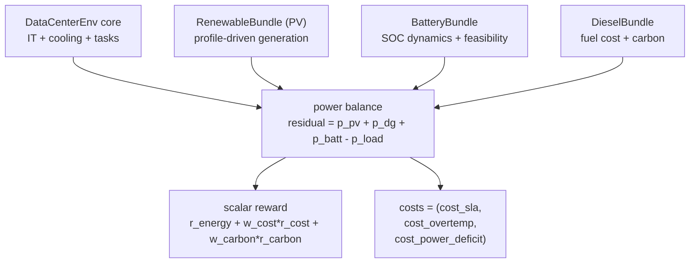
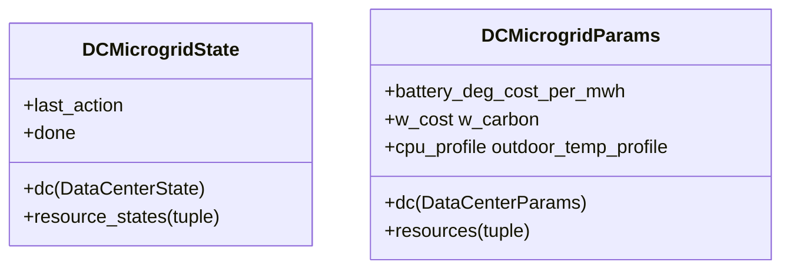

# 微电网

`DataCenterMicrogridEnv` 是一个表后自洽微电网环境，组合了：

- `DataCenter` 核心负载（IT 工作负载、制冷与热动态，见 [资源](resources.md)）；
- 具有显式可行域约束的电池储能；
- 外生的光伏发电（真实或合成昼夜曲线）；
- 具有显式燃料成本的可调度柴油机。

该环境默认是并网运行，带一个有上限的购电口（`grid_import_p_max_mw`，标准 benchmark 任务里设为 `1.5 MW`）；当 `grid_import_p_max_mw = 0.0` 时即纯孤网模式。在模拟外部停电的场景下，微电网会切换到孤网模式，此时未供电的负载会以硬约束的形式进入 `power_deficit` 通道。功率平衡是显式且可测试的；agent 需要联合决定 GPU 调度、制冷、储能、柴油机出力，并隐式地通过有上限购电口承担残余负载。

这个环境支撑 DC Microgrid benchmark 任务（[benchmarks/dc-microgrid](../benchmarks/dc-microgrid.md)）。

## 为什么单独做一个环境

`DataCenterEnv` 只刻画负载本身。如果把 PV / battery / diesel 作为 bundle 接到 `TransGridEnv` 上，就无法自然表达孤网功率平衡约束，也难以直接暴露能耗、成本、碳排与 SLA 之间的多目标权衡。这个组合环境在保持相同 JAX + RL 实现约束的同时，把这些目标直接放到了顶层接口中。

更具体地说，这个环境不是“把几个完整环境简单粘在一起”。它是一个组合层：底层包含一个负责负载与热动态的 `DataCenterEnv` 子环境，再加上 battery / PV / diesel 资源 bundle，最后由顶层 microgrid step 统一施加功率平衡并计算最终 reward / cost 输出。

## 架构



在内部，`DataCenterMicrogridEnv` 会调用私有辅助函数 `_dc_step_inner(...)`，先运行不带 auto-reset 的 DataCenter 物理过程，再在顶层对子状态统一做一次 auto-reset。这样可以避免在 `lax.scan` 里发生双重 reset。

## State 与参数



实际运行时的 schema 是嵌套结构：顶层环境保存一个 `DataCenterState`，以及每个挂载资源对应的 bundle state。为了兼容旧接口，`state.soc`、`state.p_dg_mw`、`params.battery_power_mw`、`params.solar_profile` 这类便捷访问器仍然存在，但它们只是从嵌套 bundle 结构投影出来的字段，而不是主存储字段。

`DieselParams` 是一个小型冻结辅助结构体，包含：`p_dg_max_mw`、`fuel_cost_per_mwh`、`emission_factor`（单位为 kgCO2 / kWh）。

可选 profile 字段 `cpu_profile` 与 `outdoor_temp_profile` 都是 shape 为 `(T,)` 的 JAX 数组，按 `arr[t % T]` 的方式循环索引。PV profile 存在于挂载的 `RenewableBundle` 中；当这些 profile 缺失时，会使用 `dc_microgrid_profiles.py` 中的合成昼夜辅助函数。

## 动作 {#action}

5 维 `Box`：

| 索引 | 名称 | 范围 | 含义 |
| --- | --- | --- | --- |
| 0 | `train_sched_rate` | `[0, 1]` | 分配给 training 的 GPU 余量比例 |
| 1 | `ft_sched_rate` | `[0, 1]` | 分配给 finetuning 的剩余 GPU 比例 |
| 2 | `cooling_setpoint_norm` | `[0, 1]` | 映射到 `[t_set_min, t_set_max]` |
| 3 | `battery_power_norm` | `[-1, 1]` | 正值表示放电，负值表示充电 |
| 4 | `dg_power_norm` | `[0, 1]` | 柴油机出力占 `p_dg_max_mw` 的比例 |

前两个动作量最容易被误解。它们不是固定 GPU 数，也不是对整簇 GPU 的一次性静态切分：

- `inference demand` 表示当前步中外生在线推理已经占用的 GPU；
- `urgent tasks` 表示最晚可启动时刻已到或已过、必须立刻启动才还有机会满足 deadline 的任务；
- `GPU headroom` 表示扣除推理需求和已运行的紧急任务后，当前仍可分配的 GPU 余量；
- `train_sched_rate` 先作用于当前余量，给 training scheduler 分配一个 GPU 预算；
- `ft_sched_rate` 后作用于 training 已消耗后的剩余余量，而不是原始总余量。

按代码语义，如果当前步 `gpus_avail = 600` 且 `train_sched_rate = 0.5`，那么 training 的预算是 `300` 张 GPU。若 training 实际只用了 `240`，环境会先重算剩余 headroom，再把 `ft_sched_rate` 作用到这个更小的剩余量上。

另外三个动作是直接物理控制：

- `cooling_setpoint_norm = 0` 接近 `t_set_min`，更冷、更安全，但通常冷却功率更高；`1` 接近 `t_set_max`，更热、更省电，但过温风险更高；
- `battery_power_norm` 会先映射为期望 MW 出力，再同时受到变流器额定功率与 SOC 可行域约束的裁剪，因此实际电池出力的绝对值可能小于指令值；
- `dg_power_norm` 映射为柴油机相对 `p_dg_max_mw` 的出力比例。如果启用了最小稳定出力规则，过小的正指令可能会被解释为“关闭”，或被抬升到最小稳定出力。

## 观测（24 维） {#observation-24-d}

```
[cpu_util, mem_util, q_train_fill, q_ft_fill, queue_urgency,
 zone_temp_norm, outdoor_temp_norm, cop_ratio,
 solar_cf, soc, dg_margin_norm, p_load_norm, net_load_norm,
 batt_dis_headroom_norm, batt_chg_headroom_norm,
 grid_price_norm, grid_price_6h_max_norm,
 last_action_norm (5), sin(t), cos(t)]
```

这个布局是冻结的，这样在一个 profile 池上训练出的策略，仍能与后续 profile 池保持前向兼容。

观测设计优先保证接口稳定，而不是把所有推导细节直接塞进名字里；代码里的字段名会原样暴露，便于读者回溯实现。凡是归一化字段，其归一化规则就是该字段语义的一部分：

- `solar_cf`：当前光伏容量因子；
- `soc`：当前电池 SOC；
- `dg_margin_norm`：剩余柴油机裕度，按柴油机容量归一化；
- `p_load_norm`：当前数据中心负荷，按站内总供给能力归一化；
- `net_load_norm`：扣除 PV 后的当前净负荷，按可调度供给能力归一化；
- `batt_dis_headroom_norm`：当前可行放电功率，按电池变流器额定功率归一化；
- `batt_chg_headroom_norm`：当前可行充电功率，按电池变流器额定功率归一化；
- `grid_price_norm`：当前 GB MID 购电价格，按 `grid_price_ref_per_mwh`（默认 `150.0`）归一化；
- `grid_price_6h_max_norm`：未来 6 小时内的最高购电价格预期（同一归一化），给策略一个前瞻套利信号；
- `last_action_norm (5)`：上一步动作向量，已经处于归一化控制坐标中；
- `sin(t)`、`cos(t)`：周期性的时刻特征。

## 功率平衡与电池可行域

电池动作同时受变流器额定值与 SOC 裕度约束裁剪（与 `BatteryEnv` 使用相同的单向效率规则）：

\[
P_{\max}^{\text{dis}} = \min\!\left(P_{\text{rated}},\ \frac{(\mathrm{SOC} - \mathrm{SOC}_{\min})\, E_{\max}\, \eta_d}{\Delta t}\right)
\]

\[
P_{\max}^{\text{chg}} = \min\!\left(P_{\text{rated}},\ \frac{(\mathrm{SOC}_{\max} - \mathrm{SOC})\, E_{\max}}{\eta_c\, \Delta t}\right)
\]

柴油机和 PV 的出力分别由 agent 动作与外生 profile 决定。功率平衡写为：

\[
\text{residual} = P_{\text{pv}} + P_{\text{dg}} + P_{\text{batt}} - P_{\text{load}}
\]

\[
P_{\text{deficit}} = \max(-\text{residual}, 0),\quad P_{\text{spill}} = \max(\text{residual}, 0)
\]

直白地说：如果 PV + 电池 + 柴油机仍然无法覆盖数据中心负载，缺口就记为 $P_{\text{deficit}}$，也就是未满足负载功率，并进入 cost 通道；如果供给大于负载，富余部分就记为 $P_{\text{spill}}$，只通过 `info` 报告。

## 标量 reward

\[
r_t = r_{\text{energy}} + w_{\text{cost}}\, r_{\text{cost}} + w_{\text{carbon}}\, r_{\text{carbon}}
\]

其中

\[
r_{\text{energy}} = -P_{\text{dc}}\, \Delta t \quad [\mathrm{MWh}]
\]

\[
r_{\text{cost}} = -(C_{\text{fuel}} + C_{\text{deg}})
\]

\[
r_{\text{carbon}} = -\text{carbon\_kg}
\]

其中 $C_{\text{fuel}}$ 是该步柴油机燃料成本，$C_{\text{deg}} = |P_{\text{batt}}|\, \Delta t\, c_{\text{deg}}$ 是电池退化成本，实现里用的参数名是 `deg_cost_per_mwh`。

`step()` 返回的就是上面的标量 reward $r_t$。另外，`info["reward_vector"] = [r_energy, r_cost, r_carbon]` 会把三个未缩放的 reward 分量单独暴露出来，便于分析或供多目标 RL 方法直接使用。

## 约束 cost（CMDP 通道）

\[
\text{costs} = (C^{\mathrm{sla}}_t, C^{\mathrm{temp}}_t, C^{\mathrm{deficit}}_t)
\]

- $C^{\mathrm{sla}}_t$：来自 DataCenter 任务队列的 SLA 违约密度，即超 deadline 任务数除以 $\texttt{n\_gpus}$；
- $C^{\mathrm{temp}}_t$：过温超额（overtemp）；
- $C^{\mathrm{deficit}}_t = P_{\mathrm{def}} / \max(P_{\mathrm{load}}, \epsilon)$：按负载归一化的未供电项（power deficit），是微电网环境特有的 cost。

静态名称顺序是 `("sla", "overtemp", "power_deficit")`，对应实现里的 $\texttt{cost\_sla}$、$\texttt{cost\_overtemp}$、$\texttt{cost\_power\_deficit}$。这三个下标 (`sla`、`temp`、`deficit`) 与论文 Appendix E.5 以及 [`benchmarks/dc-microgrid.md`](../benchmarks/dc-microgrid.md) 使用的标准短名一致。`info["cost_sum"]` 是这些 cost 分量的和。

## 时间尺度

微电网环境默认使用 `delta_t_hours = 5/60` 和 `max_steps = 288`，也就是一个 24 小时 episode、5 分钟时间分辨率。这个粒度比 30 分钟级别的电网环境更细，因为热动态和电池可行域都需要小于 15 分钟的步长才更有物理意义。

## 真实 profile 与合成 profile

`make_dcmicrogrid_params(...)` 会构造一个仅使用合成数据的参数对象，适合测试。若使用真实工作负载数据：

```python
from powerzoojax.envs.microgrid.dc_microgrid import (
    make_dcmicrogrid_params_with_profiles,
)
params = make_dcmicrogrid_params_with_profiles(source="google", n_steps=288)
```

在 benchmark 评估中，同一个环境既可在分布内条件下评估，也可在分布外条件下评估。为了生成 OOD 评测切分，可以对已有 `params` 调用 `powerzoojax.data.dc_microgrid_profiles` 中的 `apply_ood_transform(params, scenario)`。可用场景包括：`workload_swap`、`workload_shock`、`renewable_drought`、`cooling_stress`、`dg_derating`、`sla_tighten`。当前 benchmark 使用 `cooling_stress` 和 `renewable_drought` 作为 OOD 切分。

## 交叉引用

- [资源](resources.md)：这里引用了 battery 与 DataCenter 的底层物理语义；
- [Benchmarks / DC microgrid](../benchmarks/dc-microgrid.md)：基于该环境构建的任务定义；
- [API / Data center microgrid](../api/microgrid.md)：符号级接口与构造函数说明。
