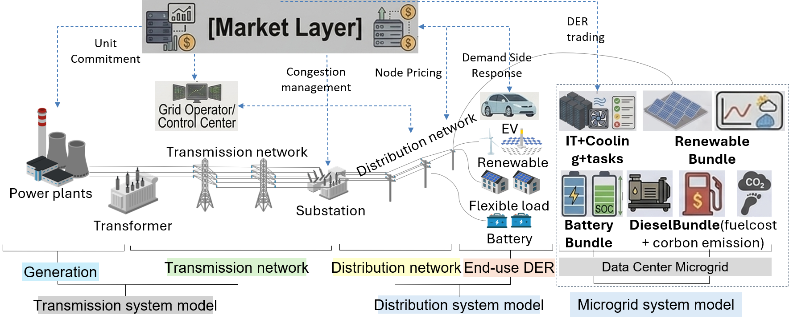

# 物理模型概览

PowerZooJax 建模了一个覆盖发电、输电、配电、终端负荷与需求响应的集成电力系统。本页提供了模型化的各个物理层级及其交互的高层次空间与功能概览。

## 系统架构

PowerZooJax 首先把电力系统任务与 JAX 训练路径连接起来：

{ width="100%" }

*图 1. PowerZooJax 的执行范式：五类电力系统 CMDP 任务被表示为 JAX 代码，在 GPU 上通过 `jax.vmap` 批量化，并作为 `[T × B]` 轨迹进入 actor-learner 训练循环。*

图 1 应从左到右阅读。左侧的 GenCos、TSO、DSO、DERs 与 DCMG 表示五类物理任务；中间把这些任务收束为 benchmark task family、固定形状的 JAX 代码和 GPU 常驻的 batched environments；右侧展示训练闭环：批量 observation 进入 actor，批量 action 回到环境，learner 再用 CMDP trajectories 更新策略。

这些任务背后的集成电力系统模型跨越五个相互关联的物理层级：

{ width="100%" }

*图 2. PowerZooJax 中各物理建模层级及其交互关系总览。*

## 如何阅读图 2

图 2 将 PowerZooJax 的物理建模划分为 3 个**系统模型**（输电、配电、微电网）、2 个**资源层**（发电侧、终端 DER），以及 1 个**协调层**（市场）。能量流大体从左到右（发电 → 负荷），信息与协调信号（例如价格）则跨层传播，影响各层决策。

## 按图分层：模型边界与含义（对齐代码实现）

### 市场层（Market Layer）— 协调与价格信号

市场层在 `powerzoojax.envs.market` 中实现，承担经济信号与物理约束之间的协调，向上下游提供**价格与出清信号**：

- **上游**：影响发电侧的报价、承诺（commitment）与调度激励
- **系统运行**：形成拥塞与平衡相关的系统性激励
- **下游**：引导终端负荷灵活性与 DER 的响应

对应页面：[市场层](markets.md)（实现见 `cost_based_market.py`、`bid_based_market.py`、`clearing.py`）。

---

### 发电侧（Generation）— 供给资源

发电侧表示注入到输电网的供给资源：

- **可再生**：风/光等按外生时间序列注入
- **火电**：可控机组，包含爬坡、启动、最小出力等成本/约束
- **储能**：规模化电池，包含效率与循环约束
- **机组组合**：可选的日前承诺决策，用于 benchmark 场景

在代码里，发电侧决策主要通过输电环境与参数工厂落地：
- [TransGridEnv](transmission.md)
- [UnitCommitmentEnv](transmission.md)

关键入口：
- `powerzoojax.envs.grid.trans.make_trans_params(...)`
- `powerzoojax.envs.grid.unit_commitment.make_uc_params(...)`

---

### 输电系统模型（Transmission system model）— 网状主网（TSO）

**输电系统模型**由 `powerzoojax.envs.grid.trans.TransGridEnv` 实现，并复用 `powerzoojax.envs.grid.base` 的基础状态/参数结构：

- **物理开关**：`physics=0`（DC PTDF 潮流），`physics=1`（AC 潮流）
- **调度开关**：`solver_mode=0`（直接 PF）、`1`（DCOPF）、`2`（ACOPF）
- **安全/成本输出**：热过载、电压越限、功率平衡残差、资源成本（CMDP 向量）
- **UC 扩展**：`UnitCommitmentEnv` 在同一输电骨架上叠加机组组合状态变量

对应页面：[输电层](transmission.md)。

---

### 配电系统模型（Distribution system model）— 辐射状馈线（DSO）

**配电系统模型**对应两个环境：
- `powerzoojax.envs.grid.dist.DistGridEnv`（平衡单相）
- `powerzoojax.envs.grid.dist_3phase.DistGrid3PhaseEnv`（不平衡三相）

- **辐射拓扑**：由 `prepare_bfs(...)` 预处理
- **潮流核心**：`bfs_power_flow(...)` 与 `bfs_3phase_power_flow(...)`
- **三相安全**：三相环境显式跟踪并约束 VUF（`vuf_max`）
- **参数工厂**：`make_dist_params(...)` 统一配置容差、约束与资源接入

对应页面：[配电层](distribution.md)。

---

### 终端 DER（End-use DER）— 灵活需求与表后资产

终端 DER 通过 `powerzoojax.envs.resource` 下的可复用资源环境/Bundle 统一建模：

- **柔性负荷**：`FlexLoadBundle`
- **电动车行为**：`VehicleEnv`
- **储能**：`BatteryBundle`
- **光伏/可再生**：`RenewableBundle`
- **本地可调热机**：`DieselBundle`

这些 Bundle 通过统一接口（`reset/step/observe`）接入 `params.resources=(...)`，由主环境在 step 中统一编排。

对应页面：[资源与 Bundle](resources.md)。

---

### 数据中心微电网系统模型（Data Center Microgrid system model）— 本地能量 + 计算耦合

**微电网系统模型**由 `powerzoojax.envs.microgrid.dc_microgrid.DataCenterMicrogridEnv` 实现，参数工厂为 `make_dcmg_params(...)`：

- **默认资源栈**：`(BatteryBundle, RenewableBundle, DieselBundle)`
- **耦合动态**：电池 SOC、柴油机出力约束、光伏时序注入
- **联合目标**：能耗成本与数据中心负载/热管理目标在同一步中共同计算

对应页面：[微电网层](microgrid.md)（以及 `DataCenterMicrogridEnv`）。

## 跨层耦合主要体现在哪里（实现视角）

- **能量耦合**：发电调度与 DER 注入先汇总为节点净注入，再进入 PF/OPF 求解。
- **约束耦合**：线路热限、电压边界、三相 VUF 约束都映射为显式安全/成本输出。
- **资源耦合**：Bundle 通过统一 `resources` 接口同时贡献注入量与资源侧成本。
- **信号耦合**：市场层与任务层包装器将经济信号映射为动作/奖励，同时复用同一套物理内核。
