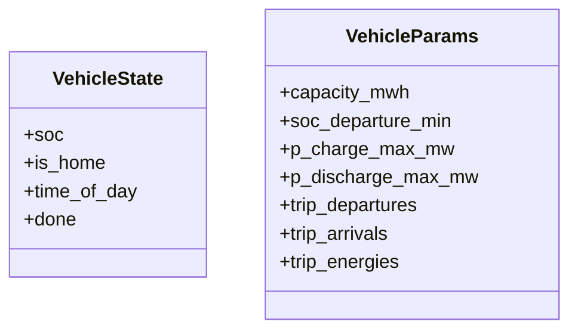
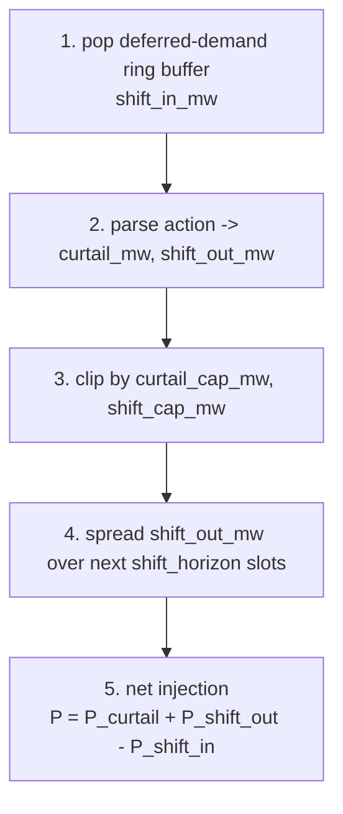
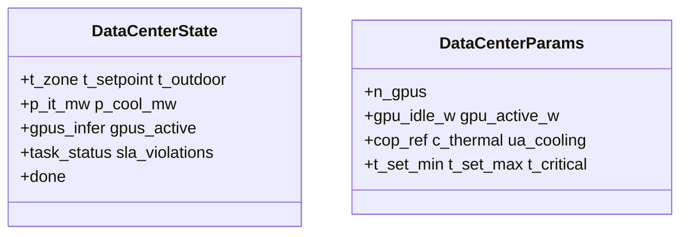

# Resources

资源环境描述的是设备本地物理：电池、可再生能源、电动车、柔性负荷、柴油机和数据中心。

直白地说，这一层回答的是一个简单问题：如果我们单独控制一个设备，或者把很多同类设备挂到电网上，这个设备自己的功率、能量或内部状态会怎样更新？

这里最重要的区分是：

- 独立 `Env`：适合研究单个设备本身
- `Bundle`：适合把很多设备挂到 grid / market / microgrid env 上

!!! note "为什么还要保留独立 resource env？"
    它们虽然通常不是最终的系统级 benchmark，但非常适合作为设备级试验台：验证局部物理、提供最小可运行的 RL 示例、调试训练流水线，以及先确认控制器能学会一个简单目标，再把同样的资源接入更大的电网。相比之下，本仓库里更系统级的问题，如电压调节、支路拥塞、网损和网络安全，通常只有在 bundle 接到父环境 `distribution`、`transmission` 或 `market` 之后才会出现。

所以一个实用经验法则是：

- 如果你想要最干净的单设备实验或训练例子，用独立 `Env`
- 如果你关心系统交互和 benchmark 风格的电力系统行为，用 `Bundle + 父环境`

并不是每种资源都同时提供这两种形式。当前公开接口如下：

| 资源 | 独立 env | Bundle | 典型用途 |
| --- | --- | --- | --- |
| Battery | `BatteryEnv` | `BatteryBundle` | 独立储能测试；挂到电网 / 市场 |
| Renewable | `RenewableEnv` / `SolarEnv` / `WindEnv` | `RenewableBundle` | 独立发电机测试；挂到电网 |
| Vehicle | `VehicleEnv` | 暂无公开 bundle | 独立 EV 调度 |
| Flexible load | `FlexLoadEnv` | `FlexLoadBundle` | 独立需求响应；DSO / DERs |
| Diesel | 暂无独立 env | `DieselBundle` | 挂到电网 / 微电网 |
| Data center | `DataCenterEnv` | 暂无公开 bundle | 独立负荷侧调度 / 热控 |

本页总结每类资源的物理语义。符号级签名见 [API → Resources](../api/resource.md)。

## 符号约定

- 有功功率 `P > 0` 表示向电网注入。
- 对电池和 EV 来说：放电为正，充电为负。
- 对柔性负荷来说：`current_p_mw > 0` 表示负荷减少（削减或移出），`current_p_mw < 0` 表示释放延期需求后导致负荷增加。
- 对柴油机来说：有功功率非负，并向宿主环境注入功率。
- 对数据中心来说：`current_p_mw` 始终为负，因为数据中心始终是净负荷。

## Battery —— `BatteryEnv` 与 `BatteryBundle`

电池模型在独立 env 和 bundle 之间共享。

### 可行功率裁剪

可行的电网侧功率同时受变流器额定值和 SOC 余量约束：

\[
P_{\max}^{\text{dis}} =
\min\!\left(P_{\text{rated}},\ \frac{(\mathrm{SOC} - \mathrm{SOC}_{\min})\, E_{\max}\, \eta_d}{\Delta t}\right)
\]

\[
P_{\max}^{\text{chg}} =
\min\!\left(P_{\text{rated}},\ \frac{(\mathrm{SOC}_{\max} - \mathrm{SOC})\, E_{\max}}{\eta_c\, \Delta t}\right)
\]

其中，$E_{\max}$ 对应 `capacity_mwh`，$\eta_c$ 和 $\eta_d$ 分别是单向充电/放电效率，$\Delta t$ 对应 `delta_t_hours`。

### SOC 更新

\[
\Delta \text{soc} =
\begin{cases}
- \dfrac{P\, \Delta t}{\eta_d\, E_{\max}} & P \ge 0 \quad \text{(放电)} \\[6pt]
- \dfrac{P\, \Delta t\, \eta_c}{E_{\max}}  & P < 0 \quad \text{(充电)}
\end{cases}
\]

### 独立 `BatteryEnv`

独立电池 env 没有设备本地经济 reward：

\[
r_t = 0
\]

它的 CMDP cost 通道是：

\[
\text{costs} = (C_{\text{cycle}},)
\]

其中

\[
C_{\text{cycle}} = c_{\text{cycle}}\, |P|\, \Delta t
\]

这里的 $c_{\text{cycle}}$ 对应实现中的 `cycle_cost_per_mwh`。`info["cost_sum"]` 是所有上报 cost 分量之和。另有 `info["cost_action_clip"]` 仅用于记录动作裁剪诊断，不会并入 CMDP cost 向量。

### `BatteryBundle`

`BatteryBundle` 是 grid 和 market env 使用的公开 bundle 实现。它把 `n_devices` 个电池打包成按设备批处理的数组，并支持可选无功控制。若 `enable_q_control=True`，无功会在有功确定之后按视在功率上限裁剪：

\[
|Q| \le \sqrt{S_{\text{rated}}^2 - P^2}
\]

bundle cost 包含动作裁剪和循环吞吐成本。grid env 会把它们累计到 `info["cost_resource"]`；market env 当前按设计忽略 bundle 自身的 cost 通道。

!!! warning "观测重建漏洞"
    本节记号约定：$p$ 是有功功率（active power，单位 MW），$q$ 是无功功率（reactive power，单位 MVAR）。

    `BatteryBundle.step` 会计算当前可行的 $p$ / $q$ 并写入返回的 `obs_slice`，但父环境随后会通过 `observe(state, ctx)` 重新构造 bundle observation。由于 `BatteryBundleState` 当前只存储 SOC，所以父环境暴露的是 SOC 加上**清零**的 $p$ / $q$ 通道，而不是刚执行的实时功率。也就是说，agent 看不到自己刚下的指令被 clip 成多少，只能从 SOC 变化间接推。

## Renewable —— `RenewableEnv`、`SolarEnv`、`WindEnv`、`RenewableBundle`

`RenewableEnv` 是一个由 profile 驱动的发电机。`SolarEnv` 和 `WindEnv` 只是默认容量因子曲线不同的便捷子类，并不引入新的物理。

### 动作与输出

动作 `a \in [-1, 1]` 映射为削减率：

\[
\text{curtailment}_t = \frac{1 - a_t}{2}
\]

因此 `a = +1` 表示不削减，`a = -1` 表示全削减。有功输出为：

\[
P_t = P_{\text{cap}}\, \mathrm{CF}(t)\, (1 - c_t)
\]

其中 `CF(t)` 是时变容量因子曲线。若 `allow_curtailment=False`，则削减被强制为 0。若 `enable_q_control=True`，无功按与 battery bundle 相同的视在功率上限裁剪。

### Reward 与 cost

独立 renewable env 也使用零标量 reward：

\[
r_t = 0
\]

其 CMDP cost 通道为：

\[
\text{costs} = (C_{\text{curtail}}, C_{\text{q-clip}})
\]

其中，$C_{\text{curtail}}$ 在 agent 削减本可发出的可再生功率时非零，$C_{\text{q-clip}}$ 在请求的无功因视在功率上限而被裁剪时非零。

设备本地的 renewable env 不负责电压/热约束 cost；这些由父级 grid env 提供。`RenewableBundle` 遵循同样的协议，并把 `n_devices` 个 PV / 风电设备打包成按设备批处理数组。

## Vehicle —— `VehicleEnv`

`VehicleEnv` 在类似电池的 SOC 模型之上，加入了时间可用性和出行能耗。

### State 扩展

### 状态转移顺序

1. 用固定长度的 trip 数组检查出发和到达。
2. 若发生出发，则从 SOC 中扣除 `trip_energy`，并记录相对 `soc_departure_min` 的缺口。
3. 只有在车辆在家（`is_home=1`）时，才允许充电或 V2G 放电。
4. 推进一天中的时间索引。

### 动作

动作采用不对称缩放：

- `a > 0`：V2G 放电，最大到 `p_discharge_max_mw`
- `a < 0`：充电，最大到 `p_charge_max_mw`

SOC 更新遵循与 battery 相同的单向效率规则，但当 `is_home=0` 时，充放电会被强制为零。

### Reward 与 cost

独立 EV env 使用：

\[
r_t = 0
\]

并且只有一个 CMDP cost 通道：

\[
\text{costs} = \left(\max(0,\ \mathrm{SOC}_{\text{dep,min}} - \mathrm{SOC}_{\text{at dep}}),\right)
\]

这个项只会在车辆出发且 SOC 低于要求的那一步非零。

## Flexible load —— `FlexLoadEnv` 与 `FlexLoadBundle` {#flexible-load-flexloadenv}

`FlexLoadEnv` 用两个控制量建模需求响应：当前直接削减，以及当前把需求移出、稍后再释放。

### Step 顺序

### 符号约定

\[
\Delta P = P_{\text{curtail}} + P_{\text{shift out}} - P_{\text{shift in}}
\]

- `current_p_mw > 0`：负荷减少
- `current_p_mw < 0`：释放延期需求导致负荷增加

### Reward 与 cost

独立 flex-load env 使用：

\[
r_t = 0
\]

并定义

\[
\text{costs} = (C_{\text{curtail}}, C_{\text{shift}}, C_{\text{simul}})
\]

其中：

- $C_{\text{curtail}} = c_{\text{curtail}}\, P_{\text{curtail}}\, \Delta t$
- $C_{\text{shift}}$：与缓冲区中延期能量成比例的逐步舒适度惩罚
- $C_{\text{simul}}$：同一步中同时启用削减和移出时的惩罚

在实现中，$c_{\text{curtail}}$ 对应 `curtail_cost_per_mwh`。`info["cost_sum"]` 是所有上报 cost 分量的和。

`FlexLoadEnv.step` 可选接受 `lmp=`，让 LMP 出现在 observation 中，但价格并不改变物理状态更新。`FlexLoadBundle` 会把 `n_devices` 个柔性负荷打包成按设备批处理数组，供 DSO / DERs 使用。

### Bundle 观测

每个设备的 `FlexLoadBundle` 观测为：

`[curtail_norm, shift_out_norm, shift_in_norm, buffer_fill_ratio, buffer_energy_norm]`

- `curtail_norm = curtailed_mw / curtail_cap_mw`
- `shift_out_norm = shift_out_mw / shift_cap_mw`
- `shift_in_norm = shift_in_mw / shift_cap_mw`
- `buffer_fill_ratio = buffer_size / shift_horizon`
- `buffer_energy_norm = buffered_deferred_energy / (shift_cap_mw * shift_horizon)`

父级 grid env 会按 device-major 顺序把这些切片拼到 `<bundle_obs>` 尾部。在 DSO benchmark 中，这正好形成 `flexload_obs (30)`，因为共有 6 台设备、每台 5 个特征。

## Diesel —— `DieselBundle`

柴油机当前提供公开的纯函数 helper 和公开 bundle 形式，但没有独立 `DieselEnv`。

### 动作与输出

每个设备只有一个 `[0, 1]` 标量动作：

\[
P_{\text{dg}} = a \, P_{\max}
\]

bundle 还支持可选的最小负载规则 `p_min_norm`：

- 低于死区（`p_min_norm / 2`）时，机组保持关闭
- 高于死区时，输出至少被钳制到 `p_min_norm * p_max`

当前 benchmark 实现里无功固定为 0。

### 观测与记账

每个设备的 bundle 观测为 `[p_norm, dg_margin_norm]`，其中：

- `p_norm = p_dg / p_max`
- `dg_margin_norm = 1 - p_norm`

### Reward 与 cost

- `reward`：这里没有独立 diesel reward，因为柴油机只以 bundle 形式暴露
- `cost_info["cost"] = 0.0`
- `cost_info["fuel_cost"]` 和 `cost_info["carbon_kg"]` 分别单独上报

也就是说，柴油机不会在资源层单独形成 CMDP cost 通道；燃料成本和碳排通常由父环境显式纳入目标。

## Data center —— `DataCenterEnv`

`DataCenterEnv` 是一个负荷侧环境，耦合了三层：IT 功耗、制冷功耗和区域热动态。

### State 与参数

### 动作

动作是 3 维：

- `action[0]`：当前可用 GPU 中分配给 training 任务的比例
- `action[1]`：剩余可用 GPU 中分配给 finetuning 任务的比例
- `action[2]`：`t_set_min` 到 `t_set_max` 之间的归一化制冷设定点

### 任务动态

- training 和 finetuning 到达由 Poisson 过程采样
- 新任务进入固定容量等待队列
- 紧急任务会被优先强制调度
- agent 控制的调度器对剩余 GPU 采用 earliest-deadline-first 贪心分配，也就是优先考虑截止时间最近的任务
- 等待中的任务若超过 deadline，则计为 SLA violation

### 功率方程

IT 和制冷功耗：

\[
P_{\text{it}} = \frac{P_{\text{infer}} + P_{\text{running}} + P_{\text{idle}}}{10^6} + P_{\text{base}}
\]

!!! note "单位换算"
    这里除以 `10^6` 是为了把瓦特换成兆瓦。像 `gpu_idle_w`、`gpu_active_w` 这样的单 GPU 量都以 W 存储，所以 `P_infer`、`P_running` 和 `P_idle` 会先在 W 上累计。环境对外报告的却是设施级有功功率 MW（如 `p_it_mw`、`current_p_mw`、`p_base_mw`），因此必须先除以 `1,000,000` 再加上 `P_base`。

\[
\mathrm{COP} = \mathrm{COP}_{\text{ref}}\, \mathrm{clip}\!\left(1 - k_{\text{cop}}\, \max(T_{\text{out}} - T_{\text{ref}}, 0),\ 0.4,\ 1.2\right)
\]

\[
Q_{\text{cool}} = UA_{\text{cool}}\, \max(T_{\text{zone}} - T_{\text{set}}, 0)
\]

\[
P_{\text{cool}} = \frac{Q_{\text{cool}}}{\mathrm{COP} \cdot 10^3}
\]

区域热状态更新：

\[
T_{\text{zone}}^{+} = \mathrm{clip}\!\left(T_{\text{zone}} + \Delta t\, \frac{P_{\text{it,kW}} - Q_{\text{cool}} + Q_{\text{wall}}}{c_{\mathrm{th}}},\ 15,\ 45\right)
\]

总电功率需求：

\[
P_{\text{dc}} = P_{\text{it}} + P_{\text{cool}} + \alpha_{\text{aux}}\, P_{\text{it}}
\]

!!! note "符号说明"
    上式中：

    - $P_{\text{infer}}$：推理负载的 GPU 功率，在除以 $10^6$ 前以 W 累积。
    - $P_{\text{running}}$：当前正在执行 training / finetuning 任务的 GPU 功率，单位 W。
    - $P_{\text{idle}}$：已安装但当前空闲的 GPU 功率，单位 W。
    - $P_{\text{base}}$：非 GPU 的基础设施底噪负荷，单位 MW。
    - $\mathrm{COP}_{\text{ref}}$：制冷参考性能系数。
    - $k_{\text{cop}}$：室外温度高于 $T_{\text{ref}}$ 时导致制冷效率下降的温度敏感系数。
    - $T_{\text{out}}$：室外温度。
    - $T_{\text{ref}}$：COP 模型使用的参考室外温度。
    - $UA_{\text{cool}}$：等效制冷导热系数，把 $(T_{\text{zone}} - T_{\text{set}})$ 的温差转换成移热项。
    - $T_{\text{zone}}$：数据中心区域当前温度。
    - $T_{\text{set}}$：agent 选择的制冷设定点。
    - $Q_{\text{cool}}$：从区域中移除的制冷热量。
    - $P_{\text{it,kW}}$：用于热 ODE 的千瓦制 `P_it`。
    - $Q_{\text{wall}}$：建筑围护结构与外界的热交换。
    - $c_{\mathrm{th}}$：区域等效热容（实现里的 $\texttt{c\_thermal}$，单位 kWh/°C；注意小写以与 cost 向量里的 $C_{\mathrm{th}}$ 区分）。
    - $\Delta t$：步长，单位小时，对应 `delta_t_hours`。
    - $\alpha_{\text{aux}}$：附加在 IT 功耗上的辅助功率比例。
    - $P_{\text{dc}}$：数据中心总电功率需求，单位 MW。

环境对外报告 `current_p_mw = -P_dc_mw`。

### Reward 与 cost

独立数据中心 env 使用：

\[
r_t = 0
\]

并定义：

\[
\text{costs} = (C_{\mathrm{sla}}, C_{\mathrm{ot}})
\]

其中：

- $C_{\mathrm{sla}}$：SLA violation 密度，即已超过 deadline 的等待任务数量再除以 $\texttt{n\_gpus}$
- $C_{\mathrm{ot}}$：归一化的超温超额量（overtemp）

这里的 SLA 指 service-level agreement，也就是每个任务的 deadline 约束。`info["cost_sum"]` 是所有上报 cost 分量的和。

### 为什么还要单独有 microgrid env

`DataCenterEnv` 建模的是并网数据中心负荷。如果你想 benchmark 一个把该负荷与 PV、电池、柴油机组合起来的自洽微电网，请使用 `DataCenterMicrogridEnv`；详见 [Microgrid](microgrid.md)。

## 这些资源出现在哪些地方

| 任务 / env | 使用的资源 |
| --- | --- |
| DSO benchmark | `FlexLoadBundle` |
| DERs benchmark | `BatteryBundle + RenewableBundle + FlexLoadBundle` |
| Market envs | `BatteryBundle` |
| Data-center microgrid | `DataCenterEnv` 与 battery / PV / diesel 逻辑组合 |

## 交叉引用

- [API → Resources](../api/resource.md) 查看完整签名
- [Microgrid](microgrid.md) 查看组合后的 `DataCenterMicrogridEnv`
- [Benchmarks → DSO](../benchmarks/dso.md) 与 [DERs](../benchmarks/ders.md) 查看这些 bundle 被怎样用于 benchmark
