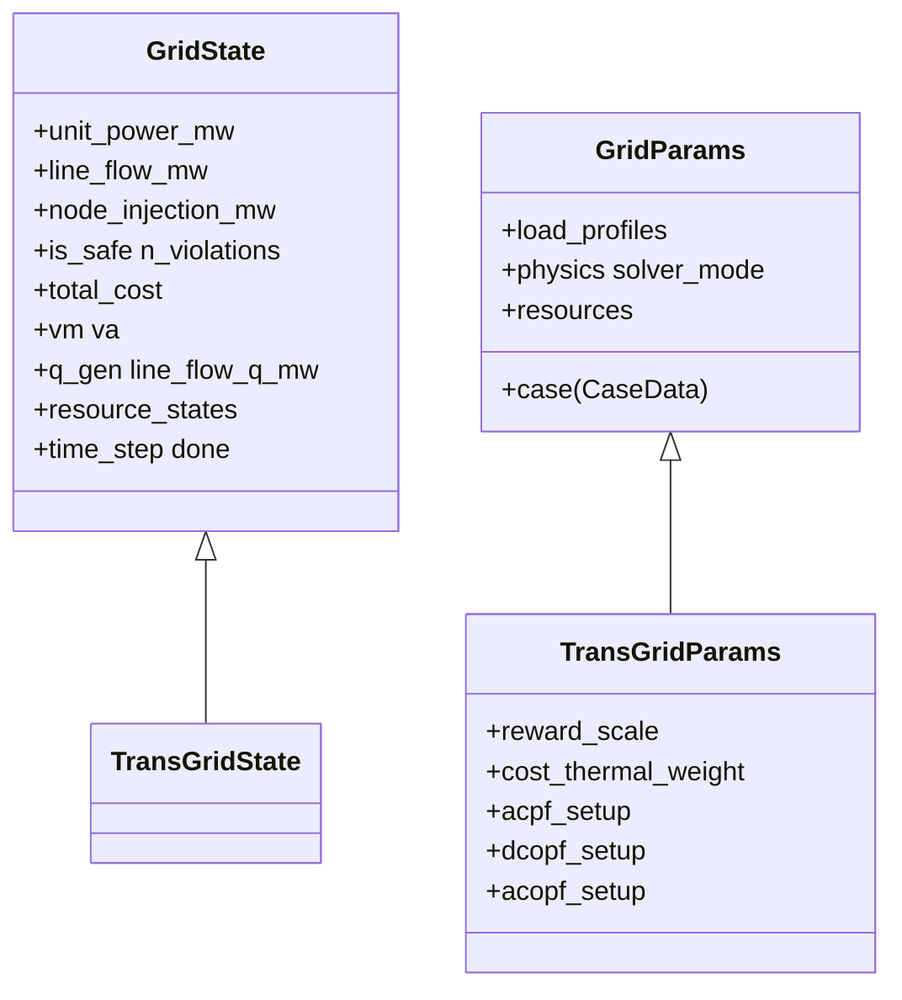
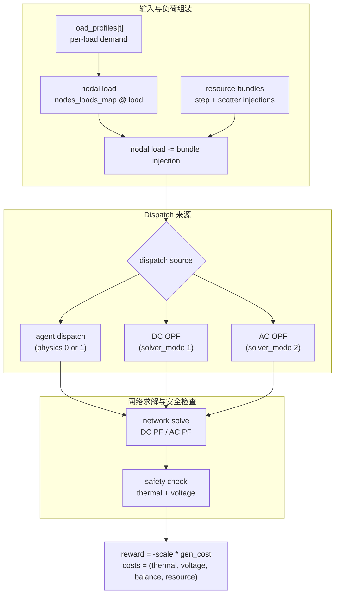
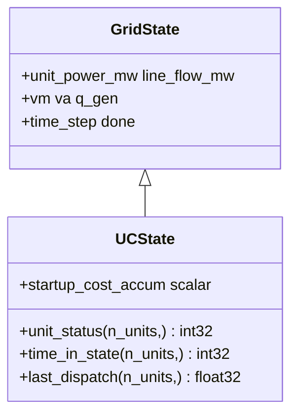
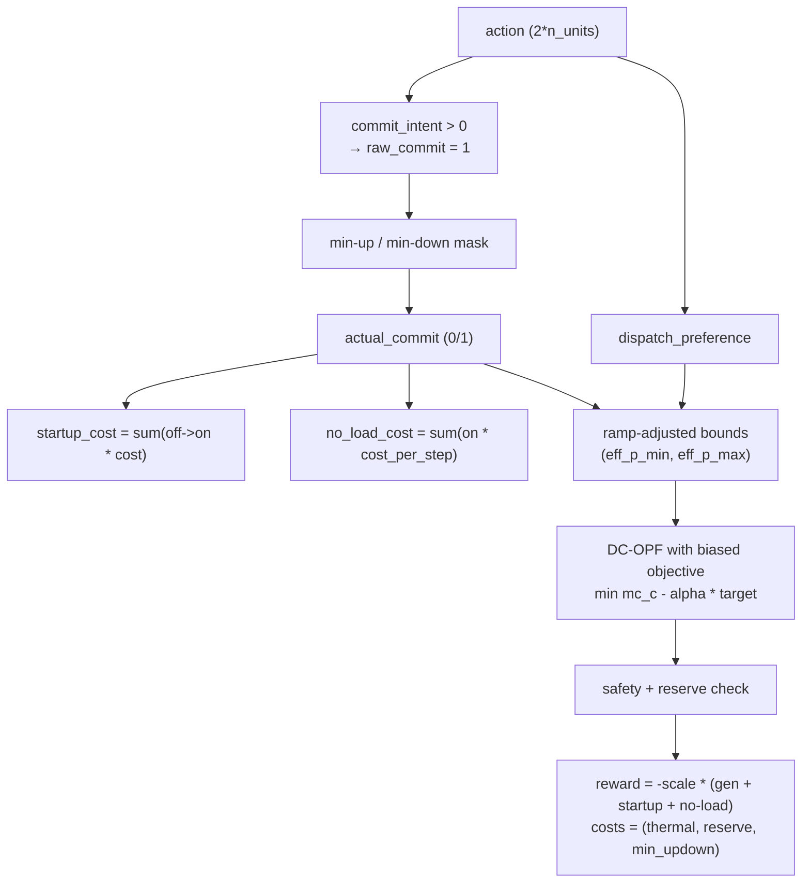

# Transmission

输电网部分包含两个环境：`TransGridEnv`（连续经济调度，可选 OPF）与 `UnitCommitmentEnv`（多步开停机 + dispatch + 安全约束，TSO benchmark 使用）。

涉及的 Power 术语，如 PTDF、AC / DC PF、OPF、SCUC、reserve、ramp，见 [Power 系统入门](../concepts/power-systems-primer.md)。

## `TransGridEnv` —— 网状电网上的 security dispatch

`TransGridEnv` 是 security-dispatch 环境。每一步把当前负荷曲线、可选 resource bundle 注入、发电机 dispatch 决策与一次网络求解组合起来。

### State 与 params



### Step 流程



### 模式矩阵

`TransGridEnv` 通过 `GridParams` 上的两个开关支持 5 种有效模式：

| `physics` | `solver_mode` | Dispatch 来源 | 网络求解 | 主要安全检查 |
| --- | --- | --- | --- | --- |
| `0` | `0` | agent dispatch | 基于 PTDF 的 DC PF | MW 线路上下限 |
| `1` | `0` | agent dispatch | Newton-Raphson AC PF | 视在功率热极限与电压上下限 |
| `0` | `1` | DCOPF | 基于 PTDF 的 DC PF | MW 线路上下限 |
| `1` | `1` | DCOPF | DCOPF dispatch 后再做一次独立 AC PF 校验 | 视在功率热极限与电压上下限 |
| `0` 或 `1` | `2` | ACOPF | ACOPF dispatch 与 AC 网络状态 | 视在功率热极限与电压上下限 |

两个求解细节对解释代码非常重要：

- `solver_mode=1` 走 JAX 的 `dc_opf()` 求解器。它的 dispatch 目标使用线性的 `mc_c` 项（边际成本梯度），由 LP 风格的 DCOPF 层负责；上报的 `gen_cost` 再用完整的边际成本多项式积分得到。这里的 `gen_cost` 可以直接理解为“当前实际 dispatch 对应的总发电成本”。
- `solver_mode=2` 走 JAX 的 `ac_opf()` 增广拉格朗日求解器。直白地说，这是一种用来寻找 AC 可行工况点的优化方法。它会给出一致的 AC 工况点，但线路约束以软惩罚形式处理；回推得到的 AC LMP / 拥塞诊断是近似值，而不是标准 interior-point OPF 下的精确对偶价格。

### DC 求解分支的方程与约束

当环境走 DC PF 求解分支时，先根据机组出力与节点负荷得到节点净有功注入，再由 PTDF 映射成线路有功潮流。核心方程是：

\[
p_{\text{inj}} = A_u\, p_g - p_{\text{load,balanced}}
\]

\[
f = \mathrm{PTDF}\, p_{\text{inj}}
\]

$A_u = \texttt{nodes\_units\_map}$，也就是“机组到节点”的映射矩阵。这里 $p_{\text{inj}}$ 表示各节点的净有功注入，$f$ 表示对应的线路有功潮流向量。功率不平衡由 slack bus 吸收，因此返回的 `actual_unit_power_mw` 是经过 slack 平衡后的最终实际机组出力。`gen_cost` 与 `cost_power_balance` 都基于这个 slack 调整后的 dispatch 计算，而不是原始 agent 命令。其中 `cost_power_balance` 表示 DC 求解后系统里还剩下多少功率不平衡，也就是未被完全消除的平衡残差；它更像一个可行性诊断 cost，而不是经济目标。

DC 分支下的线路约束直接作用在有功潮流上，即

\[
f_\ell^{\min} \le f_\ell \le f_\ell^{\max}
\]

当某条线路超出这个区间时，就产生热约束违反。对应的热约束 cost 写成：

\[
C_{\mathrm{th}} = \sum_\ell \max(f_\ell - f_\ell^{\max}, 0) + \max(f_\ell^{\min} - f_\ell, 0)
\]

### AC 求解分支的方程与约束

当环境走 AC 求解分支时，线路约束检查不再只看有功 MW，而是改用视在功率幅值：

\[
|S_\ell| = \sqrt{P_\ell^2 + Q_\ell^2}
\]

这里的视在功率幅值 $|S_\ell|$ 可以理解为线路在 AC 条件下承受的综合功率负担：有功 $P_\ell$ 和无功 $Q_\ell$ 都会占用线路容量，所以不能只看 MW 而忽略无功部分。

对应的 AC 线路约束是

\[
|S_\ell| \le S_\ell^{\max}
\]

也就是说，线路是否越限要比较当前的视在功率幅值 $|S_\ell|$ 与该线路允许的容量上限 $S_\ell^{\max}$。若超过上限，就会产生线路越限量。

!!! note "AC 状态字段命名"
    AC PF 求解分支下，state 中会保留下面这几个 AC 物理量（DC 分支下它们都是零）：

    - `vm`：节点电压幅值（voltage magnitude，单位 p.u.）
    - `va`：节点电压相角（voltage angle，单位 rad）
    - `q_gen`：每台机组的无功出力（reactive generation，单位 MVAR），仅 `solver_mode=2` 的 ACOPF 分支会写入
    - `line_flow_q_mw`：线路无功潮流，**实际单位是 MVAR**；字段名后缀 `_mw` 是历史命名遗留，不要被它误导成有功
    - `line_viol_mva`：超过 $S_\ell^{\max}$ 的视在功率越限量（单位 MVA），仅 ACOPF 分支会返回

    电压 cost 由 `CaseData` 中的 `node_v_min` / `node_v_max` 配合 `vm` 计算，仅 AC 分支非零。

### Reward 与 cost

标量 reward 定义为

\[
r_t = -\lambda_{\text{reward}}\, C_{\text{gen}}
\]

其中，$\lambda_{\text{reward}}$ 是把成本量级映射到 reward 时使用的缩放系数，$C_{\text{gen}}$ 是当前实际 dispatch 的总发电成本。

数值上，$C_{\text{gen}}$ 是在经过 slack 调整后的 dispatch 上，对每台机组的边际成本多项式积分得到的：

\[
C_{\text{gen}}
=
\sum_u \left(
\frac{mc_{a,u}}{3} p_u^3
+ \frac{mc_{b,u}}{2} p_u^2
+ mc_{c,u} p_u
\right)
\]

在实现里，这两个量分别对应 `reward_scale` 和 `gen_cost`。

CMDP cost 向量定义为

\[
\text{costs} =
\bigl(
C_{\mathrm{th}},
\ C_{\mathrm{v}},
\ C_{\mathrm{bal}},
\ C_{\mathrm{res}}
\bigr)
\]

静态名称顺序是 `("thermal_overload", "voltage_violation", "power_balance", "resource")`。其中，`info["cost_sum"]` 是这些已报告 cost 分量的求和诊断，便于快速查看总约束压力。

!!! note "cost 分量在 AC / DC 分支下来源不同"
    cost 向量的 shape 在两条求解分支下完全一致，但每个分量的物理来源不同；用同样名字训练出的 policy 在切换 `physics` / `solver_mode` 时含义会变。

    - $C_{\mathrm{th}}$ 是热约束项，对应 $\texttt{cost\_thermal\_weight} \cdot \texttt{thermal\_overload}$（$\texttt{cost\_thermal\_weight}$ 默认 1.0）。在 DC 分支下来自线路有功潮流越限；在 AC 分支下对应线路视在功率越限。
    - $C_{\mathrm{v}}$ 是电压上下限惩罚。它只在 AC 分支下由电压幅值越界产生；在 DC 分支下这个分量恒为零。
    - $C_{\mathrm{bal}}$ 对应 $\texttt{cost\_power\_balance}$，表示求解后仍然残留的系统功率不平衡量。当前实现里它主要反映 slack 调整后剩余的平衡残差，因此读起来会更偏 DC 语义。
    - $C_{\mathrm{res}}$ 是各 bundle 上报的 cost 之和。


### 观测布局

- DC 观测：`[line_flow / cap, load / total_cap, unit_p / p_max, sin(t), cos(t), <bundle_obs>]`
- AC 观测：`[|S| / cap, vm, load / total_cap, unit_p / p_max, sin(t), cos(t), <bundle_obs>]`

### 动作布局

不挂 resource bundle 时，action 是 `Box(n_units)`，范围 `[-1, 1]`，反归一化到 `[unit_p_min, unit_p_max]`。挂了 bundle 时，action 拼接为：

```text
[unit actions | bundle_0 actions | bundle_1 actions | ...]
```

env 会在 step 各 bundle 之前按 `bundle.action_dim` 切分 action。

### 工厂函数

`TransGridEnv` 也有与 `UnitCommitmentEnv` 对称的参数工厂，只是这一页之前没有单独列出来。通用入口是 `make_trans_params(...)`，定义在 [`powerzoojax/envs/grid/trans.py`](https://github.com/powerzoojax/PowerZooJax/blob/main/powerzoojax/envs/grid/trans.py)。

通常不需要手动构造 `TransGridParams`，而是用：

- `make_trans_params(case, ...)`：创建 `TransGridEnv` 的通用参数，设置 `physics`、`solver_mode`、`reward_scale`、`cost_thermal_weight`、`load_profiles` 等字段。
- `make_trans_params(case, resources=(...,))`：在同一个入口里附加 resource bundles；bundle 的动作和状态会自动并入 grid env 的 `step` / `reset` 流程。

也就是说，`TransGridEnv` 和 `UnitCommitmentEnv` 在代码层都遵循“env 类 + make_*_params 参数工厂”的模式；只是 UC 那一节额外再列出了面向 TSO benchmark 的高层任务工厂。

## `UnitCommitmentEnv` —— 给 TSO 任务的 SCUC {#unitcommitmentenv-scuc-for-the-tso-task}

`UnitCommitmentEnv` 在 `TransGridEnv` 之上加入开停机离散状态机、跨时段约束以及备用要求，正好覆盖 security-constrained unit commitment（SCUC）。TSO 论文 benchmark 在 case118 上使用这个 env。

### 为什么单独做一个 env

`TransGridEnv` 在所有机组都可用的前提下选 dispatch；`UnitCommitmentEnv` 多了：

- 每机组的开 / 停状态，含最短开机 / 最短停机约束
- 相邻步之间的 ramp 约束
- 一次性启动费 + 每步空载费
- 系统级备用裕度要求

为了保留 JAX 的 JIT/vmap 兼容性，机组组合决策通过连续到二值的映射实现：policy 输出连续的机组开停意图 `commit_intent ∈ [-1, 1]`，env 内部以 `> 0` 为阈值将其转成二值开 / 停决策，再由最短开机 / 最短停机约束的硬掩码强制可行。

### State 扩展



### 动作与 step 流程

action 是 `Box(2 * n_units)`，范围 `[-1, 1]`：

- 前 `n_units` 项：`commit_intent`。`> 0` 请求开机，`≤ 0` 请求停机，再经最短开 / 停约束的硬掩码修正为 `actual_commit`，也就是在可行性约束修正后的最终实际开停机结果。
- 后 `n_units` 项：`dispatch_preference`。它们会先反归一化到 ramp 约束后的可行区间 `[eff_p_min, eff_p_max]`。这里 `[eff_p_min, eff_p_max]` 表示考虑 ramp 限制后，本步仍允许的最小和最大机组出力。DC-OPF 模式（`solver_mode=1`，SCUC 默认）下，它作为 OPF 目标函数的引导 bias，使 OPF 解靠近偏好出力但不覆盖物理约束；直接 PF 模式（`solver_mode=0`）下，它会直接作为机组出力指令下发。



DC-OPF 模式下，`dispatch_preference` 会这样引导 OPF 求解：

\[
mc_{c,\text{biased}} = mc_c - \alpha\, p_{\text{target}}
\]

其中 $\alpha = \texttt{dispatch\_preference\_weight}$（默认 0.01），$p_{\text{target}}$ 是反归一化后的偏好出力水平。这相当于对每台机组的二次成本曲线施加一个线性偏置，把成本最小点拉向偏好的出力水平，同时功率平衡、ramp 上下限、线路约束等硬约束仍由求解器强制满足。

### Reward 与 cost

标量 reward 定义为

\[
r_t = -\lambda_{\text{reward}} \left(C_{\text{gen}} + C_{\text{start}} + C_{\text{no-load}}\right)
\]

其中，$\lambda_{\text{reward}}$ 是 reward 的缩放系数，$C_{\text{gen}}$ 是当前实际 dispatch 的总发电成本，$C_{\text{start}}$ 是启动成本项，$C_{\text{no-load}}$ 是机组保持开机时的固定运行成本项。

在实现里，这几个量分别对应 `reward_scale`、`gen_cost`、`startup_cost` 和 `no_load_cost`。

环境侧 CMDP cost 向量定义为

\[
\text{costs} = \left(C_{\mathrm{th}}, C_{\mathrm{res}}, C_{\mathrm{up/down}}\right)
\]

静态名称顺序是 `("thermal_overload", "reserve_shortfall", "min_updown")`。TSO benchmark 与论文（Appendix E.2，关于 `\mathbf{c}_t` 的方程）只采用前两个通道作为正式 CMDP 规约；第三个通道是固定 shape 的 padding，恒为 0（参见下面的 note），保留只是为了让下游 wrapper 在不同 env 变体之间拿到稳定的 cost 向量形状。

这里：

- $C_{\mathrm{th}} = \texttt{cost\_thermal\_overload} \cdot \texttt{cost\_thermal\_weight}$ 表示热越限项。
- $C_{\mathrm{res}} = \texttt{cost\_reserve\_shortfall}$ 表示备用缺口项。
- $C_{\mathrm{up/down}} = \texttt{cost\_min\_updown}$ 表示最短开机 / 最短停机项。

!!! note "$C_{\mathrm{up/down}}$ 当前恒为零"
    最短开机 / 最短停机约束在 `step` 内部由 hard mask 强制满足，因此 $C_{\mathrm{up/down}}$ 永远是 0。它保留在 cost 向量里只是为了维持固定 shape，方便下游统一接 wrapper；不要把它当成可优化的安全信号。

`info` 同时输出诊断量：`gen_cost`、`startup_cost`、`no_load_cost`、`reserve_shortfall`、`commitment_switches`、`is_safe`、`n_violations`。这些名字都按字面理解即可：总发电成本、启动成本、空载成本、备用缺口、开停机切换次数，以及最终安全性摘要。

### 智能体观测 {#智能体观测}

`obs = [unit_status | time_in_state_norm | last_dispatch_norm | unit_cost_b_norm | line_flow_norm | load_norm | reserve_ratio | sin(t) | cos(t)]`。总维度 `4 * n_units + n_lines + 4`。

各字段语义：

- `unit_status`：每台机组当前的开 / 停状态，取值 `0` 或 `1`。
- `time_in_state_norm`：每台机组已经连续保持当前 ON / OFF 状态的步数，按 `time_in_state / 200` 归一化。
- `last_dispatch_norm`：每台机组上一步的实际出力，按 $p_{i,t-1} / p_{\max,i}$ 归一化。
- `unit_cost_b_norm`：每台机组边际成本曲线里的线性项，按 $b_i / \max_j |b_j|$ 归一化。
- `line_flow_norm`：当前线路有功潮流，按 $f_{\ell,t} / f^{\max}_{\ell}$ 归一化。
- `load_norm`：当前总负荷，按 $P_{\text{load},t} / \sum_i p_{\max,i}$ 归一化。
- `reserve_ratio`：相对当前负荷的已承诺备用裕度，计算式为 $\frac{P_{\text{committed}} - P_{\text{load},t}}{P_{\text{load},t}}$。直白地说，它表示“在满足当前负荷之后，还剩下多少已经承诺可用的发电能力”。
- `sin(t)`, `cos(t)`：日内时间相位特征，用周期编码表示当前步在一天中的位置。

### Ramp / cost 数据从哪里来

ramp 限制来自 `case.unit_ramp_up` / `case.unit_ramp_down`（按 `unit_p_max` 的小时百分比）；`make_uc_params` 会把它们转成每步的 `ramp_up_mw` / `ramp_down_mw`。最短开 / 停时间来自 `case.min_up_time` / `case.min_down_time`（步数）。启动费与空载费来自 `case.unit_startup_cost` / `case.unit_no_load_cost`。内置 case118 已经填好这些字段。

### 工厂函数

构造 `UCParams` 推荐用 TSO 工厂，不要手写：

- `make_tso_case118_params(...)` —— case118 SCUC 的主配置。
- `make_tso_case14_params(...)` —— case14，并注入默认 UC 元数据。
- `make_tso_ed_params(...)` —— 关闭 UC（纯经济调度），用于 `tso-ed` preset。
- `make_tso_uc_params(...)` —— 开 UC、关 reserve。
- `make_tso_scuc_params(...)` —— 开 UC、开 reserve（`tso-scuc-safe` 使用）。

如需真实 GB 用电曲线，调用 `make_tso_net_load_profiles_from_data(loader, case, role=...)`。测试与 CI 用 `make_tso_net_load_profiles(...)`，它返回合成的日内轨迹。

TSO 任务页 [benchmarks/tso](../benchmarks/tso.md) 会把这些工厂封装成完整的实验流水线。

## TSO 的非学习式 baseline

`tasks/tso.py` 自带两条 **无学习** 的 SCUC benchmark rollout 作为参照：

- `tso_all_on_rollout(env, params, key)` —— 所有机组始终开机，仅由 OPF 层做 dispatch。作为「全开机」的参照策略；表里用作成本上侧参照。
- `tso_merit_order_rollout(env, params, key)` —— **优先顺序（merit order）** 开停机：按边际成本从低到高启机直至满足负荷+备用，再 OPF。确定性的**规则型** SCUC 近似，并作为强**成本参照**（简化问题下可理解为较松的下界，勿与全局最优混用）。

`compute_tso_metrics(rollout_info)` 会把按步 info 聚合成 [benchmarks/tso](../benchmarks/tso.md) 报告中的指标。

## 交叉引用

- [Distribution](distribution.md) —— 辐射状与三相环境
- [Resources](resources.md) —— 可挂载的 bundle
- [Benchmarks → TSO](../benchmarks/tso.md) —— 基于 `UnitCommitmentEnv` 构建的 SCUC 任务
- [API → Grid](../api/grid.md) 与 [API → Unit commitment](../api/grid-uc.md) 查看符号级签名
