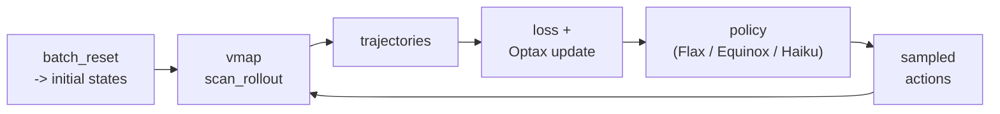

# 自定义训练循环

[Trainers](trainers.md) 和 [Presets](presets.md) 已经覆盖了常见情形。若你
需要完全控制优化器、policy 结构、目标函数、日志或数据流，就应该直接基于
`batch_reset`、`batch_step`、`scan_rollout` 和 Optax 编写自己的训练循环。

这一页的目标不是复述库里的 trainer，而是说明怎样在不破坏 PowerZooJax
JAX 合约的前提下，自己把训练闭环搭起来。

## 为什么自定义循环没问题

PowerZooJax 的 env 是纯函数，不需要任何 trainer 专用 wrapper 即可使用。
只要你遵守 [JAX + RL 环境实现规范](../concepts/jax-contract.md)
（显式 state、显式 PRNG key、固定 shape），就可以用任何 JAX 兼容的 RL
栈驱动它们。



## 先决定：你要用哪种 env 接口？

真正的第一个决定往往不是优化器，而是 env 接口。

| 需求 | 推荐接口 | 原因 |
| --- | --- | --- |
| 完全自己控制 reward / cost 处理 | bare env | 直接拿到底层 `(obs, state, reward, costs, done, info)` 合约。 |
| 单智能体 MDP 训练，想复用 episode 统计 | `LogWrapper` | 会绑定 `params`，并暴露 trainer 常用的 5 元组 step。 |
| CMDP / PPO-Lagrangian 风格训练 | `SafeRLWrapper` | 会把选中的 cost 向量作为一等输出返回。 |
| dict 风格的多智能体训练 | `GridMARLEnv`、`DistGridMARLEnv`、`MarketMARLEnv` | 和 IPPO 后端使用的 MARL 合约一致。 |

如果不确定，从 bare env 开始通常最稳妥。它最显式，也最不容易把你关心的
训练语义藏在 wrapper 里。

## 先理清数据流和张量 shape

自定义循环里最常见的 bug 往往不是优化器公式，而是 shape 没对齐。

对单智能体、时长为 `T`、并行环境数为 `N`、约束维度为 `k` 的 rollout，
常见张量形状如下：

| 量 | 常见 shape | 说明 |
| --- | --- | --- |
| `obs` | `(T, N, obs_dim)` | 每一步动作之前的 observation。 |
| `actions` | `(T, N, act_dim)` | 采样或确定性的动作。 |
| `rewards` | `(T, N)` | 单步标量 reward。 |
| `costs` | `(T, N, k)` | 单步约束 cost 向量。 |
| `dones` | `(T, N)` | auto-reset 继续向前前的 episode 终止标记。 |
| `values` | `(T, N)` | reward critic 在 rollout observation 上的输出。 |
| `last_value` | `(N,)` | scan 结束后最后一个 observation 上的 bootstrap value。 |
| `info` 的叶子 | `(T, N, ...)` | batched 诊断信息；不要把它当训练主信号。 |

做 minibatch 更新时，通常会先把 `(T, N, ...)` flatten 成 `(T * N, ...)`，
再做 shuffle 和切 minibatch。

## 最小单智能体 rollout 骨架

最常用的模式是：reset 一次，把 observation 和 state 一起放进
`lax.scan` 的 carry 里，然后在 scan 中输出 transition pytree。

```python
import jax
import jax.numpy as jnp
import optax
from flax import linen as nn

from powerzoojax.case import load_case
from powerzoojax.envs import TransGridEnv, make_trans_params
from powerzoojax.utils.jax_utils import batch_reset

case = load_case("5")
env = TransGridEnv()
profiles = jnp.ones((48, case.n_loads), dtype=jnp.float32) * 0.5
params = make_trans_params(case, load_profiles=profiles, max_steps=48)


class GaussianActorCritic(nn.Module):
    action_dim: int
    hidden: tuple[int, ...] = (64, 64)

    @nn.compact
    def __call__(self, x):
        for h in self.hidden:
            x = nn.tanh(nn.Dense(h)(x))
        mu = nn.Dense(self.action_dim)(x)
        log_sigma = self.param("log_sigma", nn.initializers.zeros, (self.action_dim,))
        value = nn.Dense(1)(x)[..., 0]
        return mu, log_sigma, value


policy = GaussianActorCritic(action_dim=case.n_units)


def policy_apply(params_p, obs):
    return policy.apply({"params": params_p}, obs)


def sample_action_and_value(key, params_p, obs):
    mu, log_sigma, value = policy_apply(params_p, obs)
    sigma = jnp.exp(log_sigma)
    noise = jax.random.normal(key, mu.shape)
    action = mu + sigma * noise
    return action, value


def rollout_once(key, params_p, init_obs, init_state, horizon=48):
    def step_fn(carry, _):
        obs, state, key = carry
        key, k_act, k_step = jax.random.split(key, 3)
        action, value = sample_action_and_value(k_act, params_p, obs)
        obs_next, state_next, reward, costs, done, info = env.step_auto_reset(
            k_step, state, action, params
        )
        transition = {
            "obs": obs,
            "action": action,
            "reward": reward,
            "costs": costs,
            "done": done,
            "value": value,
        }
        return (obs_next, state_next, key), transition

    (last_obs, last_state, _), traj = jax.lax.scan(
        step_fn,
        (init_obs, init_state, key),
        None,
        length=horizon,
    )
    _, _, last_value = policy_apply(params_p, last_obs)
    return traj, last_obs, last_state, last_value


def collect_batch(key, params_p, n_envs=64, horizon=48):
    key, k_reset, k_roll = jax.random.split(key, 3)
    keys_reset = jax.random.split(k_reset, n_envs)
    init_obs, init_states = batch_reset(env, keys_reset, params)
    keys_roll = jax.random.split(k_roll, n_envs)
    traj, last_obs, last_states, last_values = jax.vmap(
        rollout_once, in_axes=(0, None, 0, 0, None)
    )(keys_roll, params_p, init_obs, init_states, horizon)
    return traj, last_obs, last_states, last_values
```

关键点是 carry：不要在 Python 侧重建 rollout observation，而要把它和 state
一起在 scan 里往前传，这样整个数据流才能稳定留在 JIT 边界内。

## 从 rollout 到一次 PPO 更新

上面的 rollout 只是 PPO 的前半段。后半段通常是：

1. 用 `last_value` 做 bootstrap
2. 计算 reward return 和 reward advantage
3. 把 `(T, N, ...)` flatten 成 `(T * N, ...)`
4. 打乱后切成 minibatch
5. 跑 `n_epochs` 次 Optax 更新

一个最小单智能体 PPO update 至少需要三项损失：

- policy loss：clipped surrogate
- value loss：对 reward return 的平方误差
- entropy bonus：鼓励探索

核心的 value / advantage 计算大致如下：

```python
def gae_advantage(rewards, dones, values, last_value, gamma=0.99, gae_lambda=0.95):
    # rewards/dones/values: (T, N)
    next_values = jnp.concatenate([values[1:], last_value[None, :]], axis=0)

    def step_back(last_gae, xs):
        reward, done, value, next_value = xs
        not_done = 1.0 - done
        delta = reward + gamma * next_value * not_done - value
        gae = delta + gamma * gae_lambda * not_done * last_gae
        return gae, gae

    _, advantages_rev = jax.lax.scan(
        step_back,
        jnp.zeros_like(last_value),
        (rewards[::-1], dones[::-1], values[::-1], next_values[::-1]),
    )
    advantages = advantages_rev[::-1]
    returns = advantages + values
    return advantages, returns
```

接着把 batch flatten：

```python
def flatten_time_env(tree):
    return jax.tree.map(lambda x: x.reshape((x.shape[0] * x.shape[1],) + x.shape[2:]), tree)
```

于是一个训练步在概念上会变成：

```python
def train_step(train_state, key):
    traj, _, _, last_values = collect_batch(key, train_state.params)
    adv, ret = gae_advantage(
        traj["reward"],
        traj["done"],
        traj["value"],
        last_values,
    )
    batch = flatten_time_env({**traj, "advantage": adv, "return": ret})
    batch = shuffle_and_split_into_minibatches(batch, key)
    train_state = run_n_epochs_of_ppo_updates(train_state, batch)
    return train_state
```

这一页不打算把库里的完整 PPO loss 再抄一遍。重点是数据怎么流动：
rollout 在 device 上、bootstrap 在 device 上、flatten 在 device 上、更新
也在 device 上。

## CMDP 自定义循环模式

对约束训练来说，scan 本身不是难点。难点是 scan 之后的更新逻辑。

如果你使用 `SafeRLWrapper`，每一步已经会返回选中的 cost 向量：

```text
(obs, state, reward, selected_costs, done, info)
```

标准 CMDP 结构通常是：

1. 同时收集 reward rollout 和 selected cost rollout
2. 计算 reward advantage `A_R`
3. 对每个选中的约束分别计算 cost advantage，得到 `A_C`
4. 形成增广优势 `A_R - lambda^T A_C`
5. 用这个增广优势做 PPO 的内层更新
6. 再对 `lambda` 做一次外层对偶更新

实践里你通常会同时维护这些张量：

- `reward_value`：reward critic 输出
- `cost_values`：shape 为 `(T, N, k)` 的 cost critic 输出
- `advantages_reward`：shape 为 `(T, N)`
- `advantages_cost`：shape 为 `(T, N, k)`
- `lambda`：shape 为 `(k,)`

如果你不用 `SafeRLWrapper`，也仍然可以在 bare env 上写 CMDP loop，但那时
你需要自己负责 cost 通道的选择和对齐。

## MARL 自定义循环模式

MARL 场景里，变化最大的不是优化器，而是 env contract。

dict 风格 wrapper 返回的是：

```text
reset(key) -> (obs_dict, state)
step(key, state, action_dict) -> (obs_dict, state, rewards_dict, dones_dict, info)
```

这时自定义循环的关键工作是：你准备怎样把这些 dict 变成可训练的 batch。

常见选择有三种：

- 完全参数共享：把所有 agent stack 到一个 batch，用同一个 actor
- typed sharing：按类型分组（`battery_*`、`renewable_*`、`flexload_*`）
- 完全独立：每个 agent 各自维护一套参数

对 PowerZooJax 来说，typed sharing 往往是更自然的折中，因为不同资源类型的
物理规律不同，但同一类型内的多个 agent 往往可以交换。

如果你用 local observation 的 MARL env，最好在循环开头就明确每个 agent 的
observation shape。很多 MARL bug 都来自 dict 顺序、agent 顺序和 stack 后的
数组顺序没有对齐。

## 用 `scan_rollout` 做确定性评测

如果你只是要评测一个规则策略，或者回放一段确定性 action 序列，
`scan_rollout` 是最简单的路径：

```python
from powerzoojax.utils.jax_utils import scan_rollout

@jax.jit
def evaluate(key, action_seq):
    key, k_reset, k_scan = jax.random.split(key, 3)
    _, state = env.reset(k_reset, params)
    final_state, obs_traj, reward_traj, cost_traj, done_traj, info_traj = scan_rollout(
        env, k_scan, state, params, action_seq
    )
    return reward_traj.sum(), cost_traj, info_traj
```

benchmark 里的 `baselines.py` 本质上就是这个结构：确定性策略逻辑，加一条
固定长度、完全在 device 上执行的 rollout。

## 什么时候用哪个 helper

| 需求 | 用什么 |
| --- | --- |
| 单 env、固定步长 rollout | `lax.scan` 里的 `env.step_auto_reset` |
| 多并行 env、单步 | `batch_step` |
| 多并行 env、固定步长 rollout | `jax.vmap(scan_rollout)` |
| 只做 reset | `batch_reset` |

它们都来自 `powerzoojax.utils.jax_utils`。

## 常见失败模式

- 每次调用都重建 jitted 训练函数。闭包构造一次后要复用。
- 在 traced 值上混入 Python `if` / `for` / `while`。
- 让 shape 依赖运行时数据。batch size、horizon 和 state 结构应保持静态。
- 在 GAE 或 bootstrap 里忘记用 done mask。
- rollout 之后再从 `info` 里反推 reward / cost，而不是直接使用 env 已返回的显式量。
- PRNG key 没有在每个随机边界正确 split。
- MARL 中 dict 顺序和 stack 后数组顺序不一致。
- 真正应该使用显式 `costs` 或 `constraint_costs` 时，却把 `info["cost_sum"]` 当成主训练信号。

## 提示

- 把 `train` 函数作为捕获 `env`、`params`、policy 模块的闭包构造一次并复用。重复编译会让 JIT 的收益几乎消失。
- 多目标 reward（`info["reward_vector"]`）应在 rollout 内部直接取出，不要事后再从 `info` 重算。
- 对不用 `SafeRLWrapper` 的 CMDP loop，直接在 rollout 里聚合 `costs`；`info["cost_sum"]` 只当诊断。
- `step_auto_reset` 内部已经应用了 `jax.lax.stop_gradient`，不要再包一层。
- 如果你真正想要的是 trainer 友好的 episode 统计，而不是最底层 env 合约，就改用 `LogWrapper`，不要自己重复造那套 bookkeeping。

## 交叉引用

- [Trainers](trainers.md) —— 内置的单智能体、CMDP 和 MARL 训练路径。
- [Wrappers](wrappers.md) —— 应该从哪种包装后 env 接口开始写循环。
- [Architecture -> JAX 原生并行计算](../architecture/gpu-pipeline.md) —— `batch_reset`、`batch_step`、`scan_rollout` 背后的 helper 层。
- [Concepts -> JAX + RL 环境实现规范](../concepts/jax-contract.md) —— 自定义循环成立的底层契约。
- [Examples](../examples/index.md) —— 由这些模式衍生出来的可运行脚本。
