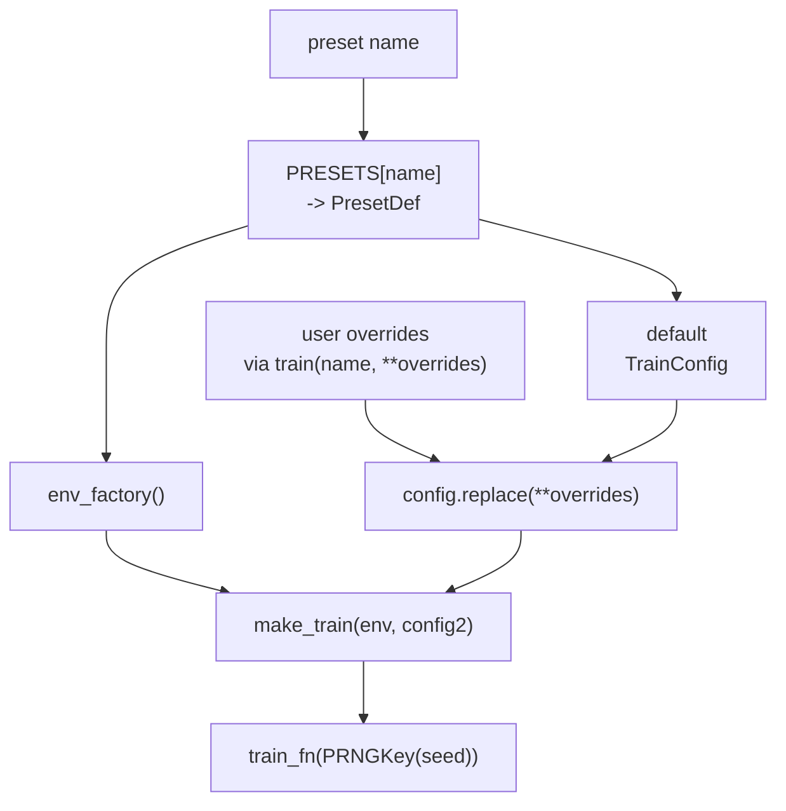

# Presets

一个 preset 把三件事打成一个名字：

- 一个 environment 工厂（case + bundle + wrapper），
- 可选的 reward 覆盖，
- 一个带合理默认值的 `TrainConfig`。

可以把 preset 理解为“预先打包好的训练配方”。它给一条特定的 env
构造路径和一份匹配的默认 trainer 配置起了一个稳定名字，这样你每次复现
标准设置时，不需要手动重新拼 env 和超参数。

这让你能用一行启动一次 benchmark 训练：

```python
from powerzoojax.rl import train

result = train("dso-nflex", seed=0)
```

完整 preset 列表在 `powerzoojax/rl/presets.py`。这一页给出目录。

## API

```python
from powerzoojax.rl import list_presets, get_preset, train

for p in list_presets():
    print(p["name"], "-", p["description"])

preset = get_preset("battery-soc-tracking")
env = preset.env_factory()
config = preset.config
```

`train(preset_name, seed=..., total_timesteps=..., **overrides)` 解析 preset，通过 `preset.config.replace(...)` 应用覆盖，再调 trainer 层的 `make_train(env, config)`。

`list_presets()` 返回 JSON 友好的列表，包含 `name`、`description`、`algo` 与 `total_timesteps`。

## 目录

### Resource warm-up

| 名称 | Algo | 备注 |
| --- | --- | --- |
| `battery-soc-tracking` | `ppo` | `BatteryEnv` + `LogWrapper`，48 步。最小 sanity-check preset。自定义 reward `-|soc - 0.5|`。 |

### Transmission single-agent

| 名称 | Algo | 备注 |
| --- | --- | --- |
| `case5-economic-dispatch` | `ppo` | `TransGridEnv`（case5）+ `LogWrapper`，恒定 50% 负荷，48 步。 |
| `case5-safe-dispatch` | `ppo_lagrangian` | 同 env 用 `SafeRLWrapper` 包装，`selected_names=("thermal_overload",)`，`cost_thresholds=(0.0,)`。 |

### Transmission multi-agent

| 名称 | Algo | 备注 |
| --- | --- | --- |
| `case5-ippo` | `ippo` | 在 `TransGridEnv`（case5）上的 `GridMARLEnv`。5 个机组 agent 参数共享。 |
| `case5-ippo-battery` | `ippo` | 同上加 2 个电池设备 → 7 个 agent。 |

### DSO benchmark

| 名称 | Algo | 备注 |
| --- | --- | --- |
| `dso-nflex` | `ppo` | DSO `case33bw` + 6 × FlexLoad，单 agent PPO。合成负荷（仅 dev / test）。 |
| `dso-nflex-safe` | `ppo_lagrangian` | 同 env，任务选择 `("voltage_violation",)`，`cost_thresholds=(0.0,)`。 |

如需论文级数字，从 `benchmarks/dso/` 运行，配合 `make_dso_params_from_split(...)` 使用真实 Ausgrid split。详见 [Benchmarks → DSO](../benchmarks/dso.md)。

### DERs benchmark

| 名称 | Algo | 备注 |
| --- | --- | --- |
| `ders-medium` | `ippo_typed` | `case141` + 12 个 agent（4 Battery + 4 PV + 4 FlexLoad）。typed 参数共享。 |
| `ders-medium-safe` | `ippo_typed` | 同 env，并使用 task-level fallback reward shaping `r - w·c`。`cost_thresholds=(0.0, 0.0, 0.0)` 仅是日志目标——这**不是**约束 MARL。 |

这个 “safe” preset 本质上是 reward-shaped IPPO。真正的按-agent 约束 MARL 仍在 roadmap 上，**不要**在已发表结果里把这个 preset 引用为约束 MARL。

### TSO benchmark

| 名称 | Algo | 备注 |
| --- | --- | --- |
| `tso-ed` | `ppo` | `case118` 经济调度（关闭 UC）。Action `Box(2*54)`；机组组合信号那一半被忽略，出力目标会对 OPF 施加偏置。 |
| `tso-uc` | `ppo` | `case118` SCUC，使用经阈值映射的机组组合信号。Min-up/down、ramp、startup/no-load 在 env 内强制。 |
| `tso-scuc-safe` | `ppo_lagrangian` | 同 `tso-uc`，并选择 CMDP cost `("thermal_overload", "reserve_shortfall")`。`cost_thresholds=(0.0, 0.0)`。 |

三者都用 hidden `(256, 256)`、gamma `0.995`。

### GenCos benchmark

| 名称 | Algo | 备注 |
| --- | --- | --- |
| `gencos-case5-ippo` | `ippo` | 5 agent 滚动竞争市场，精确 SCED + ramp 耦合。使用 GB demand pool；若 GB parquet 数据未安装，会抛 `FileNotFoundError`。 |
| `gencos-case5-ippo-dev` | `ippo` | CI / dev 用的合成平直 profile。**不是** benchmark 配置。 |

### DC microgrid benchmark

| 名称 | Algo | 备注 |
| --- | --- | --- |
| `dc-microgrid` | `ppo` | `DataCenterMicrogridEnv`，1 agent，288 × 5 min。标量化多目标 reward。 |
| `dc-microgrid-safe` | `ppo_lagrangian` | 同 env，选择 CMDP cost `("sla", "overtemp", "power_deficit")`，`cost_thresholds=(0.0, 0.0, 0.0)`。 |

## Preset 解析过程



也就是说，不改 `presets.py` 就能修改任何 preset：

```python
from powerzoojax.rl import train

result = train(
    "tso-uc",
    seed=1,
    total_timesteps=2_000_000,
    learning_rate=1e-4,
    hidden_dims=(512, 512),
)
```

## 何时用 preset，何时用自定义循环

如果你想在某个 benchmark 上无额外配置地跑标准 PPO / IPPO / Lagrangian，用 preset。下列情形改用自定义循环（见 [自定义训练循环](custom-loops.md)）：

- 接入不同的 policy 网络结构，
- 加额外损失（auxiliary、对比学习、多目标分解），
- 跑 trainer dispatcher 还不支持的非 PPO 算法，
- 暴露中间量做分析。

benchmark 的 `train.py` 走 preset 路径，因为那里复现性比灵活性重要。研究代码可以走自定义循环路径。

## 交叉引用

- [Trainers](trainers.md) —— `make_train` 的具体行为。
- [Wrappers](wrappers.md) —— 训练前 env 怎么 bind。
- [自定义训练循环](custom-loops.md) —— 全手动训练。
- [Benchmarks](../benchmarks/overview.md) —— 在这些 preset 之上构建的论文实验。
