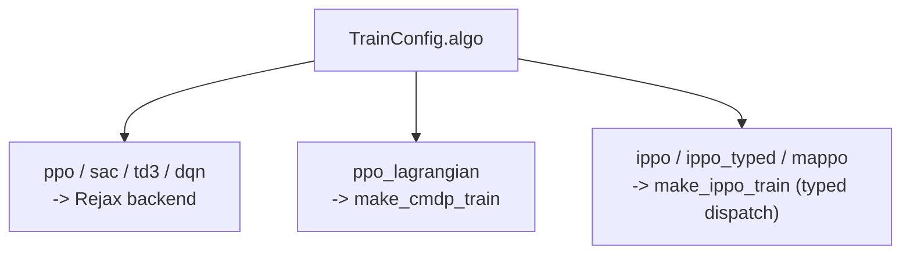
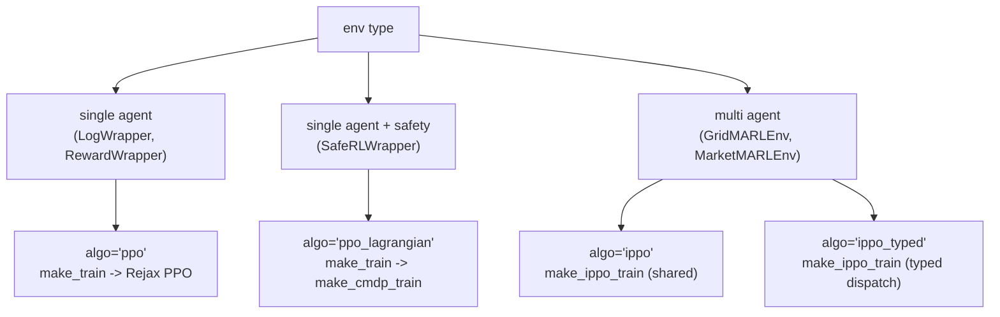

# Trainers

PowerZooJax 在统一 dispatcher `make_train` 后面提供四种训练入口。四者共用同一个 `TrainConfig` dataclass，所以切算法只需改一个字段。

Power 术语见 [Power 系统入门](../concepts/power-systems-primer.md)。RL 术语（PPO、IPPO、CMDP、Lagrangian）在下文给出说明。

## `TrainConfig` —— 统一配置

```python
from powerzoojax.rl import TrainConfig

config = TrainConfig(
    algo="ppo",                   # ppo | sac | td3 | dqn | ppo_lagrangian | ippo | ippo_typed | mappo
    total_timesteps=200_000,
    num_envs=64,
    seed=42,
    learning_rate=3e-4,
    gamma=0.99,
    n_steps=128,                  # rollout length per update
    n_epochs=4,
    n_minibatches=4,
    clip_eps=0.2,
    ent_coef=0.01,
    vf_coef=0.5,
    gae_lambda=0.95,
    cost_thresholds=(),           # ppo_lagrangian 的向量预算；旧 cost_threshold 仍会广播兼容
    lambda_lr=5e-3,
    hidden_dims=(64, 64),
    normalize_observations=False,
    normalize_rewards=False,
)
```

`TrainConfig` 是 frozen；派生变体用 `config.replace(field=value)`。`load_config(path)` 与 `save_config(config, path)` 与 YAML 互转。

`benchmarks/<task>/configs/train_*.yaml` 解码出来的也是同一份 dataclass。某 backend 不识别的超参会被静默忽略。

## `make_train` —— dispatcher

```python
from powerzoojax.rl import make_train

train_fn = make_train(env, config)
result = train_fn(jax.random.PRNGKey(42))
```

`train_fn` 是 JIT 融合后的训练程序。调用它返回一个 `TrainResult` namedtuple，含训练好的 `params`、学习曲线和简短的 `summary`。

`make_train` 内部按 `config.algo` 分发：



dispatcher 按 algo 字符串与 wrapper 类型选 backend。单 agent env 走 Rejax，Lagrangian 走 CMDP；MARL env（`GridMARLEnv`、`DistGridMARLEnv`、`MarketMARLEnv`）走 IPPO。

## 单 agent PPO 走 Rejax

当 `algo in {"ppo", "sac", "td3", "dqn"}` 时，`make_train` 构造 Rejax 适配器，把 `TrainConfig.to_rejax_kwargs()` 转给底层算法。Rejax 提供融合后的 `algo.train()` JIT 程序，内置 eval callback。

这是 `LogWrapper` 绑定的 env 以及所有 `*-economic-dispatch` 与 `*-soc-tracking` preset 的默认路径。

适配器桥接少量 API 差异（Rejax 期望 `gymnax` 风格的 4 参 `step`，PowerZooJax wrapper 是 3 参），因此 `LogWrapper(env, params)` 无需修改即可工作。

## CMDP —— `make_cmdp_train`

当 `algo == "ppo_lagrangian"` 且 env 是 `SafeRLWrapper` 时，dispatcher 路由到 `make_cmdp_train`。CMDP 是 constrained Markov decision process（约束 MDP）的缩写；PPO-Lagrangian 通过维护一个非负对偶向量 `lambda` 来求解约束问题，对超出 `cost_thresholds` 的期望 cost 加惩罚。

在目标层，训练器求解

\[
\max_\pi \; J_R(\pi)
\quad \text{s.t.} \quad
J_{C,i}(\pi) \le d_i,\; i=1,\dots,k,
\]

其中 \(J_R\) 是期望 return，\(J_{C,i}\) 是第 \(i\) 个约束的期望 cost，\(d_i\) 对应 `cost_thresholds[i]`。

放到 PPO 内部，可写成增广优势

\[
A_{\mathrm{aug}} = A_R - \lambda^\top A_C,
\]

其中 \(A_R\) 是标准 reward advantage，\(A_C\) 是逐约束 cost advantage 构成的向量。也就是说，actor 在提高 reward 的同时，会考虑当前对偶惩罚对约束违反的影响。

对偶更新的概念形式为

\[
\lambda_i \leftarrow \max\!\left(0,\; \lambda_i + \eta_\lambda (\hat J_{C,i} - d_i)\right),
\]

其中 \(\eta_\lambda\) 对应 `lambda_lr`。实现里 PowerZooJax 存储的是 `log_lambda`，并用 \(\lambda_i = \exp(\log \lambda_i)\) 保证非负性。

实现位于 `powerzoojax.rl.cmdp`：

- `SafeActorCritic` —— actor + reward critic + 向量 cost critic。
- 内层更新：用增广优势 \(A_R - \lambda^\top A_C\) 构造 PPO 的 clipped surrogate 目标。
- 外层更新：每个约束各自更新一个对偶变量，让 `lambda` 跟踪违反向量。

关键超参（除标准 PPO 外）：

- `cost_thresholds` —— 每个选中约束一个冻结 budget。benchmark 配置应使用显式向量；硬物理约束通常应为零。旧的标量 `cost_threshold` 字段仍会做广播兼容，多约束任务不要使用它。
- `lambda_lr` —— 对偶乘子学习率（可标量广播，也可逐约束给定）。
- `cost_gamma` —— cost critic 的折扣因子（通常保留 `1.0`）。

CMDP 是 `tso-scuc-safe`、`dso-nflex-safe`、`dc-microgrid-safe` 等 preset 的路径。

## MARL —— `make_ippo_train` 与 `make_ippo_typed_train` {#marl-make_ippo_train-and-make_ippo_typed_train}

当 env 是 MARL wrapper（`GridMARLEnv`、`DistGridMARLEnv`、`MarketMARLEnv`）时，dispatcher 路由到 IPPO backend：

- `algo == "ippo"` —— 在所有 agent 间完全共享参数的 independent PPO。
- `algo == "ippo_typed"` —— Typed 参数共享：按名字前缀分组（`battery_*`、`renewable_*`、`flexload_*`），每组单独一份 `SharedActorCritic`。
- `algo == "mappo"` —— 中心化 critic、去中心化 actor（暂未实现，未来工作）。

IPPO（"independent PPO"）每个 agent 训练一个 PPO 实例，agent 可互换时共享参数。MAPPO（"multi-agent PPO"）共享一个中心化 critic。

DERs benchmark 用 `ippo_typed`。它的结果树是按类型 key 的 dict：

```python
result.params == {
    "battery": <SharedActorCritic params for the 4 battery agents>,
    "renewable": <... for the 4 PV agents>,
    "flexload": <... for the 4 flex-load agents>,
}
```

比完全共享更有表达力（不同物理 → 不同 policy），又比完全独立训练便宜（4 个电池共享一个电池 actor）。

## `make_ippo_act`

用于 evaluation：`make_ippo_act(env, params)` 返回一个由训练好的 actor 参数支撑的确定性按 agent 动作函数。在 `eval.py` 的 rollout 里用它。

## 怎么选 trainer



无论怎样，实际调用都是 `make_train(env, config)` —— 上图展示的是它内部的分支。

## 完整示例

```python
import jax
from powerzoojax.case import load_case
from powerzoojax.envs.grid.trans import TransGridEnv, make_trans_params
from powerzoojax.rl import LogWrapper, TrainConfig, make_train

case = load_case("5")
env = TransGridEnv()
import jax.numpy as jnp
profiles = jnp.ones((48, case.n_loads), dtype=jnp.float32) * 0.5
params = make_trans_params(case, load_profiles=profiles, max_steps=48)
wrapped = LogWrapper(env, params)

config = TrainConfig(
    algo="ppo",
    total_timesteps=200_000,
    num_envs=32,
    n_steps=48,
    hidden_dims=(64, 64),
)

train_fn = make_train(wrapped, config)
result = train_fn(jax.random.PRNGKey(0))
print(result.summary)
```

要一行式入口（已经 pre-bake env 工厂与 `TrainConfig`），见 [Presets](presets.md)。
