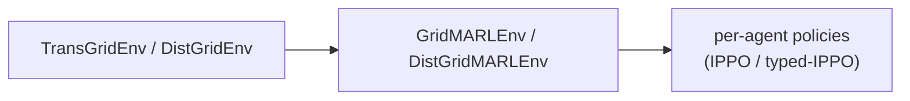
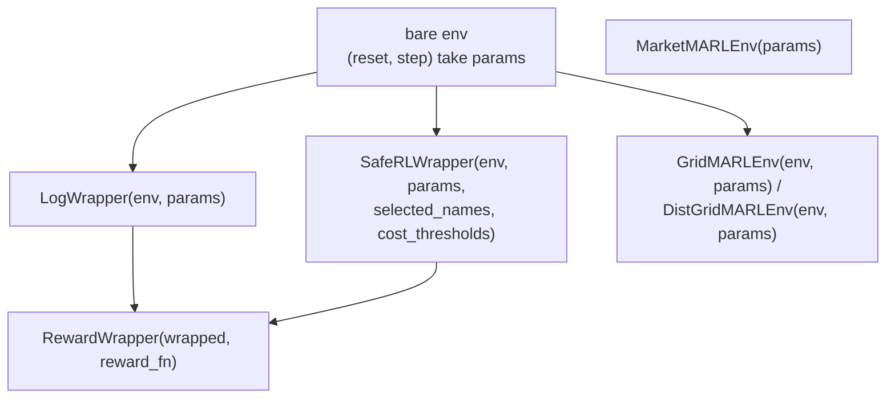

# Wrappers

Wrapper 用来把纯函数式环境适配成不同的训练接口。它们主要分布在：

- `powerzoojax.rl.wrappers`：单智能体 binder / CMDP 适配器
- `powerzoojax.rl.reward`：reward 替换与 reward shaping
- `powerzoojax.rl.multi_agent` 与 `powerzoojax.rl.market_marl`：多智能体适配器

这一页关注的是：每个 wrapper 改变了什么训练侧接口，而不是底层物理本身。底层环境请看对应的 [Transmission](../physics/transmission.md)、[Distribution](../physics/distribution.md)、[Resources](../physics/resources.md)、[Markets](../physics/markets.md) 和 [Microgrid](../physics/microgrid.md) 页面。

## 所有 wrapper 共同保留的性质

所有 PowerZooJax wrapper 都遵守 [Concepts -> JAX contract](../concepts/jax-contract.md)：

- `reset` 和 `step` 仍然是纯函数
- state 和 params 仍然是 pytree
- PRNG key 仍然显式传入
- 仍然兼容 `jit`、`vmap` 和 `lax.scan`
- wrapper 改的是训练侧接口，不改变底层物理

## `LogWrapper` -> 绑定 params，并暴露 5 元组 step

```python
from powerzoojax.rl import LogWrapper

wrapped = LogWrapper(env, params)
obs, state = wrapped.reset(key)
obs, state, reward, done, info = wrapped.step(key, state, action)
```

它做的事情是：

- 绑定 `params`，让包装后的对象暴露不带 `params` 的 `(reset, step)`
- 把 core CMDP 环境的 step
  `(obs, state, reward, costs, done, info)`
  适配成 PureJaxRL / Rejax 风格的 5 元组
  `(obs, state, reward, done, info)`
- 在 device 上追踪 episode return 和 episode length
- 在 `info` 里补充兼容字段，包括 `constraint_costs`、`cost_sum` 和标量别名 `cost`

一个容易误解的点是：`returned_episode_returns`、`returned_episode_lengths` 和
`returned_episode` 这几个字段会在每一步都出现在 `info` 里，不是只在 episode
结束时才出现。真正表示“这一刻是否刚结束一个 episode”的，是布尔标记
`returned_episode`。

## `SafeRLWrapper` -> 把选中的 CMDP cost 提升为独立输出

```python
from powerzoojax.rl import SafeRLWrapper

wrapped = SafeRLWrapper(
    env,
    params,
    selected_names=("thermal_overload",),
    cost_thresholds=(0.0,),
)
obs, state = wrapped.reset(key)
obs, state, reward, costs, done, info = wrapped.step(key, state, action)
```

`SafeRLWrapper` 同样会绑定 `params`，但它保留的是 CMDP 训练需要的 step 接口：

```text
(obs, state, reward, selected_costs, done, info)
```

适合给 PPO-Lagrangian 这类 trainer 直接读取 cost 向量。几个关键点：

- `selected_names=` 用来从环境完整约束向量里选择一个子集
- `cost_thresholds=` 为每个被选中的约束提供阈值
- `info["constraint_costs_all"]` 保留环境完整 cost 向量
- `info["constraint_costs"]` 是实际返回给 trainer 的选中向量

对于热越限、电压越限、备用缺额、过温、供电缺额这类硬物理约束，默认应该使用零阈值；只有任务明确声明是松弛约束或机会约束时，才应设置非零 budget。

这个 wrapper 是 `make_cmdp_train` 直接消费的接口。

## `bind` -> 便捷构造器

```python
from powerzoojax.rl import bind

wrapped = bind(env, params, safe=False)   # -> LogWrapper
wrapped = bind(
    env,
    params,
    safe=True,
    selected_names=("thermal_overload",),
    cost_thresholds=(0.0,),
)   # -> SafeRLWrapper
```

`bind` 只是一个快捷入口，方便示例和测试从一个函数里拿到单智能体训练 wrapper。

## `RewardWrapper` -> 替换已有 wrapper 的训练 reward

```python
from powerzoojax.rl import LogWrapper, RewardWrapper

def custom_reward_fn(obs, action, next_obs, reward, info):
    return -jnp.abs(next_obs[0] - 0.5)

wrapped = RewardWrapper(LogWrapper(env, params), reward_fn=custom_reward_fn)
```

`RewardWrapper` 会替换已经包装好的训练环境的 reward。它不改变底层物理，也不改 cost 通道。支持两种 reward 函数签名：

- `(obs, action, next_obs, reward, info)`
- `(obs, action, next_obs, reward, costs, info)`

也就是说，`RewardWrapper` 应该包在 `LogWrapper` 或 `SafeRLWrapper` 外面，而不是直接包 bare env。

## `GridMARLEnv` 与 `DistGridMARLEnv` -> JaxMARL 风格 dict 接口

多智能体 wrapper 会把单个环境转换成 dict 风格的 MARL 接口：

- `reset(key)` 返回 `(obs_dict, state)`
- `step(key, state, action_dict)` 返回
  `(obs_dict, state, rewards_dict, dones_dict, info)`
- `dones_dict["__all__"]` 是全局 episode done 标记
- observation / action 都以 agent 名作为 key

典型 agent 命名如下：

- `GridMARLEnv`：`"unit_0"`、`"unit_1"`、`"battery_0"`、`"pv_0"`、`"flexload_0"` ...
- `DistGridMARLEnv`：`"battery_0"`、`"battery_1"`、`"pv_0"`、`"flexload_0"` ...



`DistGridMARLEnv` 支持 `observation_mode`：

- `"global"`：每个 agent 看到完整 shared grid-core observation 再加自己的设备切片
- `"local"`：每个 agent 看到 Dec-POMDP 风格的局部观测，包括本地 bus、K-hop 邻域、全局摘要统计、时间特征和自身设备状态

这些 wrapper 是薄适配层，不复制物理；同时它们本身也不提供 `LogWrapper` 那种单智能体 episode logging 字段。

## `MarketMARLEnv` -> GenCos 市场适配器

`MarketMARLEnv` 给 GenCos benchmark 包装纯函数式 market core。它暴露的也是和上面一致的 dict 风格 MARL 合约：

- `reset(key)` 返回 `(obs_dict, state)`
- `step(key, state, action_dict)` 返回
  `(obs_dict, state, rewards_dict, dones_dict, info)`

这里的 agent 名是 `genco_i`，每个发电公司一个。

内部实现调用的是 `market_marl_reset` 和 `market_marl_step`；wrapper 本身只负责按 agent 切分和打包 observation / action。

底层市场动力学见 [Physics -> Markets](../physics/markets.md#marketmarlenv-gencos-rolling-market)。

## 组合规则

- `RewardWrapper` 应该包装 `LogWrapper` 或 `SafeRLWrapper`，不要直接包装 bare env
- `SafeRLWrapper` 应该包装 bare env；它自己就是 param-binding wrapper
- MARL wrapper 应该直接包装 bare env，或者包装 params 已在构造时固定好的纯 market core

!!! warning "Wrapper 叠加禁忌"
    以下两种叠加方式接口不兼容，会在 `step` 返回 shape 上出错：

    - **不要**把 `SafeRLWrapper` 叠在 `LogWrapper` 上 —— `LogWrapper` 已经把 `costs` 收编进 `info`，`SafeRLWrapper` 再来读 `costs` 会拿不到。正确顺序是 `LogWrapper(SafeRLWrapper(env))`。
    - **不要**把 `LogWrapper` 放进 MARL wrapper —— MARL 的 reward / done 是向量化的，`LogWrapper` 只能处理标量。MARL 的 logging 应放在 trainer 一侧，不要走 `LogWrapper`。

## 叠加示意图



## 交叉引用

- [Trainers](trainers.md)：`make_train`、`make_cmdp_train`、`make_ippo_train`、`make_ippo_typed_train`
- [Presets](presets.md)：一行式入口，提前打包 wrapper 选择
- [API -> RL](../api/rl.md) 与 [API -> RL MARL](../api/rl-marl.md)
